# Training: assembly.linearPattern / assembly.circularPattern

**Date:** 2026-05-09

## Goal

Testing `v1.assembly.linearPattern`, `updateLinearPattern`, `getLinearPattern`, `v1.assembly.circularPattern`, `updateCircularPattern`, `getCircularPattern`.

**Methods to cover:**

- `linearPattern` — create with mate1 only, dir1 count/distance, dir2 (2D grid), mate2
- `updateLinearPattern` — change count, change distance, add dir2 after creation
- `getLinearPattern` — retrieve by name, verify all fields match
- `circularPattern` — create with mate1, instanceCount, angle (radians + degree strings), offset
- `updateCircularPattern` — change instanceCount, angle, offset
- `getCircularPattern` — retrieve by name, verify fields

**Questions:**

- What does `linearPattern` return? `{ constraint, instances }` per docs — confirm instance count matches `dir1.count`.
- Does `dir1.count=1` mean 1 copy (2 total instances) or 1 total?
- What happens with `dir2` — does it create a 2D grid? How many instances total?
- Does `updateLinearPattern` return updated instance IDs? Are old pattern instances deleted and new ones created?
- How does circular pattern `angle` work — between adjacent copies or total span?
- Does circular pattern `offset` shift copies along the rotation axis (helix)?
- Spatial verification: do pattern copies land at the expected positions? Measure COG of each pattern instance.
- What is `mate2` for on linearPattern? The docs don't explain clearly.

---

## 01 — basic linear pattern

Script: `scripts/01-basic-linear-pattern.mjs` — ✅ `linearPattern` works, returns `{ constraint, instances }`.

|  | 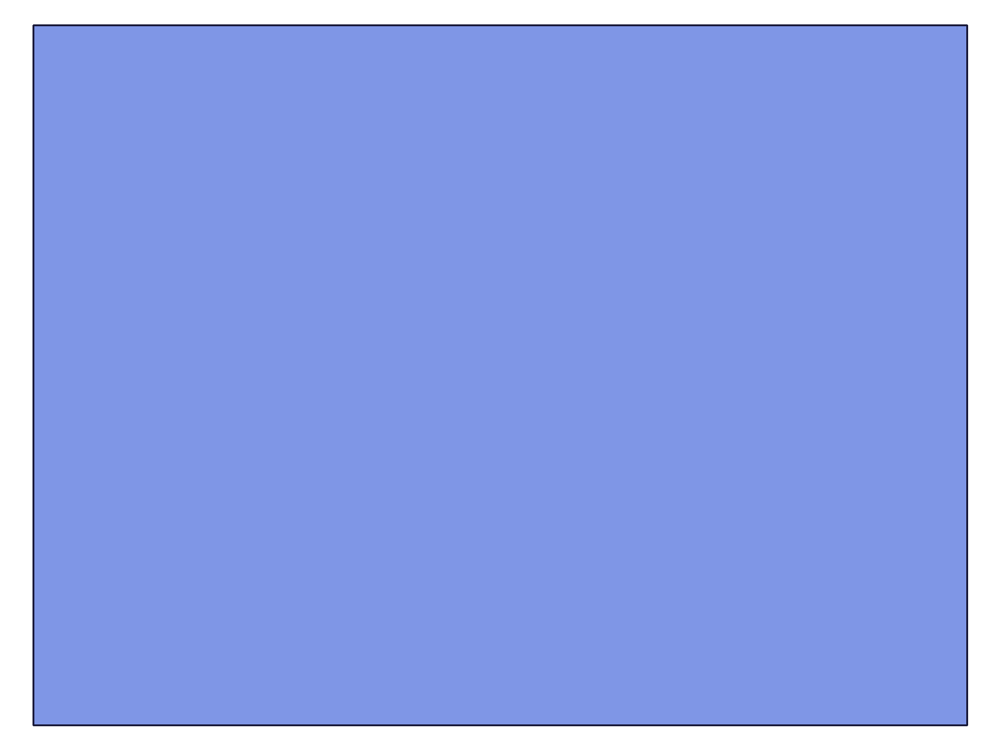 |
|---|---|

**Data:** count=3, distance=60. Result: `{ constraint: 123, instances: [113, 125, 127] }`. maxLevel=31 (info). Instances array has 3 elements — seed is included. COG measurement via `assembly.calculateMassProperties` returned undefined for `centerOfGravity` — the field name is wrong. Script 03 later proved `part.calculateMassProperties` works and returns `cog`.

**📌 LLM doc:** `linearPattern` returns `{ constraint: id, instances: Array<id> }`. The instances array includes the seed. Use `part.calculateMassProperties` (not `assembly.calculateMassProperties`) to read instance COG.

## 02 — count semantics

Script: `scripts/02-linear-count-semantics.mjs` — ✅ count = total instance count including seed.

| 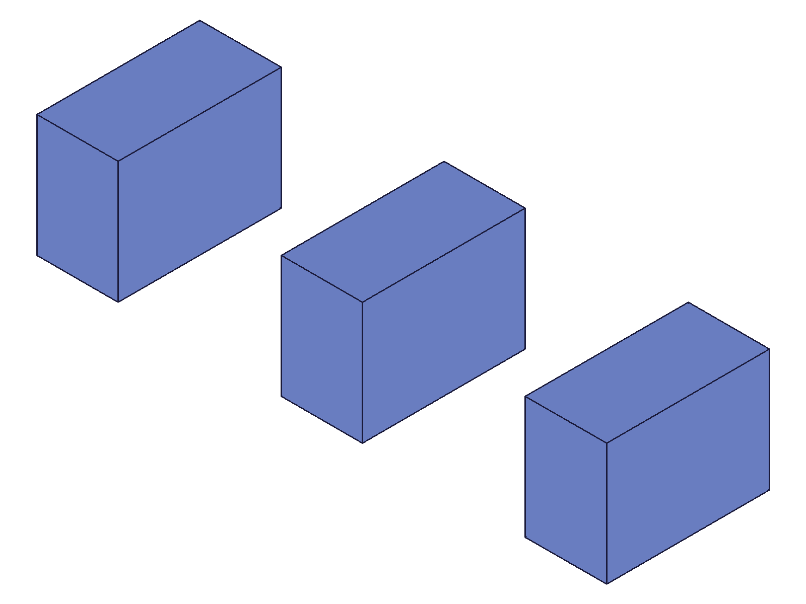 |
|---|

**Data:** count=3 → instances=[113,125,127] (3 total, seed=113 included: `instances.includes(inst1) === true`). count=1 → instances=[129] (1 element — the seed only, no new copies created). `getInstance({ id: instId })` returns null for all pattern instances — this is not the right call pattern (use `ownerId` to list instances instead).

**Learned:** `dir1.count` is the **total** number of instances including the seed. count=3 → seed + 2 copies. count=1 → seed only (0 copies, effectively a no-op).
**📌 LLM doc:** count is total including seed, not number of copies. Minimum useful count is 2.

## 03 — spatial verification

Script: `scripts/03-spatial-verify.mjs` — ✅ pattern instances land at expected positions along WCS Z axis.

|  | 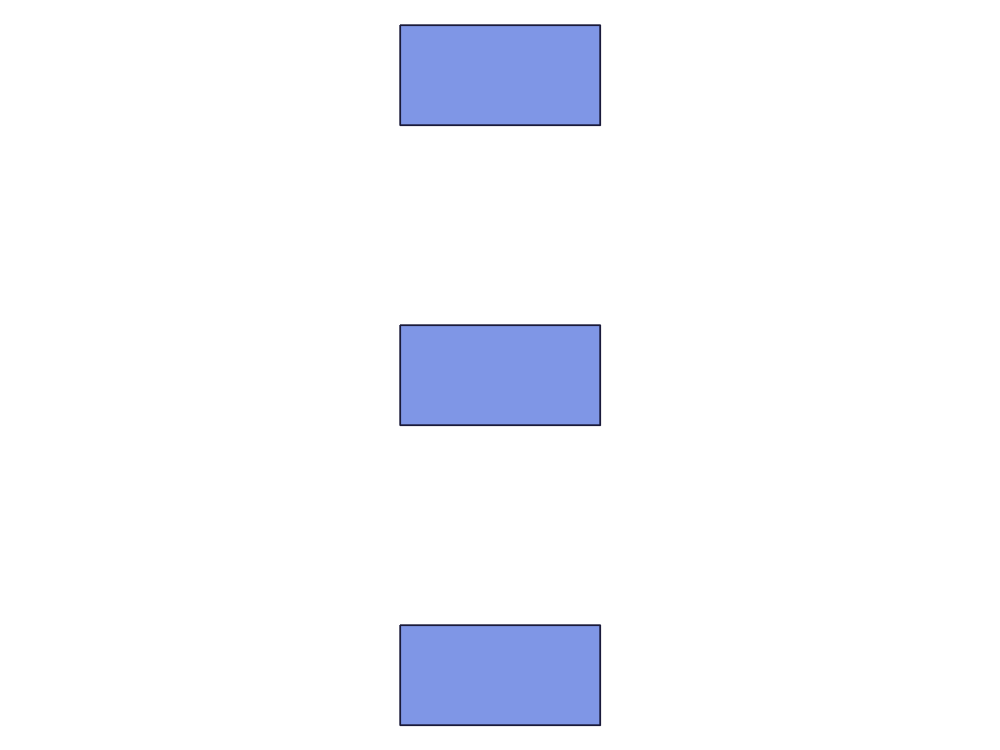 |
|---|---|

**Data:** Template COG: `{x:20, y:15, z:10}` (40×30×20 box, corner-aligned). Pattern with count=3, distance=60, default flip="Z":
- inst 113 COG: `{x:20, y:15, z:10}` — seed at origin
- inst 125 COG: `{x:20, y:15, z:70}` — offset +60 in Z (10+60)
- inst 127 COG: `{x:20, y:15, z:130}` — offset +120 in Z (10+120)

Spacing is exactly 60mm along the Z axis. The `mate1.flip` direction (default "Z") determines the pattern direction. Copies are placed at `seed + n*distance` along the flip axis.

**📌 LLM doc:** mate1.flip determines the pattern axis. Default "Z" → copies space along Z. Distance is between adjacent instances.

## 04 — dir2 grid (2D pattern)

Script: `scripts/04-dir2-grid.mjs` — ✅ dir2 creates a 2D grid. Total instances = dir1.count × dir2.count.

| 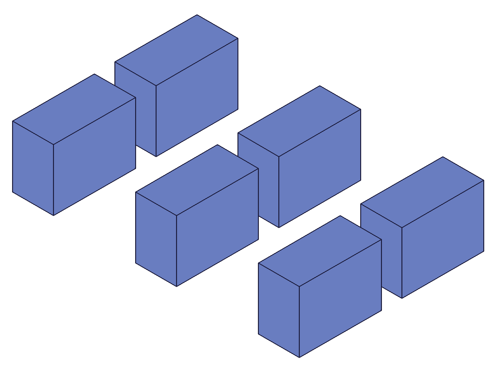 | 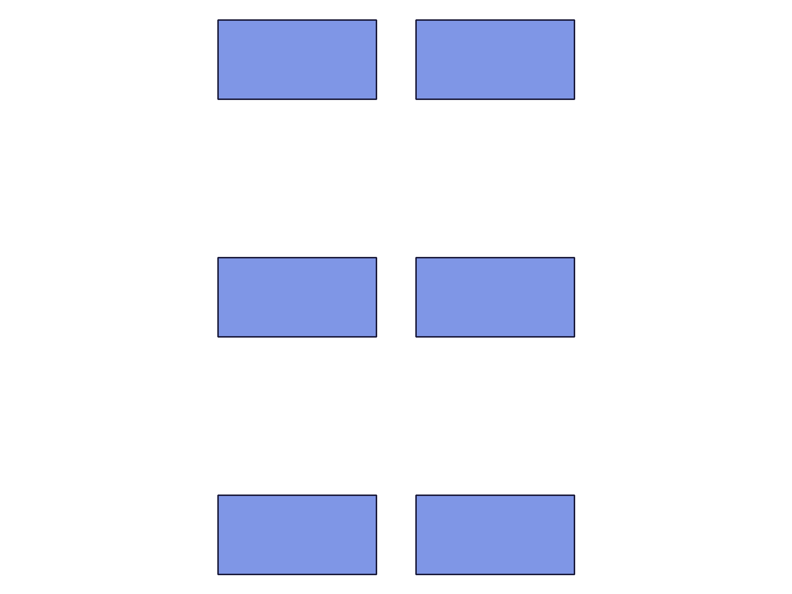 |
|---|---|

**Data:** dir1 count=3 distance=60 (flip="Z"), mate2 flip="X", dir2 count=2 distance=50. Result: 6 instances (3×2). COGs:
- Row 0 (X=20): z=10, 70, 130
- Row 1 (X=70): z=10, 70, 130

dir2 with mate2 flip="X" spaces copies 50mm along the X axis. Grid pattern confirmed: total = count1 × count2.

**Learned:** `mate2` defines the second direction axis for 2D grids. `mate2.flip` controls which axis dir2 copies are spaced along. Without mate2/dir2, you get a 1D linear pattern.
**📌 LLM doc:** mate2 + dir2 create 2D grids. Total instances = dir1.count × dir2.count. mate2.flip determines the second axis direction.

## 05 — getLinearPattern

Script: `scripts/05-get-linear-pattern.mjs` — ✅ retrieves pattern by name.

**Data:** `getLinearPattern({ id: asmId, name: 'MyLP' })` returns:
```json
{
  "dir1": {"count": 4, "distance": 50},
  "dir2": {"count": 1, "distance": 100},
  "id": 123,
  "instanceId": 113,
  "mate1": {"csys": 107, "flip": "Z", "path": [113], "reorient": "0"},
  "name": "MyLP"
}
```
dir2 shows default values (count:1, distance:100) even when not specified in the create call. Non-existent name: result=null, maxLevel=51 (error).

**📌 LLM doc:** getLinearPattern always returns dir2 (with defaults if not specified). Nonexistent name → null + maxLevel=51.

## 06 — updateLinearPattern

Script: `scripts/06-update-linear-pattern.mjs` — ✅ updates count and distance, returns new instance list.

| 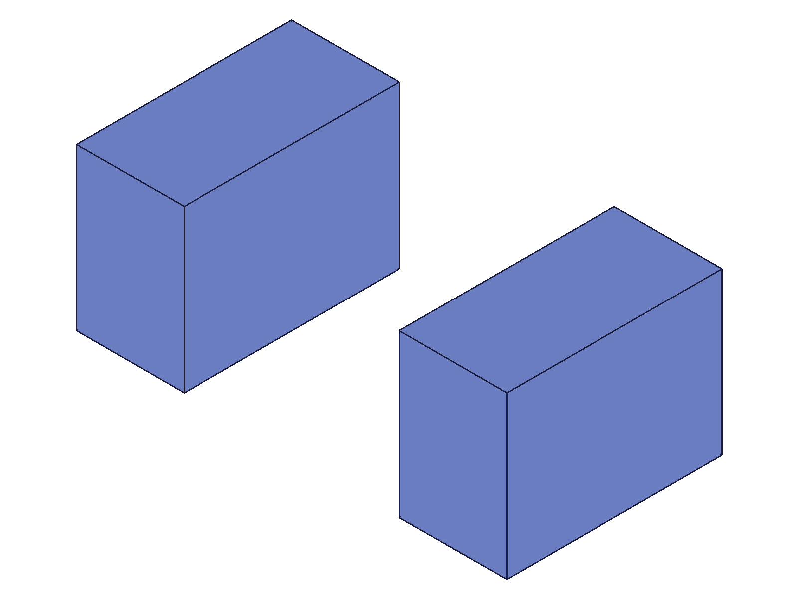 | 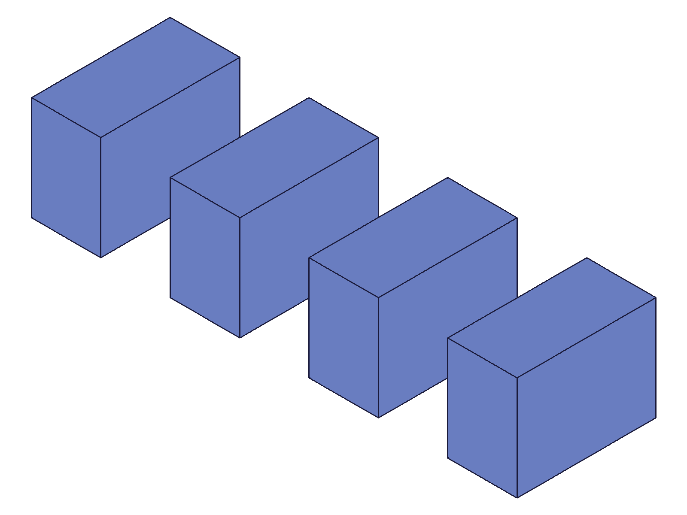 |
|---|---|

**Data:** Initial: count=2, distance=60 → instances [113, 125]. COGs: z=10, z=70.
After update to count=4, distance=40 → instances [113, 125, 160, 162]. COGs: z=10, z≈50, z=90, z=130.

Existing instance 125 was repositioned (z=70 → z≈50) rather than deleted. Two new instances (160, 162) were added. Constraint ID stays the same (123). Update takes the constraint ID (not assembly ID).

**Learned:** `updateLinearPattern` keeps existing instances where possible and repositions them. New instances are added for increased count. The `id` param is the constraint ID from the create result, not the assembly ID.
**📌 LLM doc:** Update takes constraint ID. Existing instances are repositioned, new ones added. Returns `{ constraint, instances }` with updated list.

## 07 — basic circular pattern

Script: `scripts/07-basic-circular.mjs` — ✅ circular pattern works with radians and degree strings.

| 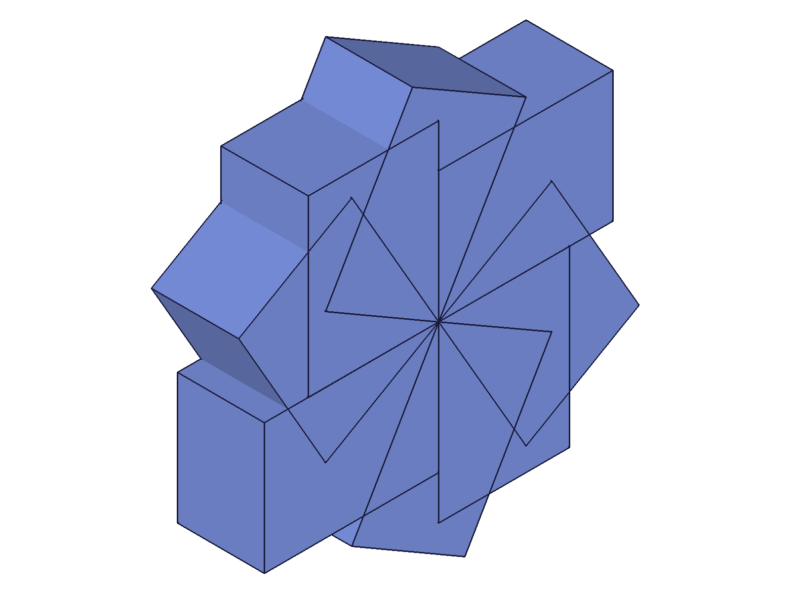 | 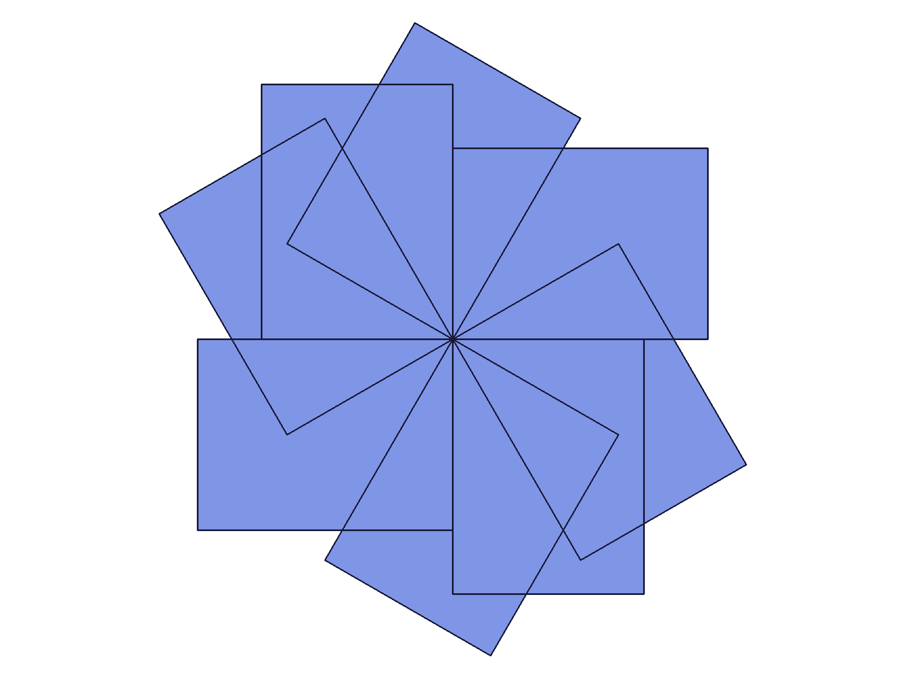 |
|---|---|

**Data:** Seed at origin (fastenedOrigin overrides initial transformation). instanceCount=4, angle=PI/2 (90°). COGs:
- inst 113: {x:20, y:15, z:10} — seed
- inst 126: {x:-15, y:20, z:10} — 90° rotation around Z
- inst 128: {x:-20, y:-15, z:10} — 180°
- inst 130: {x:15, y:-20, z:10} — 270°

Z is constant across all instances — rotation is purely in XY plane around the Z axis (flip="Z"). Degree string `'60deg'` also works: instanceCount=6 with `angle: '60deg'` → 6 instances.

**Learned:** `angle` is between adjacent copies, not total span. instanceCount includes the seed. Rotation axis is the mate1.flip axis (default Z). Degree strings like `'60deg'` are accepted alongside radians.
**📌 LLM doc:** angle is between adjacent copies. instanceCount includes seed. Degree strings work. Rotation axis = mate1.flip axis.

## 08 — circular pattern with offset (helix)

Script: `scripts/08-circular-offset.mjs` — ✅ offset creates helix-like arrangement along rotation axis.

| 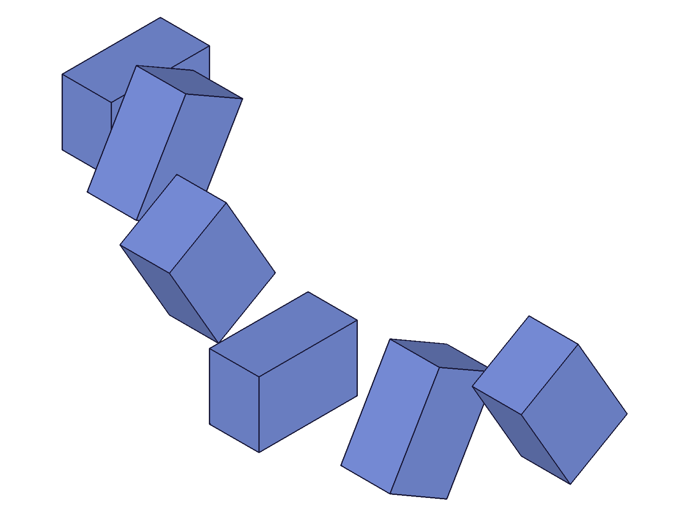 | 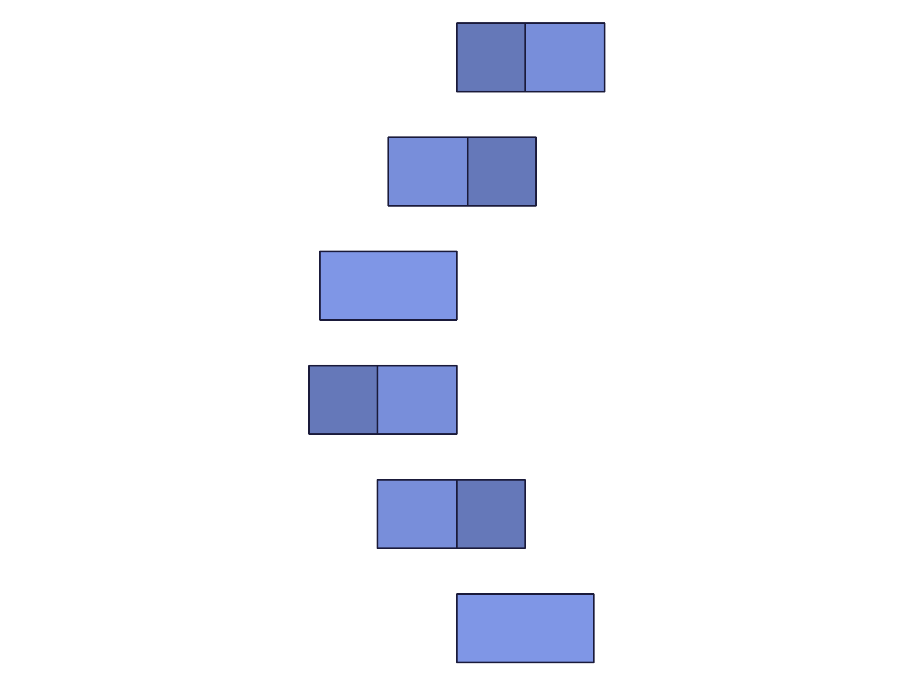 |
|---|---|

**Data:** instanceCount=6, angle=PI/3 (60°), offset=25. COGs:
- inst 113: z=7.5 (seed)
- inst 125: z=32.5 (+25)
- inst 127: z=57.5 (+50)
- inst 129: z=82.5 (+75)
- inst 131: z=107.5 (+100)
- inst 133: z=132.5 (+125)

Z increments by exactly 25 per instance. X/Y rotate at 60° steps. Confirmed: offset is the distance along the rotation axis between adjacent copies, producing a helix.

**📌 LLM doc:** offset shifts each copy along the rotation axis by the specified distance. Combined with angular rotation, this produces a helix.

## 09 — get/update circular pattern

Script: `scripts/09-get-update-circular.mjs` — ✅ get and update work as expected.

| 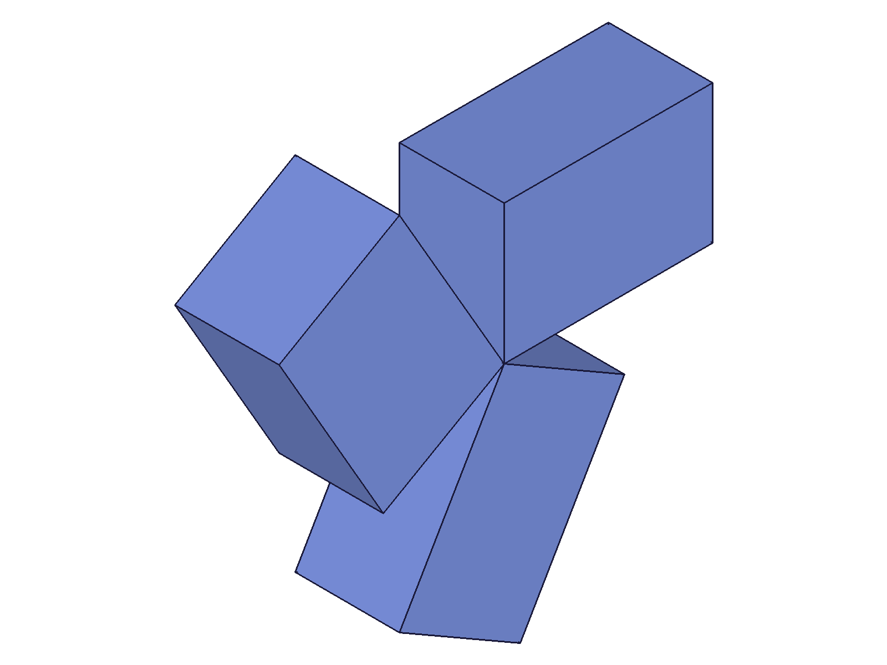 | 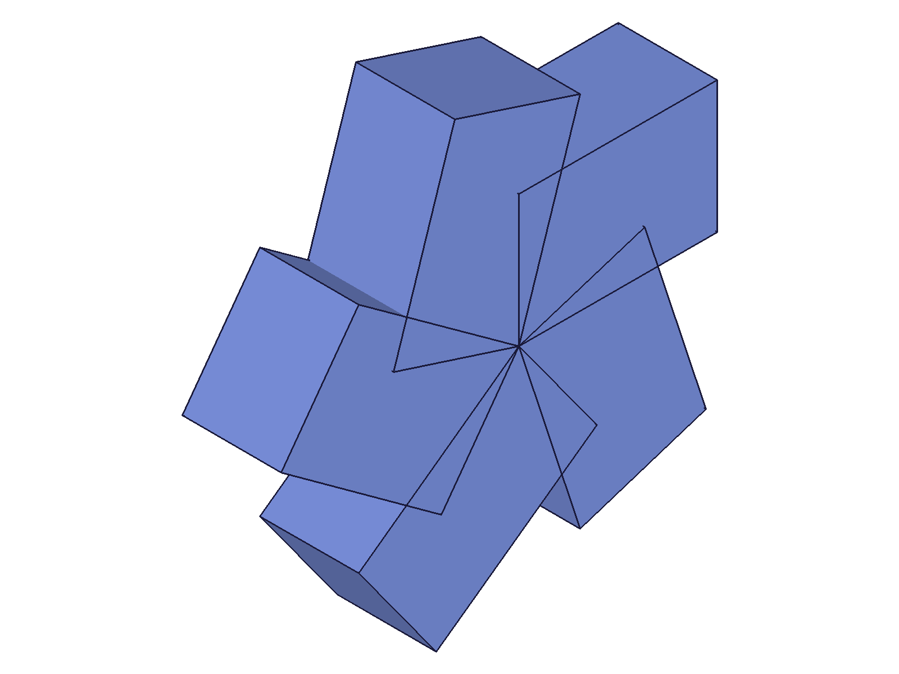 |
|---|---|

**Data:** Created with `angle: '120deg'`, instanceCount=3. `getCircularPattern` returns:
```json
{
  "angle": 2.0943951023931953,
  "id": 123,
  "instanceCount": 3,
  "instanceId": 113,
  "mate1": {"csys": 107, "flip": "Z", "path": [113], "reorient": "0"},
  "name": "CP1",
  "offset": 0
}
```
Angle stored as radians (2.094... = 120°) even when provided as degree string. Non-existent name: null + maxLevel=51.

After `updateCircularPattern({ id: constraintId, instanceCount: 5, angle: '72deg' })`: get returns instanceCount=5, angle=1.2566... (72° in radians). Update result: `{ constraint: 123, instances: [113, 125, 127, 160, 162] }` — 5 instances total. COGs confirm 72° angular spacing in XY plane.

**📌 LLM doc:** getCircularPattern always returns angle in radians regardless of input format. Update takes constraint ID. Degree strings work in update too.

---

## Coverage Checklist

- [x] `linearPattern` called successfully (scripts 01, 03, 04)
- [x] dir1.count and dir1.distance tested (scripts 01-03)
- [x] Count semantics verified: count = total including seed (script 02)
- [x] Spatial verification: COG measurements confirm positions (script 03)
- [x] dir2 + mate2 for 2D grids tested (script 04)
- [x] `getLinearPattern` tested — retrieval by name, nonexistent name (script 05)
- [x] `updateLinearPattern` tested — count/distance change, instance lifecycle (script 06)
- [x] `circularPattern` tested with radians and degree strings (script 07)
- [x] Circular pattern offset (helix) tested (script 08)
- [x] `getCircularPattern` tested — retrieval, angle storage format (script 09)
- [x] `updateCircularPattern` tested — count/angle change (script 09)
- [x] Every goal question answered with numbered script evidence
- [x] Spatial claims backed by COG measurements (scripts 03, 04, 07, 08, 09)

**Not tested:** mate2 with a different WCS (all tests used the same WCS for mate1/mate2). Negative flip values ("-X", "-Y", "-Z"). These are edge cases shared with all assembly constraints and don't need dedicated pattern testing.
