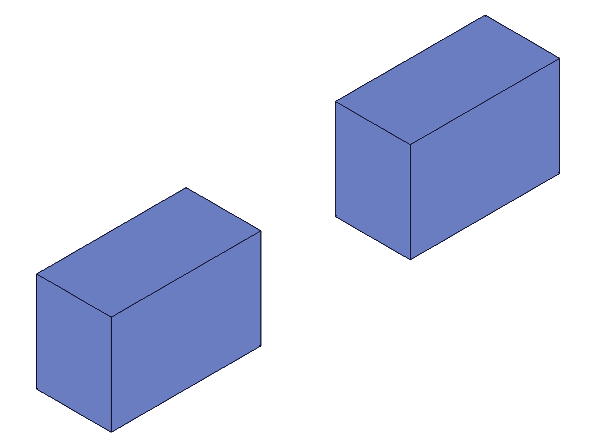
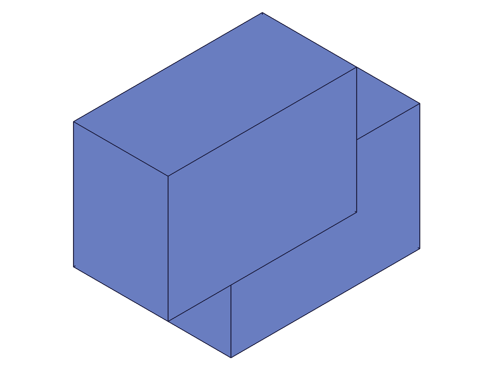
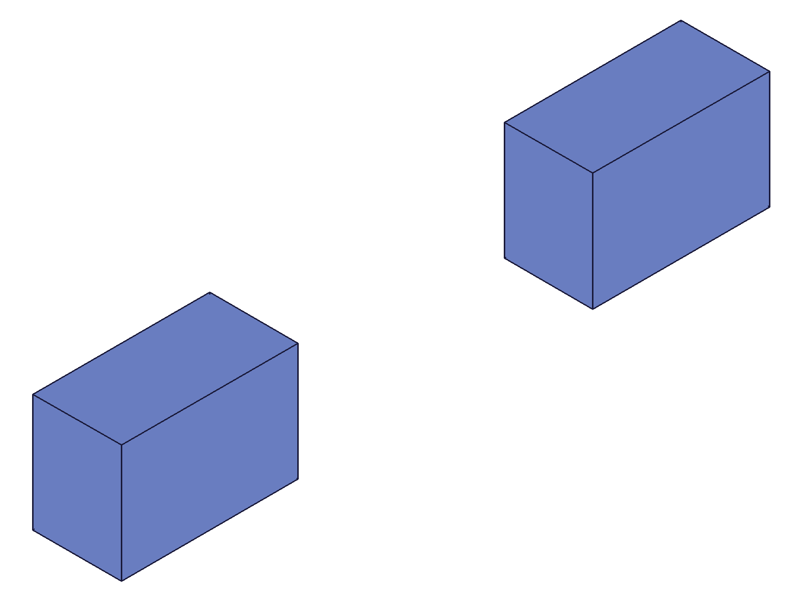
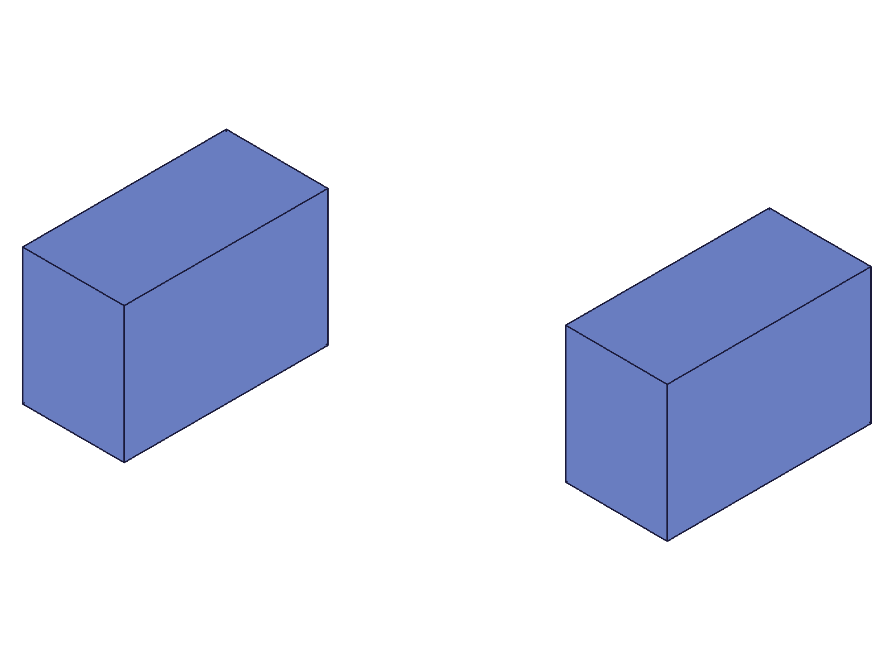
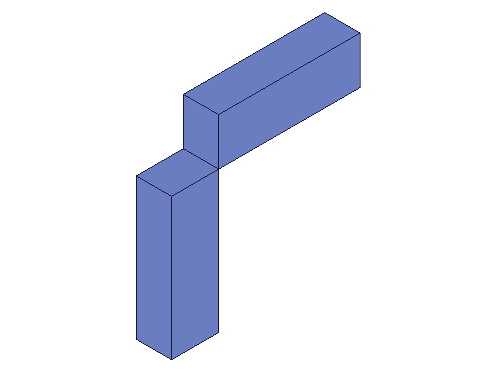
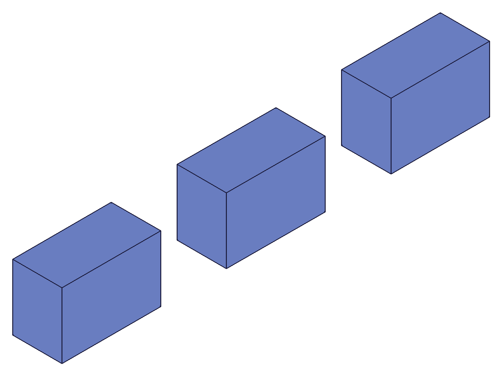
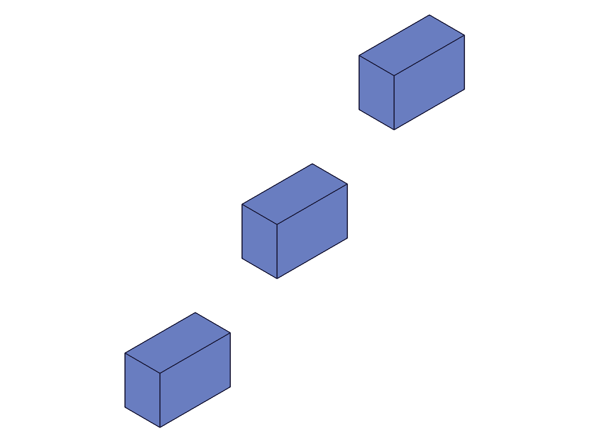
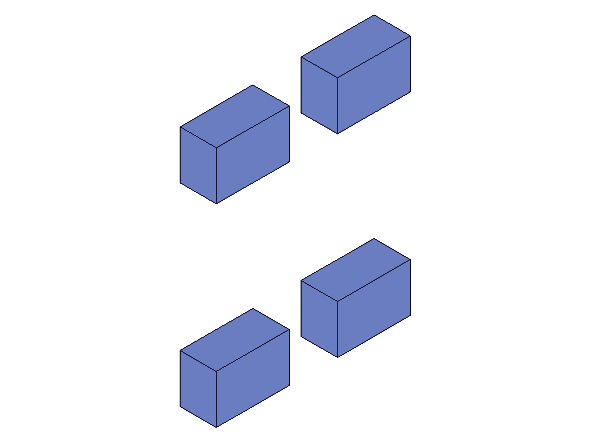
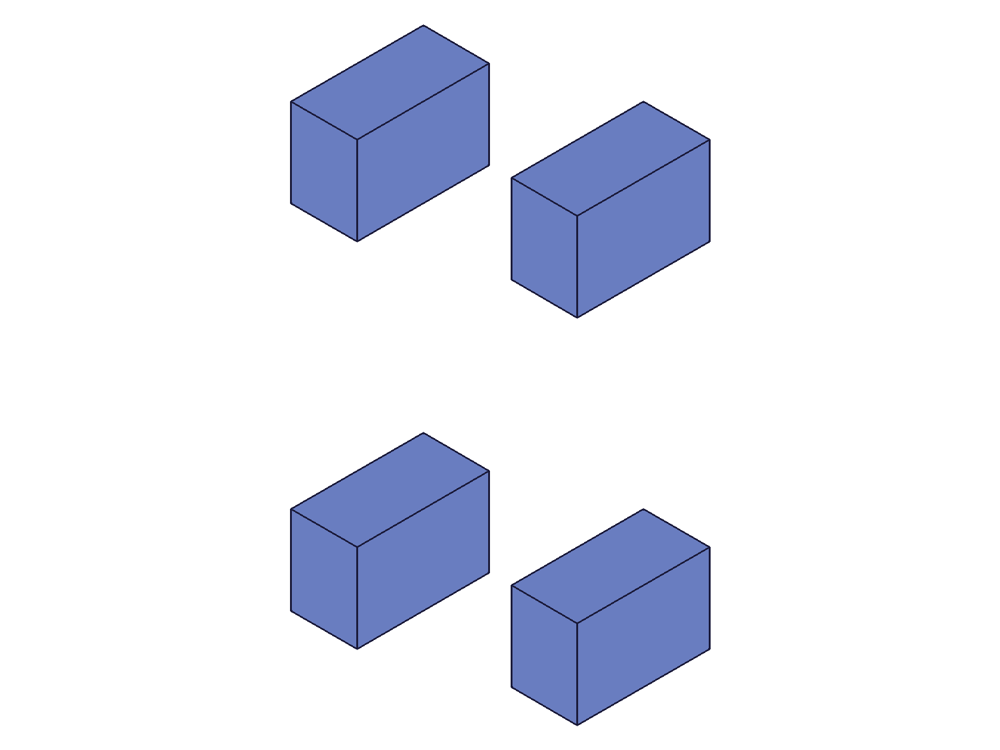

# Training: assembly.transformInstance

**Date:** 2026-05-09

## Goal

Testing `v1.assembly.transformInstance` — relative transform of instances using 4x4 matrices.

**Methods to cover:**

- `transformInstance` — basic translation via 4x4 matrix
- `transformInstance` — rotation via 4x4 matrix
- `transformInstance` — combined rotation + translation
- `transformInstance` — `isLocal` param (global vs local to owner)
- `transformInstance` — batch (array form)
- Propagation behavior: docs say "the same other instances and the template of them will also be transformed"

**Questions:**

- Is the transform truly relative (additive to current position)? → YES (scripts 02, 04)
- What does "same other instances and template will also be transformed" mean in practice? → Template-level propagation for ET instances only (script 10)
- Does `isLocal: TRUE` make the 4x4 matrix relative to the owner's frame? → YES (scripts 05, 06)
- Can you chain multiple transformInstance calls? → YES, they accumulate (script 04)
- What happens with an identity matrix? → No-op (script 07)
- What happens with a left-handed (mirror) matrix? → Error 1014 (script 07)
- What errors occur with invalid inputs? → See script 07

---

## 01 — basic translation

Script: `scripts/01-basic-translation.mjs` — ✅ Translation works. Used wrong field name (`centerOfGravity` instead of `cog`) for mass properties so COG data was undefined. Snapshots show two blocks moving closer together after +[40,20,10] on inst1.

|  |  |
|---|---|

**Data:** result=null, maxLevel=31 (success). COG data lost due to field name error. Fixed in script 02.

---

## 02 — propagation check (root-level instances)

Script: `scripts/02-propagation-check.mjs` — ✅ Confirmed only target instance moves at root level.

|  |  |
|---|---|

**Data:** Template local COG: {x:15, y:10, z:7.5} (30×20×15 box). Assembly COG before: {x:55, y:10, z:7.5} (two instances at [0,0,0] and [80,0,0]). After +50Y on inst1: {x:55, y:35, z:7.5}. Y shift from 10→35 = +25 average, consistent with ONE instance moving +50 (avg(10,60)=35). inst2 did NOT move.

**Learned:** At root level, `transformInstance` moves ONLY the specified instance — sibling instances of the same template are unaffected.
**📌 LLM doc:** Root-level instances are independent — no sibling propagation.

---

## 03 — rotation via 4x4 matrix

Script: `scripts/03-rotation.mjs` — ✅ 90° Z rotation works correctly.

|  |
|---|

**Data:** Assembly COG before: {x:30, y:40, z:7.5}. After 90°Z on inst1: {x:10, y:50, z:7.5}. inst1 local COG [30,10,7.5] → rotated → [-10,30,7.5]. Assembly avg of [-10,30] and [30,70] = [10,50]. ✓

**Learned:** Rotation via 4x4 is applied as matrix composition: new_transform = M × current_transform.

---

## 04 — chained transforms

Script: `scripts/04-chained-transforms.mjs` — ✅ Three sequential transforms accumulate correctly.

**Data:** inst1 starts at [10,0,0]. After +20X → COG shifts from [60,10,7.5] to [70,10,7.5]. After +30Y → [70,25,7.5]. After +15Z → [70,25,15]. All match predictions exactly.

**Learned:** Transforms are truly relative and can be chained indefinitely. Each call composes with the current instance transform.
**📌 LLM doc:** Chaining confirmed — each call accumulates on top of the current state.

---

## 05 — isLocal: FALSE (global transform in sub-assembly)

Script: `scripts/05-isLocal.mjs` — ✅ Global transform on sub-assembly child.

**Data:** Sub-assembly at [50,50,0] rotated 90°Z. Assembly COG before: {x:30, y:40, z:7.5}. After global +30X on child: {x:45, y:40, z:7.5}. X shifted +15 average = one of two instances moved +30 in world X. ✓

**Learned:** isLocal:FALSE (default) applies the 4x4 in world/global coordinates regardless of owner's orientation.

---

## 06 — isLocal: TRUE (local transform in sub-assembly)

Script: `scripts/06-isLocal-true.mjs` — ✅ Local transform respects owner's frame.

**Data:** Same setup. Assembly COG before: {x:30, y:40, z:7.5}. After local +30X on child: {x:30, y:55, z:7.5}. Y shifted +15 average = one instance moved +30 in world Y. Since sub-assembly is rotated 90°Z, local X = world Y. ✓

**Learned:** isLocal:TRUE makes the 4x4 matrix relative to the owner's (sub-assembly's) coordinate frame. A +30 local X became +30 world Y because the owner was rotated 90° around Z.
**📌 LLM doc:** isLocal:TRUE applies transform in owner's local frame. Critical for sub-assembly work.

---

## 07 — edge cases

Script: `scripts/07-edge-cases.mjs` — ✅ Five edge cases tested.

**Data:**
1. **Identity matrix**: No-op, COG unchanged at {x:35, y:40, z:7.5}. ✓
2. **Left-handed (mirror)**: Error 1014 "The provided matrix is left-handed. This is not yet supported." maxLevel=51.
3. **Missing transformation**: Error 1004 "The parameter \"transformation\" must be provided."
4. **Invalid ID (999999)**: Warning code 0 + Error 1006 "invalid id."
5. **Scale matrix (2x)**: maxLevel=31 (ACCEPTED!). COG changed from [35,40,7.5] to [55,70,7.5]. The 2x scale matrix was accepted, and the scaling in the 3x3 rotation part scaled the translation via matrix composition (new_T = M × current_T), then the rotation part was renormalized. Net effect: position doubled from [20,30] to [40,60].

**Learned:** Scale matrices are silently accepted. The rotation part is normalized after composition, but the translation column already absorbed the scaling from the matrix multiplication. Effectively, a scale factor N applied to an instance at position P moves it to position N×P.
**📌 LLM doc:** Scale matrix gotcha — accepted without error, effectively scales the position. Left-handed error 1014.

---

## 08 — batch transform (array form)

Script: `scripts/08-batch-transform.mjs` — ✅ Batch works, each instance transformed independently.

|  |  |
|---|---|

**Data:** 3 instances at X=0,50,100. Batch moved them +30Y, +60Y, +90Y respectively. Assembly COG after: {x:65, y:70, z:7.5}. Predicted: [65, 70, 7.5]. ✓ Returns VOID (null), maxLevel=31.

**Learned:** Array form works. Each element in the array is processed independently. Returns single VOID result.

---

## 09 — combined rotation + translation

Script: `scripts/09-combined-rot-translate.mjs` — ✅ 90°Z rotation + [50,30,0] translation in one matrix.

**Data:** Assembly COG after: {x:35, y:75, z:7.5}. Predicted: [35, 75, 7.5]. ✓

**Learned:** Combined rotation+translation in a single 4x4 works exactly as expected. The 4x4 is applied as one atomic operation via matrix composition.

---

## 10 — propagation in sub-assembly context (CRITICAL finding)

Script: `scripts/10-propagation-subasm.mjs` — ✅ Template-level propagation confirmed.

|  |  |
|---|---|

**Data:** Two sub-assembly instances (PairInst1, PairInst2), each containing two children (ChildA, ChildB). Transformed PairInst1's ChildA (ET id 120) by +40Y. Assembly COG Y shifted from 50 to 70 (+20 average). This is consistent with TWO ChildA instances moving +40 each (both PairInst1/ChildA and PairInst2/ChildA), NOT just one. If only one moved, Y would shift to 60, not 70.

**Calculation:**
- Before: 4 instances with Y COGs [10, 10, 90, 90] → avg 50
- If only one ChildA moved: [50, 10, 90, 90] → avg 60 — NOT observed
- If both ChildAs moved: [50, 10, 130, 90] → avg 70 — ✓ matches!

**Learned:** Transforming an expanded-tree (ET) instance propagates to the template's corresponding instance, which then updates ALL other instances of that template. This is the meaning of the doc claim "the same other instances and the template of them will also be transformed."

**Key distinction:**
- **Root-level CC_ProductReference** instances: `transformInstance` moves ONLY the target. Siblings unaffected. (Script 02)
- **Expanded-tree CC_ProductReferenceET** instances: `transformInstance` propagates through the template to ALL instances. (Script 10)

**📌 LLM doc:** CRITICAL — ET instance transforms propagate via template. Root-level instances are independent.

---

## Coverage Checklist

- [x] API called successfully
- [x] Required `id` parameter tested
- [x] Required `transformation` (4x4 matrix) tested
- [x] Optional `isLocal` tested (FALSE=global, TRUE=local to owner)
- [x] No enum values to test
- [x] No corresponding update/delete method
- [x] Realistic usage: chaining, sub-assembly context, batch
- [x] Behavioral claims verified with COG data + snapshots
- [x] Spatial claims backed by numeric COG measurements
- [x] Every question in Goal section answered with named scripts
