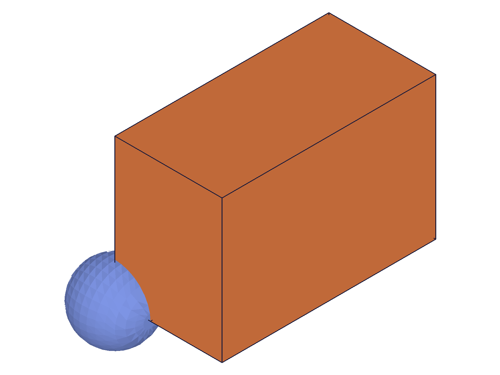
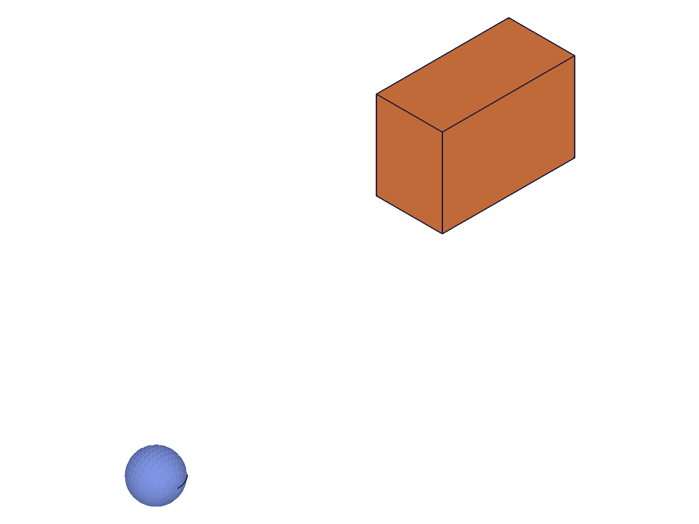
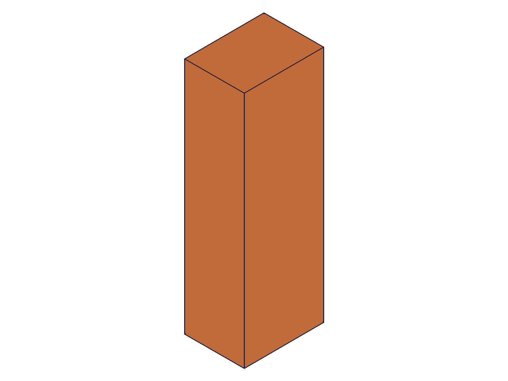
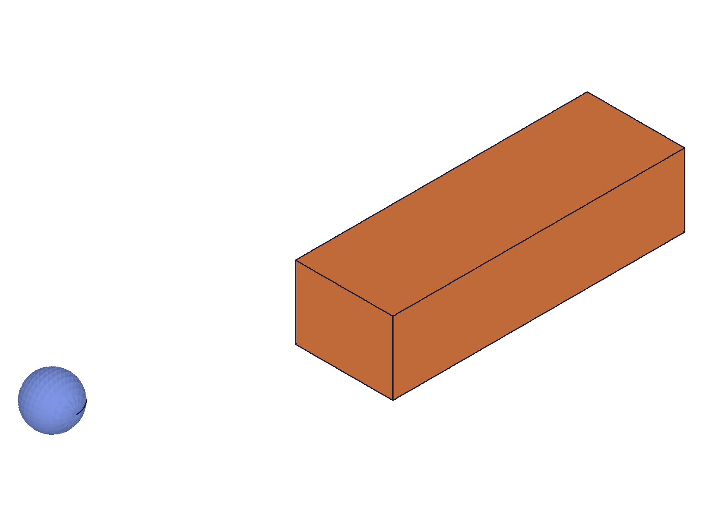

# Training: assembly.transformInstanceTo

**Date:** 2026-05-09

## Goal

Testing `v1.assembly.transformInstanceTo` — absolute positioning of instances using `[origin, xDir, yDir]` format.

**Methods to cover:**

- `transformInstanceTo` — basic absolute positioning (translate instance to known world position)
- `transformInstanceTo` — rotation via xDir/yDir vectors
- `transformInstanceTo` — combined rotation + translation
- `transformInstanceTo` — `isLocal` param (global vs local to owner)
- `transformInstanceTo` — batch/array form
- Propagation behavior (root instances vs ET instances)
- Error handling (invalid params, left-handed, non-orthogonal)

**Questions:**

- Is this truly absolute (overwriting current transform), unlike `transformInstance` which is relative?
- How does `[origin, xDir, yDir]` define z-direction — cross product?
- Does it accept 4x4 matrix format too (like `instance` does)?
- Does `isLocal` work the same as in `transformInstance`?
- What are the propagation rules for ET instances?
- How does calling it twice behave — does the second call fully replace the first?
- Can you pass non-unit xDir/yDir vectors (non-normalized)?
- What errors occur with left-handed or non-orthogonal direction vectors?

**Questions answered:**

- Is this truly absolute? → **YES** — script 02 proves second call overwrites first (COG matches absolute position, not cumulative)
- z-direction from cross product? → **YES** — confirmed by rotation COG in script 03 matching expected rotated coordinates
- Accepts 4x4 matrix? → **NO** — script 08: error code 1002, "should be 3 elements". Unlike `assembly.instance`, this API only accepts `[origin, xDir, yDir]`
- isLocal same as transformInstance? → **YES** — script 04: with 90°Z-rotated owner, local [30,0,0] maps to world [0,30,0]
- Propagation rules? → **Same as transformInstance** — ET instances propagate to template + all sibling instances (script 09). Root-level instances are independent (script 10)
- Second call overwrites? → **YES** — script 02: COG after second call matches new absolute position, not sum
- Non-unit vectors? → **Normalized silently** — script 06: non-unit [2,0,0],[0,3,0] produces same result as [1,0,0],[0,1,0]
- Left-handed/non-orthogonal? → **Left-handed impossible** with 3-point format (z=cross(x,y) is always right-handed). Non-orthogonal accepted — system orthogonalizes via Gram-Schmidt (keeps xDir, derives z, corrects yDir). Zero-length/collinear vectors → error 51

---

## 01 — basic absolute position

Script: `scripts/01-basic-position.mjs` — ✅ basic translation works. Used wrong `calculateMassProperties` params (productId/instanceId instead of id) — COG returned undefined. Visual evidence confirmed the move.

|  |  |
|---|---|

**Data:** API returned null result, maxLevel=31 (success). Block visibly moved away from reference sphere.

---

## 02 — absolute overwrite (key test)

Script: `scripts/02-absolute-overwrite.mjs` — ✅ confirms absolute positioning and overwrite behavior.

**Data:**
- Initial (inst at [10,0,0]): COG = [25, 10, 7.5] — matches [10+15, 0+10, 0+7.5]
- After `transformInstanceTo([50,30,0])`: COG = [65, 40, 7.5] — matches [50+15, 30+10, 7.5]
- After second `transformInstanceTo([100,0,20])`: COG = [115, 10, 27.5] — matches [100+15, 0+10, 20+7.5]

Second call fully overwrites first. Not cumulative — each call sets absolute position.

**📌 LLM doc:** Document that this is absolute (overwrites current transform), unlike `transformInstance` which is relative.

---

## 03 — rotation via xDir/yDir

Script: `scripts/03-rotation.mjs` — ✅ rotation works correctly via direction vectors.

|  |  |
|---|---|

**Data:** (assembly contains block + reference sphere, COG is weighted average)
- 90°Z at origin (xDir=[0,1,0], yDir=[-1,0,0]): COG ≈ [-9.72, 29.15, 7.29] — matches block local [30,10,7.5] rotated 90°Z → [-10,30,7.5] weighted with sphere at origin
- 90°X at [50,0,0] (xDir=[1,0,0], yDir=[0,0,1]): COG ≈ [77.74, -7.29, 9.72] — matches block local [30,10,7.5] rotated 90°X → [30,-7.5,10] + origin [50,0,0]

**📌 LLM doc:** Document `[origin, xDir, yDir]` format — xDir and yDir define rotation, z is derived from cross(x,y).

---

## 04 — isLocal behavior

Script: `scripts/04-isLocal.mjs` — ✅ isLocal works as expected with rotated sub-assembly.

**Data:** Sub-assembly rotated 90°Z. Child ET transformed to [30,0,0]:
- `isLocal: FALSE` (global): COG.x ≈ 46.93, COG.y ≈ 9.39 — child placed at world [30,0,0]
- `isLocal: TRUE` (local): COG.x ≈ -9.39, COG.y ≈ 46.93 — local [30,0,0] maps to world [0,30,0] (owner's X → world Y after 90°Z)

x and y swapped between global and local modes, consistent with 90°Z rotation of the owner frame.

**📌 LLM doc:** Document isLocal behavior — same semantics as `transformInstance`.

---

## 05 — batch form

Script: `scripts/05-batch.mjs` — ✅ array form works, returns single VOID result.

**Data:** 3 instances placed at [0,0,0], [50,0,0], [100,0,0]. COG = [65, 10, 7.5] — matches average of block COGs at [15,10,7.5], [65,10,7.5], [115,10,7.5].

**📌 LLM doc:** Document batch form accepts array of `{id, transformation, isLocal}` objects.

---

## 06 — vector edge cases

Script: `scripts/06-non-unit-vectors.mjs` — mixed results, multiple findings.

**Data:**
1. **Non-unit vectors [2,0,0],[0,3,0]**: maxLevel=31 (success), COG=[20,10,5] — same as identity. Vectors are **normalized**, no scaling applied.
2. **Non-orthogonal [1,0.5,0],[0,1,0]**: maxLevel=31 (success), COG=[13.42,17.89,5] — system **orthogonalizes**: normalizes xDir, computes z=cross(x,y), corrects y=cross(z,x). Effective rotation ≈26.57° around Z.
3. **Zero xDir [0,0,0],[0,1,0]**: maxLevel=51, error: "Vectors for SetCoordSystem may not have length 0"
4. **Collinear [1,0,0],[2,0,0]**: maxLevel=51, error: "Vectors for SetCoordSystem may not be parallel"
5. **"Left-handed" [1,0,0],[0,0,1]**: maxLevel=31 (success) — not actually left-handed because z=cross(x,y) always yields right-handed frame.

**📌 LLM doc:** Document vector normalization, orthogonalization, and error cases. The 3-point format cannot produce left-handed systems.

---

## 07 — error cases

Script: `scripts/07-errors.mjs` — ✅ all error cases documented.

| Error case | maxLevel | Code | Message |
|---|---|---|---|
| Missing transformation | 51 | 1004 | "transformation" must be provided |
| Missing id | 51 | 1004 | "id" must be provided |
| Invalid id (99999) | 51 | 0 | ToId()/TOID() didn't get an existing or valid id |
| 2-point array | 51 | 1002 | "transformation" has invalid number of elements! There should be 3 |
| Empty array | 51 | 1002 | Same as 2-point |
| Template ID (not instance) | 51 | 1001 | "id" has a wrong id type! Provide only following id types: ["instance"] |

**📌 LLM doc:** Document error codes and messages.

---

## 08 — 4x4 matrix format

Script: `scripts/08-4x4-matrix.mjs` — ❌ 4x4 matrix rejected.

**Data:** Passing 4x4 identity-with-translation matrix: maxLevel=51, code 1002, "should be 3 elements". COG unchanged (transform not applied). Unlike `assembly.instance` which accepts both formats, `transformInstanceTo` only accepts `[origin, xDir, yDir]`.

**📌 LLM doc:** CRITICAL — document that this API does NOT accept 4x4 matrices, only the 3-point format. This differs from `assembly.instance`.

---

## 09 — ET propagation

Script: `scripts/09-propagation.mjs` — ✅ ET instances propagate.

**Data:** Two instances of the same sub-assembly (Sub1 at origin, Sub2 at [80,0,0]). Transformed child ET in Sub1 to [0,40,0].
- COG before: [55, 10, 7.5]
- COG after: [55, 50, 7.5]

If only Sub1's child moved: COG.y = (50+10)/2 = 30. But we got COG.y=50, meaning both children moved to y=40 in their respective sub-assembly frames. Transform propagated to template → all instances updated.

**📌 LLM doc:** Same propagation rules as `transformInstance` — ET instances propagate to template + siblings.

---

## 10 — root-level no propagation

Script: `scripts/10-root-no-propagation.mjs` — ✅ root instances are independent.

**Data:** Two root-level instances of same template. Transformed inst1 to [0,50,0].
- COG before: [45, 10, 7.5]
- COG after: [45, 35, 7.5] — matches "only inst1 moved" expectation [(15+75)/2, (60+10)/2, 7.5] = [45, 35, 7.5]

Not [45, 60, 7.5] which would indicate propagation. Root-level instances are independent.

---

## Coverage

- [x] API called successfully
- [x] Required parameters (id, transformation) tested
- [x] Optional parameter (isLocal) tested
- [x] Batch/array form tested
- [x] No update/delete methods for this API
- [x] Realistic usage with prerequisites
- [x] All claims verified with COG data AND snapshots
- [x] All goal questions answered with named scripts
- [x] Error cases documented
