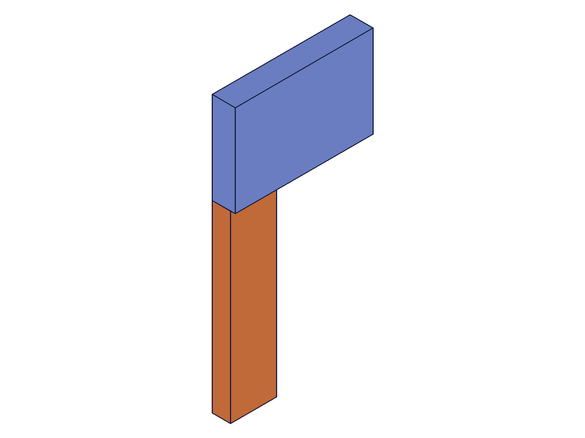
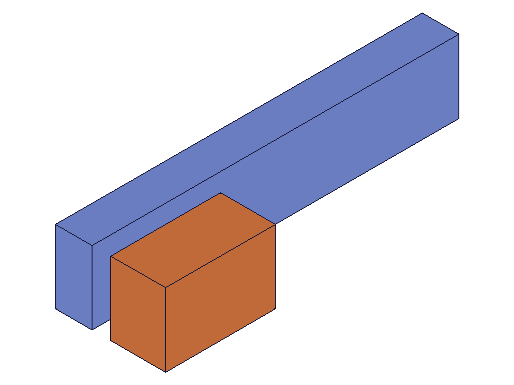
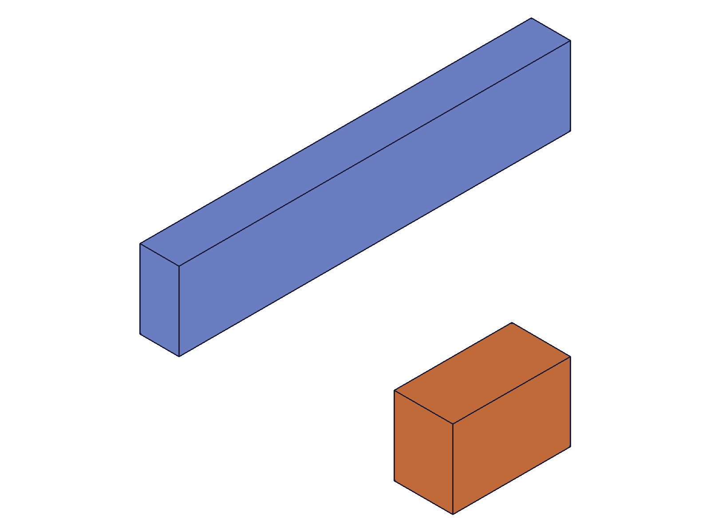
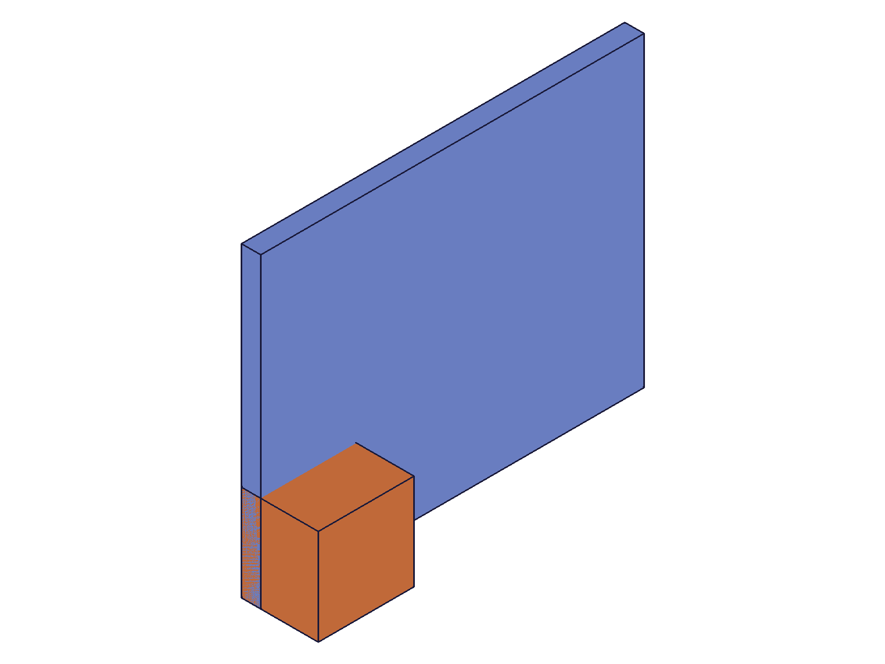
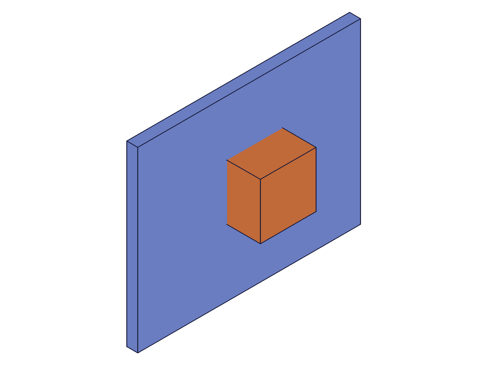
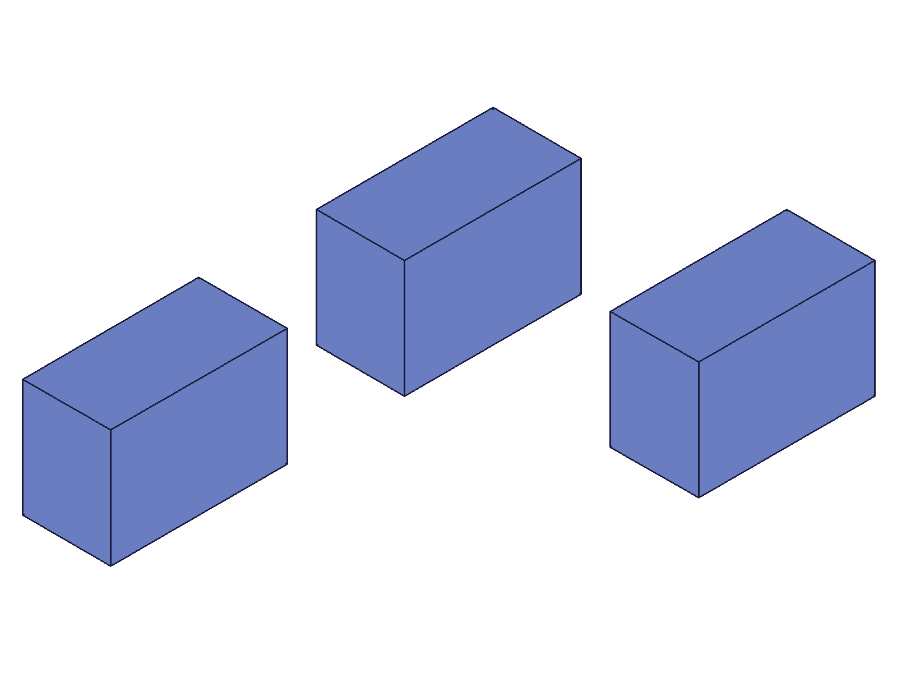

# Training: assembly.startMovingUnderConstraints

**Date:** 2026-05-09

## Goal

Testing `v1.assembly.startMovingUnderConstraints`, `v1.assembly.moveUnderConstraints`, and `v1.assembly.finishMovingUnderConstraints` — the three-step constraint-driven motion workflow.

**Methods to cover:**

- `startMovingUnderConstraints` — params: id (assembly root), instanceIds, pivotInfo, mucType (TRANSLATION_1D, TRANSLATION_2D, ROTATION)
- `moveUnderConstraints` — params: id, rotation (basis vectors), offset (translation)
- `finishMovingUnderConstraints` — params: id (assembly root)

**Questions:**

- What does the full start → move → finish workflow look like with a revolute joint?
- How does mucType affect which DOF can be exercised?
- What is pivotInfo and how does it affect rotation behavior?
- Can we translate with ROTATION mode or rotate with TRANSLATION modes?
- What happens when motion violates constraint limits (e.g., revolute zRotationLimits)?
- What happens if we skip startMoving and go straight to moveUnderConstraints?
- What happens if we call finishMoving without startMoving first?
- Can we move multiple instances at once via instanceIds?
- What happens with unconstrained (free) instances?
- Does the position persist after finish, or does it revert?
- What are the error conditions and messages?

---

## 01 — basic ROTATION workflow

Script: `scripts/01-basic-rotation.mjs` — ✅ Full start → move → finish workflow works with revolute constraint.

|  |  |  |
|---|---|---|

**Data:** All three calls return VOID (null) with maxLevel=31. COG before: (33.5, 16.5, 4.7), after move: (23.0, -0.9, 4.7), after finish: identical to after-move. Volume constant at 36800.

**Learned:**
- The three-step workflow works: `startMovingUnderConstraints` → `moveUnderConstraints` → `finishMovingUnderConstraints`
- ROTATION mucType with 90° Z rotation basis vectors successfully rotates the arm around the revolute joint axis
- Position **persists** after `finishMovingUnderConstraints` — it does not revert
- `moveUnderConstraints` takes `rotation` as basis vectors (xDir/yDir/zDir object), not as an angle

**📌 LLM doc:** Core workflow pattern for all three APIs.

## 02 — TRANSLATION_1D along wrong axis (no effect)

Script: `scripts/02-translation-1d.mjs` — ✅ Constraint solver projects motion onto allowed DOF.

Slider constraint allows 1 DOF (Z-axis translation). Applied offset=[50,0,0] (X direction). COG unchanged: (39.14, 10.0, 10.43) before and after. No error — the solver silently projects the requested motion onto the allowed DOF, which has zero X component.

**Data:** All three calls return VOID with maxLevel=31. Mass comparison shows identical COG before/mid/after.

**Learned:** Motion that's orthogonal to the allowed DOF is silently ignored — no error, no warning.

## 03 — TRANSLATION_1D along free axis (Z)

Script: `scripts/03-translation-1d-along-z.mjs` — ✅ Slider block moves along Z axis.

|  |  |
|---|---|

**Data:** COG Z: 10.43 → 25.95, X/Y unchanged. Volume constant at 29000. Block's proportional contribution to COG shift ≈ 50 units along Z (matches requested offset).

**Learned:** TRANSLATION_1D with slider works when the offset is along the slider's free axis (Z). The solver projects the 3D offset vector onto the 1D allowed direction.
**📌 LLM doc:** TRANSLATION_1D projects offset onto constraint's free DOF; orthogonal components silently ignored.

## 04 — TRANSLATION_2D with planar constraint

Script: `scripts/04-translation-2d.mjs` — ✅ 2D translation works on free plane; constrained axis ignored.

|  |  |
|---|---|

**Data:** XY move offset=[40,30,0]: COG X: 41.1→50.6, Y: 33.5→40.6, Z unchanged (4.29). Z-only move offset=[0,0,50]: COG completely unchanged from XY result — Z is constrained by planar.

**Learned:** TRANSLATION_2D with planar constraint allows motion in the 2 free DOF (X and Y on the plane) and silently ignores the constrained DOF (Z normal to plane). Same silent-projection behavior as TRANSLATION_1D.
**📌 LLM doc:** TRANSLATION_2D behavior with planar constraints.

## 05 — error conditions (skip start, double start, finish without start)

Script: `scripts/05-skip-start.mjs` — ✅ All "error" cases silently succeed.

**Data:** All calls return VOID with maxLevel=31:
- `moveUnderConstraints` without prior `startMovingUnderConstraints`: succeeds, no error
- `finishMovingUnderConstraints` without prior start: succeeds, no error
- Double `startMovingUnderConstraints` (start → start without finish): second start succeeds

**Learned:** The three-step workflow is **not enforced by the server**. Skipping start or calling finish without start produces no error. The protocol is lenient — but whether the move has any geometric effect without start is unclear. This is a no-op safety property, not a strict state machine.
**📌 LLM doc:** Server does not enforce start/move/finish sequence — no errors for out-of-order calls, but geometric effect only guaranteed when the full sequence is followed.

## 06 — pivotInfo effect on rotation

Script: `scripts/06-pivot-info.mjs` — ✅ pivotInfo has no effect with revolute constraint.

**Data:** Same 45° rotation with pivot=[0,0,0] and pivot=[40,20,0] produce identical COG: (31.86, 5.66, 4.65). Reset (inverse rotation) restores original COG exactly: (33.48, 16.52, 4.65).

**Learned:** For revolute constraints, `pivotInfo` is ignored — the constraint's rotation axis (the joint Z-axis) determines the rotation center. The inverse rotation correctly resets position, confirming rotations are composable.
**📌 LLM doc:** pivotInfo is ignored when the constraint already defines the rotation axis; the constraint DOF takes precedence.

## 07 — multiple moveUnderConstraints calls: absolute, not incremental

Script: `scripts/07-multi-move.mjs` — ✅ Moves are absolute from the start position.

**Data:**
- Before: COG (33.48, 16.52)
- After move1 (30° from start): (33.35, 9.10)
- After move2 (30° again): **(33.35, 9.10)** — identical to move1
- After move3 (60° from start): (29.53, 2.73) — different
- After finish + new session + 60° from THAT position: (15.62, -0.74) — 120° total from original

**Learned:** `moveUnderConstraints` sets the position **absolutely from the start position**, not incrementally. Calling it twice with the same rotation replaces the first result. Each move is relative to where the instance was when `startMovingUnderConstraints` was called, not relative to the last move. A new start/finish session resets the reference point.
**📌 LLM doc:** CRITICAL — moves are absolute-from-start, not incremental. Each call overwrites the previous within a session.

## 08 — rotation limits enforced during motion

Script: `scripts/08-rotation-limits.mjs` — ✅ Limits clamp the requested rotation.

**Data:**
- 30° (within ±45° limits): COG (33.35, 9.10) — applied in full
- 90° (exceeds +45° limit): COG (31.89, 5.71) — clamped near 45°
- 45° reference: COG (31.86, 5.66) — nearly identical to the clamped 90°
- No error or warning — maxLevel=31 for the clamped move

**Learned:** `zRotationLimits` ARE enforced during `moveUnderConstraints`. A requested rotation beyond the limit is silently clamped to the limit — no error, no warning. The solver projects to the nearest valid position.
**📌 LLM doc:** Rotation limits silently clamp the motion — no error for beyond-limit requests.

## 09 — unconstrained (free) instance motion

Script: `scripts/09-unconstrained.mjs` — ✅ Both rotation and translation work on free instances.

**Data:**
- Before: COG (20, 15, 10)
- After 90° rotation: COG (15, -20, 10) — correct 90° CCW: (x,y)→(y,-x)
- After +50,+30 translation: COG (65, 10, 10) — correct: (15,-20) + (50,30) = (65,10)

**Learned:** Motion works on unconstrained instances — "under constraints" means the solver respects any existing constraints; with none, it's equivalent to free-body motion. All 6 DOF are available.

## 10 — multi-instance motion

Script: `scripts/10-multi-instance.mjs` — ✅ instanceIds array moves multiple instances together.

|  |  |
|---|---|

**Data:** 3 blocks in row at Y=10. Moved inst1+inst2 with offset=[0,40,0]. COG Y: 10.0 → 36.67 = (50+50+10)/3. X and Z unchanged.

**Learned:** `instanceIds` array accepts multiple instance IDs. All listed instances move together; unlisted instances stay fixed.

## 11 — combined rotation + offset in single move call

Script: `scripts/11-combined-rotation-offset.mjs` — ✅ Both params applied in ROTATION mode.

**Data:**
- Before: COG (20, 15, 10)
- ROTATION mode + rotation + offset=[50,0,0]: COG (65, -20, 10)
- Rotation only (same rotation, no offset): COG (15, -20, 10)
- Translation only (same offset, no rotation): COG (70, 15, 10)

Composition order: rotate first → translate. (15,-20) + (50,0) = (65,-20) ✓

**Learned:** `mucType` doesn't restrict which params `moveUnderConstraints` accepts — you can pass both `rotation` and `offset` regardless of the mode. Rotation is applied before translation.
**📌 LLM doc:** Both rotation and offset can be combined in a single move; mucType doesn't restrict param usage.

## 12 — invalid parameter errors

Script: `scripts/12-invalid-params.mjs` — ✅ Good error messages for all invalid params.

**Data:**

| Test | maxLevel | Code | Error |
|---|---|---|---|
| Bad assembly ID | 51 | 1006 | `"id" has an invalid id!` |
| Empty instanceIds | **31** | — | **No error — silently accepted** |
| Invalid mucType | 51 | 1013 | Lists valid values: TRANSLATION_1D, TRANSLATION_2D, ROTATION |
| Bad instance ID | 51 | 1006 | `"instanceIds" has an invalid id!` |
| Missing instanceIds | 51 | 1004 | `"instanceIds" must be provided` |
| Missing pivotInfo | 51 | 1004 | `"pivotInfo" must be provided` |
| Missing mucType | 51 | 1004 | `"mucType" must be provided` |

**Learned:** All three params (`instanceIds`, `pivotInfo`, `mucType`) are required — missing any gives code 1004. Invalid IDs give 1006. Invalid mucType gives 1013 with valid values listed. **Empty instanceIds array is silently accepted** (no error).
**📌 LLM doc:** Error codes and required params.

## 13 — mucType constrains which motion params are respected

Script: `scripts/13-mucType-vs-params.mjs` — ✅ mucType IS meaningful for param acceptance.

**Data:**
- TRANSLATION_2D + rotation param: COG unchanged (20, 15, 10) — **rotation IGNORED**
- TRANSLATION_1D + rotation param: COG unchanged (20, 15, 10) — **rotation IGNORED**
- ROTATION + offset only: COG (70, 45, 10) = (20+50, 15+30) — **offset applied**

**Learned:** `mucType` determines which motion params the solver considers:
- `ROTATION`: accepts BOTH rotation and offset (most permissive)
- `TRANSLATION_2D`: accepts offset only; rotation param silently ignored
- `TRANSLATION_1D`: accepts offset only; rotation param silently ignored

This corrects the script 11 finding — mucType IS meaningful. ROTATION mode is the only mode that can apply rotations.
**📌 LLM doc:** CRITICAL: mucType determines which params are active. TRANSLATION modes silently ignore rotation.

## 14 — cylindrical constraint motion (2 DOF)

Script: `scripts/14-cylindrical-motion.mjs` — ✅ Both rotation and translation DOFs of cylindrical work.

**Data:**
- Before: COG (2.52, 0.63, 6.60)
- After ROTATION 90°: COG (0.63, -2.52, 6.60) — XY rotated, Z unchanged
- After TRANSLATION_1D Z+40: COG (0.63, -2.52, 9.95) — Z shifted, XY unchanged

**Learned:** Cylindrical constraint's 2 DOFs (Z-rotation + Z-translation) work correctly with the motion APIs. Use ROTATION for the rotation DOF and TRANSLATION_1D for the translation DOF.

## 15 — moving a grounded instance (no effect)

Script: `scripts/15-move-grounded.mjs` — ✅ Grounded instance cannot be moved.

**Data:** COG unchanged at (25, 20, 5) for both ROTATION and TRANSLATION_2D attempts. maxLevel=31, no error.

**Learned:** `fastenedOrigin` locks all 6 DOF. The solver projects the requested motion onto zero free DOF = no motion. Silent, no warning.

## 16 — spherical constraint (3 DOF rotation)

Script: `scripts/16-spherical-motion.mjs` — ✅ All 3 rotation axes work with spherical.

**Data:**
- Before: COG (25.45, 16.59, 8.64)
- After X rotation 45°: COG (25.45, 16.96, 6.79) — Y/Z changed, X unchanged
- After Y rotation 45°: COG (22.60, 16.96, 14.65) — X/Z changed, Y unchanged

**Learned:** Spherical constraint's 3 rotation DOFs all work correctly with ROTATION mucType.

## 17 — realistic hinge animation (multi-session chaining)

Script: `scripts/17-realistic-hinge-animation.mjs` — ⚠️ Multi-session chaining didn't produce expected results.

**Data:** COG at 45° and 90° attempts are identical: (2.23, 37.27, 57.27). The second session's 45° rotation from the already-rotated position produced no additional motion.

**Learned:** For revolute constraints, the rotation basis vectors in `moveUnderConstraints` appear to be interpreted relative to the constraint's zero position, not relative to the session start. Applying the same 45° basis in a new session (starting from 45°) results in the same 45° position — it does NOT add 45° to reach 90°. To animate through multiple angles, either: (a) compute the total angle from zero and use one session, or (b) use different basis vectors in each session representing the DESIRED final angle from the constraint zero. This differs from free-instance behavior (script 07 showed accumulation across sessions for unconstrained revolute with no limits).
**📌 LLM doc:** IMPORTANT — rotation basis interpretation differs between constrained and unconstrained contexts. For constrained joints, the basis represents the target angle from the constraint's zero position.

