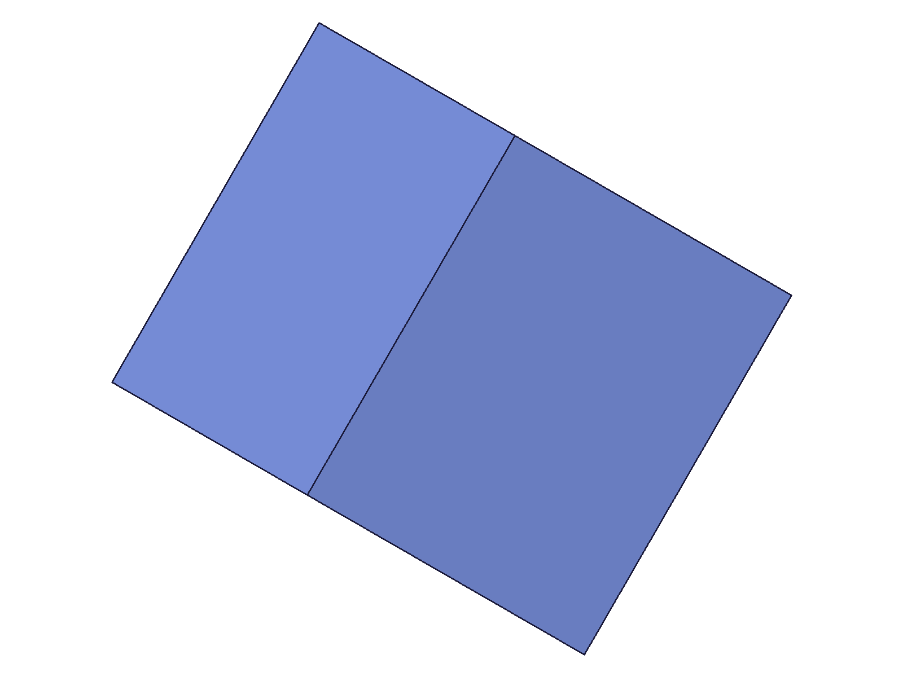
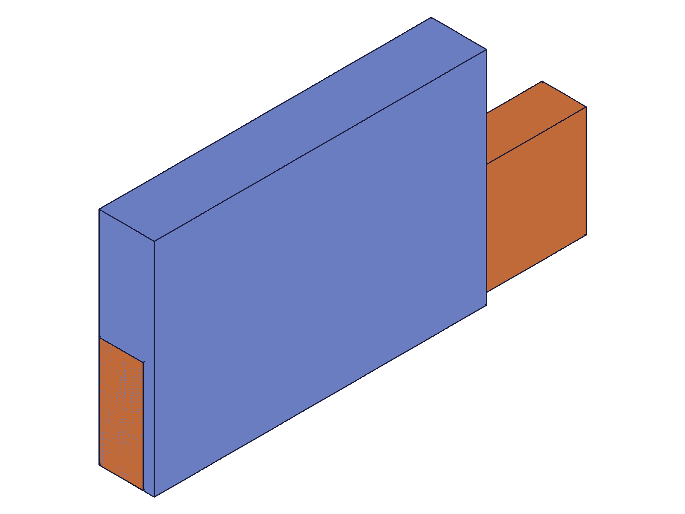
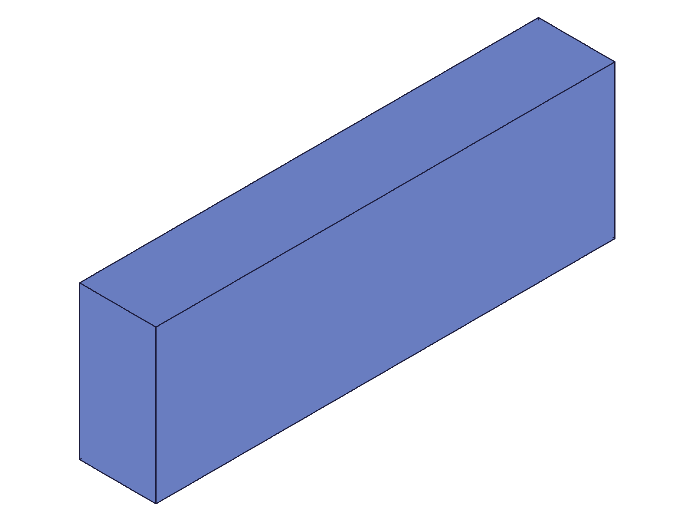

# Training: assembly.moveUnderConstraints

**Date:** 2026-05-09

## Goal

Deep-dive on `v1.assembly.moveUnderConstraints` — the middle step of the constraint-driven motion workflow. The prior session (startMovingUnderConstraints) covered the broad workflow across all three APIs. This session focuses on `moveUnderConstraints`-specific behaviors and edge cases.

**Methods to cover:**

- `moveUnderConstraints` — params: id, rotation (basis vectors), offset (translation)

**Questions:**

- What happens with non-orthogonal basis vectors in the rotation param?
- What happens with identity rotation + non-zero offset (offset-only motion)?
- What happens when calling moveUnderConstraints multiple times without finish — does the last call win?
- Does omitting both rotation and offset produce a no-op?
- How does offset interact with rotation for constrained joints (revolute)?
- Can we translate a revolute-constrained instance using offset param (should be projected to zero)?

---

## 01 — non-orthogonal basis vectors

Script: `scripts/01-non-orthogonal-basis.mjs` — ✅ Non-orthogonal basis is silently ignored.

|  |
|---|

**Data:** COG before: (20, 15, 10). After non-orthogonal basis {xDir:[1,1,0], yDir:[0,1,0], zDir:[0,0,1]}: COG unchanged (20, 15, 10). No error — maxLevel=31, no messages. After proper orthogonal 45° rotation: COG (24.75, -3.54, 10) — correctly applied.

**Learned:** Non-orthogonal basis vectors in the `rotation` param produce a **silent no-op**. The server accepts them without error or warning but does not apply any rotation. Only proper orthogonal basis vectors produce rotation.
**📌 LLM doc:** Non-orthogonal basis vectors silently produce no rotation — no error, no warning.

## 02 — offset-only motion (no rotation param)

Script: `scripts/02-offset-only.mjs` — ✅ Offset-only works; empty move is a no-op.

|  |
|---|

**Data:** COG before: (20, 15, 10). After offset=[50,30,10] (no rotation param): COG (70, 45, 20) — offset applied correctly. After empty move (no rotation, no offset): COG (70, 45, 20) — unchanged from new session start (the first offset was finished).

**Learned:** Omitting the `rotation` param works fine — offset is applied standalone. Calling `moveUnderConstraints` with only `id` (no rotation, no offset) is a no-op — defaults to identity rotation and [0,0,0] offset.

## 03 — multiple moves replace (not accumulate)

Script: `scripts/03-multi-move-last-wins.mjs` — ✅ Each move replaces the previous; identity move returns to start.

**Data:**
- Before: COG (20, 15, 10)
- Move1 offset=[100,0,0]: COG (120, 15, 10) — +100 in X
- Move2 offset=[0,50,0]: COG (20, 65, 10) — **REPLACED** move1, X back to 20
- Move3 offset=[100,50,0]: COG (120, 65, 10) — both axes
- Move4 offset=[0,0,0]: COG (20, 15, 10) — back to session start
- After finish: COG (20, 15, 10) — last move's position persists

**Learned:** Confirms with precision: each `moveUnderConstraints` call sets the position **absolutely from the session start position**. Move2 with offset=[0,50,0] completely overwrote move1's +100X (X went back to 20). Sending identity (zero offset) returns the instance to the session start position.
**📌 LLM doc:** Identity move (zero offset, no rotation) returns instance to session-start position — useful as an "undo within session."

## 04 — offset on revolute-constrained instance

Script: `scripts/04-revolute-offset.mjs` — ✅ Offset silently ignored for revolute; rotation works.

|  |  |
|---|---|

**Data:**
- Before: arm COG (40, 10, 4)
- After offset=[100,50,0] only: COG unchanged (40, 10, 4) — **offset completely ignored**
- After rotation 90° + offset: COG (10, -40, 4)
- After rotation 90° only: COG (10, -40, 4) — **identical** to rotation+offset

rotPlusOffsetMatchesRotOnly = true. offsetIgnored = true.

**Learned:** For revolute-constrained instances, the `offset` param is completely silently ignored — the solver projects the requested translation onto zero translational DOF. Only the rotation DOF is available. Adding offset alongside rotation has no effect compared to rotation alone.

## 05 — edge cases (negative, huge, identity)

Script: `scripts/05-move-errors.mjs` — ✅ All edge cases work cleanly.

**Data:**
- id-only (no rotation, no offset): COG unchanged (20, 15, 10) — identity no-op, maxLevel=31
- Negative offset [-100,-200,-300]: COG (-80, -185, -290) — works fine, no bounds checking
- Huge offset [1e6, 1e6, 1e6]: COG (1000020, 1000015, 1000010) — works fine, no overflow
- Identity explicit (rotation=identity, offset=[0,0,0]): COG (20, 15, 10) — back to start

**Note:** Bad assembly ID and "move without start" tests were skipped — both caused worker hangs (100% CPU requiring kill -9). This matches findings from the prior session (script 05 showed these calls "succeed silently"), but the reality is more nuanced: they can hang the worker.
**📌 LLM doc:** CAUTION — `moveUnderConstraints` with invalid assembly ID or without prior `startMoving` can hang the worker (100% CPU). Prior session reported these as "silent success" but the timeout was likely masking a hang.

## 06 — rotation + offset composition order

Script: `scripts/06-rotation-composition-order.mjs` — ✅ Rotation applied first, then translation.

|  |  |
|---|---|

**Data:** Instance at (50,0,0) offset, COG at (80, 10, 5) (60x20x10 box).

| Test | COG result | Expected if rot-then-translate | Expected if translate-then-rotate |
|---|---|---|---|
| rot90+offset(0,20,0) | (10, -60, 5) | rotate(80,10) = (10,-80), +offset = (10,-60) ✓ | translate(80,30), rotate = (30,-80) ✗ |

Confirmed: **rotation is applied first, then translation**. The offset is in world-space coordinates applied after the rotation.

**Learned:** Composition order: rotate around pivot first, then translate by offset. The offset is in world-space, not in the rotated frame.
**📌 LLM doc:** Composition order confirmed: rotation first (around pivot), then translation (in world-space).

