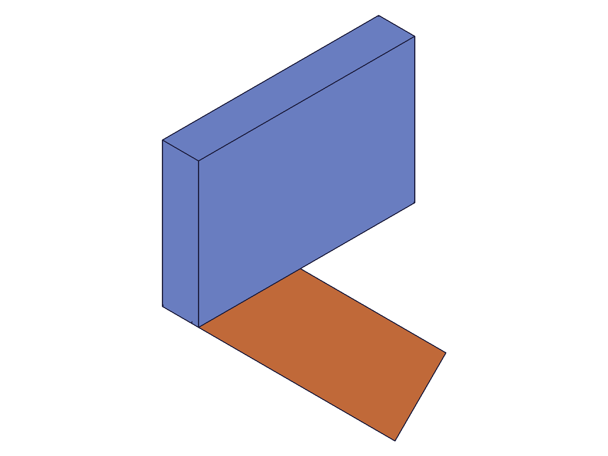
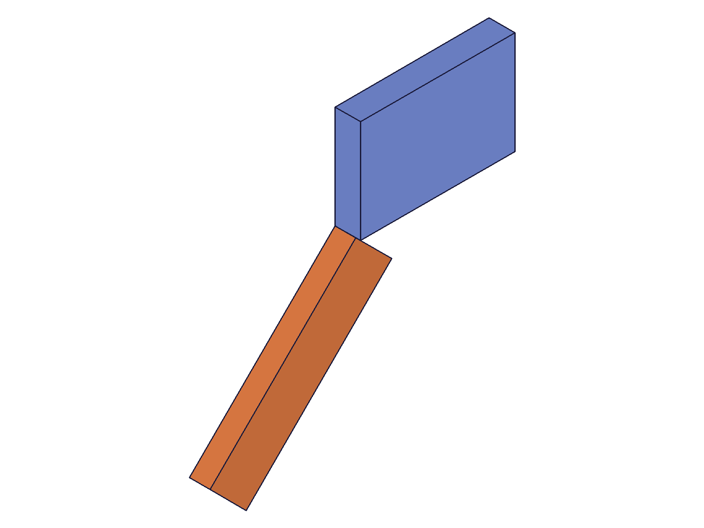
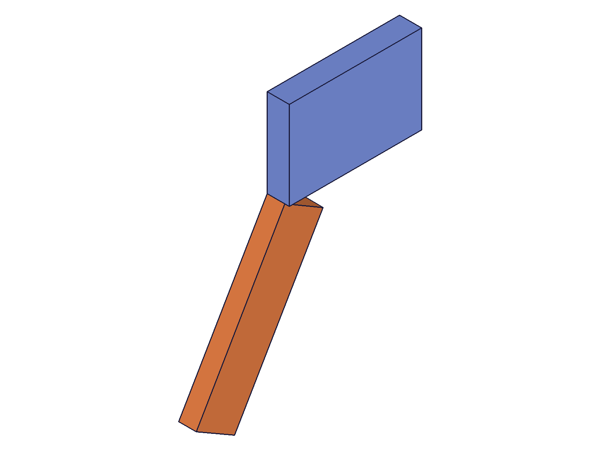

# Training: constraint-driven motion workflow

**Date:** 2026-05-09

## Goal

Studying the complete constraint-driven motion workflow: `startMovingUnderConstraints → moveUnderConstraints → finishMovingUnderConstraints`. This is a conceptual synthesis task — the three individual APIs have been trained in sessions 03, 04, and 05.

**Questions to answer:**

- How does the workflow interact with different constraint types? (revolute, cylindrical, slider, planar, spherical, fastened, free)
- What is the state machine: what transitions are safe, and which hang the worker?
- How does the motion compose across multiple sessions (start/finish cycles)?
- What's the practical pattern for animating through a range of angles?
- Does the workflow interact with transformInstance/transformInstanceTo?

---

## 01 — MUC workflow vs transformInstance

Script: `scripts/01-workflow-vs-transformInstance.mjs` — ✅ transformInstance has no lasting effect on constrained instances; MUC accumulates across sessions.

|  |  |  |
|---|---|---|

**Data:**
- Original COG: (40, 10, 4)
- After MUC 45°: (35.36, -21.21, 4) — correct 45° rotation
- After transformInstance 45°: (35.36, -21.21, 4) — **NO CHANGE**
- After MUC identity (post-TI): (35.36, -21.21, 4) — still at 45°
- After MUC 90° (post-TI): (-21.21, -35.36, 4) — at 135° from original (45° + 90°)

Verification of 135°: 40*cos135° + 10*sin135° = -21.21 ✓; -40*sin135° + 10*cos135° = -35.36 ✓

**Learned:**
1. **transformInstance has NO lasting effect on constrained instances** — the constraint solver snaps the instance back immediately. The API call succeeds but the position doesn't change.
2. **MUC rotation is a delta from session start.** The 90° basis from the 45° position gives 135° total, not 90° from constraint zero. This contradicts the earlier session's script 17 finding.
**📌 LLM doc:** IMPORTANT CORRECTION — MUC rotation is delta from session start, not from constraint zero. transformInstance has no effect on constrained instances.

## 02 — animation patterns (single vs multi-session)

Script: `scripts/02-animate-pattern.mjs` — ✅ Confirms delta-from-session-start for multi-session chaining.

|  |
|---|

**Data — Pattern A (single session, increasing angles):**

| Angle | COG | Expected | Match |
|---|---|---|---|
| 0° | (40, 10) | (40, 10) | ✓ |
| 30° | (39.64, -11.34) | 40*cos30+10*sin30=39.64, -40*sin30+10*cos30=-11.34 | ✓ |
| 60° | (28.66, -29.64) | ✓ | ✓ |
| 90° | (10, -40) | ✓ | ✓ |
| 120° | (-11.34, -39.64) | ✓ | ✓ |

Pattern A works perfectly — within a single session, each move replaces the previous (absolute from session start).

**Data — Reset attempt with identity:**
After finishing at 120°, started new session and applied identity rotation. COG stayed at (-11.34, -39.64) = 120° position. **Identity does NOT reset to constraint zero** — it keeps the session-start position.

**Data — Multi-session accumulation:**

| Session | Basis | Expected total | Actual COG | Match |
|---|---|---|---|---|
| From 120° | 30° delta | 150° | (-29.64, -28.66) | ✓ |
| From 150° | 30° delta | 180° | (-40, -10) | ✓ |
| From 180° | 60° delta | 240° | (-28.66, 29.64) | ✓ |

**This definitively proves: MUC rotation is a DELTA from session start, and each new session starts from the current position. Rotations ACCUMULATE across sessions.**

This CORRECTS the prior session's script 17 finding which claimed "applying the same 45° basis in a new session from an already-rotated position produced no additional motion." That test must have had a measurement error or different constraint setup.

**📌 LLM doc:** CRITICAL CORRECTION — rotation accumulates across sessions. Each session's basis is applied as a delta from the current position. To reach a specific angle from zero, you must track the total accumulated rotation and compute the remaining delta. Identity rotation means "stay at session start," NOT "return to constraint zero."

## 03 — state machine transitions

Script: `scripts/03-state-machine.mjs` — ✅ All safe transitions verified.

**Data:**
- **start → start:** Both succeed (maxLevel=31). Second start overwrites the first's `mucType`.
- **move after double-start:** Works correctly — second start's TRANSLATION_2D mode takes effect.
- **start → move → move → finish:** Last move wins. COG at finish = start + last offset.
- **start → finish → start → move → finish (clean restart):** Works correctly. Each session starts from the position after the previous session's finish.

**Learned — state machine summary:**

| From → To | Safe? | Notes |
|---|---|---|
| idle → start | ✅ | Normal entry |
| start → move | ✅ | Normal flow |
| move → move | ✅ | Last move replaces previous |
| move → finish | ✅ | Commits last move |
| start → finish | ✅ | Commits no-change |
| finish → finish | ✅ | Idempotent |
| start → start | ✅ | Second overwrites first |
| finish → start | ✅ | New session |
| idle → move | ❌ HANG | Worker 100% CPU |
| idle → finish | ❌ HANG | Worker 100% CPU |

