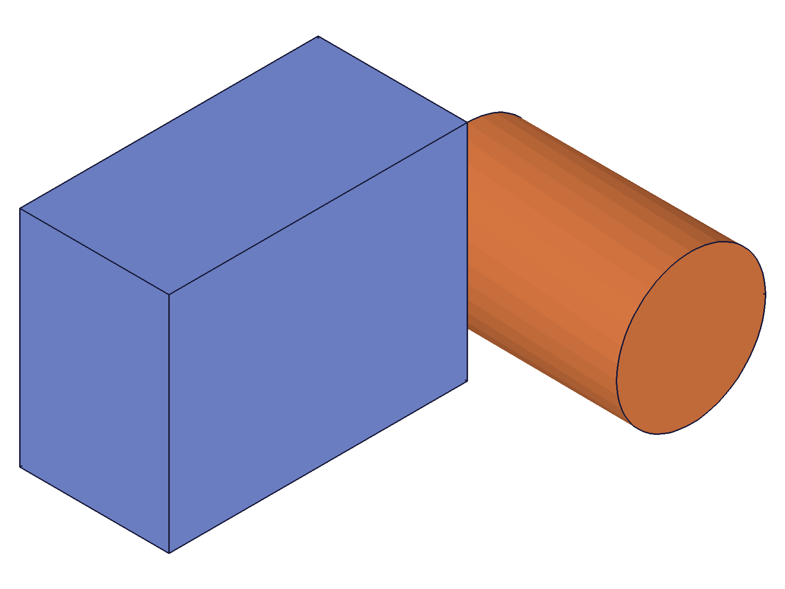
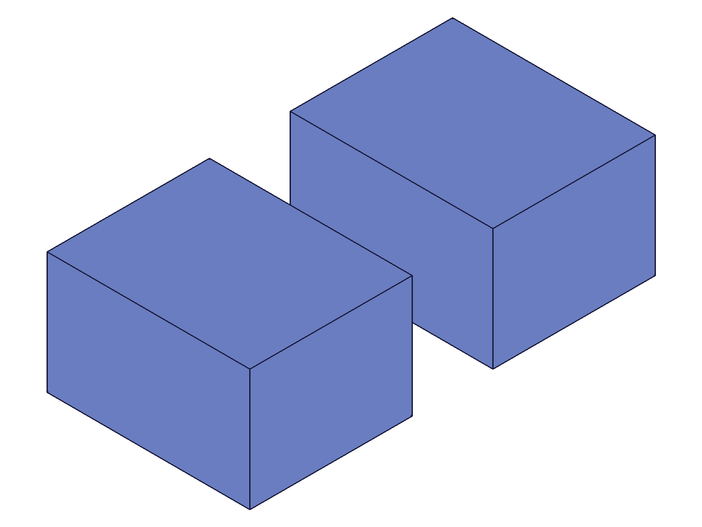

# Training: assembly.setCurrentInstance

**Date:** 2026-05-09

## Goal

Testing `v1.assembly.setCurrentInstance`.

**Methods to cover:**

- `setCurrentInstance` — set an instance or root assembly as "current"
- Interaction with `setCurrentProduct` — how they differ
- Return value — what does it return?
- Effect on `part.*` APIs — can you call part APIs after setting current instance?
- Effect on `common.save` — does current instance affect what gets saved?

**Questions:**

- What does `setCurrentInstance` return? An ID? VOID?
- What does "current instance" mean practically — which APIs are affected by it?
- Can you set the root assembly ID as the current instance?
- After `setCurrentInstance(instanceId)`, does `setCurrentProduct` also change to the template?
- How does it differ from `setCurrentProduct`?
- What happens with nested sub-assembly instances?
- Does setting the current instance affect `common.save` output?
- Can you query the current instance? Is there a getter?

---

## 01 — basic return value

Script: `scripts/01-basic-return-value.mjs` — ✅ returns VOID (null) for all valid inputs, maxLevel=31.

**Data:** Tested with instance IDs (inst1, inst2), root assembly ID, and template ID. All return `{ result: null, messages: [], maxLevel: 31 }` (see `files/01-basic-return-value-sci-*.json`).

|  |
|---|

**Learned:** Returns VOID. Accepts instance IDs, root assembly ID, and template IDs — all without error.

## 02 — product interaction

Script: `scripts/02-product-interaction.mjs` — ✅ confirms setCurrentInstance sets currentProduct to the instance's template.

**Data:** Used `setCurrentProduct(asmId)` after each `setCurrentInstance` call to read back the previous product:
- After `setCurrentInstance(inst1)` → previous product = 22 = tpl1 (BoxPart) ✓
- After `setCurrentInstance(inst2)` → previous product = 105 = tpl2 (CylPart) ✓
- After `setCurrentInstance(asmId)` → previous product = 12 = asmId ✓

See `files/02-product-interaction-product-tracking.json`.

**Learned:** Docs confirmed — "The current product will also be set to the current instance's product template." When setting to root assembly, product = root assembly itself.
**📌 LLM doc:** Document the product-switching side effect.

## 03 — part API access after setCurrentInstance

Script: `scripts/03-part-api-access.mjs` — ✅ template modification works through setCurrentInstance context.

|  |  |
| --- | --- |

**Data:** After `setCurrentInstance(inst1)`, called `openFeature → updateBox(height: 50) → closeFeature → recalc`. Both instances reflect the change:
- inst1 COG: `{x:20, y:15, z:25}`, volume: 60000 (40×30×50 = 60000 ✓)
- inst2 COG: `{x:80, y:15, z:25}`, volume: 60000 ✓

Before update (height=20): COG z would be 10. After (height=50): COG z=25 ✓. Snapshots show taller boxes after update, consistent with numeric data.

**Learned:** After `setCurrentInstance`, you can use `part.*` APIs (openFeature, updateBox, closeFeature) to modify the instance's template. Changes propagate to all instances of that template.
**📌 LLM doc:** Document the template-edit workflow via setCurrentInstance.

## 04 — nested sub-assembly

Script: `scripts/04-nested-subassembly.mjs` — ✅ works with expanded tree instance IDs.

|  |
|---|

**Data:**
- Sub-assembly template (id=105) contains innerInst (id=115, CC_ProductReference)
- Root has subInst (id=117, instance of sub-assembly template)
- `getInstance(subInst)` returns [118] — the CC_ProductReferenceET (expanded tree) ID
- `setCurrentInstance(subInst)` → sets product to 105 (sub-assembly template) ✓
- `setCurrentInstance(118)` (expanded tree inner instance) → sets product to 22 (tpl1, BoxPart) ✓

**Learned:** `setCurrentInstance` works at any nesting depth. Both CC_ProductReference (template-scope) and CC_ProductReferenceET (expanded-tree) instance IDs are accepted.
**📌 LLM doc:** Document sub-assembly and expanded-tree ID support.

## 05 — edge cases

Script: `scripts/05-edge-cases.mjs` — ✅ error handling as expected.

**Data:**
- Invalid ID (99999): maxLevel=51, error "didn't get an existing or valid id"
- Feature ID (box feature): maxLevel=51, error "wrong id type! Provide only following id types: [\"instance\",\"part/assembly\"]"
- Double call same instance: maxLevel=31, no error (idempotent)
- String ident ("myBoxIdent"): maxLevel=51, error "couldn't be converted to an id" — does NOT support ident lookup

See `files/05-edge-cases-*.json`.

**Learned:** Accepts only instance or part/assembly IDs (numeric). Does not support string identifiers. Double-calling is safe. Error messages are clear and descriptive.
**📌 LLM doc:** Document accepted ID types and string ident limitation.

## 06 — save interaction

Script: `scripts/06-save-interaction.mjs` — ✅ setCurrentInstance affects save content slightly.

**Data:** Three saves with different current instances:
- current=asmId: 81152 bytes
- current=inst1 (product=tpl1): 81192 bytes
- current=inst2 (product=tpl2): 81604 bytes

All three are different content (none match). See `files/06-save-interaction-save-comparison.json`.

**Learned:** `setCurrentInstance` changes `common.save` output because it changes `currentProduct`. File sizes differ slightly — likely metadata about which product is "current."

## 07 — save/loadback

Script: `scripts/07-save-loadback.mjs` — ✅ full assembly preserved regardless of current instance.

**Data:** Both saves (from asm context and from inst1 context) load back with:
- Root assembly ID returned
- Both instances present (2 instances in each load)

See `files/07-save-loadback-loadback-comparison.json`.

**Learned:** `setCurrentInstance` affects the save metadata (which product is marked "active"), but the full assembly structure is always preserved. No data loss.
**📌 LLM doc:** Document that save preserves full assembly regardless of current instance.

## 08 — vs setCurrentProduct

Script: `scripts/08-vs-setCurrentProduct.mjs` — ✅ key differences identified.

**Data:**
- `setCurrentProduct(inst1)` returns 12 (previous product ID). `setCurrentInstance(inst1)` returns null (VOID).
- `setCurrentProduct(tpl1)` also works — it accepts template IDs directly.
- Assembly operations (`getInstance`, `fastenedOrigin`) work in both contexts.

|  |
|---|

**Learned:** Main differences:
1. **Return value**: `setCurrentProduct` returns the PREVIOUS product ID. `setCurrentInstance` returns VOID.
2. **Side effect**: `setCurrentInstance` sets both the current instance AND current product. `setCurrentProduct` only sets the current product.
3. **Practical effect**: `setCurrentInstance` is a convenience wrapper — it navigates to an instance's template context in one call. `setCurrentProduct` gives you direct product control with rollback info (previous ID).
**📌 LLM doc:** Document the differences between the two APIs.

---

## Answers to Goal Questions

1. **Return value?** VOID (null). maxLevel=31 on success.
2. **Practical meaning?** Sets the "active" instance context. Also switches `currentProduct` to the instance's template, enabling `part.*` API access.
3. **Root assembly?** Yes — `setCurrentInstance(asmId)` sets both instance and product to the root assembly.
4. **Product change?** Yes — confirmed in script 02. The product is automatically set to the instance's linked template.
5. **Difference from setCurrentProduct?** setCurrentInstance returns VOID and sets both instance+product. setCurrentProduct returns the previous product ID and only sets product.
6. **Nested sub-assemblies?** Works with expanded-tree IDs (CC_ProductReferenceET). Correctly resolves to the leaf template.
7. **Save effect?** Yes, slightly — metadata changes (file size differs). But full assembly is always preserved on load-back.
8. **Getter?** No `getCurrentInstance` API exists. No way to query the current instance.

## Coverage Checklist

- [x] API called successfully (script 01)
- [x] Required parameter `id` tested with instance, root assembly, template, expanded-tree instance (scripts 01, 04)
- [x] No optional parameters
- [x] No enum variants
- [x] No update/delete methods
- [x] Realistic usage: template modification workflow (script 03)
- [x] Behavioral claims verified with COG data AND snapshots (script 03: z=25 matches height=50/2)
- [x] Every goal question answered with named script
- [x] Edge cases: invalid ID, feature ID, double-call, string ident (script 05)
