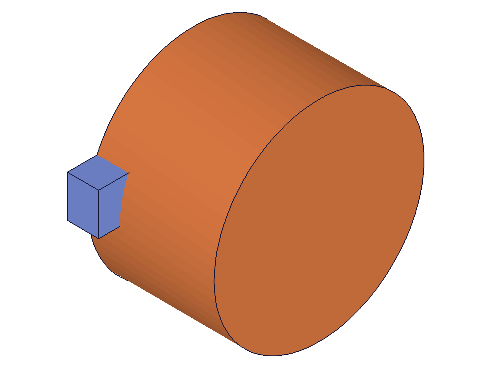

# Training: assembly.setCurrentProduct

**Date:** 2026-05-09

## Goal

Testing `v1.assembly.setCurrentProduct` — the API that switches the "current product" context in the assembly.

**Methods to cover:**

- `setCurrentProduct` — basic call with assembly ID, part template ID, assembly template ID
- Return value: previous product ID (vs `setCurrentInstance` which returns VOID)
- Context switching: does switching product enable `part.*` calls on that template?

**Questions:**

- What ID types are accepted? (root assembly, part template, assembly template, instance, feature, invalid)
- What does "previous product ID" mean when called the first time?
- Is it idempotent? (calling twice with same ID)
- Does it affect `setCurrentInstance` state?
- Does switching to an instance ID work? (generic.md says yes, but unverified)
- Can you chain switches and track previous IDs?
- Does it work without an assembly context?

---

## 01 — basic return value

Script: `scripts/01-basic-return-value.mjs` — ✅ `setCurrentProduct` returns the **previous product ID**.

|  |
|---|

**Data:** After `partTemplate` creates tplId=22, `setCurrentProduct({id: asmId})` returns 22 (was on tplId). Then `setCurrentProduct({id: tplId})` returns 12 (was on asmId). Then back to asmId returns 22 again. maxLevel=31 (info), empty messages in all cases.

**Learned:** The return value is always the ID of the product that was current *before* the switch. This is a reliable rollback mechanism — save the returned ID to restore later.

---

## 02 — accepted ID types

Script: `scripts/02-id-types.mjs` — systematically tested every ID type.

**Data:**

| ID type | Works? | maxLevel | Return value |
|---|---|---|---|
| Root assembly | ✓ | 31 | previous product ID |
| Part template | ✓ | 31 | previous product ID |
| Assembly template | ✓ | 31 | previous product ID |
| Instance (CC_ProductReference) | ✓ | 31 | previous product ID |
| Feature ID | ✗ | 51 | null |
| Invalid numeric (999999) | ✗ | 51 | null |
| String identifier | ✗ | 51 | null |

**Error messages:**
- Feature: code 1001 — `"The parameter \"id\" has a wrong id type! Provide only following id types: [\"part/assembly\",\"instance\"]"`
- Invalid: code 1006 — `"An element of parameter \"id\" has an invalid id!"`
- String: `"The string \"myInst\" couldn't be converted to an id. Error message: stol: no conversion"`

**Learned:** Accepted types are `["part/assembly","instance"]`. Instance IDs work (resolves to template — see script 06). Strings never work.
**📌 LLM doc:** Accepted ID types table and error messages.

---

## 03 — idempotency and chaining

Script: `scripts/03-idempotent-and-chain.mjs` — ✅ idempotent and chain both work correctly.

**Data (idempotent):** First switch asm→tpl1 returns 12 (asmId). Second switch tpl1→tpl1 returns 22 (tpl1 — it was already current, so "previous" = itself). Third identical call also returns 22. Safe and consistent.

**Data (chain):** asm→tpl1 returns 12, tpl1→tpl2 returns 22, tpl2→tpl3 returns 105, tpl3→asm returns 188. Each call correctly returns the previous product. Chain verified against `files/03-idempotent-and-chain-chain.json` — all match expected values.

**Learned:** Idempotent — calling with the same product returns that product's own ID as "previous" (since it was already current). Chain switching is reliable for multi-product navigation.

---

## 04 — context effect on part.* calls

Script: `scripts/04-context-effect.mjs` — ✅ switching product enables part.* editing on the target template.

|  |  |
|---|---|

**Data:** After `setCurrentProduct({id: tpl2})`, called `openFeature/updateCylinder(radius: 25)/closeFeature` successfully. Volume after update: 471229.5 (vs original π*10²*60 ≈ 18849.6 — confirms radius change took effect). Box volume: 9000 (30*20*15, unchanged). Snapshots look identical due to auto-scaling but data confirms the change.

**Learned:** `setCurrentProduct` enables `part.*` operations (openFeature, updateCylinder, closeFeature) on the target template.
**📌 LLM doc:** Context switching workflow — switch product, edit template features, switch back.

---

## 05 — no-assembly context

Script: `scripts/05-no-assembly.mjs` — partial: Test 1 worked, Tests 2-3 corrupted.

**Data (Test 1):** `part.create` → `setCurrentProduct({id: partId})` returns partId=4, maxLevel=31. Works on a standalone part with no assembly structure.

**Data (Tests 2-3):** After `setCurrentProduct` on partId, calling `assembly.create` returned null. This corrupted the rest. The `assembly.create` call clears the drawing (which included the standalone part), but apparently the prior `setCurrentProduct` state caused the creation to return null. Not a `setCurrentProduct` bug per se — it's `assembly.create` that fails after a plain-part context.

**Learned:** `setCurrentProduct` works on standalone parts (no assembly needed). But don't mix `part.create` standalone parts with `assembly.create` in the same drawing.

---

## 06 — interaction with setCurrentInstance

Script: `scripts/06-interaction-with-instance.mjs` — ✅ shared state confirmed.

**Data (Test 1):** After `setCurrentInstance(instId)`, `setCurrentProduct(asmId)` returns tplId=22. Confirms `setCurrentInstance` sets `currentProduct` to the instance's template, and `setCurrentProduct` sees that shared state.

**Data (Test 2):** `setCurrentProduct({id: instId})` succeeds (maxLevel=31). Switching away reveals the current product was set to tplId=22 (the template), **not** instId=105. So passing an instance ID resolves to the instance's linked template.

**Data (Test 3):** After `setCurrentProduct(instId)`, `openFeature` on the template's box feature (id=70) succeeds. Confirms template editing is enabled.

**Learned:** `setCurrentProduct` with an instance ID resolves to the instance's template automatically. It does NOT set the current instance (only `setCurrentInstance` does that). The two APIs share `currentProduct` state.
**📌 LLM doc:** Instance resolution behavior, shared state with setCurrentInstance.
