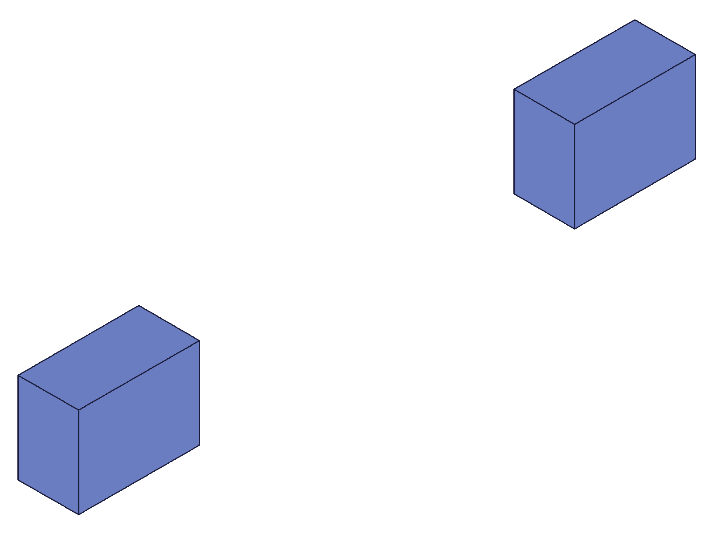

# Training: assembly.setIdent

**Date:** 2026-05-09

## Goal

Testing `v1.assembly.setIdent` — sets a custom string identifier on an existing object.

**Methods to cover:**

- `setIdent` — assign a string ident to an object by numeric ID
- Batch form — `param` accepts `Array<object>`, test batch assignment

**Questions:**

- Which object types accept an ident? (instances, templates, assemblies, constraints?)
- Can the ident string be used in place of numeric IDs in subsequent API calls?
- What happens with duplicate idents? (docs say "Must be unique")
- Can you overwrite an existing ident with a new one?
- Can you clear/remove an ident?
- How does ident differ from `common.setObjectName`?
- Does the ident survive save/load cycles? (may not be testable)

---

## 01 — basic setIdent

Script: `scripts/01-basic-setIdent.mjs` — ✅ setIdent works, returns VOID (null) with maxLevel 31.

**Data:** setIdent on instances succeeds with empty messages. Attempted to use ident strings as `id` param in `getInstance` and `transformInstance` — both failed, but for different reasons: `getInstance` needs `ownerId` (was missing), `transformInstance` got a matrix format error (see `files/01-basic-setIdent-setIdent-inst1.json`, `files/01-basic-setIdent-getInstance-by-ident.json`).

**Learned:** setIdent itself is straightforward. Ident resolution in other APIs needs more careful testing.

## 02 — ident as ID in other APIs

Script: `scripts/02-ident-as-id.mjs` — Mixed results. Some APIs accept ident strings, others don't.

**Data:**
- `getInstance({ id: 'box_a', ownerId: asmId })` → returned `[113]` (all instances, `id` param ignored — see `files/02-ident-as-id-getInstance-ident.json`)
- `transformInstance({ id: 'box_a' })` → error "not a 4x4 matrix" — format bug, not ident issue
- `calculateMassProperties({ id: 'box_a' })` → error "string couldn't be converted to an id" (see `files/02-ident-as-id-massProps-ident.json`)
- `instance({ ownerId: 'root_asm' })` → ✅ works, returned 117

**Learned:** `calculateMassProperties` does NOT support ident strings at all — it tries stol conversion and fails. `instance()` productId/ownerId params DO support idents.
**📌 LLM doc:** calculateMassProperties does not accept ident strings.

## 03 — ident on different object types

Script: `scripts/03-ident-scope.mjs` — ✅ setIdent works on assemblies, templates, work geometry, instances.

**Data:**
- setIdent on assembly (maxLevel 31), template (31), WCS (31), instance (31) — all succeed
- `transformInstance({ id: 'alpha' })` with 4x4 matrix: maxLevel 31 ✅
- `fastenedOrigin` with ident in `path` array: error "string couldn't be converted to an id" (see `files/03-ident-scope-fastenedOrigin-ident.json`)
- `calculateMassProperties` with numeric ID: works (maxLevel 31)

**Learned:** setIdent accepts any object type. `fastenedOrigin`'s `path` array does NOT resolve idents — it only does stol.
**📌 LLM doc:** path arrays in constraint APIs do NOT support ident strings.

## 04 — duplicate and overwrite

Script: `scripts/04-duplicate-overwrite.mjs` — Duplicate rejected, overwrite works, clear works.

**Data:**
- Duplicate ident: error "alpha already exists" (see `files/04-duplicate-overwrite-duplicate-ident.json`)
- Overwrite ident: maxLevel 31 ✅
- Clear ident (empty string): maxLevel 31 ✅
- `getInstance` returns all instances regardless of `id` param — it does NOT filter by ident (returns `[105, 107]` for any string)

**Learned:** Idents must be unique. Can overwrite. Can clear with `""`. `getInstance` ignores the `id` param entirely.
**📌 LLM doc:** Duplicate ident error message. Overwrite and clear behavior.

## 05 — which APIs accept ident strings

Script: `scripts/05-ident-resolution.mjs` — Comprehensive test across APIs.

**Data:**
- `transformInstance(id: 'alpha')`: ✅ works (maxLevel 31)
- `transformInstanceTo(id: 'alpha')`: ❌ failed — but was matrix format error, not ident
- `instance(productId: 'box_tpl', ownerId: 'root')`: ✅ works, returned 119
- `deleteInstance(ids: ['beta'])`: ✅ works (maxLevel 31)
- `setCurrentProduct(id: 'root')`: ❌ "string couldn't be converted to id" (see `files/05-ident-resolution-setCurrentProduct-ident.json`)
- `setCurrentInstance(id: 'alpha')`: ❌ "string couldn't be converted to id" (see `files/05-ident-resolution-setCurrentInstance-ident.json`)
- `deleteConstraint(ids: ['fo_alpha'])`: ❌ "string couldn't be converted to id" (see `files/05-ident-resolution-deleteConstraint-ident.json`)

**Learned:** Only a subset of assembly APIs resolve ident strings. Many just try stol conversion.
**📌 LLM doc:** Document which APIs accept idents and which don't.

## 06 — transformInstanceTo with correct format

Script: `scripts/06-transformInstanceTo-ident.mjs` — ✅ transformInstanceTo accepts ident when using correct `[[origin], [xDir], [yDir]]` format.

**Data:** COG after transformInstanceTo to origin (50, 20, 0): cog = {x: 70, y: 35, z: 10}. Expected: (50+20, 20+15, 0+10) = (70, 35, 10) ✓ (see `files/06-transformInstanceTo-ident-massProps-after-transform.json`)

**Learned:** The script 05 failure was a matrix format bug, not an ident issue. `transformInstanceTo` DOES support ident strings.
**📌 LLM doc:** Both transformInstance and transformInstanceTo accept ident strings.

## 07 — batch form and creation-time ident

Script: `scripts/07-batch-and-creation-ident.mjs` — Creation-time ident works; batch setIdent fails.

**Data:**
- `instance({ ..., ident: 'part_a' })`: ✅ ident set at creation time, inst1 = 107
- `transformInstance({ id: 'part_a' })`: maxLevel 31 ✅ — confirms creation-time ident works
- Batch `setIdent([{...}, {...}])`: ❌ error "objId not found" (see `files/07-batch-and-creation-ident-batch-setIdent.json`)
- COGs: inst1 at (50, 15, 10) = (0+30+20, 15, 10) ✓; inst2 at (100, 15, 10) = (80+20, 15, 10) — unchanged since batch failed

**Learned:** Batch/array form of setIdent does NOT work. Use individual calls. Creation-time `ident` param on `instance()` works.
**📌 LLM doc:** Batch form broken despite docs showing `Array<object>` param type. Use individual calls.

## 08 — name vs ident

Script: `scripts/08-name-vs-ident.mjs` — Both name and ident resolve as string IDs in transformInstance.

**Data:**
- `getInstance({ ownerId, name: 'MyRenamedInstance' })`: returns 105 ✅ (name-based lookup works in getInstance)
- `getInstance({ ownerId, name: 'MyInstance' })`: returns `[]` (old name cleared by setObjectName)
- `transformInstance({ id: 'inst_ident' })`: maxLevel 31 ✅
- `transformInstance({ id: 'MyRenamedInstance' })`: maxLevel 31 ✅ — names also resolve!
- `setIdent` on constraint (fastenedOrigin): maxLevel 31 ✅

**Learned:** `transformInstance` resolves BOTH ident strings and name strings. Name and ident are independent properties on objects. setIdent works on constraints.
**📌 LLM doc:** Some APIs resolve both ident and name strings. They are independent properties.

## 09 — string resolution order and conflict

Script: `scripts/09-string-resolution.mjs` — When ident and name conflict, ident takes priority.

|  |
|---|

**Data:**
- inst1 (name "Alpha", ident "ident_alpha") and inst2 (name "Beta") created
- transformInstance by name "Beta": maxLevel 31 ✅ (name resolves when no ident)
- transformInstance by ident "ident_alpha": maxLevel 31 ✅
- transformInstance by name "Alpha" (inst1 has ident too): maxLevel 31 ✅ — name still works
- Set inst2's ident to "Alpha" (conflicts with inst1's name)
- transformInstance("Alpha") → **inst2 moved** (COG from 110 to 210), inst1 unchanged (COG 45)
- Numeric string `String(inst1)`: maxLevel 31 ✅
- Final COGs: inst1=(46,15,10), inst2=(210,15,10) — confirms ident took priority

**Learned:** String resolution order: (1) try numeric conversion, (2) check ident map, (3) check name. Ident takes priority over name in conflicts.
**📌 LLM doc:** Document resolution order: numeric > ident > name.

## 10 — structure tree

Script: `scripts/10-structure-tree.mjs` — Idents stored in `IdentToIdMap` node in structure tree.

**Data:**
- Structure tree contains ident values (found "my_ident_1" at line 1305)
- Stored in class `IdentToIdMap` (id 105, parent 12 = assembly root)
- Map entries: `{ "value": "my_ident_1", "type": "string" } → { "value": 107, "type": "id" }`
- Centralized map at assembly root level — not per-object

**Learned:** Idents are a centralized lookup map in the assembly, not an attribute on individual objects. No getIdent API exists to query them — must inspect the structure tree.
**📌 LLM doc:** Idents stored in IdentToIdMap. No getIdent query API.

---

## Coverage Checklist

- [x] setIdent called successfully (scripts 01-10)
- [x] Every required parameter tested (id, ident)
- [x] Object types: instances, assemblies, templates, work geometry, constraints
- [x] Duplicate ident rejected (script 04)
- [x] Overwrite and clear tested (script 04)
- [x] Batch form tested (script 07 — broken)
- [x] Creation-time ident param tested (script 07)
- [x] Ident resolution in other APIs mapped (scripts 02, 03, 05, 06, 08)
- [x] Name vs ident distinction documented (scripts 08, 09)
- [x] Resolution priority: numeric > ident > name (script 09)
- [x] Structure tree storage documented (script 10)
- [x] All questions from goal answered
