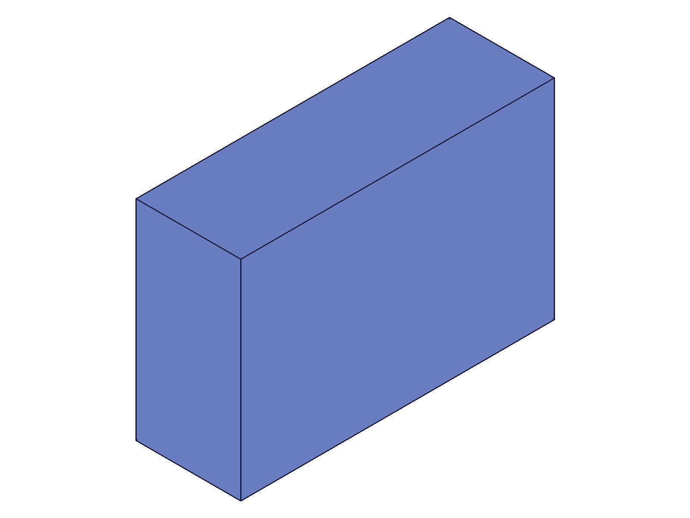
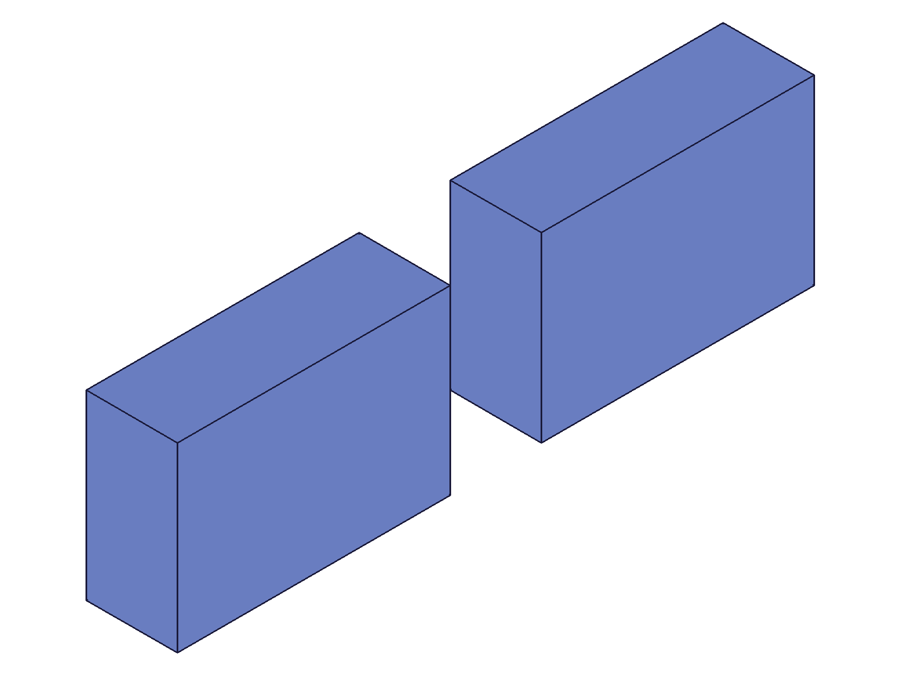

# Training: assembly.loadProduct

**Date:** 2026-05-09

## Goal

Testing `v1.assembly.loadProduct` — imports a product from data/file/URL into an existing assembly as a template.

**Methods to cover:**

- `loadProduct` — basic OFB data load
- `loadProduct` — STP format load
- `loadProduct` params: data, format, encoding, compression, ident
- `loadProduct` — relationship with `exportNode` (round-trip)
- `loadProduct` — multiple products loaded into the same assembly
- `loadProduct` — instantiating loaded products

**Questions:**

- What is the return value? Does it return a template ID, instance ID, or something else?
- Does the loaded product appear as a template in CC_PartContainer (like `partTemplate`)?
- Can the loaded template be instantiated with `assembly.instance`?
- Does `ident` parameter do anything observable?
- Does it work with STP format? What about encoding/compression?
- Does it require an assembly context? What happens if called without `assembly.create`?
- How does `loadProduct` differ from `common.load`?
- Does the loaded product's geometry have correct spatial properties (verified via COG)?

---

## 01 — basic OFB loadProduct

Script: `scripts/01-basic-ofb-load.mjs` — ✅ loads a part OFB into an assembly as a template.

|  |
|---|

**Data:** `loadProduct` returns `{ id: 22 }`, maxLevel=31, no messages. Structure dump shows:
- Node 22 is a `CC_Part` named "BoxPart" in `CC_PartContainer` (parent=8)
- `currentProduct` remains at 12 (assembly root) — loadProduct does NOT switch context
- No automatic instance created — assembly root has no `CC_ProductReference` children

**Learned:** `loadProduct` adds the product as a template in the appropriate container (PartContainer for parts), analogous to `partTemplate`. Does NOT auto-instantiate. Does NOT switch `currentProduct`. Original part name is preserved.

📌 LLM doc: Return value, template placement, no auto-instantiation.

## 02 — load and instantiate with COG verification

Script: `scripts/02-load-and-instance.mjs` — ✅ loaded product can be instantiated and positioned.

|  |
|---|

**Data:** COG measurement initially returned undefined because `result.centerOfGravity` was wrong field — `cog` is the correct field (fixed in script 03).

**Learned:** Instantiation works via `assembly.instance({ productId: tplId, ... })`. Snapshot shows two boxes at different positions.

## 03 — COG spatial verification

Script: `scripts/03-cog-verify.mjs` — ✅ spatial claims verified numerically.

**Data:** 60×40×20 box, COG expected at (30,20,10):
- inst1 at origin: COG = `{x:30, y:20, z:10}` ✓
- inst2 at [80,0,0]: COG = `{x:110, y:20, z:10}` ✓

Both `part.calculateMassProperties` and `assembly.calculateMassProperties` work on instance IDs, returning `{ cog: {x,y,z}, volume }`.

📌 LLM doc: Loaded templates behave identically to `partTemplate` for spatial purposes.

## 04 — STP format load

Script: `scripts/04-load-stp.mjs` — ✅ STP format works with loadProduct.

**Data:** Cylinder (d=30, h=50) saved as STP (10244 b64 chars), loaded into assembly. Result: `{ id: 25 }`, maxLevel=31. Instance COG = `{x:≈0, y:≈0, z:≈25}` — correct for base-centered cylinder.

**Learned:** STP is supported. No messages on success.

## 05 — ident parameter and multiple products

Script: `scripts/05-ident-and-multi.mjs` — ✅ `ident` IS observable; multiple loadProduct calls work.

**Data:**
- Box template loaded with `ident: 'box-template'` → id=24
- Cylinder template loaded with `ident: 'cyl-template'` → id=79
- Both in CC_PartContainer: `children: [24, 79]`
- `getPartTemplate({ name: 'BoxPart' })` returns 24 (original name preserved)
- IdentToIdMap in assembly root stores: `[["box-template", 24], ["cyl-template", 79]]`
- BoxInst COG: `{x:30, y:20, z:10}` ✓
- CylInst at [80,15,0] COG: `{x:≈80, y:≈15, z:≈25}` ✓

**Learned:** The `ident` parameter stores a string↔ID mapping in the assembly's `IdentToIdMap`. Multiple products can be loaded into the same assembly.

📌 LLM doc: ident stores in IdentToIdMap, multiple loads work, original name preserved.

## 06 — error cases

Script: `scripts/06-error-cases.mjs` — ✅ all error paths tested.

**Data:**
| Scenario | maxLevel | Error message |
|---|---|---|
| No assembly context | 51 | "Assembly building is not initialized!" |
| Empty data | 51 | "Nothing could be found to import!" |
| No source params | 51 | "Either data, file or url must be provided..." |
| STL format | 51 | "format is not valid. Possible values are: [\"OFB\",\"STP\"]" |
| OFB data as STP | 51 | "Only loading drawings with one single root product is supported." |

**Learned:** Only OFB and STP formats are supported (not IWP, unlike `common.load`). Requires assembly context. Format mismatch gives an unhelpful generic error.

📌 LLM doc: Only OFB/STP, requires assembly.create first, error messages.

## 07 — exportNode → loadProduct roundtrip

Script: `scripts/07-export-load-roundtrip.mjs` — ✅ roundtrip preserves geometry.

**Data:** Box template (50×30×25) exported via `exportNode`, loaded into new assembly via `loadProduct`. COG = `{x:25, y:15, z:12.5}`, volume=37500. Both match exactly.

`assembly.getWorkGeometry` on the loaded template returned null (maxLevel=51). Investigated in script 08.

📌 LLM doc: exportNode→loadProduct roundtrip preserves geometry. Work geo access caveat.

## 08 — work geometry access after loadProduct

Script: `scripts/08-work-geo-access.mjs` — ✅ work geo preserved but access pattern matters.

**Data:**
| Access method | Target | Result | maxLevel |
|---|---|---|---|
| `assembly.getWorkGeometry` | template | null | 51 |
| `part.getWorkGeometry` | template | 76 | 31 |
| `part.getWorkGeometry "Top"` | template | 39 | 31 |
| `assembly.getWorkGeometry "BaseWCSys"` | assembly root | 20 | 31 |
| `assembly.getWorkGeometry` | instance | 76 | 31 |

**Learned:** Work geometry IS preserved in loaded templates. Must use `part.getWorkGeometry` to access it on the template. `assembly.getWorkGeometry` works on assembly root and instances, but NOT on part templates. IDs shift when loaded into assembly context (original wcsId=91, after load=76).

📌 LLM doc: Use part.getWorkGeometry on loaded templates. assembly.getWorkGeometry works on instances.

## 09 — name-based instantiation

Script: `scripts/09-name-instance.mjs` — ✅ name string works as productId.

**Data:** `getPartTemplate({ name: 'NamedPart' })` → 22 (finds loaded template). `instance({ productId: 'NamedPart', ... })` → 79. COG by name: `{x:20, y:15, z:10}` ✓. COG by ID at [60,0,0]: `{x:80, y:15, z:10}` ✓.

**Learned:** Loaded templates are queryable by name via `getPartTemplate` and instantiable by name string.

## 10 — loading assembly OFB

Script: `scripts/10-load-assembly.mjs` — ✅ assembly OFB creates assembly template.

|  |
|---|

**Data:** Assembly OFB loaded → result `{ id: 26 }`, maxLevel=31. `getAssemblyTemplate({ name: 'SubAsm' })` → 26. `getPartTemplate({ name: 'SubAsm' })` → null (maxLevel=51). Instance id=86, maxLevel=31.

**Learned:** When loading an assembly OFB, the product becomes an assembly template in `CC_AssemblyContainer` (not PartContainer). Queryable via `getAssemblyTemplate`, not `getPartTemplate`. Instantiable as a sub-assembly.

📌 LLM doc: Part OFBs → PartContainer, assembly OFBs → AssemblyContainer.

---

## Coverage Checklist

- [x] loadProduct called successfully (OFB, STP)
- [x] All documented params tested: data, format, encoding, compression, ident
- [x] Return value verified: `{ id }` pointing to template
- [x] Error cases tested (no assembly, empty data, no source, bad format, mismatch)
- [x] Multiple loadProduct calls into same assembly
- [x] Instantiation of loaded templates (by ID and by name)
- [x] exportNode → loadProduct roundtrip
- [x] Part OFB vs assembly OFB behavior
- [x] Spatial claims verified with COG: inst1@origin COG=(30,20,10), inst2@[80,0,0] COG=(110,20,10)
- [x] Work geometry access pattern documented
- [x] All Goal questions answered
