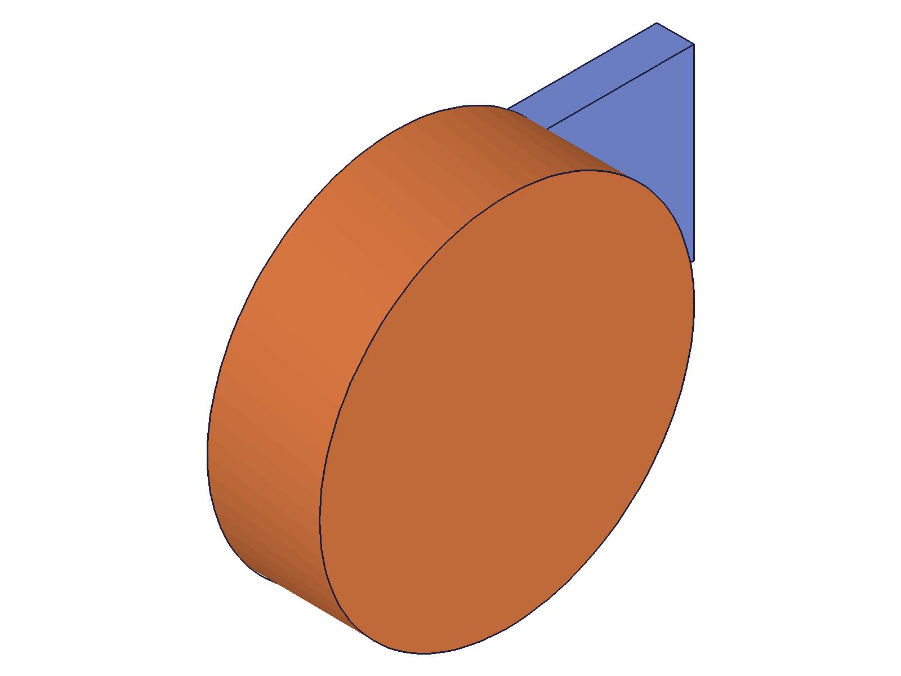

# Training: assembly.exportNode

**Date:** 2026-05-09

## Goal

Testing `v1.assembly.exportNode` — exports a node (instance or template) from the assembly tree as OFB or STP data.

**Methods to cover:**

- `exportNode` — basic export of a part template
- `exportNode` — export as STP format
- `exportNode` — export an instance vs a template
- `exportNode` — encoding param (`base64`)
- `exportNode` — compression param (`deflate`)
- `exportNode` — encoding + compression combined
- `exportNode` — export an assembly template (sub-assembly)
- `exportNode` — roundtrip with `loadProduct` (verify data integrity)
- `exportNode` — export to file param
- `exportNode` — error cases (invalid ID, no ID)

**Questions:**

- Does `exportNode` return `content` as raw or base64 string?
- What does the `success` field look like on success vs failure?
- Can you export an instance (not just a template)?
- Is the exported data compatible with `loadProduct` roundtrip?
- What happens when you export an assembly template (sub-assembly tree)?
- Does the `file` param work, and what format does it use?
- What's the default behavior with no encoding/compression?

---

## 01 — basic OFB export (template and instance)

Script: `scripts/01-basic-ofb.mjs` — ✅ Both template and instance export work.

|  |
|---|

**Data:** Template export: success=1, maxLevel=31, content is a raw plaintext string (36005 chars). Content starts with `classcad\nVersion=11\nApplicationClass=...` — this is the native OFB text format. Instance export: identical content (36005 chars). Exporting an instance yields the same data as exporting its template.

**Learned:** Default format is OFB. Default encoding is plaintext (raw OFB). Instance and template exports produce identical content — exportNode extracts the underlying product definition regardless of whether you pass the template ID or instance ID.
**📌 LLM doc:** Default OFB is raw plaintext; instance ≡ template content.

## 02 — STP format

Script: `scripts/02-stp-format.mjs` — ✅ STP export works for both template and instance.

**Data:** Template STP export: success=1, content=9599 chars. Content starts with `ISO-10303-21;` (valid STEP file). Instance STP: also 9599 chars (identical, same as OFB behavior).

**Learned:** STP export produces a valid STEP AP203 file. STP is significantly smaller than OFB (9599 vs 36005 chars for the same box). Instance vs template: same content.
**📌 LLM doc:** STP produces valid STEP files; much smaller than OFB for same geometry.

## 03 — encoding and compression

Script: `scripts/03-base64-deflate.mjs` — ✅ All encoding/compression combos work.

**Data:** Size comparison for same box part:
- Raw OFB: 36005 chars
- base64 only: 47880 chars (+33% from base64 overhead)
- deflate only: 559 chars (98.4% compression)
- base64+deflate: 5904 chars (deflate then base64)

**Learned:** `compression: 'deflate'` gives massive compression (36005 → 559). When both encoding and compression are set, the pipeline is: raw → deflate → base64. The `deflate` output alone is binary (not JSON-safe) — always combine with `encoding: 'base64'` when passing through JSON.
**📌 LLM doc:** Always use `encoding: 'base64', compression: 'deflate'` for data transport. Raw deflate is binary.

## 04 — OFB roundtrip (exportNode → loadProduct)

Script: `scripts/04-roundtrip.mjs` — ✅ Roundtrip preserves geometry.

|  |  |
|---|---|

**Data:** Export with base64+deflate: 8152 chars. loadProduct returned id=23, maxLevel=31. Instance created successfully (id=89). Before/after snapshots are visually identical, confirming geometry preservation.

**Learned:** `exportNode` data is fully compatible with `loadProduct` for OFB roundtrip. Use matching encoding/compression params on both sides.
**📌 LLM doc:** Roundtrip pattern: exportNode(base64+deflate) → loadProduct(base64+deflate).

## 05 — assembly template export

Script: `scripts/05-assembly-template.mjs` — ✅ Assembly templates export with children.

|  |
|---|

**Data:** Size comparison (all base64+deflate):
- Part template (Plate only): 5956 chars
- Sub-assembly template (Plate+Pin): 10848 chars
- Root assembly (everything): 11292 chars

**Learned:** Exporting a sub-assembly template includes all its children (part templates + instances). Root export includes everything. Sizes scale with content as expected: root > subAsm > single part.
**📌 LLM doc:** Assembly exports include full subtree (templates + instances).

## 06 — error cases

Script: `scripts/06-error-cases.mjs` — ✅ All errors produce clear messages.

**Data:**
- Invalid ID (99999): maxLevel=51, "An element of parameter \"id\" has an invalid id!"
- After clear (stale ID): same error
- No ID: maxLevel=51, "The parameter \"id\" must be provided in the api call!"
- Invalid format (STL): maxLevel=51, "The provided value for parameter \"format\" is not valid. Possible values are: [\"OFB\",\"STP\"]"
- Invalid format (IWP): same error as STL

**Learned:** On error, `result` is `undefined` (no `success` field). Only OFB and STP are supported — no STL, IWP, or other formats. Error messages are clear and descriptive.
**📌 LLM doc:** Only OFB/STP. On error, result is undefined (not `{ success: false }`).

## 07 — file export

Script: `scripts/07-file-export.mjs` — ✅ File export works, content field is omitted.

**Data:**
- File export OFB: success=1, result is `{ success: 1 }` — no `content` field
- File export STP (format inferred from .stp extension): success=1
- File export STP (explicit format): success=1

**Learned:** When `file` param is provided, the result has `{ success: 1 }` with no `content` field. Format is inferred from file extension when `format` is omitted.
**📌 LLM doc:** File param → no content in response. Extension-based format inference works.

## 08 — STP roundtrip and exportNode vs common.save

Script: `scripts/08-stp-roundtrip.mjs` — ✅ STP roundtrip works. exportNode ≠ common.save.

**Data:** STP export with base64+deflate: 2976 chars. STP roundtrip via loadProduct: success (id=25, maxLevel=31). exportNode (root, OFB): 7076 chars. common.save (OFB): 7164 chars. Content is NOT identical — `common.save` includes additional drawing-level metadata.

**Learned:** Both OFB and STP roundtrips work. `exportNode` and `common.save` produce different content for the same assembly — `common.save` includes drawing-level data not present in node exports.
**📌 LLM doc:** exportNode ≠ common.save. Use exportNode for extracting individual nodes, common.save for full drawings.

## 09 — content presence behavior

Script: `scripts/09-content-absent.mjs` — ✅ Content field presence follows docs.

**Data:**
- Data export (no file/url): result keys = ['content', 'success'] — content present
- File export: result keys = ['success'] — content absent
- URL export: success=1, maxLevel=31, empty messages — "succeeded" even with unreachable URL

**Learned:** `content` field is only present when neither `file` nor `url` is specified, exactly as documented. URL export reports success even if the target is unreachable — fire-and-forget behavior, no delivery verification.
**📌 LLM doc:** URL export is fire-and-forget — does not verify delivery. Avoid for critical exports.

---

## Coverage Checklist

- [x] API called successfully (script 01)
- [x] Required parameter `id` tested (scripts 01–09)
- [x] Optional `format` tested: OFB (01), STP (02)
- [x] Optional `encoding` tested: base64 (03)
- [x] Optional `compression` tested: deflate (03)
- [x] Optional `file` tested (07)
- [x] Optional `url` tested (09)
- [x] Template vs instance export compared (01, 02)
- [x] Assembly template (sub-assembly) export tested (05)
- [x] Roundtrip with loadProduct: OFB (04), STP (08)
- [x] Error cases: invalid ID, no ID, invalid format (06)
- [x] Content presence/absence verified (09)
- [x] exportNode vs common.save compared (08)
- [x] All questions answered
