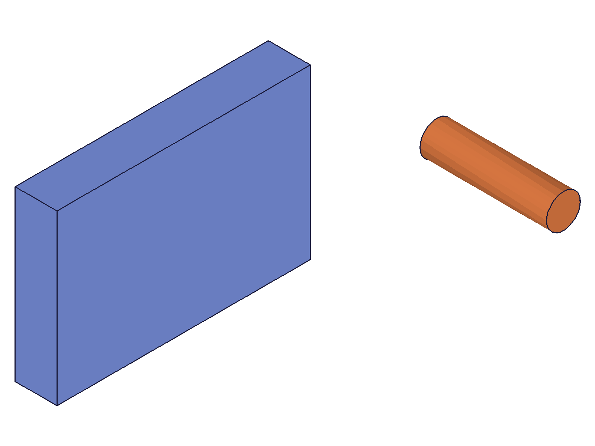
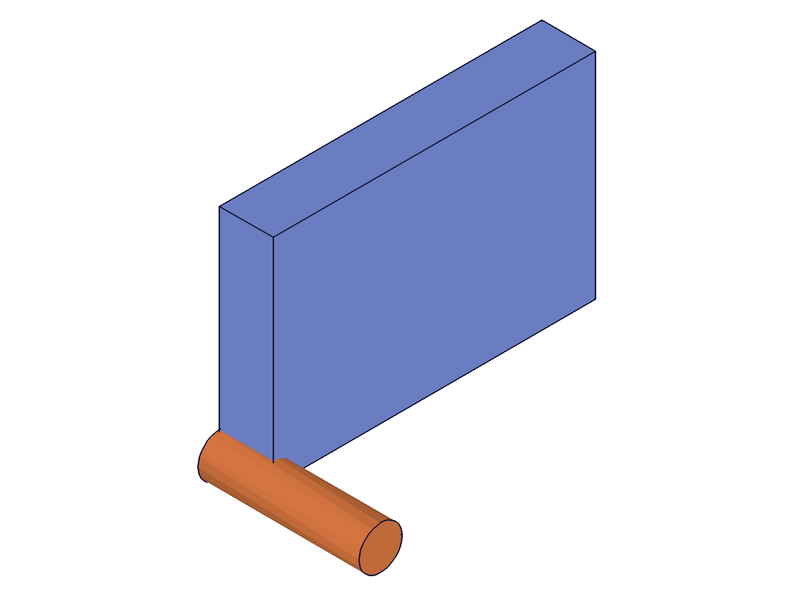

# Training: assembly.getWorkGeometry

**Date:** 2026-05-09

## Goal

Testing `v1.assembly.getWorkGeometry` — looks up work geometry by name from an assembly or instance.

**Methods to cover:**

- `getWorkGeometry` — with assembly ID, instance ID, template ID
- All work geometry types: workPlane, workAxis, workCSys, workPoint

**Questions:**

- What built-in work geometries are available via the assembly root?
- Can you look up work geometry on a part template via the assembly API?
- Can you look up work geometry on an instance ID?
- Does it return the same IDs as `part.getWorkGeometry` for the same template?
- What happens with invalid names or wrong ID types?
- Can it find work geometry inside sub-assembly templates?
- Does it work with user-created work geometry (not just built-ins)?
- Do ET (expanded tree) instance IDs work?

## 01 — builtin work geometry on part template ID

Script: `scripts/01-builtin-on-template.mjs` — ❌ All 7 built-in names fail on part template ID.

**Data:** Every call returns `maxLevel: 51`, error: `"The parameter "id" has a wrong id type! Provide only following id types: ["assembly","instance"]"` (see `files/01-builtin-on-template-builtin-on-template.json`).

By contrast, `part.getWorkGeometry({ id: tplId, name: 'Top' })` succeeds (result: 56, maxLevel: 31).

**Learned:** `assembly.getWorkGeometry` rejects part template IDs. Only accepts assembly or instance ID types. To look up work geometry on a template directly, use `part.getWorkGeometry` instead.
**📌 LLM doc:** Document accepted ID types — assembly and instance only, not part templates.

## 02 — assembly root and instance IDs

Script: `scripts/02-on-instance.mjs` — ✅ Instance IDs work; assembly root has no work geometry.

**Data** (`files/02-on-instance-results.json`):
- Assembly root (id=12): "Couldn't find work geometry with name: ..." for Top, Origin, MateCSys. Accepted by API (no type error) but assemblies have no work geometry.
- Instance 1 (id=113): Top=56, Origin=40, MateCSys=107, XAxis=44 — all succeed (maxLevel=31).
- Instance 2 (id=115): MateCSys=107 — same template-scoped ID as instance 1.
- `sameIdAcrossInstances: true` — both instances return the same template IDs.

**Learned:** The API looks up work geometry from the instance's linked part template. IDs returned are template-scoped (not instance-scoped) — same numeric ID regardless of which instance you query. Assembly roots are accepted but have no work geometry of their own.
**📌 LLM doc:** Instance lookups return template-scoped IDs. Assembly root has no work geometry.

## 03 — sub-assembly templates, error cases

Script: `scripts/03-assembly-template-and-errors.mjs` — ✅ Error handling confirmed; sub-assemblies have no work geometry.

**Data** (`files/03-assembly-template-and-errors-results.json`):
- Sub-assembly template (id=113): "Couldn't find work geometry" — accepted (assembly type) but no work geometry.
- Sub-assembly instance (id=125): "Couldn't find work geometry" — can't see through to nested part instances.
- Direct part instance: `WPt1` found (id=107) — user work points accessible.
- Error cases:
  - NonExistent → "Couldn't find work geometry with name: "NonExistent""
  - Empty string → "Couldn't find work geometry with name: """
  - Wrong case "top" → fails (maxLevel 51, case-sensitive)
  - Part template ID → "wrong id type" error

**Learned:** Sub-assembly instances don't expose work geometry from nested part instances — they have no work geometry of their own. Case-sensitive name matching.
**📌 LLM doc:** Case sensitivity, sub-assembly limitation, error messages.

## 04 — practical constraint usage

Script: `scripts/04-practical-constraint-usage.mjs` — ✅ Looked-up WCS IDs drive a fastened constraint successfully.

|  |  |
| --- | --- |

**Data:** `bracketMate` (looked up via getWorkGeometry) = 107 = template WCS ID. `boltBaseMate` = 180 = template WCS ID. Fastened constraint result: 234, maxLevel: 31. Snapshots confirm bolt moved from offset (100,0,0) to bracket's MatePoint WCS at (30,20,10).

**Learned:** This is the primary use case — look up named WCS on instances by name, then use those IDs as mate references in constraint APIs. The template-scoped IDs work directly in `mate1.csys` / `mate2.csys`.
**📌 LLM doc:** Working example of constraint workflow using getWorkGeometry.

## 05 — all 4 work geometry types + nesting

Script: `scripts/05-all-types-and-nesting.mjs` — ✅ All 4 types work; nesting requires ET instance IDs.

**Data** (`files/05-all-types-and-nesting-results.json`):
- CustomPlane: 107→107 ✓, CustomAxis: 115→115 ✓, CustomCSys: 123→123 ✓, CustomPoint: 131→131 ✓
- Built-ins: Top=56, Front=60, Right=64, XAxis=44, YAxis=48, ZAxis=52, Origin=40
- Nested sub-asm instance / "CustomCSys": fails ("Couldn't find")
- ET instance IDs available via `getInstance({ ownerId: subAsmInst })` → [152]

**Learned:** All 4 types (workPlane, workAxis, workCSys, workPoint) are findable. All IDs match the template's IDs exactly. Nesting through sub-assembly instances requires getting the ET instance ID first.

## 06 — ET instance IDs

Script: `scripts/06-et-instance-lookup.mjs` — ✅ ET instance IDs work identically to regular instance IDs.

**Data** (`files/06-et-instance-lookup-results.json`):
- ET instance (id=126) / Mate: 107 ✓, maxLevel: 31
- ET instance / Top: 56 ✓, maxLevel: 31
- Direct instance / Mate: 107 — identical
- `allSameId: true` — ET instance, direct instance, and template WCS all return 107.

**Learned:** For nested sub-assemblies, use `getInstance({ ownerId: subAsmInst })` to get ET instance IDs, then call `getWorkGeometry` on those. The ET IDs work the same as regular instance IDs. Always returns template-scoped IDs.
**📌 LLM doc:** Document ET instance workflow for nested sub-assemblies.
