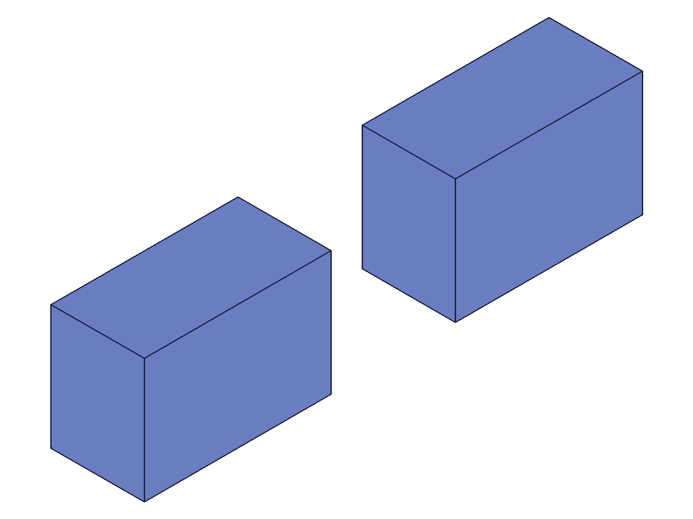
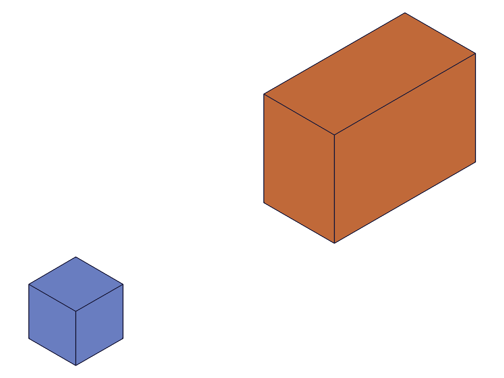
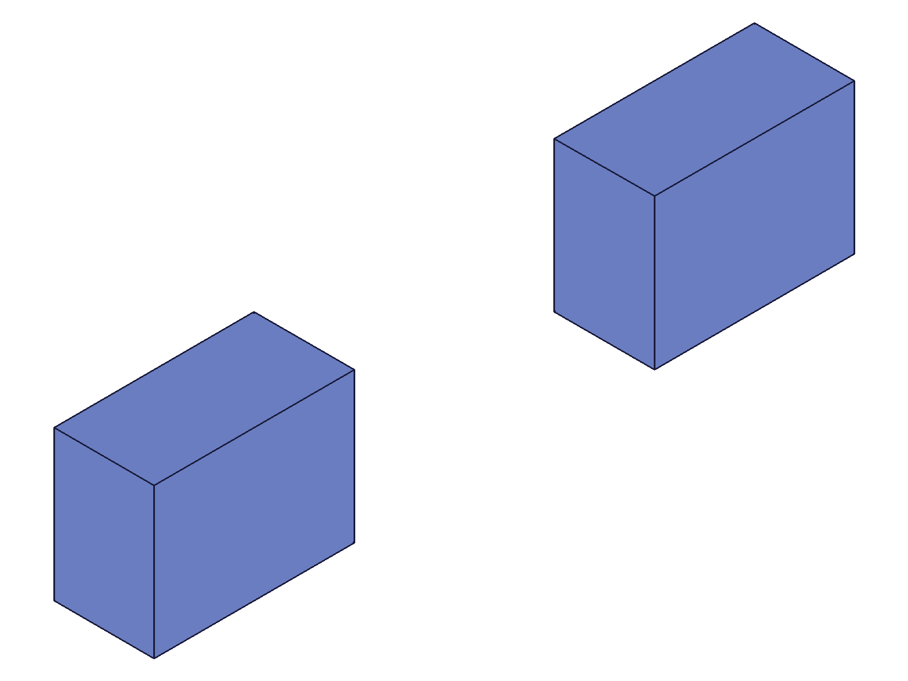
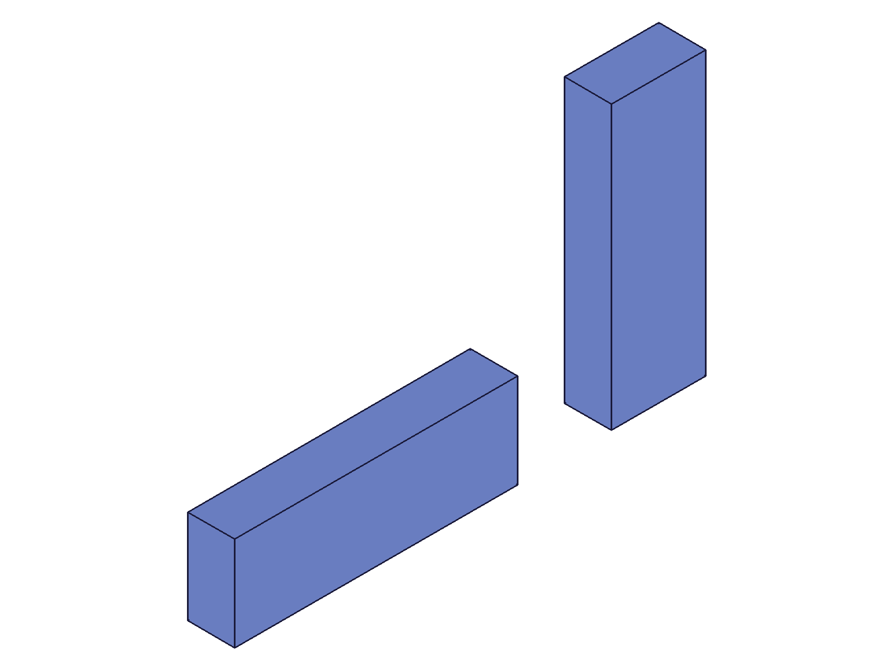

# Training: assembly.calculateMassProperties

**Date:** 2026-05-09

## Goal

Testing `v1.assembly.calculateMassProperties` — the assembly-domain variant of mass property calculation.

**Methods to cover:**

- `assembly.calculateMassProperties` — with assembly root ID, instance ID, template/part ID, sub-assembly ID
- Compare behavior with `part.calculateMassProperties` (same function, different namespace)

**Questions:**

- Does `assembly.calculateMassProperties` accept the same ID types as `part.calculateMassProperties`?
- Are results identical for same inputs between assembly and part domains?
- Does COG for an instance reflect its world transform (assembly coordinates)?
- Does the assembly root COG aggregate all instances correctly (volume-weighted)?
- How does it handle sub-assemblies — does it recurse into nested instances?
- What happens with an empty assembly (no instances)?
- What happens with multiple instances of different templates?

---

## 01 — basic assembly mass properties

Script: `scripts/01-basic-assembly.mjs` — ✅ Basic call works on assembly root, instance, and part template.

|  |
|---|

**Data:** All three ID types (assembly root, instance, part template) return identical results for a single instance at origin: `cog: {x:30, y:20, z:15}, volume: 72000`. Box is 60×40×30, COG is at center. Both `assembly.calculateMassProperties` and `part.calculateMassProperties` return identical results (see `files/01-basic-assembly-basic-results.json`).

**Learned:** The two namespace variants are interchangeable — same input, same output.

---

## 02 — multi-instance COG aggregation

Script: `scripts/02-multi-instance-cog.mjs` — ✅ Volume-weighted aggregation confirmed.

|  |
|---|

**Data:** inst1 COG: (30,20,15) vol:72000. inst2 at X+100 COG: (130,20,15) vol:72000. Assembly COG: (80,20,15) vol:144000. Equal volumes → simple average. All checks pass (see `files/02-multi-instance-cog-multi-instance-results.json`).

**Learned:** Instance COGs reflect their world transforms. Assembly root aggregates as volume-weighted average.

---

## 03 — different template volumes

Script: `scripts/03-different-templates.mjs` — ✅ Volume-weighted average confirmed with unequal volumes.

|  |
|---|

**Data:** Small box (20³=8000) at origin COG:(10,10,10). Large box (60×40×30=72000) at X+100 COG:(130,20,15). Assembly COG: (118,19,14.5) vol:80000. Formula: `(8000*10 + 72000*130)/80000 = 118`. All axes match (see `files/03-different-templates-different-templates.json`).

**Learned:** COG correctly volume-weighted across heterogeneous templates.

---

## 04 — sub-assembly (partial run)

Script: `scripts/04-sub-assembly.mjs` — ⚠️ Crashed at sub-assembly template call (null result). Sub-asm instance COG confirmed: (120,40,10) matching expected value.

**Data:** Sub-asm instance (one box inside, translated X+100) COG: (120,40,10). Sub-assembly template returned null — investigated in script 05.

---

## 05 — ID type matrix

Script: `scripts/05-id-types.mjs` — ✅ Comprehensive ID type testing.

|  |
|---|

**Data** (from `files/05-id-types-id-types.json`):

| ID type | assembly.cMP | part.cMP | Result |
|---|---|---|---|
| Assembly root | ✅ cog:(70,15,10) vol:48000 | ✅ identical | Aggregates all instances |
| Part template | ✅ cog:(20,15,10) vol:24000 | ✅ identical | Local COG |
| Assembly template | ❌ null maxLevel:51 | ❌ identical error | "not supported yet!" |
| Part instance | ✅ cog:(20,15,10) vol:24000 | ✅ identical | Assembly coords |
| Sub-asm instance | ✅ cog:(120,15,10) vol:24000 | ✅ identical | Assembly coords, recurses |
| Feature ID | ❌ null code:1001 | — | "wrong id type" |
| Work CSys ID | ❌ null code:1001 | — | "wrong id type" |
| Sub-instance (unexpanded) | ❌ null | — | "use objects from expanded tree!" |

**Learned:** 
- `assembly.calculateMassProperties` and `part.calculateMassProperties` are exact aliases — identical behavior for all ID types.
- Accepted: assembly root, part template, instance (part or sub-asm), solid ID.
- Rejected: assembly template, feature IDs, work geometry, unexpanded sub-instance IDs.

**📌 LLM doc:** Assembly template not supported. Unexpanded sub-instance IDs not supported. Document all accepted/rejected ID types.

---

## 06 — edge cases

Script: `scripts/06-edge-cases.mjs` — ✅ All edge cases tested.

**Data** (from `files/06-edge-cases-edge-cases.json`):

| Scenario | Result |
|---|---|
| Empty assembly (no templates/instances) | ❌ NullMem crash, maxLevel:51 |
| Assembly with template but no instances | ❌ NullMem crash |
| Instance of empty template (no geometry) | ❌ NullMem crash |
| Solid ID (from solid.box) | ✅ cog:(0,0,0) vol:8000 |
| Invalid ID (999999) | ❌ code:1006 "invalid id" |

**Learned:** Any path with zero solids crashes with NullMem — not a graceful {volume:0}. This matches `part.calculateMassProperties` behavior documented in its LLM doc.

**📌 LLM doc:** Document NullMem crash for empty assemblies/templates. Document solid ID support.

---

## 07 — rotated instance COG

Script: `scripts/07-rotated-instance.mjs` — ✅ Rotation correctly transforms COG.

|  |
|---|

**Data:** Box 60×20×10, local COG:(30,10,5). Instance 2 with 90° CCW Z rotation + translation (100,0,0). Expected COG: (90,30,5). Measured: (90.00,30,5). Assembly average of (30,10,5) and (90,30,5) = (60,20,5). All match (see `files/07-rotated-instance-rotated-instance.json`).

**Learned:** COG correctly applies the full instance transform (rotation + translation).

---

## 08 — namespace identity proof

Script: `scripts/08-namespace-comparison.mjs` — ✅ `assembly.calculateMassProperties` ≡ `part.calculateMassProperties`.

**Data:** Tested assembly root, part template, instance, and solid ID. All four return `identical=true` between namespaces (see `files/08-namespace-comparison-namespace-comparison.json`).

**Learned:** These are the same function exposed in two namespaces. No behavioral difference whatsoever.

**📌 LLM doc:** Document that both namespaces are interchangeable.
