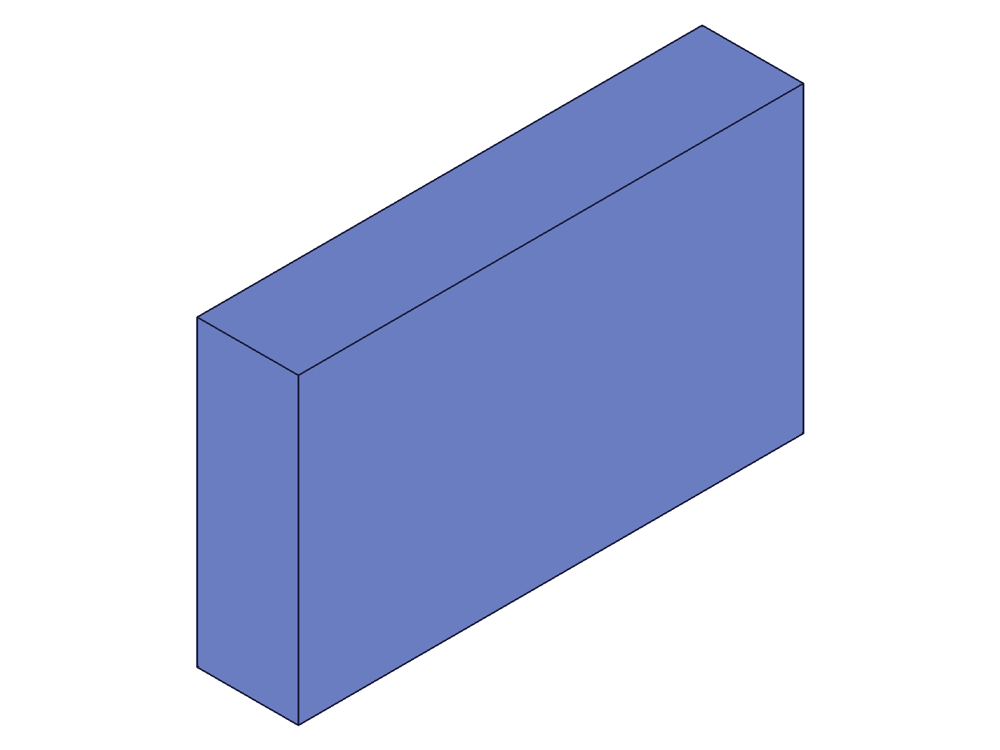

# Training: drawing2d.centerView

**Date:** 2026-05-11

## Goal

Testing `v1.drawing2d.centerView` — centers views to origin based on each view's boundary box.

**Methods to cover:**

- `centerView` — basic call with `types` array
- `centerView` — omitting `types` (should center all views)
- Interaction with `getBoundaryBoxFromView` — measure before/after centering
- Interaction with `placeView` — does centering reset placement offsets?

**Questions:**

- What does "center to origin" mean concretely — does it move the view's boundary box center to [0,0,0]?
- Does centerView return VOID as documented?
- What happens if views haven't been created yet?
- Does centerView affect view IDs or just positions?
- Can you selectively center some views but not others?
- What's the boundary box state before vs after centering?
- Does centerView interact with placeView offsets?

---

## 01 — basic centerView

Script: `scripts/01-basic-centerView.mjs` — ✅ works as documented.

**Data:** centerView returns `null` (VOID) with maxLevel=31 (INFO). Boundary boxes before centering showed views at their initial positions (TOP: center at (40,30), FRONT: center at (40,20), ISO: center at (7.07,44.91)). After centering, all bbox centers are at (0,0) — confirmed by `getBoundaryBoxFromView` data (see `files/01-basic-centerView-bbox-before.json` and `files/01-basic-centerView-bbox-after.json`).

|  |
|---|

**Learned:** "Center to origin" means: translate each view so that its bounding box center is at [0,0,0] in the 2D plane. The bbox dimensions (width/height) do not change — only the position. For TOP view: bbox was [0,0]–[80,60] → becomes [-40,-30]–[40,30].

📌 LLM doc: Core behavior — centering moves each view's bbox center to origin.

## 02 — omit types (center all)

Script: `scripts/02-omit-types.mjs` — ✅ omitting `types` centers all existing views.

**Data:** After placing all 4 views (TOP, FRONT, RIGHT, ISO) at large offsets (200, 200, -100, 300), calling `centerView({ id: partId })` without `types` recentered all 4 views to (0.00, 0.00). See `files/02-omit-types-bbox-after-omit.json`.

**Learned:** When `types` is omitted, all views are centered. Docs say "if empty all views will be centered" — confirmed, and omitting entirely also works.

📌 LLM doc: Omitting `types` centers all views.

## 03 — selective centering

Script: `scripts/03-selective-center.mjs` — ✅ selective centering works.

**Data:** After placing TOP, FRONT, ISO at offsets, centering only `['TOP']` moved TOP to (0.0, 0.0) while FRONT stayed at (40.0, 220.0) and ISO at (307.1, 344.9). See `files/03-selective-center-bbox-after-selective.json`.

**Learned:** You can center a subset of views. Only the specified types are moved.

## 04 — no views exist

Script: `scripts/04-no-views-exist.mjs` — ✅ error as expected.

**Data:** Both `centerView({ id, types: ['TOP','FRONT'] })` and `centerView({ id })` returned maxLevel=51 with error code 1200: "There are no views exisiting on product with id: $4. You have to create the views first, before trying to center views."

**Learned:** Error 1200 when no views exist. Clear error message. Note the typo in server message: "exisiting".

📌 LLM doc: Error 1200 when views haven't been created yet.

## 05 — center + place + recenter interaction

Script: `scripts/05-center-then-place.mjs` — ✅ centerView fully resets placeView offsets.

**Data:** After centering (all at (0,0)), placing (TOP at (0,100), RIGHT at (120,0)), then re-centering, all views returned to (0,0). The workflow is: center → place is the intended pattern for creating drawing layouts. Re-centering after placement undoes the placement offsets.

**Learned:** centerView and placeView operate on the same position state. Centering always resets to bbox-centered at origin regardless of prior placement.

📌 LLM doc: Recommended workflow: center first, then placeView to arrange layout.

## 06 — edge cases

Script: `scripts/06-edge-cases.mjs` — ✅ all edge cases handled gracefully.

**Data:**
- Empty `types: []` → succeeds, maxLevel=31 (no-op)
- Invalid type `'INVALID'` → error 1013: "The provided value for parameter 'types' is not valid" (same error code as `view()`)
- Uncreated type `'RIGHT'` (not in view set) → succeeds silently, maxLevel=31 (no-op)
- Duplicate types `['TOP', 'TOP']` → succeeds silently, maxLevel=31

**Learned:** Centering a type that wasn't created is a silent no-op. Invalid type strings get error 1013. Empty array is a no-op.

📌 LLM doc: Edge case behavior — silent no-op for uncreated types, error 1013 for invalid strings.

## 07 — realistic workflow

Script: `scripts/07-realistic-workflow.mjs` — ✅ full workflow with asymmetric geometry.

**Data:** L-shaped part (base 100x60x20 + upright 20x60x80). After centering: TOP size=100x60, FRONT size=100x20, RIGHT size=60x20, ISO size=113.1x81.6 — all centered at (0,0). Then placed in standard engineering layout (TOP above FRONT, RIGHT to the right). SVG not available on this server instance.

|  |
|---|

**Learned:** The workflow dims→views→center→place works correctly. The FRONT view bbox appears to show only the base box silhouette (100x20), suggesting the upright box may not have been positioned correctly via `references.origin` — but this is a box positioning question, not a centerView issue.
