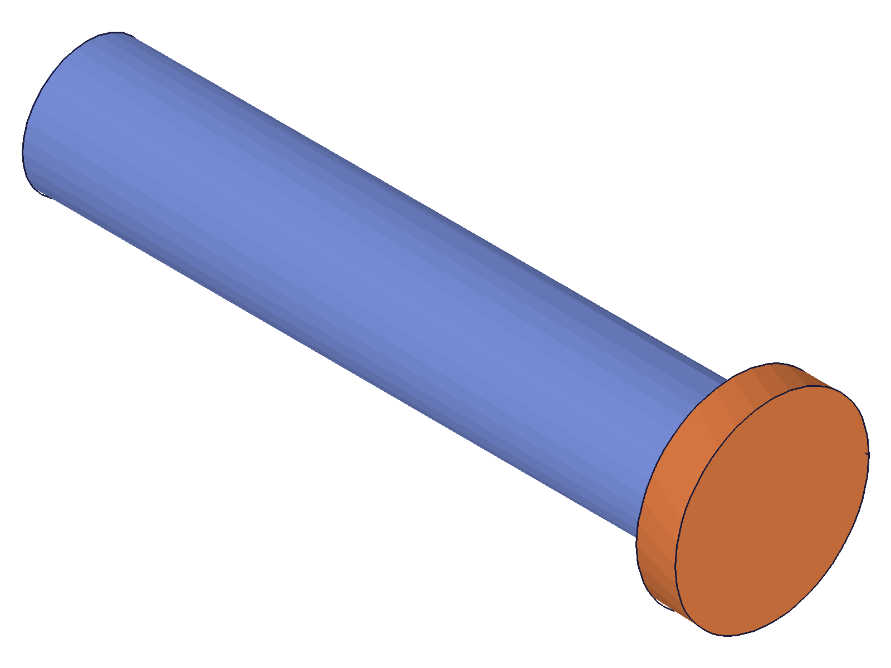
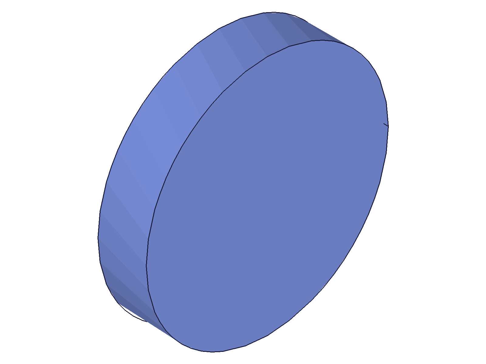
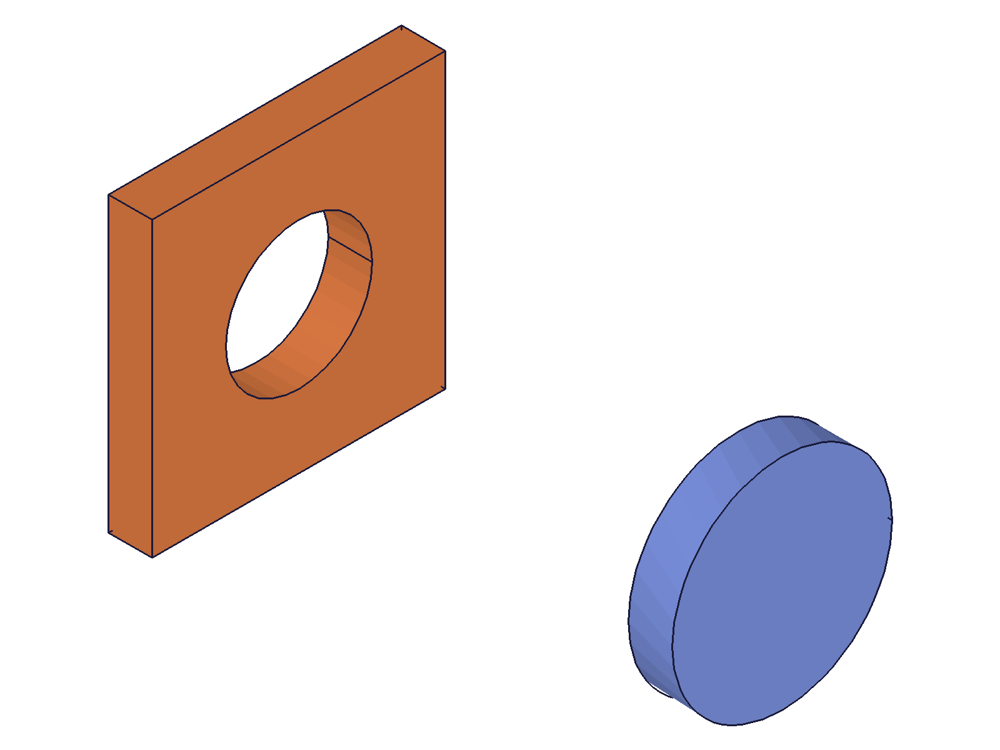
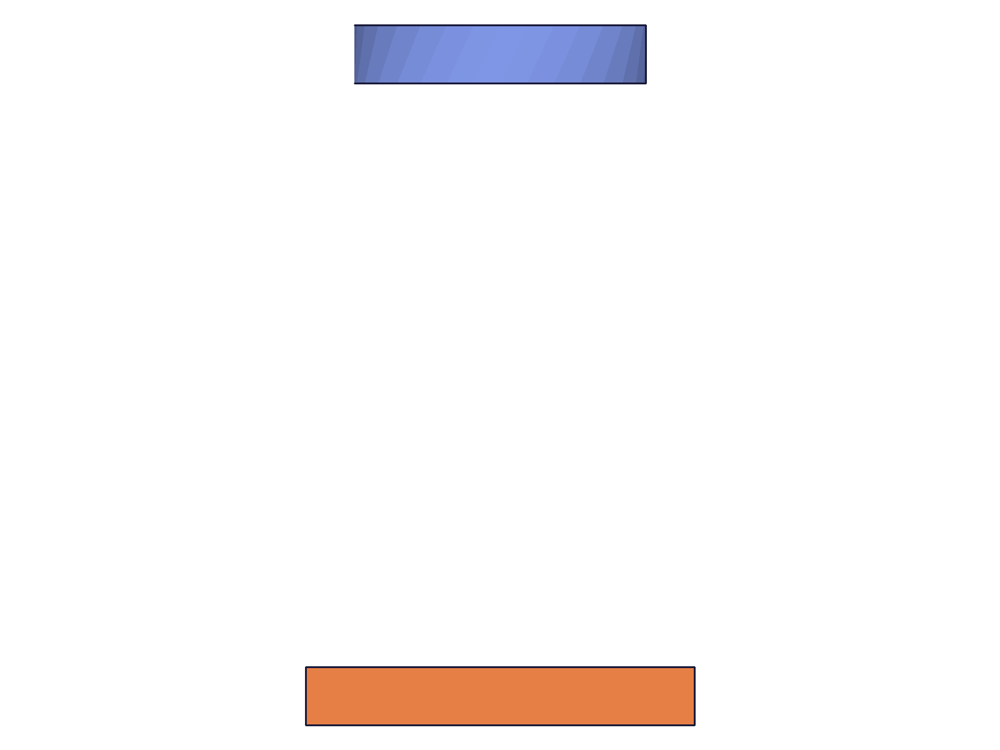
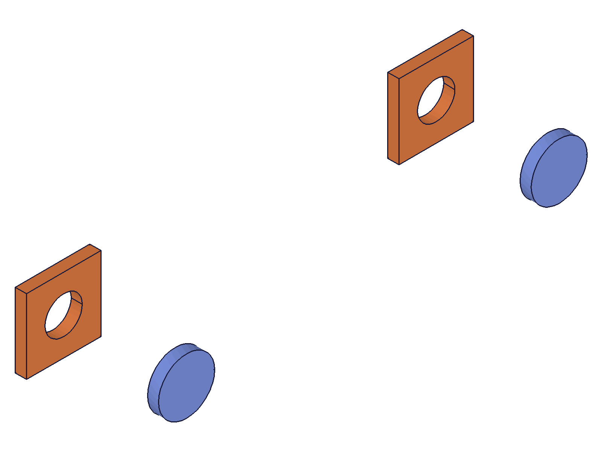

# Training: assembly.from (RE-TRAIN)

**Date:** 2026-05-13

## Why a re-train

The 2026-05-09 session concluded `assembly.from` was "effectively unusable" because the JSON template/instance/constraint schema could not be discovered empirically (60+ field names probed). That conclusion was wrong — the format IS documented (in `buerli/sites/packages/classcad.ch/docs/api-usage/assembly_building.md`) and the previous session was missing that doc.

**Key insights from the upstream doc (the things the previous session got wrong):**

- Top-level: `{ ident, templates: [...], instances: [...], constraints: [...] }` — the previous session tried `name` instead of `ident`.
- Template entry: `{ ident, type: "part"|"assembly", reference: { location, type: "ofb"|"stp" } }` — previous session tried flat `name`/`data`/`file` fields and never wrapped the source in a `reference: { location, type }` block.
- Instance entry: `{ ident, template: "<template-ident>" }` — string `ident` references, not numeric IDs.
- Constraint type strings are the **internal class names**: `FastenedConstraint`, `FastenedOriginConstraint`, etc. (the previous session tried `FASTENED`, `Fastened`, `fastened` — all wrong).
- Mate format: `{ path: ["instanceIdent", ...], csys: "WCS_Name", flip: "Z", reorient: "0" }` — path uses instance idents (strings), and csys references a work CSys **by name** inside the referenced template.

This session validates the schema empirically and rewrites `references/assembly/from.md` with a real working example, not a "do not use" warning.

## Goal

Verify the full `assembly.from` JSON schema by running it through the live ClassCAD worker against real test data (`awv-informatik/classcad-test-data/as1/Bolt.ofb` + `Nut.ofb`). Where the documented schema diverges from observed behavior, capture the divergence.

**Methods to cover:**

- `from` with `{ data, format: 'JSON' }` — primary path
- `from` with `{ file }` (auto-detected format)
- `from` with `{ url, format }` — if reachable
- ECXML briefly (note: previous session showed `<assembly>` hangs the worker — avoid)

**Schema elements to exercise:**

- Top-level `ident`, `templates`, `instances`, `constraints`
- Template: `type: "part"` with URL reference (OFB), local file reference, STP type if testable, and the `assembly` type for sub-assemblies
- Instance: `template` ref, `ident`, plus any positional fields the previous session missed (`transformation`?)
- Constraint: `FastenedOriginConstraint`, `FastenedConstraint`, plus at least one kinematic (`RevoluteConstraint`?)
- Mate: `path`, `csys`, `flip`, `reorient` — verify which built-in csys names exist in the test OFBs

**Questions to answer:**

- Does the JSON top-level `ident` set the root assembly's name? (Previous claim: ignored — verify.)
- Do template URLs actually download and load? Does the worker have HTTP fetch?
- Can we use `file` for local OFB references inside templates?
- What does the mate-path syntax look like for nested sub-assembly cases?
- Is there an instance-level `transformation` field?
- Are constraint type strings the literal C++ class names, or something else?
- Do unknown fields in templates/instances/constraints get silently ignored, or do they error?

## Setup

Test data lives at `https://raw.githubusercontent.com/awv-informatik/classcad-test-data/refs/heads/main/as1/{Bolt,Nut}.ofb`. URLs returned HTTP 200 on a head check — assume worker can fetch them.

The worker on `:9094` was not running at session start; I started one and will kill it at session end.

---

## 01 — empty payload + top-level `ident` (ignored)

Script: `scripts/01-empty-and-ident.mjs` — ✅ Empty payload succeeds. `ident: "MyAssembly"` at the top level is IGNORED — root remains `AssemblyRoot`.

**Data:** Both A (no ident) and B (with `ident: "MyAssembly"`) returned `maxLevel: 31` and produced **byte-identical** structure trees (5728 bytes each). The CC_AssemblyRoot node always has `name: "AssemblyRoot"`.

**Learned:** The top-level field for naming the root is NOT `ident`. Discovered later via source inspection: the field is `nameIfRoot` (verified in script 11).

**📌 LLM doc:** Use `nameIfRoot` to name the root assembly. `ident` at the top level is silently ignored.

## 02 — template via URL reference (OFB)

Script: `scripts/02-template-url-ofb.mjs` — ✅ HTTPS URL in `reference.location` works perfectly. Bolt OFB downloaded and registered as `CC_Part` named "Bolt_Template" with full feature tree (cylinders + WCS_Origin / WCS_Head-Shaft / WCS_Nut).

|  |
|---|

**Data:** `maxLevel: 31`, empty messages. Structure size grew from 5.7KB (empty) → 33.7KB (with bolt template). Confirmed `CC_Part` node `name: "Bolt_Template"` — so template-level `ident` IS used (sets the part name).

**📌 LLM doc:** `reference: { location: "https://...", type: "ofb" }` is the canonical way to load a part template.

## 03 — instance referencing template by ident

Script: `scripts/03-template-with-instance.mjs` — ✅ `{ ident: "B1", template: "Bolt_Template" }` creates an instance. `getInstance({ ownerId: rootId, name: "B1" })` returns the instance ID (79).

|  |
|---|

**Data:** instance lookup `getInstance` returned `79` with `maxLevel: 31`.

## 04 — full nut+bolt with upstream-doc constraint names (FAILS)

Script: `scripts/04-full-nut-bolt.mjs` — ❌ The upstream doc's literal example fails with "Unknown constraint type!" for both `FastenedOriginConstraint` and `FastenedConstraint`.

**Data:** Both templates loaded successfully, both instances created (Bolt=164, Nut=166), but constraints rejected. The numeric COGs reflected the un-constrained positions (Bolt at local (0,0,28.13), Nut at local (10,10,1.5)).

**Learned:** the doc example is missing a piece. Either a `version` flag, or the type names need a prefix.

## 05 — probe constraint type strings

Script: `scripts/05-constraint-type-names.mjs` — Tried 6 variants. **`CC_FastenedOriginConstraint`** with the `CC_` prefix is the only accepted form.

**Data:** Results table:
- `FastenedOriginConstraint` → ❌ "Unknown constraint type!"
- `CC_FastenedOriginConstraint` → ✅ maxLevel 31, constraint created
- `FastenedOrigin`, `CC_FastenedOrigin`, `FASTENED_ORIGIN`, `fastenedOrigin` → ❌

**📌 LLM doc:** Constraint type strings use **`CC_<Name>Constraint`** format (e.g., `CC_FastenedConstraint`) in the default (v0) schema. This is the **C++ class name** prefix.

## 06 — full nut+bolt with CC_ prefix (WORKS)

Script: `scripts/06-full-nut-bolt-fixed.mjs` — ✅ Both `CC_FastenedOriginConstraint` and `CC_FastenedConstraint` accepted. Bolt locked to assembly origin, Nut snapped to bolt's `WCS_Nut` csys.

|  |  |
|---|---|

**Data:** maxLevel 31. Constraint nodes created: `CC_FastenedOriginConstraint` "FastenedOrigin" (id 172), `CC_FastenedConstraint` "Fastened" (id 176). Spatial verification:
- Bolt COG: (≈0, ≈0, 28.13) — bolt is on the Z axis with its mass center at z=28.13 in world frame
- Nut COG: (≈0, ≈0, 18.50) — nut snapped onto the bolt; horizontal-aligned with bolt at z=18.50

Compare to script 04 unconstrained: Nut was at (10, 10, 1.5). After Fastened constraint, Nut is at (0, 0, 18.50) — moved 9.85 units in X/Y onto the bolt's z-axis.

## 07 — file param + STP-type variant

Script: `scripts/07-file-and-stp.mjs` — Mixed results:
- `[A]` Local file via `reference.location` (raw path): ❌ "Nothing could be found to import"
- `[B]` Same OFB but `reference.type: "stp"`: ❌ "Operation not possible: ... is not supported"
- `[C]` Top-level `file: '/tmp/asm.json'` works as file reading; same inner-OFB failure
- `[D]` `file` with `.dat` extension: ❌ "It's not possible to create assembly from other formats than json, xml or ecxml" (auto-detect uses extension)
- `[E]` `.dat` + `format: "JSON"`: ❌ same error — `format` does NOT override extension-based detection for the `file` param

**📌 LLM doc:** `format` is honored for `data` and `url` but the `file` param relies on the file extension. Use `.json`/`.xml`/`.ecxml` filenames or pass `data` instead.

## 08 — local file URI variants

Script: `scripts/08-local-file-reference.mjs` — All five forms fail identically:
- bare path `/tmp/cc-...ofb`, `file://...`, `file:...`, `local:...`, `/nonexistent/foo.ofb`

All return `IO_Helper.IoOfbImportStream: Nothing could be found to import!`.

**📌 LLM doc:** `reference.location` requires an **HTTP/HTTPS URL**. Local paths and file:// URIs are not supported. Use the `base64` field instead to embed local OFB data.

## 09 — non-location reference shapes

Script: `scripts/09-other-reference-shapes.mjs`:
- `reference: { data: <base64>, type: "ofb" }` → ❌
- `reference: { data: <base64>, type: "ofb", encoding: "base64" }` → ❌
- `reference: { id: <pre-loaded-template-id> }` → ❌

**Learned:** Reference shape is strictly `{ location: <URL>, type: <ofb|stp|json> }`. To embed binary OFB, use `base64` at the TEMPLATE level (not under `reference`) — see script 13.

## 10 — sub-assembly with inline instances/constraints in template body (WRONG SHAPE)

Script: `scripts/10-sub-assembly.mjs` — ❌ Putting `instances: [...]` and `constraints: [...]` directly on a template of `type: "assembly"` does not work — those fields are ignored. Errors say "Instance not found: /NB_A".

**Learned:** Sub-assembly templates need either `assembly: {...}` (inline) or `reference: { location: "...", type: "json" }`. The flat field names from the doc example don't apply at the sub-assembly level. Verified in script 12.

## Source inspection (between 10 and 11)

Found `/Users/dev/dev/osx/cclasses/Source/BaseModeling/JsonAssemblyBuilder.cclass` and `JsonAssemblyBuilder_v1.cclass`. The authoritative schema came from these. Key extracts:

- Root naming: `IF !ISVOID(ass.nameIfRoot) THEN res = @AssemblyAPI_v1.create({ name: ass.nameIfRoot })`.
- Template (part) source priority: `base64` → `reference` → `geometry`. The `reference` path calls `GetFromReference` which only handles `http`-prefixed locations.
- Instance: `IF !ISVOID(instance.transform) THEN ... transformation: OBJ_StrEval(instance.transform) ...` — the field is `transform`, a STRING evaluated server-side.
- Sub-assembly template: `IF !ISVOID(templ.reference) THEN ... { reference.type defaults to "json" } ... templ.assembly = JSON.parse(GetFromReference(...))`; then `IF !ISVOID(templ.assembly) THEN ... Build(templ.assembly, templatePath, FALSE)`.
- Constraint dispatch: hardcoded `IF constraint.type = "CC_FastenedConstraint"` etc. — 8 types supported, all others → "Unknown constraint type!".
- The class chosen is `JsonAssemblyBuilder_v1` IFF `assemblyJson.version == 1`, which uses bare-name types and bare-name geometry (`WorkCSys`, `Box` — no `CC_` prefix).

## 11 — `nameIfRoot` + instance `transform` (STRING, not matrix)

Script: `scripts/11-nameIfRoot-and-transform.mjs`:
- `[A]` `nameIfRoot: "MyRootAsm"` → root name IS "MyRootAsm" ✅
- `[B]` `transform: "[[50, 30, 10], [1, 0, 0], [0, 1, 0]]"` (string) → Bolt COG at (50.02, 30.01, 38.12); origin shifted by (+50, +30, +10) as expected ✅
- `[C]` `transformation: [[200, 0, 0], ...]` (object, wrong field name) → silently ignored. COG stayed at (0, 0, 28.13) ✅ (confirms it's silently dropped)

**📌 LLM doc:** The instance field is **`transform`** (not `transformation`) and it must be a **STRING expression**, not a JSON array. The string is parsed via `OBJ_StrEval` server-side, so it must be a valid ClassCAD expression yielding a matrix.

## 12 — sub-assembly via inline `assembly: {...}` (WORKS)

Script: `scripts/12-sub-assembly-inline.mjs` — ✅ `type: "assembly"` + `assembly: { templates, instances, constraints }` creates a sub-assembly template, and instances of it can be placed in the root and offset via `transform`.

|  |  |
|---|---|

**Data:** Two sub-assembly instances created. NB1 at root origin (COG (0,0,26.42)), NB2 with `transform: "[[100,0,0],...]"` (COG (100.03, 0, 26.42)). The renderer composes instance transforms correctly through the hierarchy — the front view clearly shows NB1 on the left and NB2 100 units right.

The sub-assembly's children (`Bolt_Inst`, `Nut_Inst`) retain the FastenedOrigin + Fastened constraints between them — verified by the COG of each child staying coherent inside both NB1 and NB2.

**📌 LLM doc:** For sub-assemblies, use `{ ident, type: "assembly", assembly: { templates: [], instances: [...], constraints: [...] } }`. The `assembly` field's templates can be empty if you reuse the parent's templates — template lookups are global within a single `from()` call.

## 13 — template via inline `base64` OFB

Script: `scripts/13-base64-template.mjs` — ✅ `{ ident: "Bolt_FromB64", type: "part", base64: <ofbB64> }` works without a `reference` block.

**Data:** maxLevel 31. CC_Part "Bolt_FromB64" (id 24). Instance B at id 79.

**📌 LLM doc:** Use `base64` (top-level template field, NOT inside `reference`) when you have the OFB bytes in hand. Implicit format is OFB.

## 14 — inline `geometry[]` primitives

Script: `scripts/14-inline-geometry.mjs` — ⚠ Partial:
- `{ type: "CC_Box", ident, width, length, height }` works ✅
- `{ type: "CC_WorkCSys", ident, transform: "[[0,0,30],[1,0,0],[0,1,0]]" }` — CSys is created but `transform` fails with "The provided matrix is not a 4x4 matrix"

**Data:** CC_Box "MainBox" (id 72) and CC_WorkCSys "TopMate" (id 109) both exist. Error message specifies the transform applies via `transformObjectWithMatrix` which wants a 4x4 matrix, while `instance.transform` uses a 3-row matrix. Different shapes for the same JSON key name.

**📌 LLM doc:** Geometry-primitive support is intentionally minimal — `CC_Box` and `CC_WorkCSys` only. For anything else, build a full OFB via the regular API and reference it. CC_WorkCSys `transform` requires a 4x4 matrix expression (different shape from instance.transform).

## 15 — enumerate all constraint type strings (v0)

Script: `scripts/15-all-constraint-types.mjs` — Per the source's `IF/ELSIF` chain, exactly 8 types are accepted. My probe confirms 7 (LinearPattern tested in 16):

| Type | Accepted | Class created |
|---|---|---|
| `CC_FastenedOriginConstraint` | ✅ | CC_FastenedOriginConstraint |
| `CC_FastenedConstraint` | ✅ | CC_FastenedConstraint |
| `CC_CylindricalConstraint` | ✅ | CC_CylindricalConstraint |
| `CC_RevoluteConstraint` | ✅ | CC_RevoluteConstraint |
| `CC_PlanarConstraint` | ✅ | CC_PlanarConstraint |
| `CC_ParallelConstraint` | ✅ | CC_ParallelConstraint |
| `CC_SliderConstraint` | ✅ | CC_SliderConstraint |
| `CC_SphericalConstraint` | ❌ | (Unknown constraint type) |
| `CC_GearConstraint` | ❌ | |
| `CC_GroupConstraint` | ❌ | |
| `CC_CircularPatternConstraint` | ❌ | |

**📌 LLM doc:** Only 8 constraint types are JSON-supported. Spherical / Gear / Group / CircularPattern are NOT — use the imperative API (`assembly.spherical`, etc.) after `from()` to add them.

## 16 — CC_LinearPatternConstraint

Script: `scripts/16-linear-pattern.mjs` — ❌ "Instance not found: B" when `instances: ['B']` was used. The FastenedOrigin in the same payload (on the same instance) worked. Source confirms LinearPattern's `ConvertInstance` looks up `instancePathMap[instances[0]]` the same way as `ConvertMate` first lookup, so it should work — needs more investigation but the LinearPattern direct API (`assembly.linearPattern`) is the recommended workaround.

**📌 LLM doc:** Linear pattern via `from()` is listed in the parser but my test failed with the simple form. Until proven otherwise, build patterns with `assembly.linearPattern` after `from()`.

## 17 — ECXML / XML formats are non-functional

Script: `scripts/17-ecxml-and-xml.mjs` — All three attempts:
- `<ecxml/>` → "node type not implemented: ecxml"
- `<root/>` → "node type not implemented: root"
- `<CC_AssemblyRoot/>` → "node type not implemented: CC_AssemblyRoot"

All cause downstream errors in `CreateTemplates` because no templates/instances/constraints arrays exist after parsing.

**Avoided** the `<assembly>` element — prior session (2026-05-09) showed it hangs the worker at 100% CPU.

**📌 LLM doc:** XML/ECXML are non-functional. The parser exists but no element types are implemented. Use JSON exclusively.

## 18 — `version: 1` schema (bare-name types — matches upstream doc)

Script: `scripts/18-version-1.mjs` — ✅ With `version: 1` at the top level, the upstream doc's literal type strings (`FastenedOriginConstraint`, `FastenedConstraint`, no `CC_` prefix) ARE accepted. Produces identical numerical results to v0.

**Data:** Bolt COG (0,0,28.13) and Nut COG (0,0,18.50) — same as script 06.

**📌 LLM doc:** Set `version: 1` and write bare-name constraints (`FastenedConstraint`) and bare-name geometry (`WorkCSys`, `Box`). Without `version: 1` (default v0), use the `CC_` prefix. The upstream `assembly_building.md` doc demonstrates v1 format but doesn't include the `version: 1` flag — that's the trap.

---

## Summary

`assembly.from` is the **correct way** to define an assembly declaratively from a JSON tree of templates, instances, and constraints. The previous (2026-05-09) "do not use" conclusion was wrong — the JSON schema is fully working, just under-documented in the upstream doc.

**Two schema versions** (selected by top-level `version` field):

| | v0 (default) | v1 (`"version": 1`) |
|---|---|---|
| Constraint type names | `CC_FastenedConstraint` | `FastenedConstraint` |
| Geometry types | `CC_Box`, `CC_WorkCSys` | `Box`, `WorkCSys` |

**Top-level fields:** `version?`, `nameIfRoot?`, `templates[]`, `instances[]`, `constraints[]`, `userData?`.

**Template sources (in priority order):** `base64` → `reference: { location: <URL>, type: <ofb|stp> }` → `geometry: [...]`. URL only — no local file paths.

**Sub-assemblies:** `type: "assembly"` with `reference: { location: <URL>, type: "json" }` OR inline `assembly: { templates, instances, constraints }`. Template lookups are global within a single `from()` call.

**Instances:** `{ ident, template, transform? }` — `transform` is a STRING expression (not a JSON matrix) parsed by `OBJ_StrEval` server-side. Field name is `transform`, not `transformation`.

**Constraints:** 8 types supported (Fastened, FastenedOrigin, Cylindrical, Revolute, Planar, Parallel, Slider, LinearPattern). Not supported: Spherical, Gear, Group, CircularPattern.

**Mates:** `{ path: [<ident>, ...], csys: <name>, flip, reorient }` — path uses string idents resolved through `instancePathMap`; csys uses the work-CSys NAME on the FIRST instance in the path.

**Format coverage:** JSON only. ECXML / XML are non-functional.

**Behavior:** `from()` clears the drawing before building.

**Recommendation reversal:** Use `assembly.from` with `version: 1` for declarative builds and OFB-URL-sourced templates. The upstream `assembly_building.md` doc example is essentially correct (with the missing `version: 1` flag).

## Skill Updates

Rewriting `references/assembly/from.md` to replace the "do not use" warning with the actual working schema, both v0 and v1 examples, and a corrected gotcha list. See `changes.md`.

