# Build: Liquid Mixer Version 2

**Date:** 2026-06-10
**Type:** Real-model build from technical drawing (user override — not a PLAN.md task)
**Source:** "Liquid mixer Version 2" drawing, Al 6061, ISO 2768-1, 1st angle, all mm.
Dimensions interpreted together with ph over several rounds — all chains close.

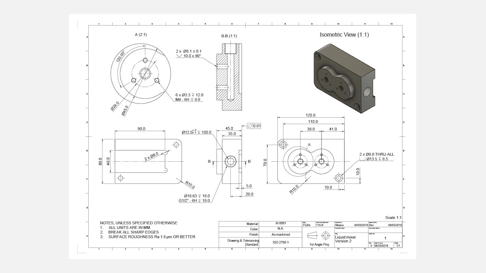

## Interpretation, assumptions, oddities, dimension checklist

**Moved to the run-2 journal** (`../2026-06-10_01-50-49_constrain-liquid-mixer/journal.md`)
so the final constrained build reads in full context — ported to its coordinate frame
(back face z=0) and including the later cutout correction (clings to the back-view left
edge; this run still modeled it centered — see Follow-up below). The checklist is fully
verified there (readbacks + 23-probe audit).

## Build log

### Server note

Worker was not running; TOOLS.md path `/Users/dev/dev/osx` is STALE — tree moved to
`/Users/dev/dev/classcad/` (binary: `runtime/output/arm64-osx-clang/release/classcad-cli`,
ini at repo root). Started worker myself (pid 87642) — must kill at session end.
📌 TODO: update TOOLS.md paths.

### 01 — probe: workCSys orientation (wrong params)

Script: `scripts/01-probe-csys-orientation.mjs` — ❌ my call used `origin`/`xDirection`/`yDirection`
(copied from cylinder.md's Working Example — that example is WRONG). Params silently ignored,
csys = identity at origin; cylinder landed base-anchored at (0,0,0) axis +Z: COG (0,0,24.98).
Also: didn't log maxLevel — re-probed properly in 02.
**📌 LLM doc:** fix `references/part/cylinder.md` example (workCSys takes offset+rotation).

### 02 — probe: workCSys offset+rotation (corrected)

Script: `scripts/02-probe-csys-corrected.mjs` — ✅ decisive.
`workCSys({ offset: [30,40,20], rotation: [0, π/2, 0] })` + cylinder d=12 h=50 on it →
COG (54.96, 40.01, 20.01), vol 5656.79 (analytic 5654.87, +0.03%).
**Learned:** `part.cylinder` follows the workCSys ROTATION (axis = csys z), and `offset` is
applied in WORLD coordinates (rotation pivots about the csys origin, not the world origin).
Port bore strategy confirmed: oriented csys + cylinder.
| 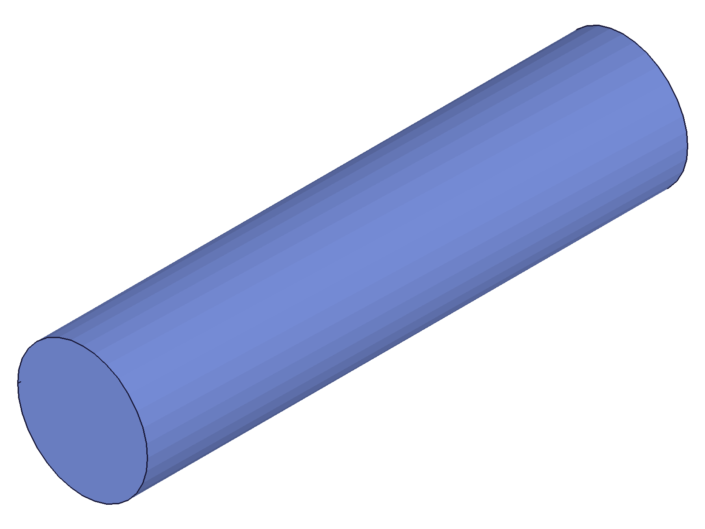 |
|---|

### 03 — block

Script: `scripts/03-block.mjs` — ✅ profile direct-constructed (4 lines + 2 CCW corner arcs,
exact tangent coords), extruded UP 35 from Top plane.
**Data:** vol 334497.87 vs analytic 334497.79 (Δ 0.000%), COG (60.2614, 40.0001, 17.4999)
vs expected (60.2596, 40, 17.5) ✓. Arc CW/CCW convention confirmed (wrong arc → volume blowup).
| 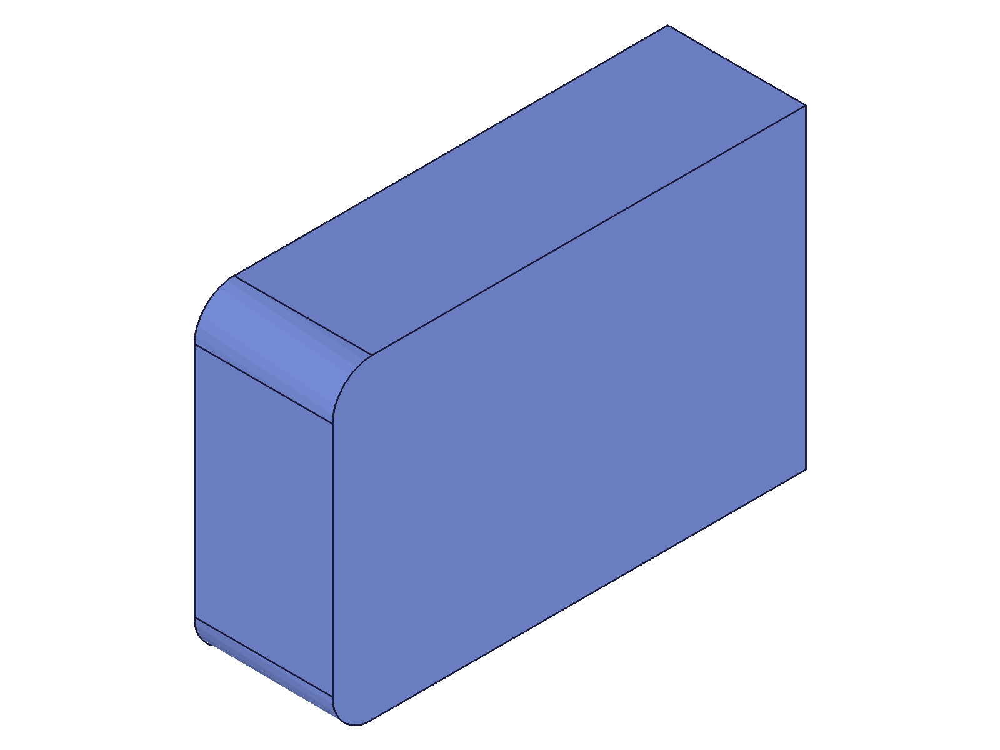 |
|---|

### 04 — boss (peanut)

Script: `scripts/04-boss.mjs` — ✅ 4 arcs (2 boss majors CCW + 2 waist fillets CW) on a
USERDEFINED workplane normal [0,0,1] offset 35; tangent points computed float-exact
(k=9/13 ratio math — arcByCenter's zero-tolerance radius check passes). Extrude UP 10, UNION.
**Data:** peanut area analytic 3099.730 vs grid-integration 3099.673 (Δ 0.002%, independent
methods). Server vol 365463.13 vs expected 365495.08 (−0.009%, within documented B-rep
tolerance for curved solids). COG (60.2393, 40.0001, 19.4069) vs expected (60.239, 40, 19.408) ✓✓
— also proves the offset workplane's local frame == world XY (no flip/offset).
Top view matches drawing plan view exactly (smooth R10 waist, no cusps).
|  | 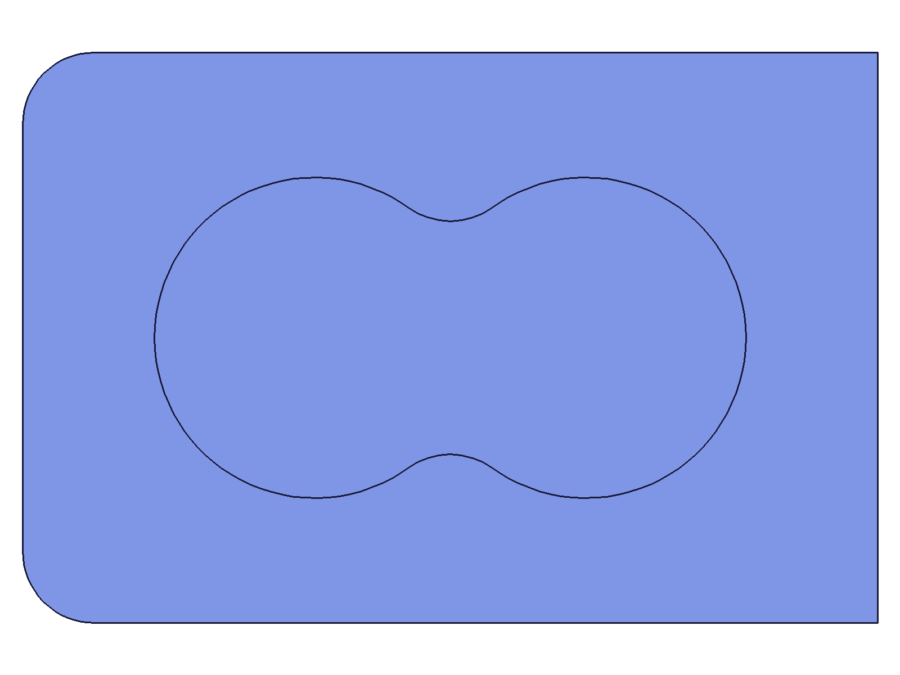 |
|---|---|

### 05 — back cutout

Script: `scripts/05-cutout.mjs` — ✅ profile = 4 lines + 2 CCW ear half-arcs on Top plane
(back face z=0), extrude UP 5, SUBTRACTION.
**Data:** vol 347211.68 vs expected 347243.76 (−0.009%), COG (60.2854, 40.0001, 20.2955) vs
expected (60.284, 40, 20.297) ✓. Back view ('bottom') confirms ears + rounded corners appear
on the SAME side — internally consistent with the drawing's back view (which shows both on
its right). Renderer note: 'bottom' view does not mirror X the way a 1st-angle back view does;
judge sides by feature-pairs, not absolute left/right.
|  | 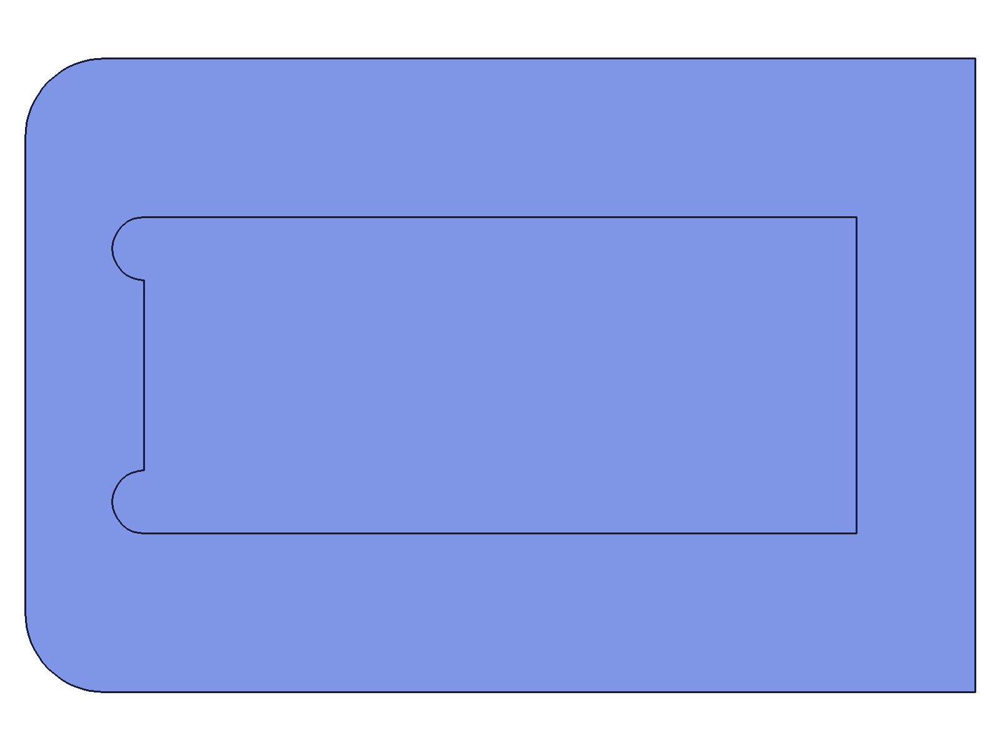 |
|---|---|

### 06 — corner holes, counterbores, side port

Script: `scripts/06-holes-port.mjs` — ✅ 6 tools in one SUBTRACTION:
Ø8 thru ×2 (overshoot both ends), Ø13.5 c'bore ×2 (floor exact z=26.5),
port pilot Ø18.63 x=102..120 and chamber bore Ø12 x=20..120 — both as cylinders on a
workCSys with `rotation: [0, π/2, 0]` (axis = csys-z = world +X; probe 02 technique).
**Data:** vol 327927.40 vs expected 327965.66 (−0.012%), COG (59.5145, 39.9992, 20.2878) vs
expected (59.509, 40, 20.289) ✓. Right view shows the two concentric port circles at
(y=40, z=20) — matches the drawing's side view exactly.
| 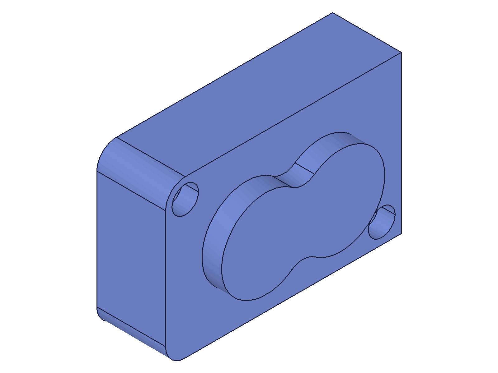 |  | 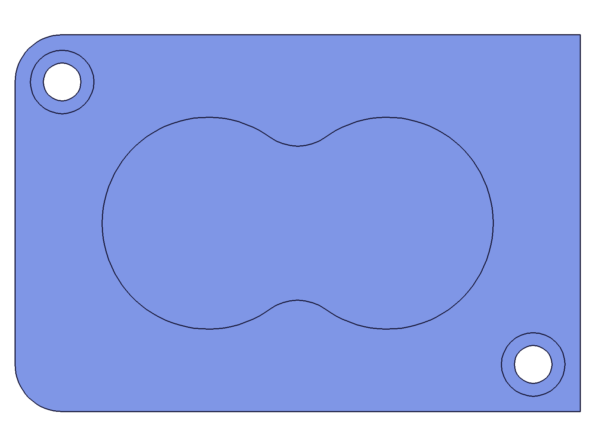 |
|---|---|---|

### 07 — hub features (shaft seats, countersinks, M4 pattern)

Script: `scripts/07-hub-features.mjs` — ✅ 10 tools in one SUBTRACTION:
Ø8.1 ↧10 ×2 (floor exact z=35), csk cones ×2 (bD=1 @ z=40.5 → tD=12 @ z=46: exact 45° flank,
crosses boss face z=45 at Ø10 — the bD≥1 floor avoids the degenerate-cone NullMem crash),
M4 pilot Ø3.3 ↧12 ×6 on Ø24 BCD at 90°/210°/330° per hub.
**Data:** vol 326305.89 vs expected 326294.49 (+0.004%), COG (59.5110, 39.9985, 20.1898) vs
expected (59.507, 40, 20.190) ✓. csk-vs-shaft overlap accounted via numeric integral of the
annular ring z=44.05..45. Top view matches drawing front view + detail A (M4 clocking: one at
12 o'clock — flagged assumption, consistent with the drawing's hole positions).
|  | 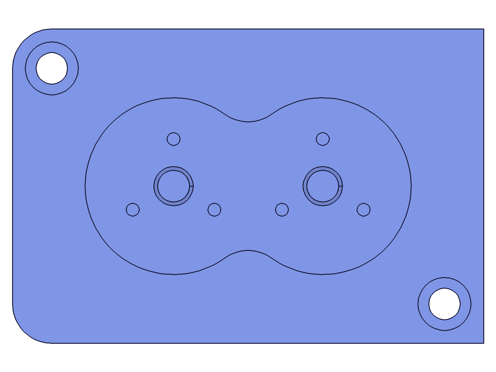 |
|---|---|

### 08 — final build + numeric spatial audit

Script: `scripts/08-final.mjs` — full part in one script, then `recalc` +
`getGeometryIds` existence probes at exact expected positions: 12 plane probes (all 6 outer
faces + cutout/bore/c'bore/pilot/shaft/M4 floors), 5 vertex probes (4 sharp right corners +
boss tangent point T1t at z=45), 3 circle probes. **17/20 — all planes and points ✓**; the
3 circle probes failed because I probed circle CENTERS.

**Learned:** `getGeometryIds` circle-by-center only works when the center lies ON a face
(solid cylinder cap). For HOLE mouths the center floats in the void → regime-2 tolerance
(<0.05) → no match. Probe rim points instead.
**📌 LLM doc:** getGeometryIds.md — hole-mouth circle-center gotcha (done, see changes.md).

| 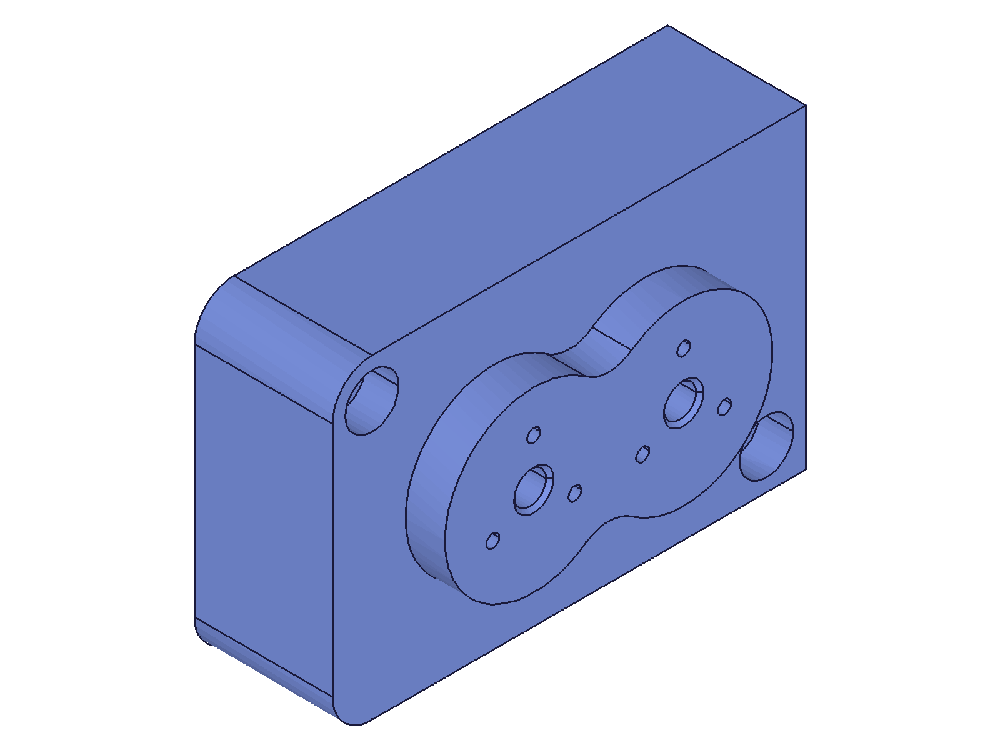       | 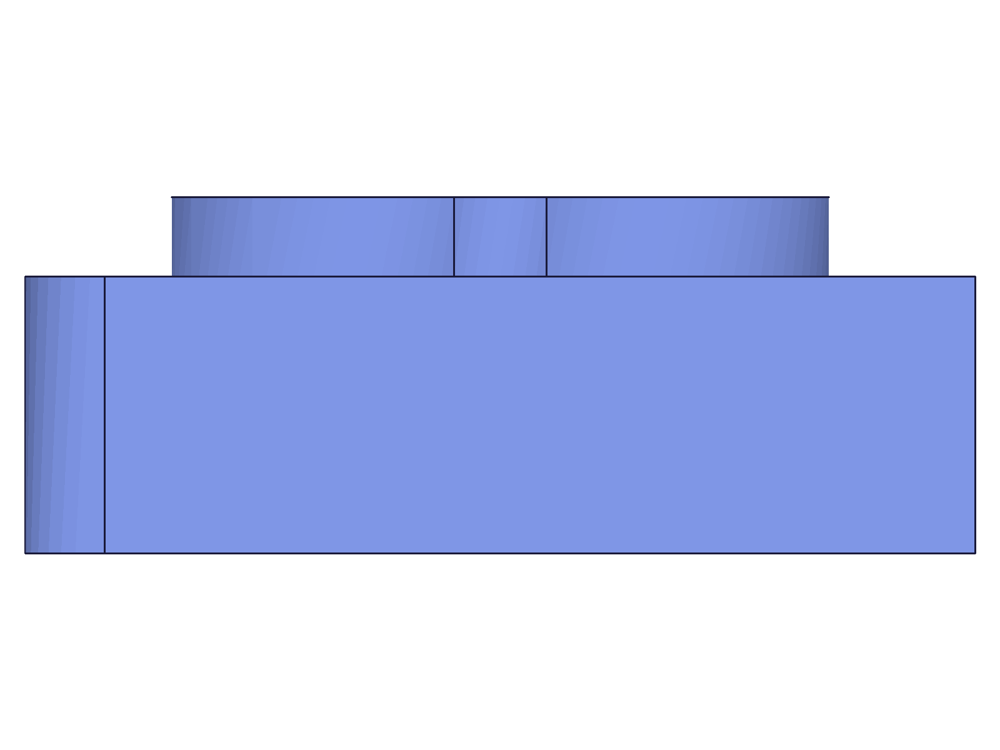 |
| --------------------------------------------------- | ------------------------------------------------- |
|  | 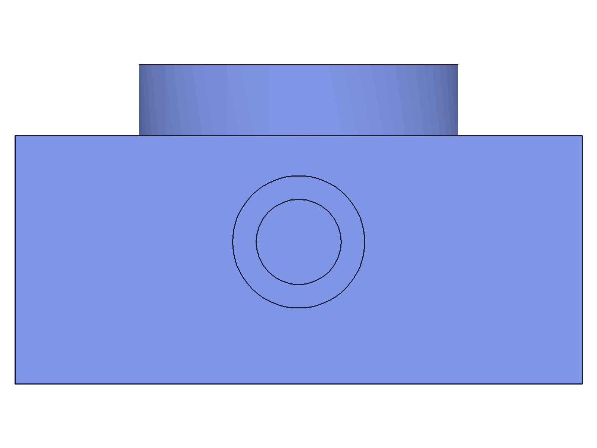 |

### 09 — circle probes, corrected (rim points)

Script: `scripts/09-circle-probes.mjs` — same build, circle probes at 90°-off-seam rim points:
port mouth Ø18.63 at (120, 49.315, 20), csk rim Ø10 at (79, 45, 45), **csk/shaft meeting
circle Ø8.1 at z=44.05** (proves the csk flank is exactly 45° and meets the Ø8.1 bore where
predicted), bore floor rim Ø12 at (20, 46, 20).
**Result: 21/21 audit PASS, maxLevel 31.** Final vol 326305.89 mm³ (analytic 326294.49,
+0.0035%), COG (59.511, 39.999, 20.190) — analytic (59.507, 40, 20.190).

## Deliverables

- **Model:** `files/08-final-08-final-iso.stp` (STEP) + `.ofb` — the finished part
- Part frame: back face z=0, front z=35, boss face z=45; x 0..120, y 0..80
- Threads NOT modeled (no native thread feature in ClassCAD): M4-6H ↧8 on the Ø3.3 pilots
  and G1/2-6H ↧18 in the Ø18.63 pilot are spec-only — noted here per drawing callouts
- Tolerances modeled nominal (Ø12 +0.3/−0.1 → 12.0)

## Skill Updates

Three doc fixes committed in `knowledge/classcad-skill` @ `a967207` (full diff in `changes.md`):

1. `part/cylinder.md` — Working Example used nonexistent workCSys params
   (`origin`/`xDirection`/`yDirection` — silently ignored!). Fixed to `offset`+`rotation`;
   added gotchas: cylinder follows csys ORIENTATION (axis = csys z), offset is world-coords.
2. `part/cone.md` — same wrong example; fixed + orientation note.
3. `part/getGeometryIds.md` — circle-center lookup works only when the center lies on a face;
   hole mouths need rim-point probes (incl. seam-direction note for rotated-csys holes).

Also fixed outside the skill: `TOOLS.md` worker paths (install tree moved to
`/Users/dev/dev/classcad/`), and the `reference_classcad_source_tree` memory.

## Completion checklist

- [x] Every snapshot-producing entry embeds its PNG (filenames verified against files/)
- [x] Every 📌 flag addressed (cylinder.md, cone.md, getGeometryIds.md — committed)
- [x] changes.md with +/− diff lines (commit a967207)
- [x] Skill changes committed inside the submodule
- [x] All dimension-checklist rows verified (see audit 21/21 + per-script mass-property gates)
- [ ] PLAN.md — N/A (user-directed build session, not a PLAN task)
- [x] workspace/TODO.md — no unresolved server/API issues; doc bugs found were fixed in-session
- [x] Worker I started (pid 87642) killed cleanly

## Follow-up (2026-06-10, same day)

ph review: the sketches in this build are exact-coordinate and UNCONSTRAINED — correct
geometry, but hardcoded (can't adapt). Two follow-up sessions:

1. `2026-06-10_01-32-58_constraint-solver-investigation/` — proved the solver actively moves
   geometry (the "constraints are metadata / value broken" claims in SKETCHING.md were false,
   rooted in planeless test sketches; fixed in skill @ 9bf4505).
2. `2026-06-10_01-50-49_constrain-liquid-mixer/` — all three sketches rebuilt constraint-driven
   from rough seeds; solver laid out every tangent point exactly. Final model verified
   EQUIVALENT to this one (vol identical, COG to 14 digits, audit 21/21), then corrected:
   the back cutout clings to the back-view LEFT edge (this run modeled it centered — wrong;
   see run-2 script 06). The interpretation/assumptions/oddities/checklist sections live in
   the run-2 journal now, updated to its frame and the corrected cutout.

The constrained build supersedes this one as the reference; this journal remains the
session record of the exploratory build (probes, scripts, evidence trail).
