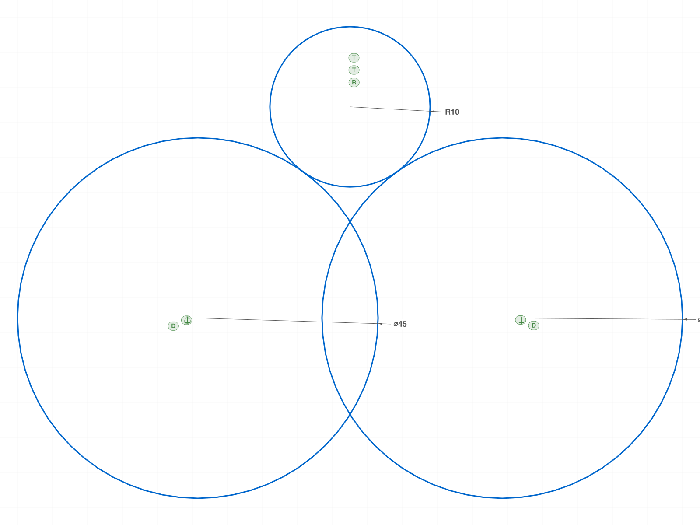

# Investigation: Does the constraint/dimension solver move geometry?

**Date:** 2026-06-10
**Trigger:** ph feedback after the liquid-mixer build — "constraints are by no means broken nor
are they metadata. they will shift geometry... constraints and dimensions create viable end
results that are conditioned, as opposed to hardcoded values that can't adapt later on."

**State of the skill (pre-investigation):**

- `references/sketch/constraint.md` + `dimension.md` + `create.md` — CORRECT per ph's claim:
  solver enforces in real time, dimensions drive geometry, all gated on `sketch.create({planeId})`.
- `SKETCHING.md` — CONTRADICTS them: "constraints are metadata only", "the solver does not run",
  "dimension `value` param is broken", "always disable gen* flags". Written from no-planeId-era
  sessions, never back-corrected. The liquid-mixer build (and my answer to ph) followed SKETCHING.md.

**Goal:** empirical certainty, then fix SKETCHING.md + any other stale refs.

## Questions to answer (one script each)

1. Control: no-planeId sketch — constraints/dimensions inert? (origin of the false belief)
2. planeId: does COINCIDENT physically snap endpoints together?
3. planeId: does `dimension` `value` at CREATION drive geometry (DIAMETER, OFFSET)?
4. planeId: do distance dimensions (HD/VD) reposition a circle against a FIXED anchor?
5. planeId: does TANGENT move geometry to tangency (circle-line, circle-circle)?
6. Showcase: can the solver lay out the mixer-boss R10 waist fillet from
   TANGENT+TANGENT+RADIUS alone (no precomputed center)? Expected center (60, 66.3676).
7. gen* flags: does auto-constraint generation (genIncidence etc.) wire a profile so dimension
   edits move CONNECTED geometry? Is the "always disable gen*" advice wrong for the
   constrained workflow?
8. Conflict/over-constraint behavior with active solver: silent? error? geometry state?
9. updateDimension re-solve: change Ø45→Ø60 on the fillet showcase — does the whole
   constrained system re-layout (the "conditioned, adapts later" property)?

## Build log

### 01 — control: no planeId (origin of the false belief)

Script: `scripts/01-control-no-planeid.mjs` — ✅ reproduces the inert behavior exactly:
- COINCIDENT: maxLevel 31 (accepted!), geometry does NOT move — l2.start stays (55,5)
- `DIAMETER value:45`: maxLevel **51**, radius stays 20 → this is the exact observation behind
  SKETCHING.md's "value param is broken"
- `updateDimension`: result **0** (unsolved), radius still 20

**Learned:** on a planeless sketch everything LOOKS accepted (constraints get IDs, maxLevel 31)
but the solver never runs. This is precisely the environment that produced the wrong
SKETCHING.md claims. The per-API docs (create.md/constraint.md/dimension.md) already
document the planeId gate correctly.

### 02 — planeId: COINCIDENT + HORIZONTAL move geometry

Script: `scripts/02-coincident-snaps.mjs` — ✅ solver ACTIVE:
- HORIZONTAL on tilted line (0,60)→(40,90): rotated to (0,60)→(50,60), dy=0.000000000,
  **length preserved at 50** — geometry physically moved.
- COINCIDENT: l2.start moved (55,5)→(55,0) — moved but NOT to the predicted (50,0).
  Suspicion: solver satisfied coincidence by STRETCHING the FIXED l1 (FIXATION locks
  position/direction, not length — known EQUAL_LENGTH caveat). I only measured l2 (my own
  measure-everything rule violated) → follow-up script 06.

### 03 — planeId: dimension `value` at creation DRIVES geometry

Script: `scripts/03-dimension-value-drives.mjs` — ✅✅ "broken value param" claim is DEAD:
- DIAMETER 45 on an r=20 circle (center fixed): radius → **22.5**, maxLevel 31
- OFFSET 100 on a len-80 line (start fixed): end → **(100,0)**
- Formula `'60+10'`: length → **70.0000**
Note: circle node gained `lgsState: 16` after solving (constraint.md says 1=solved;
16 observed here — bitmask suspicion, documented as open question).

### 04 — planeId: distance dimensions position geometry exactly

Script: `scripts/04-distance-dims-move.mjs` — ✅ HD=38 + VD=0 against a fixed anchor moved the
free circle center (90,55) → **(78,40) exactly**. This is the drawing-layout primitive
(matches the mixer hub spacing scheme).

### 05 — planeId: TANGENT physically moves to tangency

Script: `scripts/05-tangent-moves.mjs` — ✅
- circle-line: floating circle (50,50) r15 + fixed X-axis line → center lands y=**15.000**
- circle-circle: free r10 circle vs fixed r20 circle → center distance **30.000000**
  (external tangency, solver took the minimal-motion solution along the center ray)

### 06 — COINCIDENT vs FIXATION-on-line (follow-up to 02)

Script: `scripts/06-coincident-both-lines.mjs` — ✅ hypothesis confirmed, 02's "❌" was MY
measurement error (only measured one line):
- Case A (FIXATION on the line): coincidence WAS satisfied — the solver STRETCHED the fixed
  line (end 50→55). FIXATION locks position/direction, NOT length (same caveat as EQUAL_LENGTH).
- Case B (both endpoints individually fixed): l2.start snapped exactly to (50,0), l1 untouched.
**Learned:** to make a line a true datum, fix its ENDPOINTS, not the line.

### 07 — SHOWCASE: solver lays out the mixer waist fillet itself

Script: `scripts/07-fillet-by-constraints.mjs` — ✅✅✅
Fixed Ø45 bosses at (41,40)/(79,40) (FIX center points + DIAMETER 45), rough R8 circle dropped
at (58,60), then RADIUS 10 + TANGENT + TANGENT →
center solved to **(60.000000, 66.36759374687043)** — matches the hand-derived liquid-mixer
value to the LAST DIGIT (15 sig figs). Tangency distances 32.500000/32.500000.
**The solver does the tangent math** — no precomputed centers needed. ph's prescribed
workflow validated end-to-end.
|  |
|---|

### 08 — gen* flags: auto-constraints WIRE the profile

Script: `scripts/08-gen-flags-rewire.mjs` — ✅ verdict against the old blanket advice:
- gen ON: 10 Auto_* constraints (Fixation/Horizontal/Vertical/Coincident). Width dim 80→100
  re-laid-out the WHOLE rectangle — profile stayed closed (right line followed to x=100).
- gen OFF: bottom line stretched alone; right line stayed at x=80 — profile TORN.
**Learned:** "always disable gen*" (SKETCHING.md) is wrong for the constrained workflow.
Auto-incidence/H/V wiring is what makes the sketch a conditioned, editable model.

### 09 — conflicts + re-solve adaptivity

Script: `scripts/09-conflicts-and-resolve.mjs` — ✅
- HORIZONTAL then VERTICAL on one line: BOTH accepted (maxLevel 31) even with live solver;
  geometry follows the first; the losing constraint carries **lgsState: 0** (unsolved) —
  conflicts are silent but detectable per-constraint.
- updateDimension Ø45→Ø60 on the fillet system: result 1 (solved) and the fillet
  re-positioned to (60, **75.19943181359609**) = analytic √(40²−19²)+40 exactly.
  **Conditioned model adapts; hardcoded can't** — ph's core point, demonstrated.
- Observation: solved circle nodes show `lgsState: 16` (not 1) — value meaning per class
  unclear (bitmask?). Open question, logged.

## Verdict

ClassCAD's constraint/dimension solver works correctly and precisely (15-sig-fig agreement
with analytic geometry). The skill's false claims traced to ONE root cause: planeless sketches
(solver silently disabled) during early training. The per-API docs were already corrected
(create.md/constraint.md/dimension.md); **SKETCHING.md was never swept** — second occurrence
of the stale-propagation failure mode (first: 2026-04-13 box alignment).

(entries per script below)
