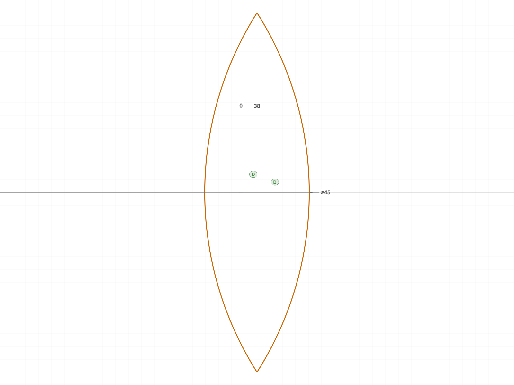
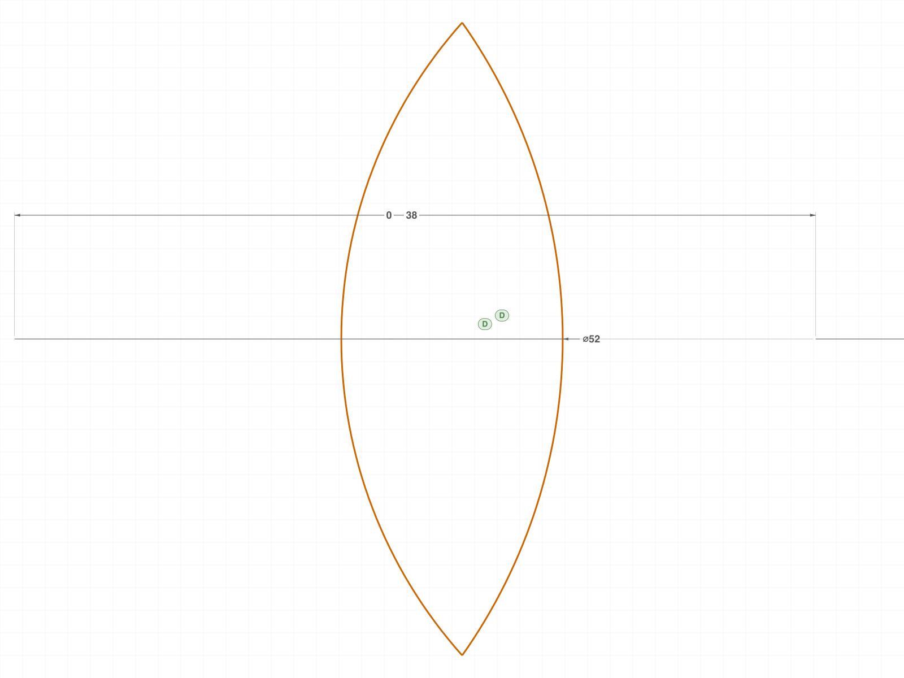
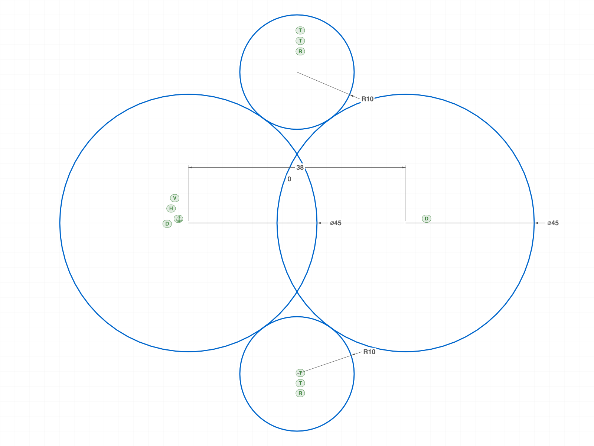
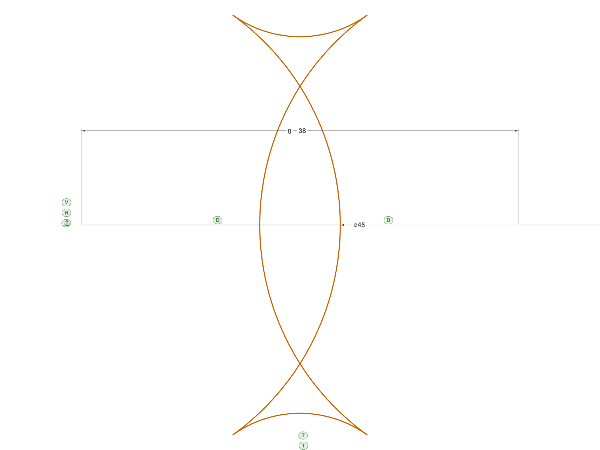
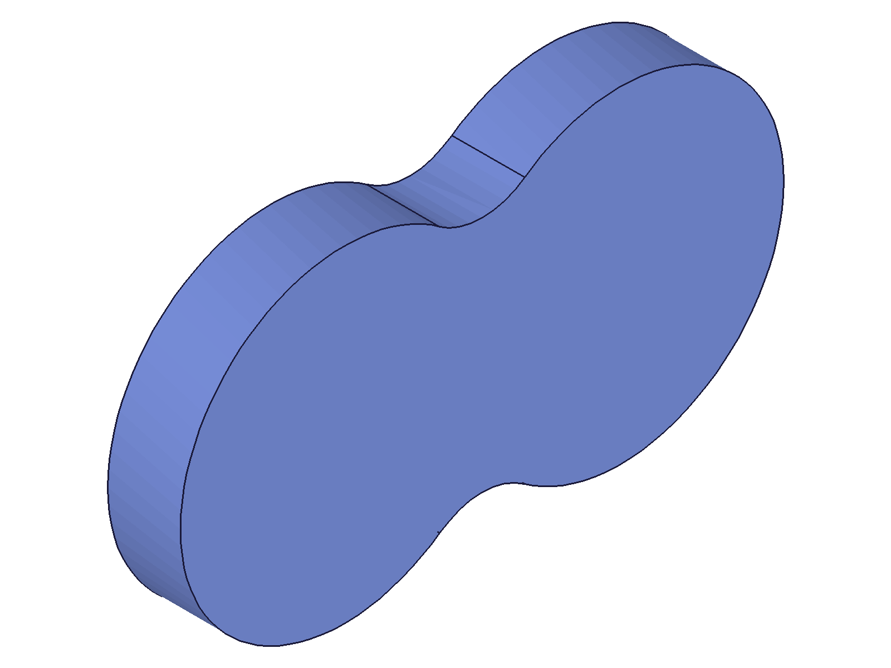
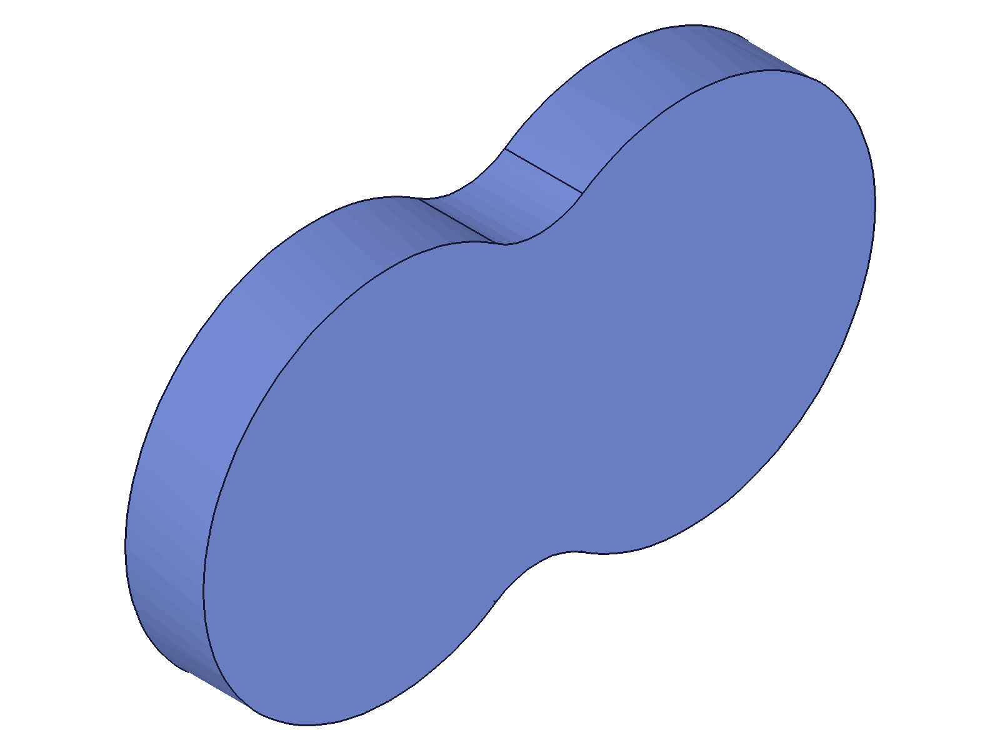

# Investigation: Trim workflow on CONSTRAINED sketches

**Date:** 2026-06-10
**Trigger:** ph — close the open question from the constrained-mixer session: "i believe that a
constrained sketch will still remain constrained if it gets trimmed. at least that is how other
CAD systems work. try it."
**Caveat going in:** the three trim docs (splitAllCurves/trimCurves/splitCurvesMergeBack.md)
were written in the planeless-solver era — their claims also get re-verified under an active
solver as a side effect.

## Hypothesis (ph)

A constrained sketch remains constrained through `splitAllCurves → trimCurves →
splitCurvesMergeBack` — like other CAD systems.

## Questions

1. Does splitAllCurves split at TANGENT touches (circle-circle, the constrained-fillet case)?
   Docs say line-tangent-circle splits the line only — circle-circle unknown.
2. During the STAGED state (after split, before mergeBack): are constraint/dimension nodes
   still in the tree? Do originals stay live?
3. Round-trip no-op (split → mergeBack, no trim) on a constrained sketch: IDs, constraints,
   solver all intact? Does updateDimension still re-solve after?
4. THE core: trim + mergeBack on constrained geometry — do constraints/dimensions survive?
   What do they reference when "their" curve got new IDs / became an arc?
5. Post-trim conditioning: does updateDimension re-solve the TRIMMED profile coherently?
6. updateDimension WHILE staged (between split and mergeBack): legal? corrupting?
7. Dimension on a circle that becomes an arc by trimming; constraint whose partner curve got
   fully trimmed away — survival/dangling behavior.
8. End-to-end discovered-topology workflow: constrained full-circle layout of the mixer boss
   → trim to peanut → extrude → re-dimension → does the whole parametric chain regenerate?

## Build log

### 01 — tangent splits + segment anatomy

Script: `scripts/01-tangent-splits.mjs` — ✅ tangent touches DO register: a tangent-only circle
enters `SplittedCurves` as ONE full-circle part (`Circle_part0`, class CC_Circle) — a doc
refinement (old doc said "circle NOT split"; it's not split but it IS staged as a part).
Line tangent → line splits in 2 ✓. Transversal control → 2 CC_Arc each ✓.
**Segment nodes carry `partOf` (original curve id) and `interval` (param range).**

### 02 — staged state preserves everything

Script: `scripts/02-staged-state.mjs` — ✅ constraint (5) and dimension (4) node counts
unchanged through splitAllCurves; originals stay queryable; solver layout intact (c2 (78,40)).

### 03/04 — mergeBack invalidates constraint/dimension HANDLES

Scripts: `scripts/03-roundtrip-constrained.mjs`, `scripts/04-roundtrip-handles.mjs` — ✅✅
03's updateDimension returned null after a no-trim roundtrip → 04 diagnosed it:
**every mergeBack recreates ALL constraint and dimension nodes with new IDs**
(dims 68/72/76/80 → 118-121; old handle → error 1006 "invalid id"). Geometry curve IDs are
preserved on no-trim roundtrip, but constraint-system handles are NOT.
**Recovery: re-fetch by NAME from the structure tree** — dimension nodes keep their names
exactly; constraint nodes get suffix-renamed (Fix→Fix0, D1→D10). With the fresh ID:
updateDimension solved=1 and moved c2 to exactly (90,40). Solver fully live post-roundtrip.

### 05 — trim core: constraints survive, Auto_Coinc wires the cut

Script: `scripts/05-trim-core.mjs` — ✅ (with an instructive classification bug, fixed in 06):
trim + mergeBack with live constraints is clean (maxLevel 31 throughout). All named
constraints/dims survive. **The system auto-creates `Auto_Coinc` constraints at the cut
points** — the trimmed profile is wired together like interactive CAD would.
updateDimension HD 38→44 on the trimmed profile: solved=1, arc endpoints re-landed at the
NEW lens crossings (62, 40±4.717) exactly.
Bug found en route: the `interval` member is a **0..1 FRACTION of the full circle** (segment
widths sum to 1.0), not radians — and its phase is not world-aligned.

### 06 — robust classifier + asymmetric re-dimension

Script: `scripts/06-classifier-and-redim.mjs` — ✅ tolerance-free direction test (compare the
CCW world-span fraction of (start,end) against interval width w; pick the closer direction).
Both lens arcs trimmed → 2 arcs + 2 Auto_Coinc. Then **D1 Ø45→Ø52 on the TRIMMED arc:
solved=1, both joints re-solved to (61.234, 40±15.005)** — the analytic crossings for
r1=26/r2=22.5/d=38, to 3 decimals. DIAMETER dims keep driving curves that became arcs.
|  |  |
|---|---|

### 07 — edge cases: dangling partner + staged updates

Script: `scripts/07-dangling-and-staged.mjs` — ✅ both clean:
- Fully-trimmed-away partner: the TANGENT constraint is **removed together with its curve**
  (no dangling node, no error); sketch keeps solving afterwards (new tangent → y=10 ✓).
- updateDimension WHILE staged (between split and mergeBack): legal, solves (c2 → x=84),
  mergeBack after is clean — **but voids the no-trim ID-preservation guarantee** (circles
  came back with new IDs). Observed lgsState=9 on FIXATION constraints in sketch A (new
  value; bitmask semantics still unconfirmed — open).

### 08 — SHOWCASE: discovered-topology peanut, fully parametric through trim

Script: `scripts/08-peanut-endtoend.mjs` — ✅✅✅ the complete prescribed workflow:
4 constrained full circles (rough seeds; FIX hub1, Ø45×2, HD38/VD0, R10×2, TANGENT×4) →
12 segments → **boundary classifier** (probe each segment midpoint ±ε radially: boundary iff
material on exactly one side — midpoint-inside-other-shape is NOT sufficient: boss segments
between tangent and crossing points are interior to the fillet PATCH while outside every
disc) → trim 8 → mergeBack → 4 arcs, **all 4 named TANGENTs survive (lgs1) + 4 Auto_Coinc**
→ extrude: vol 30993.05 vs analytic 30997.30 (−0.014%) →
**re-dimension Ø45→Ø48 both bosses + recalc: the entire chain regenerates** — sketch
re-solves (tangencies + auto-coincidences hold), extrusion rebuilds:
vol 34455.80 vs analytic 34455.00 (+0.002%).
Note: mergeBack **coalesces contiguous kept segments** of one circle into a single arc
(first run kept 8 segments → still 4 arcs — the union outline self-overlapped and the
extrusion produced no solid; also reproduced the documented empty-part mass-props crash).
|  |  |
|---|---|
|  |  |
|---|---|

## Verdict

**ph's hypothesis confirmed in full: a constrained sketch remains constrained through trim —
and remains CONDITIONED.** Constraints and dimensions survive (recreated under new IDs),
the system auto-wires cut points with Auto_Coinc, dimensions keep driving geometry that
changed class (circle→arc), and a trimmed-then-extruded model regenerates end-to-end on
re-dimension. The practical rules: re-fetch constraint/dimension handles by NAME after every
mergeBack; classify segments by the boundary (±ε) test, not midpoint-inside-shape; expect
contiguous kept segments to coalesce.

(doc updates listed in changes.md)
