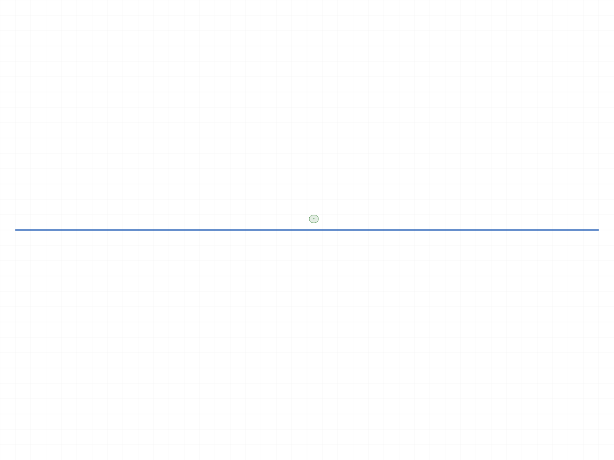
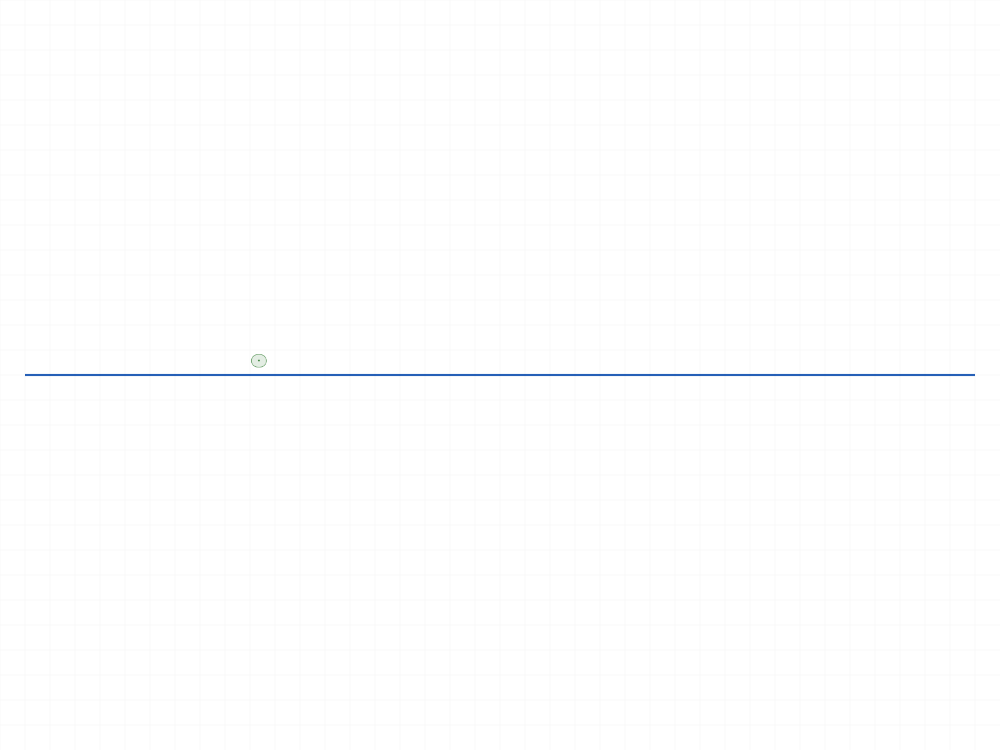
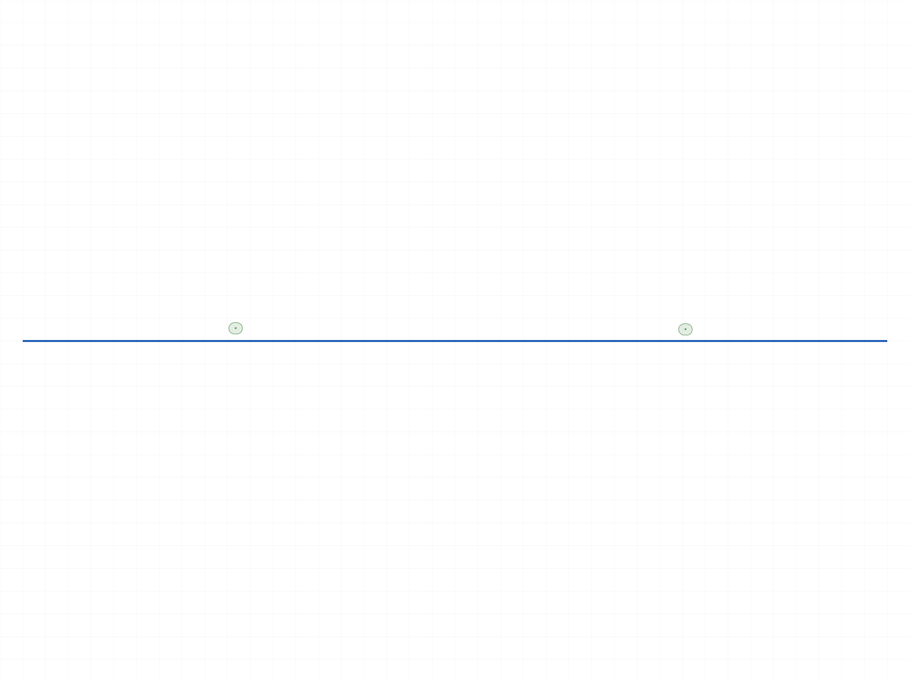
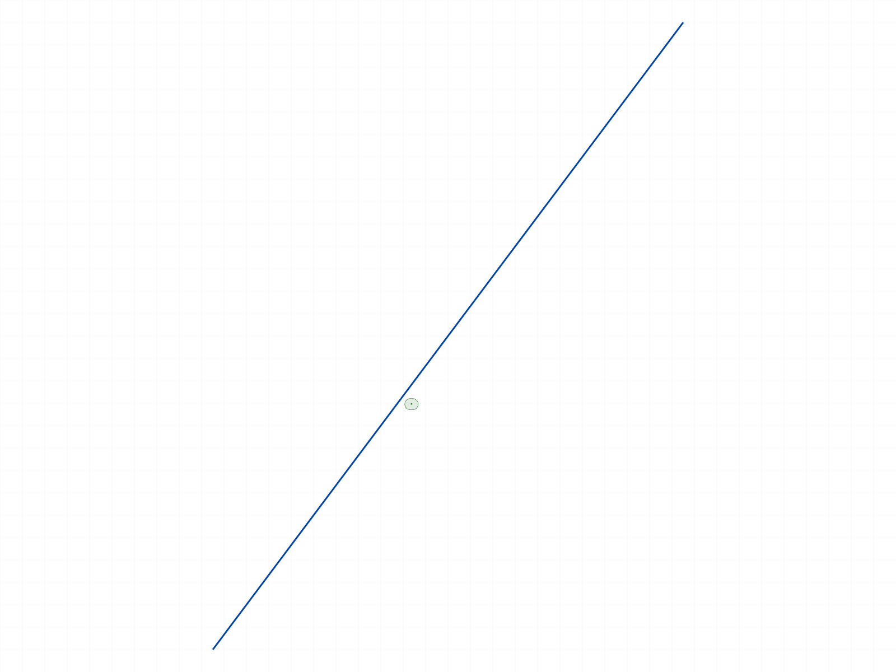
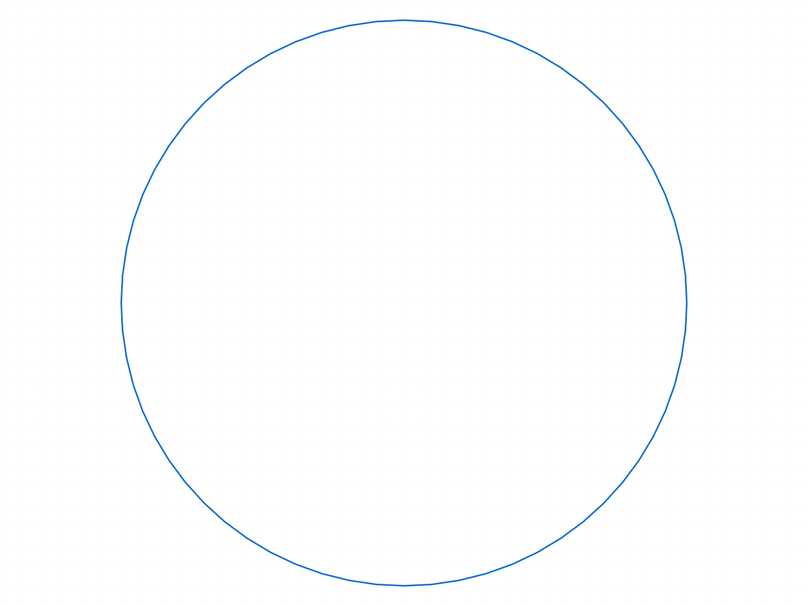
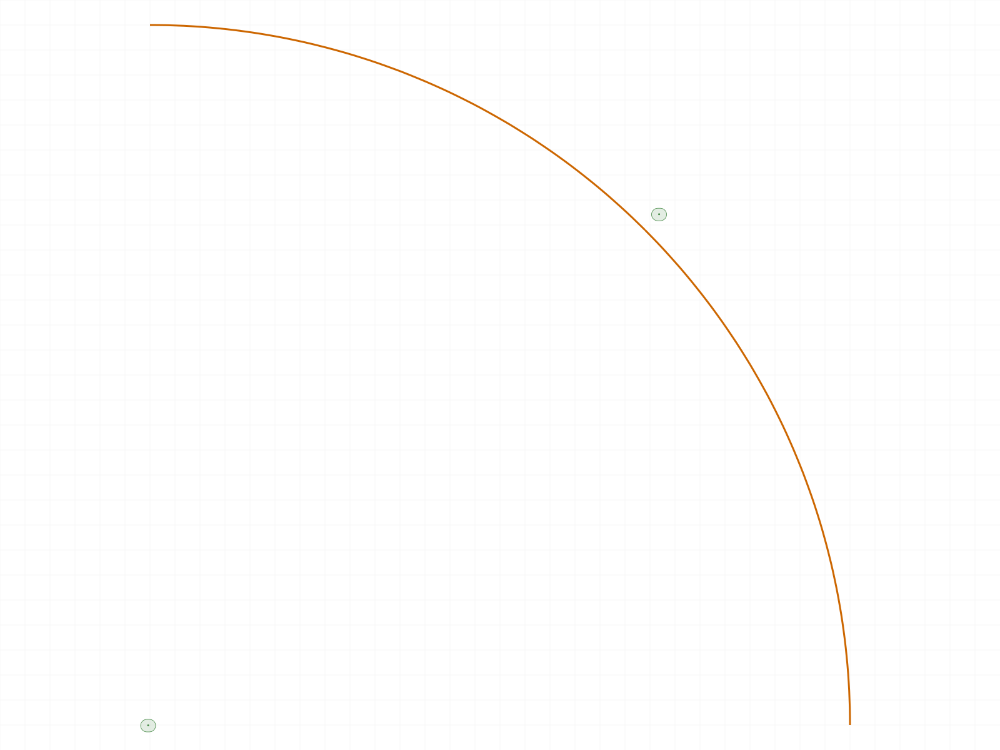

# Training: sketch.splitCurve (retrain — Category 4.10 #1)

**Date:** 2026-06-30
**Task:** PLAN.md Step 4, Category 4.10, Task #1 — `Api study of sketch.splitCurve`
**Source material:** `source/sketch-split-trim-guide.md` (provided by ph), upstream `references/api/sketch.md`
**Test matrix:** `test-matrix.json` (generated from the source material via a fan-out/synthesis workflow)

## Environment notes

- Worker was DOWN at session start; started on 9094 by cc (per ph's instruction). Binary freshly built today (Jun 30 09:57).
- `@classcad/api-js` was **21.0.0** (stale — lacked `splitCurve`/`preTrim`/`trim`/`postTrim`). Upgraded to **21.2.0** (tarball at awvstatic.com) per ph, so the typed wrapper exposes the new methods natively. No `batch` workaround needed.

## Goal

Verify, by live measurement, every behavioral claim the guide and API doc make about `sketch.splitCurve` — the
new structured-result splitter (`Array<{sourceId, splittedCurves:[{id, interval}]}>`) that replaces the
deprecated flat-array `splitCurves`. Establish with NUMERIC proof (getPositions/getPoints coordinates, never
snapshots alone): (1) values are normalized [0,1] fractions mapping linearly along the curve; (2) N values →
N+1 segments on OPEN curves; (3) intervals are true contiguous [0,1] fractions covering the whole source and
cross-checking against measured world coordinates; (4) the original curve id is replaced/invalidated;
(5) splitCurve is standalone (no preTrim staging, no postTrim merge-back). Resolve two documented contradictions
with the deprecated sibling — circle parameter domain (0..1 vs 0..2π, and where t=0 sits) and closed-curve
segment count (N vs N+1) — and pin down how the structured API signals errors/no-ops. Audit weaker guide claims
(undoability, construction-line/rigidSet trimmability) and flag doc discrepancies.

## Questions to answer

1. Return shape exactly `Array<{sourceId, splittedCurves:[{id, interval}]}>`, no leaked keys, interval a 2-number array?
2. `result.length === splits.length`, `result[i].sourceId === splits[i].geomId`, order-preserving?
3. OPEN curve: N values → exactly N+1 segments?
4. Values normalized [0,1] mapping linearly (0.25 on 0..100 line → x=25; 0.4 on skew line → chord lerp)?
5. Intervals contiguous [0,1]: first t0=0, last t1=1, seg.t1==next.t0, widths sum to 1, cross-check coords?
6. Original geomId replaced/invalidated (absent from getGeometry, getPositions errors)?
7. Returned segment ids new, distinct, real, queryable?
8. CIRCLE: where is t=0 (seam)? Discover numerically.
9. CIRCLE: one value → how many segments (1 / 2 / error)? Does N+1 break for closed?
10. CIRCLE: values [0,1] fractions or 0..2π?
11. CIRCLE: how is the wrap-around interval encoded?
12. Failure signalling: VOID / structured-empty / error code? Does result.length stay == splits.length on bad geomId?
13. Boundary values [0], [1], [0,1] — no-op / degenerate zero-length / error?
14. Duplicate / near-duplicate / unsorted values — dedup / degenerate / sort / input-order?
15. Out-of-range values [-0.2], [1.5], mixed — clamp / extrapolate / error / drop / atomic-fail?
16. Missing required params — error codes (1004/1006 family)? Wrong-type ids?
17. Standalone — no SplittedCurves/NoneSplitted staging; postTrim after split no-op/error?
18. Construction line / rigidSet member splittable (trim refuses)? Dangling ref?
19. Constraints/dimensions survive the split? Solver still live?
20. Undo path — general undo API? merge-back as real reverse? Guide's "standard undo mechanism" backed?
21. Solver independence — works identically on a planeless (dead-solver) sketch?

---

## 00 — smoke / environment validation + canonical case

Script: `scripts/00-smoke.mjs` — ✅ Validates the full path after the 21.2.0 upgrade, and already nails the
canonical spatial claim.

**Data** (`files/00-smoke-splitCurve-response.json`, `files/00-smoke-segment-positions.json`):
- `splitCurve` line(0,0,0)→(100,0,0) at `values:[0.25]` → maxLevel **31** (success).
- result = `[{sourceId:58, splittedCurves:[{id:66, interval:[0,0.25]}, {id:70, interval:[0.25,1]}]}]` — exact documented shape.
- seg 66: interval [0,0.25], (0,0,0)→**(25,0,0)**; seg 70: interval [0.25,1], **(25,0,0)**→(100,0,0). Cut vertex **exactly (25,0,0)**.
- Original line id 58: `getPositions` → maxLevel **51** (invalid), result null → **original id is destroyed**.
- `getGeometry` after → `{lines:[66,70], ...}` — original absent, 2 new ids present.

**Learned (preliminary, to be reinforced by dedicated scripts):** value 0.25 = linear normalized fraction with
param0 at startPos; N=1 → 2 segments; original id replaced; intervals match measured coords.

|  |
|---|

---

## 01 — basic line split at 0.5

Script: `scripts/01-basic-line-split-half.mjs` — ✅ PASS. Exact documented shape, no leaked keys.
result = `[{sourceId:58, splittedCurves:[{id,interval:[0,0.5]},{id,interval:[0.5,1]}]}]`. Entry keys exactly `['sourceId','splittedCurves']`; seg keys exactly `['id','interval']`; no `partOf` leak; interval is a 2-number array.

|  |
|---|

## 02 — canonical 0.25 spatial proof

Script: `scripts/02-canonical-line-025-spatial.mjs` — ✅ PASS. Line (0,0,0)→(100,0,0) split at 0.25.
Three cross-checks all hold: cut vertex == `[25,0,0]` analytic == `lerp(start,end,0.25)` == `interval.t1*100`. Shared vertex segA.endPos==segB.startPos. Endpoints preserved (0,0,0)/(100,0,0). Intervals `[0,0.25]`,`[0.25,1]` contiguous.
**📌 LLM doc:** values are linear normalized [0,1] fractions; param0 = startPos.

|  |
|---|

## 03 — N values → N+1 segments (open line)

Script: `scripts/03-multi-value-N-plus-1.mjs` — ✅ PASS. `values:[0.25,0.75]` → 3 segments, intervals exactly `[0,0.25],[0.25,0.75],[0.75,1]`, widths sum to 1, chained, shared vertices measured at `[25,0,0]` and `[75,0,0]`. Middle segment spans 25→75.
**📌 LLM doc:** N values → N+1 segments on OPEN curves; contiguous intervals cover [0,1].

|  |
|---|

## 04 — skew line disambiguator

Script: `scripts/04-skew-line-disambiguator.mjs` — ✅ PASS. Line `[10,20,0]→[40,60,0]` (len 50) split at 0.4 → cut at `[22,36,0]` = `A+0.4*(B-A)`. segA length 20 (=0.4·50), segB 30. **param0 == startPos confirmed** (not endPos). Normalization is a true 2D chord lerp, not axis-aligned coincidence.

|  |
|---|

## 05 — multi-curve ordering

Script: `scripts/05-result-ordering-multi-curve.mjs` — ✅ PASS. `result.length === splits.length`; `result[i].sourceId === splits[i].geomId`; **order tracks input order**, not internal id order (call B with swapped input `[V(2 vals), H(1 val)]` returns entries in that same order). Per-entry segment counts match each curve's value count (+1).

> **NOTE:** the original "call B fails" observation was a *harness artifact*, not a splitCurve behavior — see 05c below. Once both calls run on a single part, B passes.

## 05b/05c/05d — HARNESS CONSTRAINT: one `part.create` per run (diagnostics)

Scripts: `05b-order-diagnostic.mjs`, `05c-state-diagnostic.mjs`, `05d-viable-regimes.mjs`.

Chasing the 05 "call B" failure (`code 1001 "Set the parameter id = VOID is not allowed"`) revealed it had **nothing to do with split order**. 05c is decisive: the **first `part.create` in a run returns partId=4; every subsequent `part.create` returns `null` (VOID)** and poisons the drawing — so the 2nd sketch.create got `id=VOID`. 05d confirms the safe regimes:
- **Regime C** (one part → many sketches): all split OK.
- **Regime D** (one part → one sketch → many independent lines): all split OK.

**Learned:** test scripts must call `part.create` exactly once per harness run; build extra geometry as additional sketches/lines on that part. The helper `_setup.mjs` now enforces this (`makeSketch` once + `addSketch`/`addPlanelessSketch`/`line`).
**📌 TODO (cross-domain, not splitCurve):** `part.create` is once-per-drawing — 2nd call returns VOID silently. Belongs in `part/create.md` / TODO.

## 06 — original id replaced/invalidated

Script: `scripts/06-original-id-replaced.mjs` — ✅ PASS. getGeometry before `{lines:[58]}` → after `{lines:[66,70]}`: original absent, net +1 line, both segment ids present and distinct. `getPositions(58)` → maxLevel 51 (invalid). No segment id equals the original.
**📌 LLM doc:** the source curve id is **destroyed**; always read `splittedCurves[].id`, never the original.

## 07 — empty values:[] (FULL)

Script: `scripts/07-empty-values-noop.mjs` — `values:[]` → maxLevel 31, **one segment with interval `[0,1]`** (preTrim-style no-op, NOT the splitCurves VOID style). BUT the line id still changes **58→66** — even a no-op rebuilds the curve with a fresh id.
**📌 LLM doc:** empty values = single `[0,1]` "no-op" that still re-issues the curve id.

## 08 — empty splits:[] 

Script: `scripts/08-empty-splits-array.mjs` — ✅ PASS. `splits:[]` → `result:[]`, maxLevel 31, geometry unchanged. Clean empty no-op.

## 09 — boundary values [0]/[1]/[0,1] (FULL — silent degenerate)

Script: `scripts/09-boundary-values.mjs` — all maxLevel 31 (silent), all produce **zero-length degenerate segments**:
- `[0]` → 2 segs `[[0,0],[0,1]]` — degenerate `[0,0]` (start==end).
- `[1]` → 2 segs `[[0,1],[1,1]]` — degenerate `[1,1]`.
- `[0,1]` → 3 segs `[[0,0],[0,1],[1,1]]` — **two** degenerate segments.

**📌 LLM doc + TODO:** splitting at an endpoint (0 or 1) silently creates a zero-length curve. No warning.

## 10 — duplicate / near-duplicate (FULL — silent sliver)

Script: `scripts/10-duplicate-and-near-duplicate.mjs` — no dedup. `[0.5,0.5]` → 3 segs `[[0,0.5],[0.5,0.5],[0.5,1]]` — zero-length sliver `[0.5,0.5]` (start==end). `[0.5,0.5+1e-10]` → 3 segs with a 1e-10-wide sliver. maxLevel 31 (silent).
**📌 LLM doc + TODO:** duplicate/near-duplicate values silently yield zero-length/sliver segments. Caller must dedup.

## 11 — unsorted values [0.75,0.25] (FULL — SILENT GEOMETRY CORRUPTION) ⚠️

Script: `scripts/11-unsorted-values.mjs` — maxLevel 31 (silent), intervals returned in **input order** `[[0,0.75],[0.75,0.25],[0.25,1]]` (non-monotonic). Measured segment endpoints: `0→75→125→200`. The 100-long line became **200 long** — splitCurve applies values **sequentially without sorting**, so each cut re-parameterizes the remainder and unsorted input **extrapolates / corrupts** the geometry.
**📌 LLM doc + TODO (HIGH):** **values MUST be pre-sorted ascending.** Unsorted → silent geometry corruption, no error.

## 12 — out-of-range values (FULL — SILENT EXTRAPOLATION) ⚠️

Script: `scripts/12-out-of-range-values.mjs` — all maxLevel 31 (silent). No clamp, no validation:
- `[1.5]` → cut at x=150 (interval `[0,1.5]`), far end x=200 — **extrapolated beyond the 0..100 source**.
- `[-0.2]` → vertices outside source.
- `[0.5,1.5]` → 50, then 150, 200.

**📌 LLM doc + TODO (HIGH):** out-of-range values (`<0` or `>1`) silently extrapolate the curve beyond its endpoints. splitCurve trusts the caller completely.

## 13 — missing required params

Script: `scripts/13-missing-required-params.mjs` — clean enforcement, all maxLevel 51 `code 1004 "The parameter X must be provided"`: `id`, `splits`, nested `values`, nested `geomId`.

## 14 — bad/wrong-class geomId (FULL)

Script: `scripts/14-bad-geomid-targets.mjs` —
- bogus `999999` → maxLevel 51, `code 1006` invalid id (+ warning 41). Whole call errors (NOT an array).
- part id / sketch id / point id → maxLevel 51, `code 1001` "wrong id type! Provide only: ['sketch-curve']".
- **foreign-sketch curve** (geomId 72 belongs to sketch sk2, but `id`=sketch 52) → **maxLevel 31, SUCCESS, 2 segments.** splitCurve resolves `geomId` **globally** and does NOT enforce that it belongs to the `id` sketch.

**📌 LLM doc:** on any bad geomId the WHOLE call atomic-fails (result is not an array) → the doc's "result.length == splits.length" holds only on success. The `id` (sketch) param is not enforced against geomId — a foreign-sketch curve splits.
**📌 TODO:** `id`/`geomId` scope not validated (foreign-sketch curve splits silently).

## 15 — circle, single value (FULL — rejected)

Script: `scripts/15-circle-single-value-count-and-seam.mjs` — `circle r50` split at `[0.25]` → **maxLevel 51, error "Circle shouldn't be split at a single point!"**, geometry unchanged. A closed curve cannot be split at one point; **N+1 does not apply to circles.**

|  |
|---|

## 16 — circle, two values (FULL — domain + seam + wrap)

Script: `scripts/16-circle-two-values-domain-and-wrap.mjs` — `[0.25,0.75]` → **2 arcs (N, not N+1)**, maxLevel 31. Measured angles:
- value 0.25 → 90°, value 0.75 → 270° (= value·360° from +X, CCW). **Values are [0,1] angular fractions, NOT 0..2π.** Seam (t=0) at **+X**.
- intervals `[[0.25,0.75],[0.75,1.25]]` — the **wrap-around arc is encoded `[0.75,1.25]`** (exceeds 1.0). Both arcs r=50.

**📌 LLM doc:** circle → values are [0,1] turn-fractions from +X CCW; needs ≥2 values; N values → N arcs; wrap interval encoded past 1.0.

## 17 — open arc

Script: `scripts/17-arc-open-N-plus-1.mjs` — ✅ PASS. Quarter arc r50 (+X→+Y) split at 0.5 → 2 sub-arcs, intervals `[0,0.5],[0.5,1]`, cut at `[35.355,35.355,0]` (45° midpoint), radius & endpoints preserved. Open arc: N+1 holds, parameter = fraction from the arc's own start.

|  |
|---|

## 18 — standalone, no staging

Script: `scripts/18-standalone-no-staging.mjs` — splitCurve commits immediately: segments live in getGeometry (`[66,70]`), no `SplittedCurves`/`NoneSplitted` containers. `postTrim` after a bare split → maxLevel 31 (harmless no-op).
*Caveat:* my tree scan for preTrim's staging containers found none (class-name regex likely doesn't match the real container class) — that's a preTrim detail to confirm in task 4.10 #2; the splitCurve conclusion (no staging) stands on the immediate-liveness + postTrim-no-op evidence.
**📌 LLM doc:** splitCurve is standalone — no preTrim/postTrim needed; postTrim after it is a no-op.

## 19 — flat vs structured contrast

Script: `scripts/19-flat-vs-structured-contrast.mjs` — ✅ PASS. Same line+values:
- `splitCurve` → `[{sourceId:58, splittedCurves:[{id:72,interval:[0,0.25]},{id:76,interval:[0.25,0.75]},{id:80,interval:[0.75,1]}]}]`
- `splitCurves` (deprecated) → `[[92,96,100]]` (flat id array, no sourceId/interval).
Both cut at the same world x. Teaching artifact for the rename.

## 20 — construction line & rigidSet (FULL)

Script: `scripts/20-construction-line-and-rigidset.mjs` —
- **Construction line** (`isConstruction:true`) → **splits fine** (maxLevel 31, 2 segments). The trim workflow refuses construction geometry; splitCurve does not.
- **rigidSet member** → **rejected**, maxLevel 51, `"Curve shouldn't be a part of rigidset!"`. rigidSet node entities `[79,85]` stay intact (no dangling — prevented).

**📌 LLM doc:** splitCurve splits construction lines; refuses rigidSet members (explicit error, no dangling).

## 21 / 21b — constraint & dimension survival + solver live (FULL)

Scripts: `scripts/21-constraint-dimension-survival.mjs`, `scripts/21b-solver-live-after-split.mjs`.
Setup: line + `FIXATION` on start point + `HORIZONTAL_DISTANCE` dim `LEN`=100. After split at 0.5 (structure dump `files/21-...-survival.json`):
- HORIZONTAL constraint **duplicated** per segment (`Auto_H`/`Auto_H0`); FIXATION preserved on the original start point.
- The dimension **survives**, value 100 intact, **remapped to span original endpoints (73→78)**, **renamed `LEN`→`LEN_Split`** (a `_Split` suffix; cf. postTrim's `Fix0`).
- A new **auto-coincidence `Split_Coinc` (CC_2DCoincidentConstraint)** is added at the cut vertex (joins seg ends 74↔77).
- **21b:** `updateDimension` on the surviving dim (id 86) → far endpoint **100→60** ⇒ **solver is LIVE after the split**; the dimension still drives the now-split geometry. (result code `2`, not `1` — both = solved; minor.)

**📌 LLM doc:** constraints/dimensions survive a split (remapped, `_Split`-renamed, auto-coincidence at the cut); sketch stays solver-live. Re-fetch handles by name after splitting.

## 22 — undo path (FULL — doc discrepancy)

Script: `scripts/22-undo-path-probe.mjs` — `v1.common.undo` / `v1.sketch.undo` probed via batch → both `null` (no endpoint; wrapper has neither, only `undoFillet`). After a bare split, **neither `postTrim` nor `splitCurvesMergeBack` restores** the original curve (lines stay `[66,70]`). splitCurve has **no reverse**.
**📌 LLM doc + TODO:** the source guide's "Reversible? Yes" / "Undoable via the standard undo mechanism" is **UNBACKED** — no undo API; merge-back functions do not reverse splitCurve.

## 23 — solver independence (planeless)

Script: `scripts/23-planeless-solver-independence.mjs` — ✅ splitCurve on a **planeless** (dead-solver) sketch cuts identically at `[50,0,0]`, maxLevel 31, same as the planeId twin. **splitCurve is solver-independent — a pure topological/geometry op** (unlike dimensions, which silently no-op on planeless sketches).

---

## Coverage checklist (Step 4A)

- [x] Called successfully (01, 02)
- [x] Every required param tested (id/splits/geomId/values — 13)
- [x] Key behaviors: N+1 (03,17), normalization (02,04), ordering (05), id replacement (06)
- [x] Enum/variant: line, skew line, circle (15,16), arc (17), construction line (20)
- [x] No dedicated `update*`; reverse path probed (22 — none exists)
- [x] Realistic usage: multi-curve (05), constraint/dimension interaction (21/21b)
- [x] Behavioral claims backed by numeric data AND (where useful) snapshots
- [x] Every Goal question answered by a named script
- [x] Spatial claims backed by getPositions coords (02,03,04,16,17,23)

## Synthesis — splitCurve behavior (verified)

1. **Shape:** `Array<{sourceId, splittedCurves:[{id, interval}]}>`, one entry per input curve, order = input order, no leaked keys.
2. **Values:** normalized **[0,1]** fractions, **param0 = startPos**, true chord-lerp. Open curve: **N → N+1** segments, contiguous intervals covering [0,1].
3. **Original id destroyed**; segments get new ids; intervals match measured coords exactly.
4. **No validation / silent hazards:** out-of-range extrapolates (12); unsorted corrupts via sequential reparam (11); boundary (09) & duplicate (10) values make zero-length segments. All maxLevel 31. **Caller must pass in-range, sorted, de-duplicated values.**
5. **Errors (maxLevel 51, atomic-fail, result not an array):** missing params `1004`; bad id `1006`; wrong id class `1001` (expects `sketch-curve`); circle single value "shouldn't be split at a single point"; rigidSet member "shouldn't be a part of rigidset".
6. **Circle:** values are [0,1] turn-fractions from +X CCW; needs ≥2 values; N values → **N arcs**; wrap interval encoded past 1.0 (`[0.75,1.25]`).
7. **Standalone** (no preTrim/postTrim staging; postTrim after is a no-op). **No undo/reverse** (guide claim unbacked).
8. **Constraints/dimensions survive** (duplicated/remapped, `_Split` rename, auto-coincidence at cut); sketch stays **solver-live**. splitCurve itself is **solver-independent**.
9. `geomId` resolved globally — a foreign-sketch curve splits even when `id` is a different sketch.
