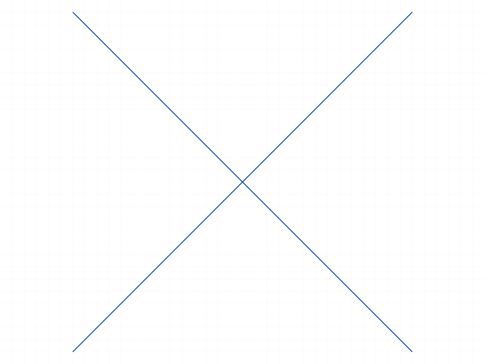

# Training: sketch.preTrim (retrain — Category 4.10 #2)

**Date:** 2026-06-30
**Task:** PLAN.md Step 4, Category 4.10, Task #2 — `Api study of sketch.preTrim`
**Source material:** `source/sketch-split-trim-guide.md`, upstream `references/api/sketch.md`, and `references/sketch/splitCurve.md` (shared split engine — cited, not re-proven)
**Test matrix:** `test-matrix.json` (fan-out/synthesis workflow). NOTE: the mining agents also ran exploratory probes (quarantined in `_explore/`); all findings below are from my own clean canonical runs (00 + 01–17), not the agents'.

## Environment

- Worker already up on 9094 (from the splitCurve session). `@classcad/api-js` 21.2.0 (has preTrim/trim/postTrim natively).
- Helper `_setup.mjs` reused from splitCurve, extended with `circle`, `containers` (find CC_Container staging nodes by NAME), `centerPos` (circle center via getPoints→centerId).

## Goal

Produce the canonical, numerically-proven LLM reference for `sketch.preTrim` (STEP 1 of preTrim→trim→postTrim).
Document what is preTrim-SPECIFIC vs inherited from the shared split engine (`splitCurve.md`): auto-computed
mutual-intersection split points landing exactly on analytic coords; the STAGING model
(`SplittedCurves`/`NoneSplitted`, original ids PRESERVED — opposite of splitCurve); curveIds subset/empty
semantics; the full preTrim→trim→postTrim round-trip (id behaviour, Auto_Coinc, coalescing); edge/degenerate
(no-intersection `[0,1]`, empty `[]`, overlaps, construction/rigidSet passthrough); error/identity codes.

## Key questions answered (see entries)

Intersection finding (exact?), open vs closed segment counts, circle interval encoding, staging containers,
getGeometry mid-workflow, id preservation/reuse, curveIds subset + empty-array trap, round-trip id semantics,
postTrim constraints/coalesce, trim footguns, endpoint-vs-crossing, overlaps, construction/rigidSet, preTrim-twice,
error codes, solver independence.

---

## 00 — smoke: shape, staging, intersection, id preservation

Script: `scripts/00-smoke.mjs` — two diagonals crossing at (50,50,0).
- preTrim maxLevel 31; structured result identical shape to splitCurve, one entry per curve, sourceIds [58,64].
- Each line → 2 segs at interval ~0.5; **cut vertex measured (50,50,0)** (the analytic crossing).
- **Staging containers:** `SplittedCurves` (CC_Container, 4 children) + `NoneSplitted` (CC_Container) — found by **name** (class is generic `CC_Container`; this is why the splitCurve script-18 class-scan missed them — and confirms splitCurve genuinely has no staging).
- **`getGeometry` mid-workflow still returns the ORIGINAL ids [58,64]** (staged segs invisible); `getPositions(58)` still maxLevel 31 (alive). preTrim PRESERVES originals (stages copies), unlike splitCurve which destroys the source.

|  |
|---|

## 01 — exact intersection finding (line-line + skew)

Script: `scripts/01-line-line-and-skew-exact.mjs` — ✅ PASS. Axis-symmetric cross → (50,50,0) to 1e-14; skew cross (slopes ±0.5) → (40,20,0) exact (1e-9). True 2D intersection finder, not axis luck.

## 02 — line crossing a circle twice

Script: `scripts/02-line-circle-2pt.mjs` — ✅ PASS. Line → **3 segments** (N+1), cut at (-50,0,0) and (50,0,0). Circle → **2 arcs** (N, not N+1); arc segment ids support `getPositions` (maxLevel 31); endpoints land on (±50,0,0).

## 03 — circle-circle intervals (read coords, never infer)

Script: `scripts/03-circle-circle-intervals.mjs` — ✅ PASS. Two r50 circles 60 apart → each splits into 2 arcs, endpoints exactly (30,±40,0). Intervals are **turn-fractions from +X**, with a **negative start for the seam-straddling arc** and **asymmetric per circle**: C1 `[-0.146,0.146]`/`[0.146,0.854]`, C2 `[-0.354,0.354]`/`[0.354,0.646]`.
**📌 LLM doc:** never infer arc endpoints from intervals — read getPositions.

## 04 — tangent (single contact)

Script: `scripts/04-tangent-line-circle.mjs` — ✅ PASS. Tangent line y=50: open line splits at (0,50,0) → 2 segs. Circle → **1 part, interval `[-0.75,0.25]`** (span 1.0, centered on the contact param) — **NOT `[0,1]`**; the part is a closed circle (`getPositions` maxLevel 51; center via getPoints→centerId = origin).
**📌 LLM doc:** a single splittedCurve is NOT necessarily `[0,1]` — a singly-tangent circle is a whole-loop part with a wrapped interval.

## 05 — curveIds subset

Script: `scripts/05-curveids-subset.mjs` — ✅ PASS. 3 lines through (50,50,0), `curveIds:[L1,L2]`. result.length 2; **L3 absent from result, NOT split** (positions unchanged), and **L3 parented under the `NoneSplitted` container** (id 76). L1/L2 split at (50,50,0).

## 06 — curveIds edges

Script: `scripts/06-curveids-cutter-and-edges.mjs` — ✅ PASS.
- **Excluded curve is NOT a cutter:** with `[H,V]` excluding D, H splits only at (50,50,0) (its crossing with V), 2 segs — not at its crossing with D.
- **Single id** → 1 entry, `[0,1]`, no split (no partner), id reused.
- **Empty array `[]` → treated as ALL** (both lines split) — the empty-array trap.

## 07 — canonical round-trip → L profile

Script: `scripts/07-canonical-roundtrip-Lprofile.mjs` — ✅ PASS. Cross two lines, trim the two overhangs, postTrim. `trim`/`postTrim` return **VOID, maxLevel 31**. Final = clean L: right half (50,50)→(100,50) + top half (50,50)→(50,100), with **brand-new survivor ids** (97,102) — neither originals nor staged-segment ids.

## 08 — postTrim id semantics (one hypothesis refuted)

Script: `scripts/08-postTrim-id-semantics.mjs` —
- **A no-trim** → originals preserved byte-for-byte (58,64).
- **B trim one half** → the **trimmed line's survivor gets a NEW id**; the **untrimmed line keeps its ORIGINAL id**.
- **C `trim([])`** → **originals PRESERVED (`idsChanged=false`)** — a clean restore, same as no-trim. ⚠️ This **refutes** the matrix's predicted "recreate path". Only *actually trimmed* curves churn their ids.
**📌 LLM doc:** "all ids change on postTrim" is false — only trimmed curves get new ids.

## 09 — postTrim constraints + coalesce

Script: `scripts/09-postTrim-constraints-coalesce.mjs` — ✅ PASS.
- Pre-existing `Auto_H`/`Auto_V` → recreated as **`Auto_H0`/`Auto_V0` with NEW ids**, PLUS a new **`Auto_Coinc` (CC_2DCoincidentConstraint)** at the corner (50,50). Re-fetch constraints by **name** after postTrim (ids change).
- A line cut into 3 by two verticals, left segment trimmed → the **contiguous middle+right survivors coalesce into ONE line** (40,50)→(120,50).

## 10 — trim footguns

Script: `scripts/10-trim-semantics-footguns.mjs` — ✅ PASS.
- `trim([validSeg, 999999])` → **atomic fail** maxLevel 51 code 1006 (+41 ToId warning); the valid seg is NOT trimmed; postTrim recovers both lines.
- **`trim([originalLineId])` → maxLevel 31, NO error, removes NOTHING** (footgun: passing an original/source id instead of a staged segment id is a silent no-op).
- Two separate `trim()` calls before one `postTrim` both succeed (maxLevel 31); the un-trimmed middle survives.
**📌 LLM doc + TODO:** trim silently no-ops on a non-segment (original) id.

## 11 — no-intersection / empty / identity

Script: `scripts/11-no-intersection-empty-identity.mjs` — ✅ PASS.
- Parallel non-crossing lines and a single isolated line → each a single `[0,1]` part with **id === sourceId (id REUSED)** — opposite of splitCurve which re-issues ids for everything.
- **Empty sketch → `result: []`** (Array, length 0, maxLevel 31) — not VOID; staging containers are still created.
**📌 LLM doc:** identity rule — `id===sourceId && interval==[0,1]` ⇒ the curve was NOT split (exception: tangent-circle whole-loop part, see 04).

## 12 — endpoint vs crossing

Script: `scripts/12-endpoint-vs-crossing.mjs` — ✅ PASS. Only **open-interior (0<t<1)** intersections cut.
- **T-junction:** the through-line splits at (50,0,0); the line whose *endpoint* touches it stays `[0,1]` (id reused).
- **Shared corner** and **collinear tip-to-tip** → neither splits.

## 13 — overlaps & multipoint (silent hazards)

Script: `scripts/13-overlaps-and-multipoint.mjs` — ✅ PASS.
- **Identical fully-overlapping lines → both `[0,1]`, intersection UNDETECTED** (silent hazard — no dedup/flag).
- **Partial collinear overlap** [40,60] → each line splits at the other's interior endpoint; the **overlap region is duplicated** as a segment in both (silent).
- 3 and 4 lines through one shared point → each splits into exactly 2; **no zero-length slivers** (shared point deduped per curve).

## 14 — construction & rigidSet passthrough (contrast vs splitCurve)

Script: `scripts/14-construction-rigidset-passthrough.mjs` — ✅ PASS.
- A **construction line** and **rigidSet members** appear as `[0,1]` passthrough (id reused), are NOT split, and produce **maxLevel 31 with NO message** — yet they STILL cut the normal/free curves they cross (normal line → 2 segs; free line → 3 segs).
- **Contrast:** splitCurve *errors* (mL51 "Curve shouldn't be a part of rigidset!") on a rigidSet member; **preTrim is silent** (passthrough). Detection of "not trimmable" is only via `id===sourceId` — no diagnostic.

## 15 — preTrim twice without postTrim

Script: `scripts/15-preTrim-twice-overwrite-leak.mjs` — ✅ PASS.
- Second preTrim → maxLevel 31 (silent overwrite); fresh segment ids [104…]; the **first batch's segment ids are all DEAD** (`getPositions` maxLevel 51). SplittedCurves childCount stays **4** (does not accumulate).
- **After postTrim a stale empty `NoneSplitted0` container LEAKS** (postTrim does not clean it). Cosmetic; geometry/original ids fine.
**📌 LLM doc + TODO:** never cache segment ids across a re-preTrim; NoneSplitted0 leak.

## 16 — error codes + VOID guard

Script: `scripts/16-error-codes-and-void-guard.mjs` — ✅ PASS.
- Missing `id` → 1004. Invalid `id` 999999 → 41 (ToId) + 51 **1006**. `id`=part/plane → **1001 "wrong id type, expects ['sketch']"** (note: preTrim's `id` wants a **sketch**, unlike splitCurve's `geomId` which wants `sketch-curve`).
- `curveIds`=[999999] → 1006; `curveIds`=[sketchId]/[pointId] → **1001 "expects ['sketch-curve']"**; `[L1,999999]` → atomic-fail 1006.
- **`curveIds:[L1,L1,L2]` → maxLevel 31, NOT de-duplicated: 3 result entries** (L1 split twice).
- All failures: `result` is not an array (VOID) — guard with `Array.isArray`.

## 17 — solver independence + out-of-order

Script: `scripts/17-planeless-and-out-of-order.mjs` — ✅ PASS.
- **Planeless** sketch: preTrim splits at (50,50,0) and postTrim restores the originals — preTrim split AND the staging/restore round-trip are **solver-independent**.
- `postTrim` / `trim` with **nothing staged** → maxLevel 31 harmless no-ops; geometry unchanged.

---

## Coverage checklist (Step 4A)

- [x] preTrim called successfully (00, 01)
- [x] Required + optional params (id, curveIds) tested incl. errors (05,06,16)
- [x] Result shape (inherited from splitCurve — confirmed in 00, cited not re-proven)
- [x] Intersection finding proven with coordinates (01,02,03,04,12)
- [x] Open vs closed segment counts; circle interval encoding (02,03,04)
- [x] Staging containers + getGeometry mid-workflow + id preservation (00,05,15)
- [x] curveIds subset / single / empty-array trap / duplicates (05,06,16)
- [x] Full preTrim→trim→postTrim round-trip + postTrim id/constraint/coalesce (07,08,09,10)
- [x] Degenerate: no-intersection, empty, overlaps, multipoint, endpoint-vs-crossing (11,12,13)
- [x] Construction/rigidSet passthrough; solver independence (14,17)
- [x] Error code map + VOID guard (16); preTrim-twice overwrite + leak (15)
- [x] Spatial claims backed by getPositions coords, never snapshots

## Synthesis — preTrim behavior (verified)

1. Auto-splits at **mutual intersections** (exact analytic coords), same structured result shape as splitCurve.
2. Open curve crossed N× → **N+1** segments; closed circle crossed twice → **2 arcs (N)**; tangent circle → **1 whole-loop part with a wrapped interval** (not `[0,1]`).
3. Circle arc intervals are **turn-fractions from +X** (negative-start seam-straddler, asymmetric) — read coords, don't infer.
4. **Staging:** split parts → `SplittedCurves` (CC_Container); untouched curves → `NoneSplitted` (CC_Container) — find by NAME. **`getGeometry` mid-workflow shows only ORIGINAL ids** — drive trim off `preTrim.result`.
5. **Unsplit curves REUSE their id** (`id===sourceId`, `[0,1]`); split curves get new ids; originals are preserved (not destroyed).
6. **curveIds** restricts which curves split against each other (excluded → parked in NoneSplitted, not split, not a cutter); `result.length===curveIds.length`; **empty `[]` == ALL**; single id → no split; duplicates not de-duped.
7. **Round-trip:** trim removes staged segments (VOID); postTrim finalizes (VOID), recreates constraints (`Auto_*0` new ids + **`Auto_Coinc`** at cuts), **coalesces contiguous survivors**. Only trimmed curves get new ids; no-trim & `trim([])` preserve originals.
8. **trim footguns:** atomic-fail (1006) on bogus id; **silent no-op on an original (non-segment) id**.
9. **Construction lines & rigidSet members:** silent `[0,1]` passthrough (no error — contrast splitCurve's mL51), still cut others.
10. Only **open-interior** intersections cut; endpoint coincidences don't. Identical/partial overlaps are silent hazards.
11. preTrim-twice → silent overwrite, first segment ids die, **NoneSplitted0 leak** after postTrim.
12. Errors: `id` expects `['sketch']` (1001), `curveIds` expects `['sketch-curve']` (1001), missing 1004, invalid 1006; any error → VOID.
13. **Solver-independent** (planeless ok); out-of-order postTrim/trim are no-ops; empty sketch → `[]`.
