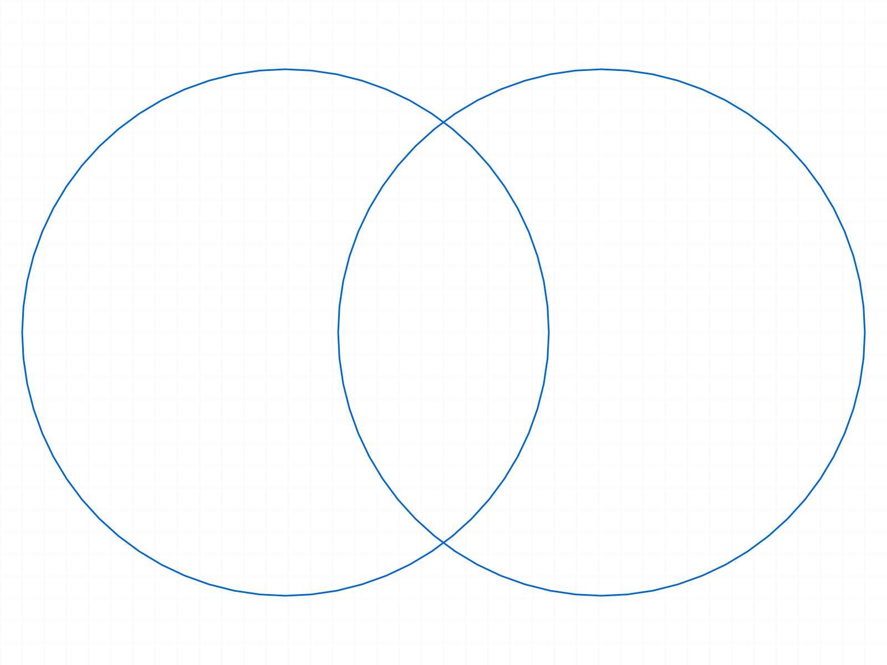
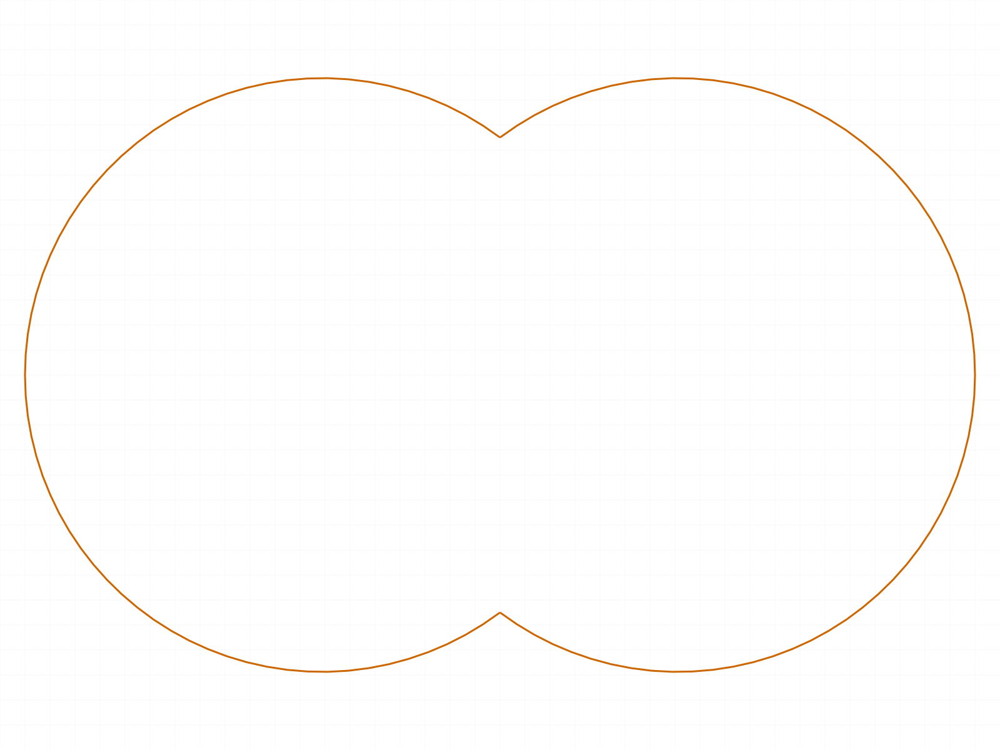
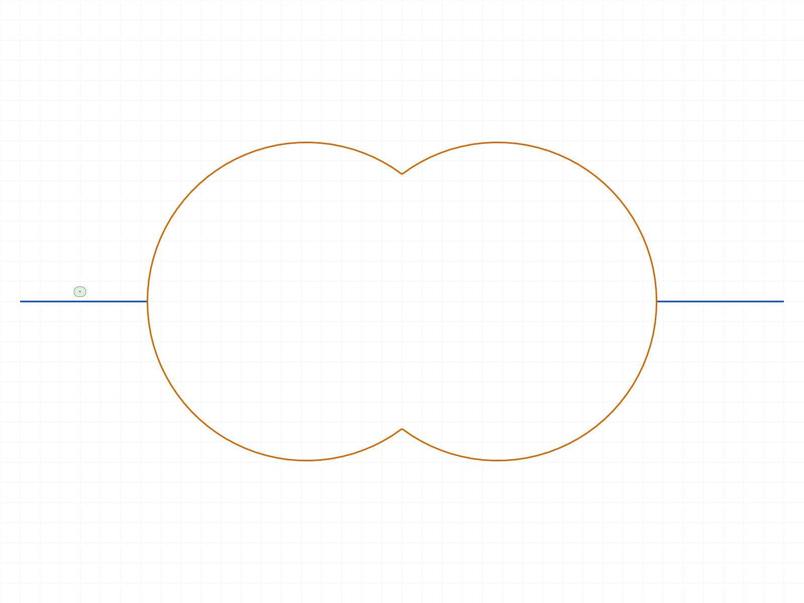
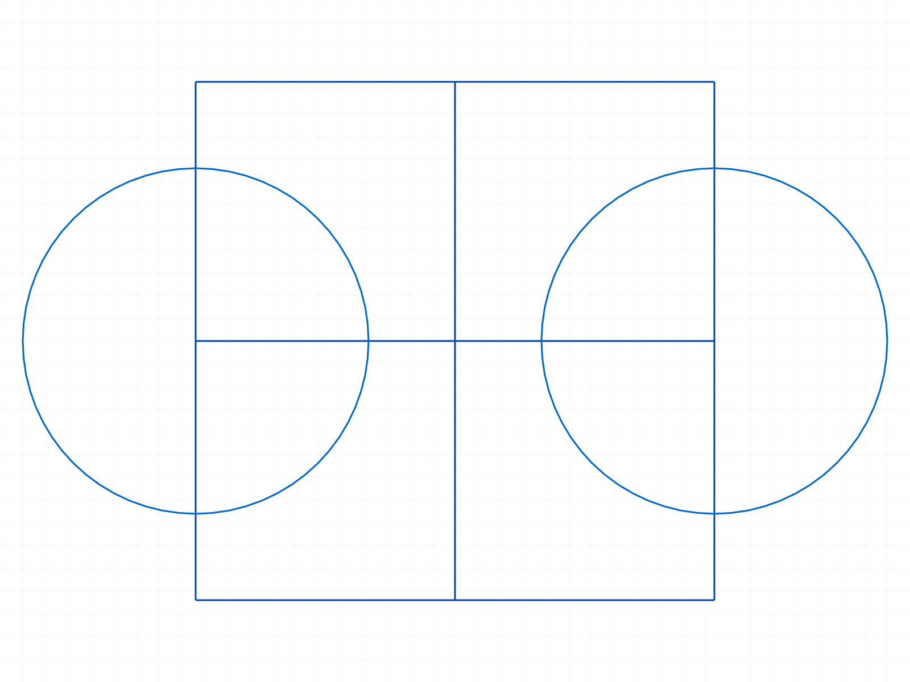
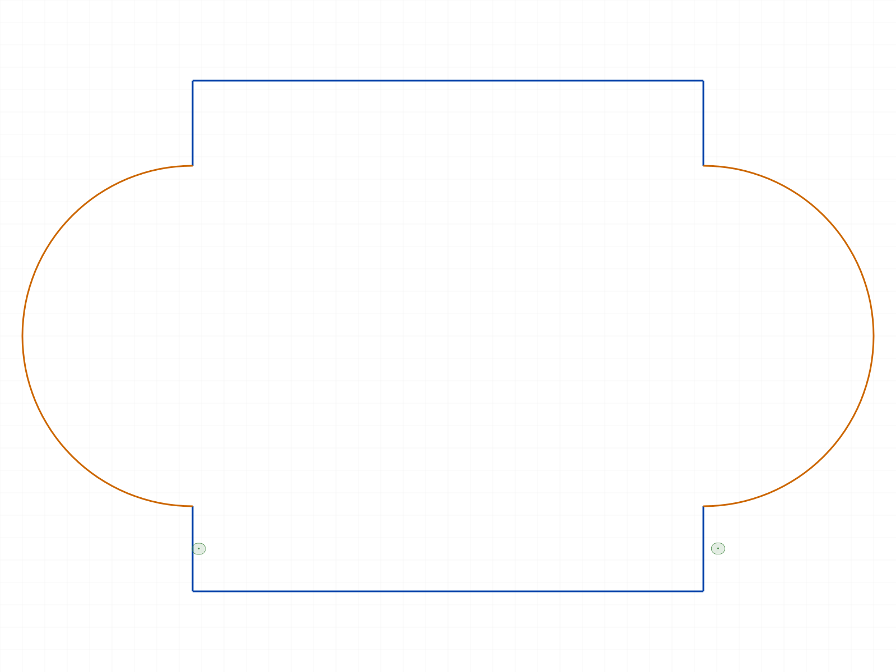

# Training: recognizing & finding trim pieces in complex sketches (advanced)

**Date:** 2026-07-01
**Type:** Integration study (not a single-API PLAN task) — building on the retrained `preTrim`/`trim`/`postTrim`.
**Goal:** With advanced sketches (grids, circles, arcs, lots of crossing elements), work out how to
**programmatically recognize which staged segments to trim**, validate a robust recipe, and fold the findings
into the skill files. Before/after snapshots throughout.

## Two headline outcomes

1. **A validated, general recipe for choosing trim pieces — the "boundary test".** Define the target filled
   region(s); for each staged segment, probe its midpoint pushed ±ε along the segment's local normal and ask "is
   there material on each side?". **Keep iff material lies on exactly ONE side** (it's a boundary edge); trim the
   interior (both sides in) and the dangling (both sides out). This one rule produces union outlines, extracts a
   sub-region from a grid, and handles mixed line/arc geometry — validated on 7 cases.
2. **Fixed a renderer bug that was actively lying about arcs.** `scripts/render-direct.mjs` drew every arc as its
   **minor (<180°) sweep**, ignoring the stored `bulge` — so a major-arc union rendered as its minor-arc
   complement (a union blob looked like the intersection lens). Fixed to derive the sweep from the signed bulge.

---

## Case 01 — two overlapping circles → union outline

Script: `scripts/01-two-circles-union.mjs`. The boundary test classifies the 4 arcs: inner arcs (mid (50,0)/(10,0),
material both sides) → trim; outer arcs (mid (-50,0)/(110,0), material one side) → keep. Survivors = 2 arcs = the
union outline.

| before (two circles) | after (union blob — post renderer fix) |
|---|---|
|  |  |

**⚠️ The challenge that started it all.** The *first* render of "after" showed a narrow **lens** (the intersection),
contradicting the data (survivors = outer arcs = union). Per SOUL.md I stopped and measured the survivor arc nodes:
`bulge ≈ 2` → included angle `4·atan(2) ≈ 254°` = **major arcs** = the union. So the geometry was right; the
**renderer** was drawing the minor sweep. Confirmed by Case 02: the *true* intersection (minor arcs, `bulge 0.5`,
106°) rendered as an *identical* lens — proof the renderer ignored major/minor. → fixed the renderer, and the
"after" now correctly shows the union blob (above).

## Case 03 — mesh grid → outer boundary

Script: `scripts/03-grid-outer-boundary.mjs`. 24 segments; boundary test with the bounding rect `[0,0]-[90,90]` as
the target region keeps the 12 perimeter segments (coalesce to 4 lines), trims the 12 interior. Lines render
reliably, so this is a clean visual proof.

| before (3×3 mesh) | after (outer square) |
|---|---|
|  |  |

## Case 04 — grid → extract the center cell

Script: `scripts/04-grid-extract-cell.mjs`. Same mesh, target region = the center cell `[30,30]-[60,60]`. Keeps the
4 cell edges, trims the other 20 segments. Shows the recipe extracts an arbitrary sub-region, not just the outline.

## Case 05 — rectangle + circle → rounded union (mixed lines + arc)

Script: `scripts/05-rect-circle-union.mjs`. A circle pokes out the rectangle's right edge. Boundary test keeps the
3 outer rect sides + the circle's outer arc; trims the rect's right edge (inside the circle) and the circle's inner
arc. Survivors: 3 lines + 1 arc = the rounded union. Mixed line/arc handled uniformly.

## Case 06 — where the NAIVE rule fails, the boundary test wins

Scripts: `scripts/06c-trim-instrumented.mjs` (boundary) and `scripts/06d-naive-only.mjs` (naive). Two overlapping
circles + a horizontal line crossing through and **overhanging both ends** (each circle now cut 4× → 13 segments).

- **Naive** ("trim iff midpoint inside any shape"): keeps the 4 union arcs **plus the two line overhang stubs**
  `(-90,0)→(-50,0)` and `(110,0)→(150,0)` — dangling pieces outside every shape. The naive rule has no
  "both-sides" notion, so it can't tell a boundary edge from a dangling stub.
- **Boundary test**: keeps only the 4 union arcs → clean union outline (2 arcs after coalescing).

| naive result (2 arcs + dangling stubs) |
|---|
|  |

**Challenge — the combined naive-vs-boundary script gave 0 survivors for both.** Isolating each run into its own
single-sketch script fixed it (06c → 2 arcs, 06d → stubs). **Running two independent trim workflows in one harness
run interferes** (consistent with `trim`'s global `curveIds` resolution, TODO #160). Rule: **one trim workflow per
run.** The empty result was a *script* artifact, not a method failure.

## Case 07 — STRESS: grid + two circles, lots crossing

Script: `scripts/07-grid-plus-circles-stress.mjs`. A 2×2 mesh + two circles poking out the left/right mid-edges.
24 segments → keep 10, trim 14. Survivors: 6 perimeter lines + 2 circle bumps, no full circles, interior grid and
inner arcs all trimmed = the union outline of `{rect, circleL, circleR}`.

| before (grid + 2 circles, crossing) | after (union outline with two bumps) |
|---|---|
|  |  |

---

## The classification toolkit (`scripts/_geo.mjs`)

- **Point-in-shape:** `inCircle` (|P−c| < r−tol), `inPolygon` (ray cast) for rects/polys. `inAny`/`countIn` over a
  set of closed shapes.
- **Segment midpoint + outward normal — from the segment's OWN geometry, never from an interval assumption:**
  - **line** (`CC_Line`): midpoint of endpoints; normal ⟂ direction.
  - **arc** (`CC_Arc`): derive center + midpoint from `(start, end, signed bulge)` — `θ = 4·atan(bulge)`,
    `R = L/(2 sin(θ/2))`, center on the chord's left-normal at `R·cos(θ/2)`, midpoint at `a0 + θ/2`; normal is
    radial. This is the **same math as the renderer fix** and is robust for a circle cut *any* number of times.
- **The boundary decision:** probe `mid ± ε·normal`; `keep = keepRule(in1, in2)`. `UNION_OUTLINE = in1 XOR in2`.

**Why NOT the interval→angle mapping.** My first toolkit computed arc midpoints from the segment `interval`
(turn-fraction from the +X seam). That held for a circle cut into exactly 2 arcs (Cases 01/05) but **broke for a
circle cut 4×** (Case 06 emptied out) — the sub-arc intervals don't stay global turn-fractions. Switching to the
bulge-based midpoint fixed it. **Lesson: derive a segment's geometry from its own node (class + bulge + endpoints),
not from the interval.**

## The renderer fix (`scripts/render-direct.mjs`)

`tessellateArc` forced the minor sweep (`if (a1 - a0 > π) a1 -= 2π`) and the sketch path never supplied the
disambiguating `bulge`. Fix: `fetchSketchData` now reads each arc's `bulge` from the structure tree; `tessellateArc`,
when given a bulge, derives center + sweep from `(start, end, 4·atan(bulge))` and tessellates the exact signed arc.
Backward-compatible (bulge defaults to null → old path), so solid/curve rendering is untouched. Verified: union →
wide blob, intersection → narrow lens (previously identical), minor arcs unbroken.

---

## Conclusions (folded into the skill)

1. **Recognizing trim pieces = the boundary test over a target region.** It subsumes "union outline", "outer
   boundary of a mesh", and "extract sub-region" — pick the target shape(s), keep XOR-boundary segments.
2. **Naive "midpoint inside a shape" is insufficient** — it leaves dangling stubs and can't classify segments
   interior-to-the-region-but-outside-every-shape.
3. **Compute a segment's midpoint/normal from its geometry (bulge), not its interval.**
4. **One trim workflow per harness run.**
5. **The arc renderer now respects bulge** — snapshots of arc profiles are trustworthy again.

Skill updates: `references/SKETCHING.md` (classification recipe rewritten + retrain banner removed);
`TOOLS.md` (renderer arc-bulge fix noted).
