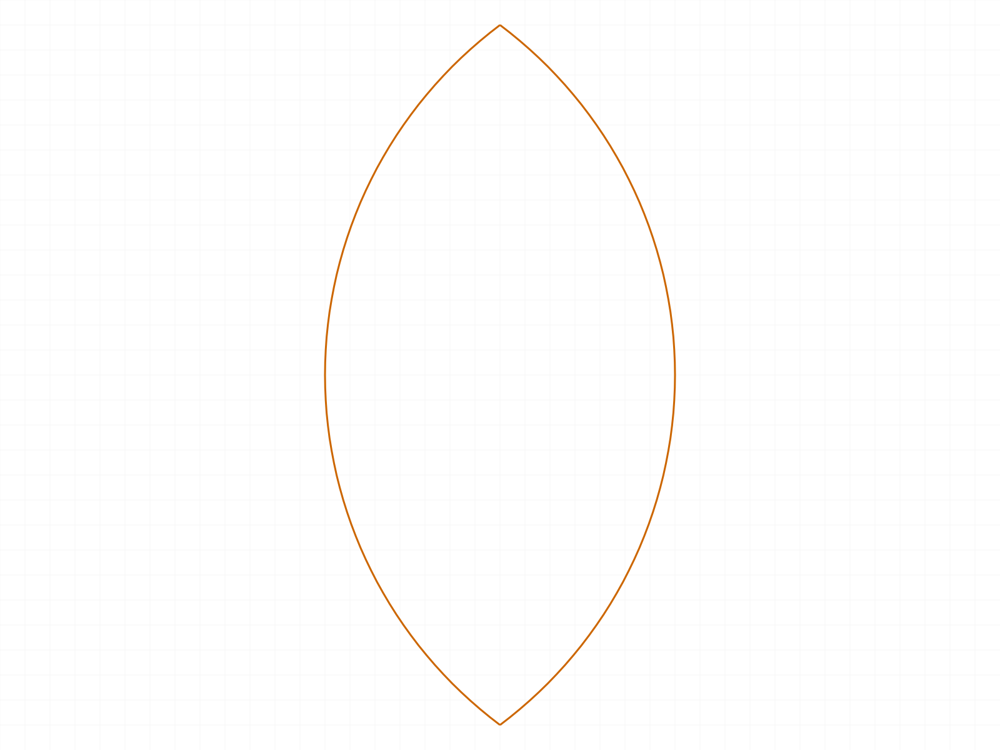
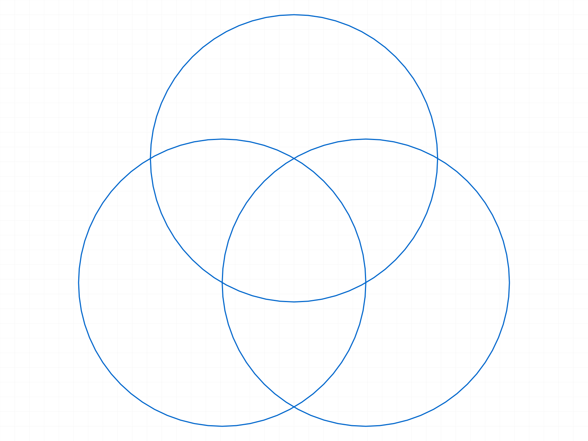
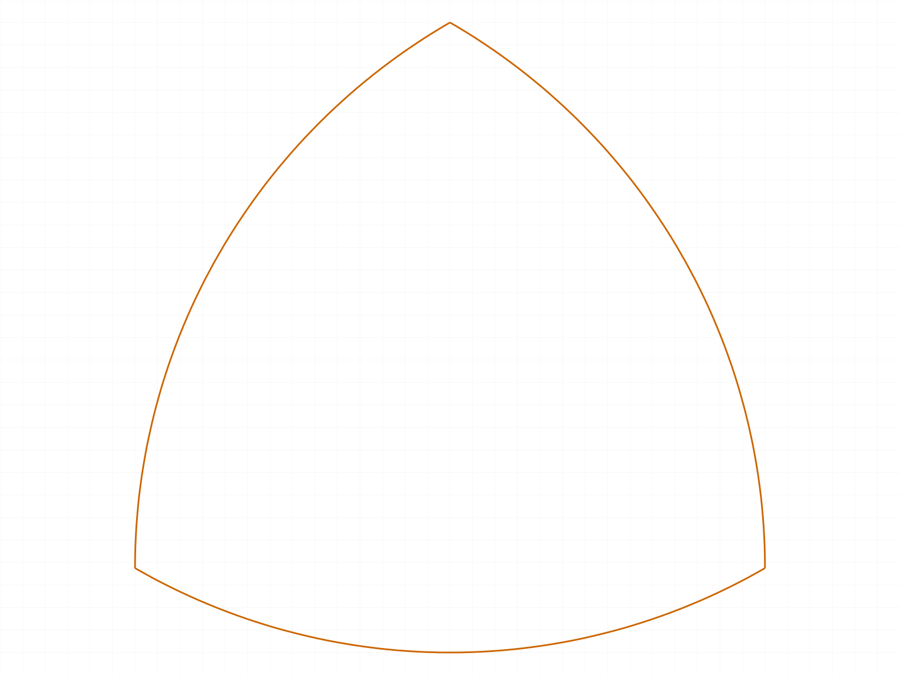
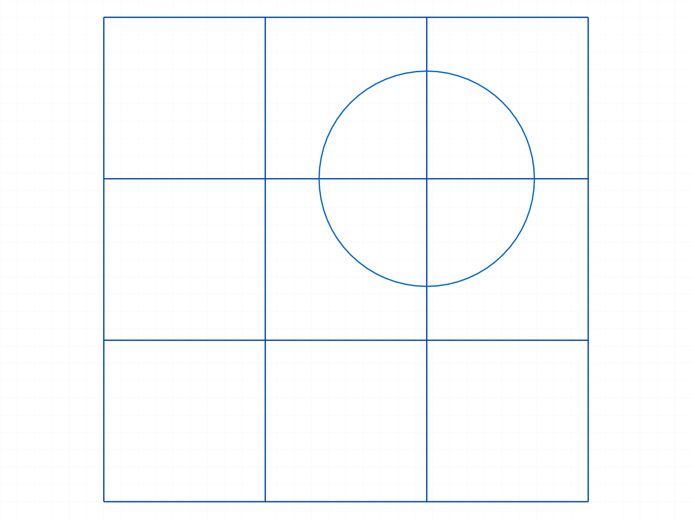
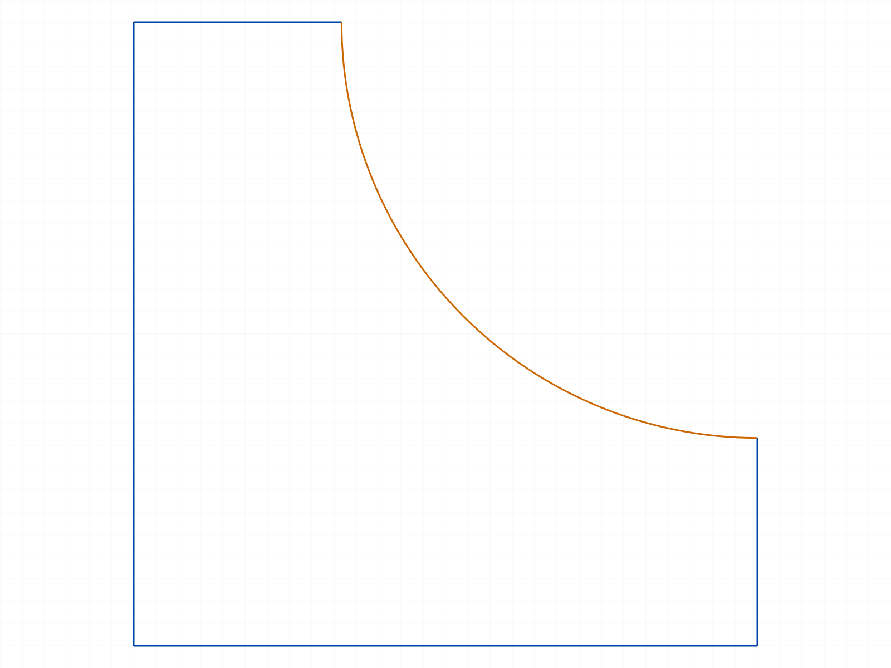
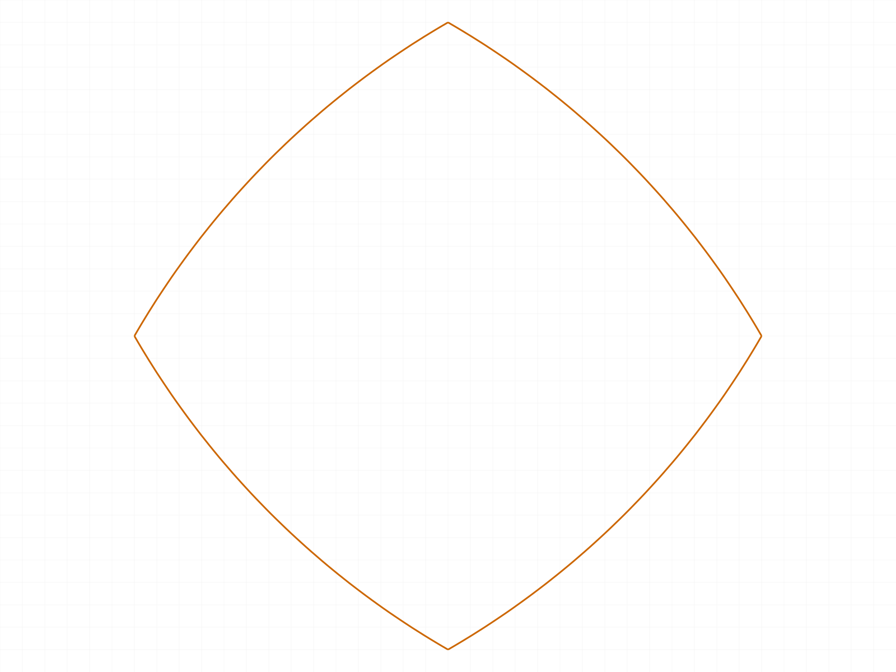

# Training: carving INNER loops with the trim workflow (predict → realize)

**Date:** 2026-07-01
**Type:** Integration study (follow-on to the outer-loop session). Renderer already fixed, so arc snapshots are trustworthy.
**Goal:** Complex fields of grids/circles/arcs/lines → **carve out an inner loop and discard the outer curves**. Before
each run, state a *theoretic* target shape, then realize it via classification and verify the realized geometry matches.

## The idea that unifies outer and inner loops

Last session extracted **outer** outlines by keeping segments on the boundary of the **union** (inside ≥ 1 shape).
Inner loops are the *same boundary test over a different target region*. Two generalizations, both added to
`_geo.mjs` and validated here:

- **Containment depth — `DEPTH_AT_LEAST(k)`**: keep a segment iff it lies on the boundary of the region
  "inside **≥ k** shapes", i.e. `(countIn(side1) ≥ k) XOR (countIn(side2) ≥ k)`.
  - `k = 1` → the outer union outline (last session).
  - `k = 2` → the boundary of "inside ≥ 2 shapes" — the pairwise **overlap** (a lens).
  - `k = N` → the region inside **all** N shapes — the deepest inner loop.
- **Arbitrary region — `classifyByRegion(regionFn)`**: keep a segment iff a caller predicate `regionFn(P)→bool`
  flips across the ±ε probe. Subsumes the depth rules and carves *any* inner region (e.g. `cell ∧ ¬circle`).

Every case below: **prediction first**, then measured realization. All six realized their prediction exactly.

---

## Case 01 — lens of two circles (depth ≥ 2)

**Predicted:** 2 minor arcs (the vesica), endpoints (30,±40), x∈[10,50], outer arcs discarded.
**Realized:** ✅ 2 arcs, `bulge 0.5` (106°), endpoints (30,±40). Classifier kept the inner arcs (`cnt 1/2` = boundary
of "inside ≥2"), trimmed the outer (`cnt 0/1`).

| before (two circles) | after (lens) |
|---|---|
|  |  |

## Case 02 — triple-overlap of three circles (depth ≥ 3)

**Predicted:** a Reuleaux-like curvilinear triangle = 3 arcs around the centroid; everything else discarded.
**Realized:** ✅ 3 arcs (`cnt 2/3`), endpoints exactly at the three circle centers (0,0)/(50,0)/(25,43.3) — the
textbook Reuleaux triangle (each arc centred on the opposite vertex).

| before (three circles) | after (Reuleaux triangle) |
|---|---|
|  |  |

## Case 03 — crossing rectangles → central square (depth ≥ 2, pure lines)

**Predicted:** two crossing rects R1[0,0]-[80,40], R2[20,-20]-[60,60] → the overlap square [20,0]-[60,40] (4 lines);
the 8 protruding arm segments discarded.
**Realized:** ✅ 4 lines forming exactly [20,0]-[60,40].

## Case 04 — circle + square corner overlap (depth ≥ 2, mixed)

**Predicted:** square[0,0]-[80,80] ∩ circle(80,80,r50) → 1 arc (from (30,80) to (80,30)) + 2 edge stubs.
**Realized:** ✅ 1 arc + 2 lines = the quarter-pie corner region.

## Case 05 — carve a ROUNDED inner cell from a complex field (arbitrary region)

**Predicted:** a 3×3 mesh + circle(60,60,r20); carve the center cell [30,60]² **minus** the circle. The circle cuts
the cell's top edge at (40,60) and right edge at (60,40) → a rounded cell = 4 line segments (full left/bottom,
partial top/right) + 1 concave arc. Discard the entire rest of the field.
**Realized:** ✅ from **32 segments**, kept 5 → 4 lines + 1 arc; survivor lines
[(30,30)-(60,30)], [(30,60)-(40,60)], [(30,30)-(30,60)], [(60,30)-(60,40)] + arc (40,60)→(60,40). Predicate:
`P ∈ cell ∧ P ∉ circle`.

| before (grid + circle) | after (rounded inner cell) |
|---|---|
|  |  |

## Case 06 — four-circle deep center (depth ≥ 4)

**Predicted:** circles r50 at the 4 corners of a 50-square; the region inside **all four** is a small curvilinear
square (4 arcs) around (25,25).
**Realized:** ✅ 4 arcs, endpoints (43.3,25)/(25,43.3)/(6.7,25)/(25,6.7) — a rounded-diamond "cushion".

| after (4-circle cushion) |
|---|
|  |

---

## Findings (valuable)

1. **Inner loops = the boundary test over a deeper target region.** The single `keep iff material on exactly one
   side` rule produces outer *and* inner loops — you only change *which region* you take the boundary of. This
   unifies the two sessions under one framework.
2. **Containment depth is the natural control** for overlap-based inner loops: `DEPTH_AT_LEAST(k)`. `k=1` outer
   union; `k=2` pairwise overlap (lens); `k=N` the all-shapes core. Each increment strips one layer inward.
3. **For non-overlap inner loops (grid cells, holes, composite regions), use an arbitrary region predicate**
   (`classifyByRegion`). `cell ∧ ¬circle` carved a rounded cell out of a 32-segment field. The framework is not
   limited to boolean-of-primitives — any `P→bool` works.
4. **Predict-then-realize is a strong discipline** — stating the exact target (segment counts, arc bulges,
   coordinates) up front turned each run into a falsifiable test; all six matched, which is much stronger evidence
   than eyeballing an after-snapshot.
5. **The arc-midpoint-from-bulge geometry (from the prior session) is essential here** — circles cut 2–6× by
   others produce sub-arcs whose interval is not a global turn-fraction; the bulge geometry located every arc's
   midpoint correctly (all 6 cases classified with zero mis-hits).

Skill update: `references/SKETCHING.md` — the classification section extended with the depth rule and the
arbitrary-region predicate for inner loops.
