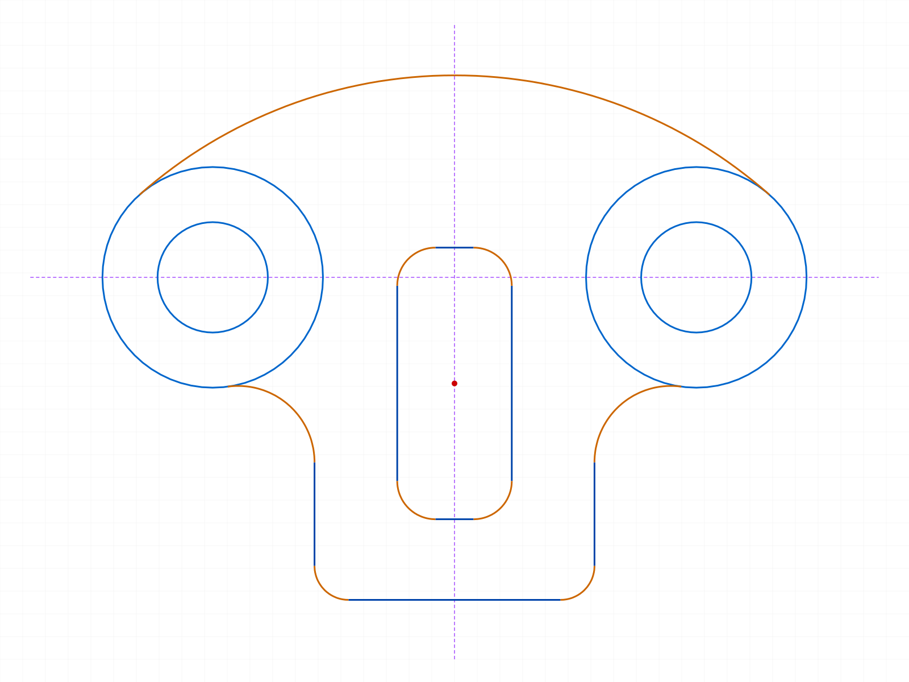
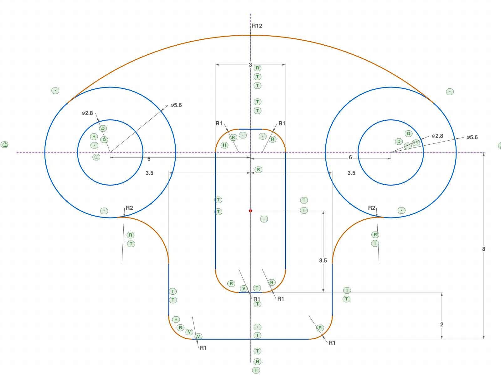
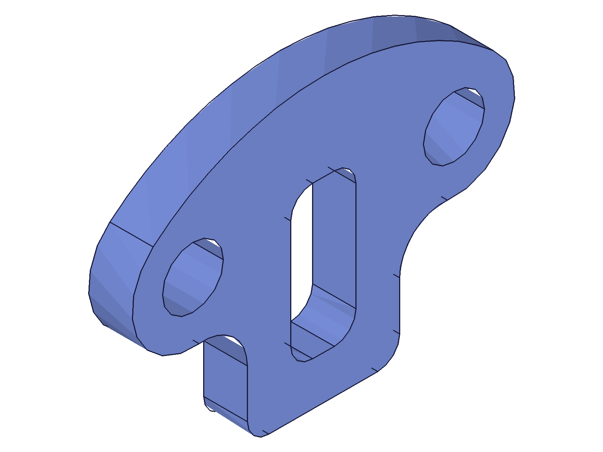
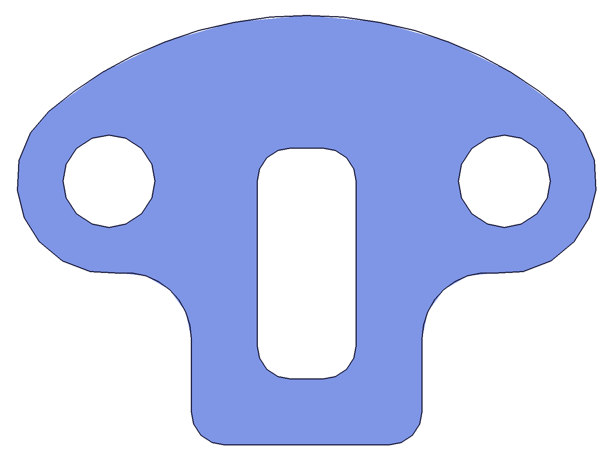

# Training: robot-head sketch reproduction (full constraints)

**Date:** 2026-07-02

## Goal

Reproduce the "robot head" technical drawing as a fully constrained ClassCAD sketch per
`SKETCHING.md`: chain topology is known from the drawing, so build the closed chains directly
from ROUGH seeds (perturbed parameters), wire them with COINCIDENT (auto) + TANGENT, and let
the drawing's dimensions drive the solver to the exact layout. No trim phase needed.

**Deliverables:** solved sketch matching the drawing (numeric readback proof), conditioning
proof (re-dimension → re-solve → revert), closed-region proof (extrusion + mass properties
vs analytic area).

## Drawing interpretation

Origin = intersection of the drawing's centerlines: horizontal dash-dot line through the two
ear-circle centers (y=0), vertical symmetry line (x=0). All values in drawing units (mm).

| Feature | Interpretation |
|---|---|
| Ear bosses | Ø5.6 arcs centered (±6, 0) — "6" locates centers from the vertical centerline |
| Holes | Ø2.8 full circles, concentric with bosses |
| Dome | R12 arc, **internally** tangent to both bosses → center (0, −√(9.2²−6²)) = (0, −6.974239), top of head at y=+5.025761. Cross-check: to-scale image shows dome top ≈ 5 above centerline ✓ |
| Chin sides | vertical lines x=±3.5 (bottom "3.5" = centerline→side) |
| Bottom edge | y=−8 ("8" = horizontal centerline→bottom) |
| 2×R1 | bottom corner fillets, centers (±2.5, −7) |
| 2×R2 | concave fillets boss↔chin side, centers (±5.5, −√(4.8²−0.5²)) = (±5.5, −4.773887) |
| Slot | rounded rect, width "3", corners 4×R1. Bottom edge y=−6 ("2" = bottom edge→slot bottom). Top corner centers ON the horizontal centerline (crosshair convention) → top edge y=+1 |
| "3.5" (vertical) | slot bottom → slot vertical mid: −6+3.5 = −2.5 = (−6+1)/2 ✓ redundant cross-check of the slot scheme |

Cross-reference check (Step 1 discipline): every annotation is consumed exactly once, the
slot scheme is doubly consistent (mid −2.5 via 3.5-dim AND via top-corners-on-datum), and
pixel-measuring the to-scale drawing (1 unit ≈ 30.8 px, calibrated on the "6" and "8" dims)
confirms: dome top +5.03, slot top just above the centerline (+1), slot bottom −6, bottom −8.

## Dimension checklist

- [ ] D1: R12 — RADIUS — dome arc
- [ ] D2: 2×Ø5.6 — DIAMETER — ear boss arcs at (±6,0)
- [ ] D3: 2×Ø2.8 — DIAMETER — holes, concentric with bosses
- [ ] D4: 6 — HORIZONTAL_DISTANCE — vertical centerline → boss center (both sides)
- [ ] D5: 8 — VERTICAL_DISTANCE — horizontal centerline → bottom edge
- [ ] D6: 3.5 (bottom) — HORIZONTAL_DISTANCE — vertical centerline → chin side (both sides)
- [ ] D7: 2×R1 — RADIUS — bottom corner fillets
- [ ] D8: 2×R2 — RADIUS — boss↔side concave fillets
- [ ] D9: 3 — OFFSET — slot width
- [ ] D10: 2 — VERTICAL_DISTANCE — bottom edge → slot bottom edge
- [ ] D11: 3.5 (vertical) — slot bottom → slot mid (encoded as slot top-corner centers COINCIDENT on horizontal centerline; verified by readback: mid must be −2.5)
- [ ] D12: 4×R1 — RADIUS — slot corner fillets

## Constraint scheme

- **Datum:** construction centerlines CLH (y=0) and CLV (x=0), all 4 endpoints FIXATION
  (fix endpoints, not lines — FIXATION doesn't lock length).
- **Chain wiring:** rough seeds computed from perturbed parameters with the SAME tangency
  math as the exact model → adjacent segments share bit-exact endpoints → Auto_Coinc wires
  the chains (gen* flags ON, genFixation OFF).
- **Relations:** CONCENTRIC boss↔hole ×2; hole centers + slot top-corner centers COINCIDENT
  on CLH; dome center COINCIDENT on CLV; SYMMETRY of slot top-corner centers about CLV;
  TANGENT at all 18 junctions (10 outer chain + 8 slot).
- **Dimensions (drive):** Ø2.8 ×2, Ø5.6 ×2, R12, R2 ×2, R1 ×2, slot R1 ×4, HD 6 ×2,
  VD 8, VD 2, OFFSET 3 (slot width), HD 3.5 ×2 (chin) — 19 driving dimensions.

Exact solution targets (computed analytically, `_model.mjs` with drawing params):
dome center (0, −6.9742388), dome↔boss tangents (±7.8260870, 2.1225937), R2 fillet centers
(±5.5, −4.7738873), boss↔R2 tangents (±5.7083333, −2.7847676), side↔R2 tangents
(±3.5, −4.7738873), R1 centers (±2.5, −7), bottom (∓2.5, −8), slot corner centers
(±0.5, 0) / (±0.5, −5).

---

## 01 — build from rough seeds, constrain, dimension, verify

Script: `scripts/01-build.mjs` — ✅ solver landed the ENTIRE sketch on the analytic exact
values in one pass. 60 comparison rows (every junction, center, radius of all 20 profile
curves), **maxErr 2.8e-15**. All batch calls maxLevel 31.

|  |  |
| --- | --- |

**Data** (`files/01-build-verify.json`): rough seeds (perturbed params: boss offset 5.7→6,
Ø5.2→5.6, dome R11.2→12, bottom −7.6→−8, slot ±1.35→±1.5 …) were pulled to exact by the
19 driving dimensions + 30 relations. Derived cross-checks from solved geometry:

- slot mid y = **−2.5** exactly (the drawing's vertical "3.5" = −6 + 3.5 ✓)
- slot height 7, top edge +1 (top corner centers on the horizontal centerline ✓)
- dome top y = 5.025761690 (analytic 5.0257617 ✓ — matches the to-scale drawing)
- boss span 12.000000 ✓

Note: seed vs solved PNGs look near-identical because the rough model is internally
consistent (same tangency math, smaller values) and the renderer auto-scales — the numeric
readback is the proof of solver motion, per the auto-zoom rule.

Auto_Coinc wiring (gen flags ON, bit-exact shared junction seeds) held through the solve —
no chain tearing, no explicit COINCIDENT needed at the 18 junctions.

## v2 — corrections from ph review

ph: (1) the Ø5.6 eye circles must stay FULL/closed like the Ø2.8 holes — v1 wrongly consumed
them into boundary arcs; (2) the nose width "3" and the "3.5 to center" must exist as real
dimensions; (3) the "8" must measure jaw/bottom → EYE CENTER.

Scheme changes (`_model.mjs`/`_build.mjs` v2):
- `bossR`/`bossL` are now full circles. The dome and R2 fillets connect via
  **COINCIDENT(endpoint, circle) + TANGENT(curve, circle)** — endpoint-on-curve plus
  tangency pins each junction exactly at the tangency point (verified: dome/f2 endpoints sit
  at distance 2.8000000 from the eye centers, and on the analytic tangent coordinates).
- "3" = HORIZONTAL_DISTANCE across the slot top endpoints (renders like the drawing).
- "3.5" = VERTICAL_DISTANCE slot bottom → **center mark**: a bare `sketch.point` seeded rough,
  COINCIDENT on the vertical centerline, driven by the 3.5 dim → solves to (0, −2.5) exactly.
- "8" = VERTICAL_DISTANCE eye center → bottom line.

Result: `01-build.mjs` — 55 rows ALL EXACT, maxErr 7.2e-14. `02-condition-proof.mjs` — boss
Ø7 / slot w4 / reverts all exact (7.2e-14). Internal tangency dome↔eye held its branch
through every re-solve.

|  |
| --- |

**📌 LLM doc:** COINCIDENT-endpoint-on-circle + TANGENT junction pattern → `sketch/constraint.md`.
**📌 LLM doc:** center-mark dimension pattern (point + on-axis + VD) → `SKETCHING.md`.

## 02 — conditioning proof (and updateDimension findings)

Script: `scripts/02-condition-proof.mjs` — ✅ after two fixes:

- **`updateDimension` has NO batch form.** Array param → `result: null`, no messages. Single
  calls only. **📌 LLM doc** → `sketch/updateDimension.md`.
- **Symmetric pairs traverse an unsolvable intermediate.** D56L→7 alone returns `result 0` —
  correctly: dome center is pinned to x=0, tangent to both eyes at ±6, so asymmetric radii
  (y²=36.25 vs y²=48.64) are contradictory. D56R→7 then returns 2 and the WHOLE system lands
  on the RB=3.5 analytic model (maxErr 3.2e-15 v1 / 7.2e-14 v2). Same for the revert.

States verified: boss Ø7 ✓, revert ✓, slot w4 (2.2e-16!) ✓, revert (full 55-row check) ✓.

## 03 — closed-region proof (extrusion + volume)

Script: `scripts/03-extrude.mjs` — ✅ with a real finding:

- **(a) Direct extrusion of the drawing-faithful sketch FAILS**: full eye circles touching
  dome/fillets only at tangent points → `Evaluation error in Extrusion.ExtrudeEntities: Brep
  after linear sweep not manifold` (maxLevel 51, but a broken feature object IS created —
  deleted via `part.deleteFeature`). Tangent-contact full circles are not a valid region
  boundary. **📌 LLM doc** → `SKETCHING.md` (drawing-faithful vs extrudable).
- **(b) Rim-trim route works**: `preTrim` splits each eye circle into **4** arcs — 2 tangent
  points AND 2 crossings of the CLH construction centerline (**construction geometry
  participates in trim splitting!** 📌 LLM doc). All 4 are minor arcs, so each apex =
  eyeCenter + R·unit(chordMid − eyeCenter); trim the 2 apex-nearest-origin (inner) arcs per
  eye, keep the rim pair (they coalesce at (±8.8, 0) on postTrim). Extrusion limit2=2 →
  maxLevel 31.
- Volume: measured 236.4421 vs analytic 236.4671 (area 118.2335 from shoelace+segment math
  over the parametric model) — **relΔ 1.06e-4** (faceting tolerance). ✓

|  |  |
| --- | --- |

Also hit during v2: **`dimPos` at dimension CREATION poisoned the 21-dim batch** (maxLevel 51,
some dims returned VOID → half-driven sketch, 38/55 rows off). Passing the same positions
post-creation via `updateDimensionPosition` works fine. **📌 LLM doc** → `sketch/dimension.md`.

## 04/05 — stale `bulge` after failed→successful updateDimension (server bug)

Scripts: `scripts/04-bulge-probe.mjs`, `scripts/05-bulge-heal.mjs` (run on the v1 arc-eye
variant; dome/fillet arcs in v2 carry the same risk).

The 02-boss7 v1 snapshot showed a notch at the dome↔bossL junction although the readback was
exact to 3.2e-15 — data and picture disagreed, so per SOUL discipline: investigate. The
un-verified field was the arc's `bulge`:

- After `D56L→7 (result 0)` then `D56R→7 (result 2)`: bossL start/end/center/radius EXACT,
  but `members.bulge.value` = 1.2988643 (a 209.6° sweep) instead of 0.7022581 (the true
  140.3° sweep). The renderer draws the bulge → the notch. Reproduced 3/3 runs.
- The revert sequence (also 0→2) REFRESHED the bulge — staleness is not deterministic per
  sequence, only per "failed attempt wrote garbage, later solve may or may not rewrite it".
- **No heal found**: `common.recalc` → still stale; same-value re-set (result 2) → still
  stale (solver no-op). A value-CHANGING successful solve that moves the arc usually
  refreshes it.

**📌 LLM doc** → `sketch/updateDimension.md` (bug + avoidance), `workspace/TODO.md` #174.

## 06 — the clean "2×Ø" encoding: one driving dim + EQUAL_RADIUS

Script: `scripts/06-equal-radius.mjs` (v1 variant) — ✅ delete `D56L`, add
`EQUAL_RADIUS(bossL, bossR)`, then a SINGLE `updateDimension(D56R→7)` solves in one step
(result 2), positions exact (3.2e-15), **all bulges fresh** — the stale-bulge trap never
triggers because no unsolvable intermediate exists. This matches the drawing's "2×Ø5.6"
semantics and is the recommended pattern. **📌 LLM doc** → `SKETCHING.md` Step 4.

## Dimension checklist — final

- [x] D1: R12 — `01-build.mjs` dome radius readback 12 exact (top of head 5.0257617)
- [x] D2: 2×Ø5.6 — full circles at (±6,0), r=2.8 via dome/f2 tangency distances (`01` derived)
- [x] D3: 2×Ø2.8 — hole circles, centers exact (±6,0)
- [x] D4: 6 — HD6L/R, eye centers x=±6.0000000
- [x] D5: 8 — VD8 eye center→bottom, bottom y=−8 exact
- [x] D6: 3.5 — HD35L/R, chin sides x=±3.5 exact
- [x] D7: 2×R1 — fillet centers (±2.5,−7), radius 1 exact
- [x] D8: 2×R2 — fillet centers (±5.5,−4.7738873) exact
- [x] D9: 3 — W3 slot top endpoints (±1.5, 0) exact
- [x] D10: 2 — VD2, slot bottom y=−6 exact
- [x] D11: 3.5 — VD35 to center mark, solved to (0,−2.5); slot mid readback −2.5 ✓
- [x] D12: 4×R1 — slot corner centers (±0.5,0)/(±0.5,−5), radius 1 exact

## Session notes

- Not a PLAN.md task (user-directed reproduction exercise) — no PLAN checkbox to tick.
- Deliverable sketch state = `01-build` run: `files/01-build-01-solved.ofb` / `.stp`.
- Worker on 9094 (ph's) used throughout; no worker started, nothing to kill.

## Retrospective — method amendments (ph review, green-lit)

Root causes of the review misses were traced to instruction gaps and fixed:

1. **SKETCHING.md profile bias** (caused the cut eye circles): the guide asserted "every
   visible outline is trimmed shapes." Amended @ e97b7aa: new **Step 0 — Classify** (deliverable
   = drawing-as-drawn by default; per-curve complete-vs-partial walk; "the drawing wins over
   the method" precedence rule), Step 3 "complete curves stay complete" rule, Step 6 gained a
   **topology pass** (full-circle-vs-arc counts) before the silhouette pass.
2. **Dimension mismatches** (3 / 3.5-to-center / 8): checklist recorded facts but nothing
   forced them to become entities. Amended: Step 2 checklist gains an **anchors column**
   (recorded as the drawing measures), Step 4 gains **"one annotation = one dimension
   entity"** (same anchors as the drawing; redundant dims as driven readouts; materialize
   center marks), Step 6 Pass 1 now requires citing the dimension entity per row.
3. **Boilerplate excavation** (rigging-plate lookup): HOW-TO-TRAIN's own examples created
   PLANELESS sketches (the #1 trap) and documented no session-module convention. Amended
   (workspace/HOW-TO-TRAIN.md): "Standard session preamble" section (planeId acquisition +
   part.create-once + getPositions-on-circles), fixed the Step 4A example, new
   "Appendix: Shared Session Modules" with a canonical `_setup.mjs` listing.
