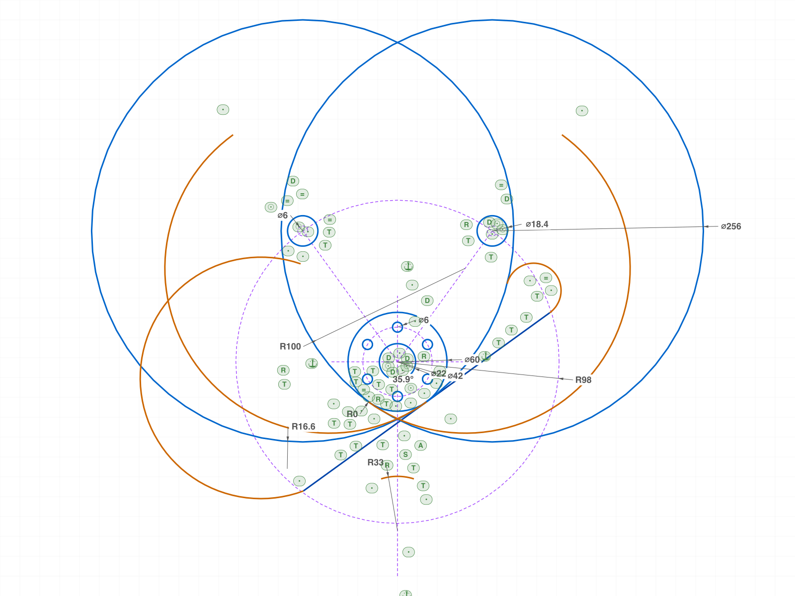
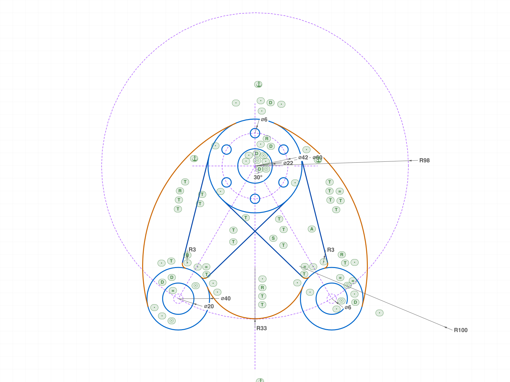
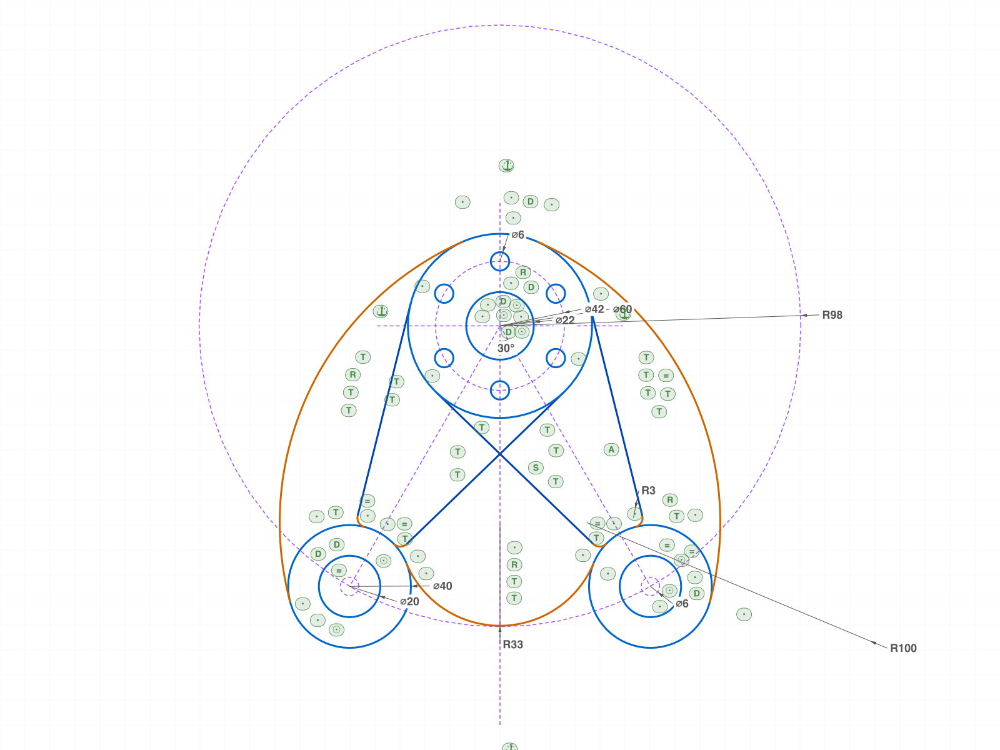
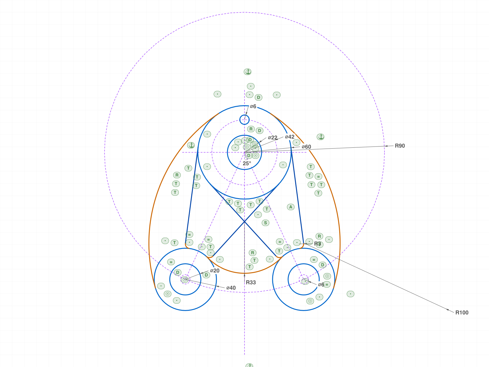

# Training: Mounting-plate drawing → fully constrained sketch

**Date:** 2026-07-02 (user-override task: reproduce the attached "mounting plate" drawing, mm, per SKETCHING.md)

## Goal

Reproduce the mounting-plate technical drawing as a fully constrained, conditioned sketch:
rough seeds → datum → relations → the drawing's dimensions drive the solver → numeric
readback vs analytic model (one code path for rough seeds AND exact targets, `_model.mjs`).
Drawing-faithful mode: all Ø-callout circles stay FULL, no trim phase (chain topology is known).

## Drawing interpretation (settled with ph — 2 AskUserQuestion rounds)

The image is NOT to scale; the dimensions are the spec. ph's reading (his words: "the top 22
circle is the mid point. at 42 are the 6 smaller circles. at 60 the outmost circle. from that
midpoint at radius 98 and at 30 deg are the two arms or circle (40) centers … the r100 isn't
centered in mid point. this is the radius for the fillet that connects the top 60 circle
tangentially."):

- **Hub center = the datum midpoint.** Ø22 bore, Ø42 bolt circle (construction, 6× Ø6 holes,
  "6 отв." = 6 holes, first at 12 o'clock, 60° spacing), Ø60 hub circle — all concentric there.
- **Boss centers at R98 / 30° from the hub center** (construction circle + the drawn diagonal
  centerlines): B± = (±49, −84.87048957) exactly.
- **R100 = the outer blend arcs** (one per side), tangent to the Ø60 hub circle AND the Ø40
  bosses, both inside: |C−H| = 70, |C−B| = 80 → right-arc center (−28.23743, −64.04620), hub
  tangency (12.10176, 27.44837), boss tangency (68.30936, −90.07575). Between the two hub
  tangencies the outline follows the HUB CIRCLE itself (top ~24mm) — that's why the image
  looks like a dome "kissing" the hub. The bosses protrude past the blends at the bottom.
- **R33 notch**: tangent to both bosses, center on the vertical CL → C33 = (0, −64.67148)
  (= boss level + √(53²−49²)), apex (0, −97.67).
- **Arms**: straight edges tangent to the Ø60 hub circle (smooth unfilleted hub junction —
  matches the drawing having no R callout there) AND tangent to a Ø6 width-gauge construction
  circle concentric with the boss (materializes the "6" width annotation, robot-head
  center-mark style); R3 fillets into the bosses. The inner edges cross at (0, −41.7) just
  below the hub — both drawn full to their hub tangent points (noted: if ph wants them
  trimmed at the crossing, that's a follow-up).
- 30° = ANGLE between the vertical centerline and the hub→boss axis.

## Dimension checklist (annotation → dimension entity, 1:1)

All checked against `files/07-final-compare-exact.json` (51 rows, maxErr 2.84e-14 vs the
analytic model — every tangency point, center and radius exact) and
`files/07-final-summary.json`.

- [x] D1: Ø6 (6 отв.) — DIAMETER `D6` on the 12-o'clock hole; 6 instances via
      `circularPattern` (all 6 centers on Ø42 at 60°: maxErr 1.59e-14)
- [x] D2: Ø22 — DIAMETER `D22` (bore center exact at origin)
- [x] D3: Ø42 — DIAMETER `D42` on the construction bolt circle
- [x] D4: Ø60 — DIAMETER `D60` (blend + edge tangencies on it land exact → radius 30 proven)
- [x] D5: R100 — RADIUS `R100` on the left blend (drawing dims the left); right via
      EQUAL_RADIUS (both radii readback 100 exactly)
- [x] D6: R98 — RADIUS `R98` on the construction boss-placement circle (boss centers solved
      to (±49, −84.8704895709) = 98·(sin30, −cos30) exactly)
- [x] D7: 6 — DIAMETER `W6` on the Ø6 width-gauge at the right boss (edges tangent to it);
      left gauge via EQUAL_RADIUS
- [x] D8: R3 — RADIUS `R3` on the right outer fillet + EQUAL_RADIUS ×3 (all four fillet
      radii = 3 exactly)
- [x] D9: R33 — RADIUS `R33` (notch center (0, −64.6714797) exact)
- [x] D10: Ø40 — DIAMETER `D40` on the left boss (drawing's leader) + EQUAL_RADIUS
- [x] D11: Ø20 (2 отв.) — DIAMETER `D20` on the left hole + EQUAL_RADIUS
- [x] D12: 30° — ANGLE `A30` [vertical CL ↔ right axis] with `dimPos` sector selection;
      left side via point-SYMMETRY of the boss centers

## 01 — first full build: solver self-destructs (unexpected)

Script: `scripts/01-build.mjs` — ❌ eq/dim/ang batches maxLevel 51; boss subgraph stuck at
rough (R93 @ 27.5°); blends/notch/fillets drifted (maxErr 12.5). Hub stack + bolt-hole
pattern solved exact anyway (holes 4.7e-10 — decoupled subgraph).

|  |
|---|

**Data:** `files/01-build-compare-exact.json` (first run overwritten by the later rerun; log
preserved). Snapshot shows the R3 dim reading **"R0"** — a fillet arc collapsed to radius ≈ 0.

## 02 — diagnose: the CalcBulges failure

Script: `scripts/02-diagnose.mjs` — every failing batch carries
`SketchSolverInterface.DoSolve: The specified radius for CalcBulges is too small`, first
appearing in the EQUAL_RADIUS batch — which is numerically a NO-OP (rough seeds are
mirror-symmetric, all pairs already equal). Every dimension then fails to set ("Couldn't set
the value for dimension $NNN"). 34 constraint nodes with lgsState 0.

**Data:** `files/02-diagnose-batch-messages.json`, `files/02-diagnose-lgs-and-radii.json`.
**Learned:** the solver DIVERGES from an already-satisfied state — the failure is not about
the solve target.

## 03 — isolation probes: every mechanism is sound (5 sketches, one part)

Script: `scripts/03-probes.mjs` — ✅ all pass. Technique: multiple independent sketches on
the ONE `part.create` of the run (solver is per-sketch).

- S1 seeds-only, gen* off: creation fidelity — every arc's structure `bulge` matches the
  model's `±tan(sweep/4)` to 1e-15 (`files/03-probes-s1-bulges.json`); `isClockwise`
  convention confirmed (cw → negative bulge).
- S2a one arm, full scheme: solves ROUGH→EXACT at 1.6e-14; fillet radius exactly 3. TANGENT
  line↔circle uses the INFINITE line — the gauge tangency point lying beyond the segment end
  is fine.
- S2b arm without gauge tangency: drifts 0.23 — confirms the Ø6 gauge is what closes the arm.
- S3 notch alone / S4 blend alone: exact at 1e-14.

**Learned:** the failure is emergent at full-system scale, not a broken construct.

## 04 — discriminator: exact seeds still explode → structural

Script: `scripts/04-exact-seeds.mjs` — full build from EXACT seeds (zero motion needed):
still 51. First run: EQUAL_RADIUS pairs f3LO↔f3RO and f3LI↔f3RO (cross-side, r=3 arcs) fail
with CalcBulges while same-side f3RI↔f3RO and all circle/R100 pairs pass. After switching to
same-side eq + twin `R3L` dim: eq batch 31, but dims STILL explode — `R100.SetSE: NullMem
{29.986, −0.916, 0} ist nicht definiert` etc. All NullMem points lie exactly ON the Ø60 hub
circle: the blend arcs had COLLAPSED to zero-length arcs on the hub. Also
`Line length on angular dimension became zero!` (the axis line's endpoints merged).
**Data:** `files/04-exact-seeds-compare-exact.json`, `files/04-exact-seeds.log`.
*(Interpretation superseded: both the "structural" verdict and the cross-side-EQUAL_RADIUS
attribution turned out to be confounded by a wiring bug — see 05/09/10.)*

## 05 — gen* off converges; exposes the REAL bug

Script: `scripts/05-gen-off.mjs` — with `genIncidence:false, genTangency:false,
genVertAndHoriz:false` the build converges (all batches 31) and the first run's only
"errors" were 4.24mm displacements on the LEFT fillets with start/end swapped vs targets:
**my model bug** — `marc()` mirrors arcs WITH s/e swap, while the constraint loop wires
`edge.end ↔ fillet.start` uniformly on both sides. The explicit wiring therefore
contradicted the seed adjacency. With autos OFF that contradiction is benign (solver slides
the fillets into the role-swapped layout; readback catches it). Fixed with a swap-free
mirror (`marcK`, cw flipped) → rerun: **maxErr 2.84e-14 ✓ PASS**, pattern clean.

|  |
|---|

**📌 LLM doc:** SKETCHING.md gen*-flags regime + `sketch/geometry.md` + `sketch/constraint.md`
(final causal story settled in 09/10 below).

## 06 — un-confound the cross-side EQUAL_RADIUS finding

Script: `scripts/06-eq-cross-gen-off.mjs` — ✅ cross-side fillet EQUAL_RADIUS (all four tied
to f3RO, single R3 dim) passes with gen* off: maxErr 2.84e-14, every eq constraint
individually 31. The 04 "structural" cross-side failure only exists WITH auto-dupes present.
The preferred one-driving-dim-per-annotation encoding stands.

## 07 — final canonical build

Script: `scripts/07-final.mjs` — ✅ ROUGH seeds, gen* off, eqCross, 12 annotation dims +
pattern: all batches 31, **51 verification rows maxErr 2.84e-14**, 6 bolt holes at 1.59e-14,
**zero `Auto_*` constraints** in the structure tree (regime confirmed).
**Data:** `files/07-final-compare-exact.json`, `files/07-final-summary.json`.

|  |
|---|

## 08 — conditioning proof

Script: `scripts/08-condition-proof.mjs` — ✅ after the build, `updateDimension` R98→90 and
A30→'25deg' (both `result: 2`, maxLevel 31 — note: docs say 1=solved, we observed 2): every
blend, notch, edge, fillet re-solved to the analytically recomputed layout
`model({RP:90, TH:25})` at **2.84e-14**. The sketch is a conditioned model.
**Data:** `files/08-condition-proof-compare-conditioned.json`.

|  |  |
| --- | --- |

## 09 — do individual creators auto-generate? (yes — mostly)

Script: `scripts/09-individual-autos.mjs` — 4 individual creator calls (2 exactly-tangent
circles, a tangent horizontal line, a coincident vertical line) produced **5 autos**:
`Auto_Fix`, `Auto_Coinc`×2, `Auto_H`, `Auto_V` — but **no tangency autos** despite exact
tangency. Kills my "probes were auto-free" explanation; only `genTangency` (batch) makes
tangency autos. **Data:** `files/09-individual-autos-autos.json`.

## 10 — un-confound: fixed wiring + autos ON → PASS. Final causal story.

Script: `scripts/10-gen-on-fixed.mjs` — script 07 with default gen* (autos ON): all batches
31, **maxErr 2.84e-14**. So scripts 01/02/04 failed because they combined autos with the
mis-wired left fillets: **auto-constraints wire junctions from seed positions; my explicit
COINCIDENTs wired the swapped endpoints — two contradictory constraint sets, and DoSolve
diverges GLOBALLY** (CalcBulges/NullMem, arcs collapse to r=0, every dim refused, satisfied
subgraphs wrecked) instead of flagging a loser. Matrix:

| wiring | autos ON | autos OFF |
|---|---|---|
| contradicts seeds (marc bug) | ❌ catastrophic divergence (01/02/04) | ✓ solves, 4.24mm role-swap visible (05 first run) |
| consistent (marcK fix) | ✓ 2.84e-14 (10) | ✓ 2.84e-14 (05 rerun/06/07) |

Corollaries: the 04 "cross-side EQUAL_RADIUS breaks" finding was this confounder (06 + 10
pass with it); pure auto duplication is harmless; autos-OFF in fully explicit builds is
still the robust choice — it turns this class of bookkeeping bug into a visible displacement
instead of a wrecked sketch.
**📌 LLM doc:** all Step-5 docs written to this corrected story.

## Evaluation (SKETCHING.md Step 6)

- **Pass 1 checklist:** all 12 rows checked above, each citing its dimension entity + the
  measured solve (compare files).
- **Pass 2 topology:** 7 full circles (hub, bore, hole6, 2 bosses, 2 boss holes) + 5 pattern
  copies, 3 outline arcs (2×R100, R33), 4 fillet arcs, 4 edge lines; construction: 2 center
  lines, 2 axes, bc42, r98, 2 gauges. Matches the drawing's curve inventory — Ø-callout
  circles stay FULL; blends/edges END on them (junction-on-full-circle pattern).
- **Pass 3 visual:** 07 snapshot vs source drawing — silhouette, protruding bosses, notch,
  tapered arms, hole layout all match. (Reminder: the source image is not to scale; boss
  spacing in the image reads ~117 vs the dimensioned 98.)

## Skill Updates

See `changes.md`. Updated: `SKETCHING.md` (fully-explicit-scheme gen* guidance + the
wiring-contradiction divergence + infinite-line TANGENT + degenerate-junction solver facts,
`updateDimension` result 1|2), `references/sketch/geometry.md` (autos-vs-explicit-wiring
divergence; individual creators generate Fix/Coinc/H/V but no tangency autos),
`references/sketch/constraint.md` (infinite-line TANGENT; wiring-contradiction gotcha;
cross-chain EQUAL_RADIUS verified), `references/sketch/circularPattern.md` (pattern on a
constrained, dimensioned original after solve). `updateDimension.md` already documents
result 0|1|2 — no change needed there.
