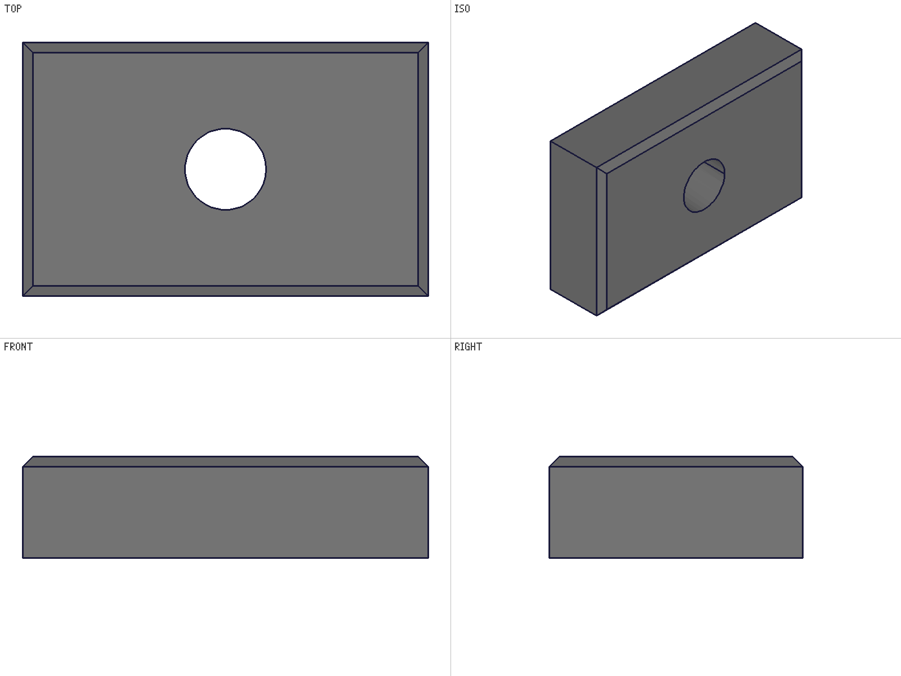
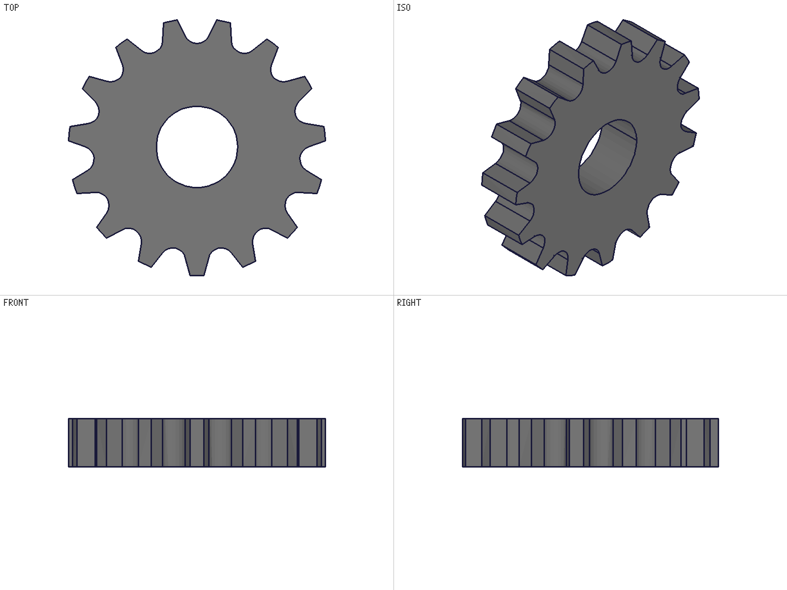
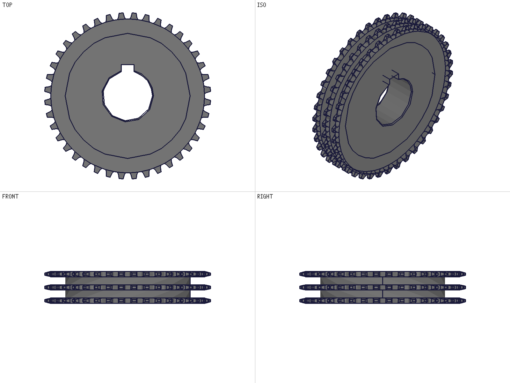

# E2E benchmark journal — one prompt, three hosts

The same host-neutral prompts are run verbatim in every agent host: the **root
agent** (harness, node worker — the ground truth), **buerli-ai** (buerligons
in-app panel, WASM engine, Fable via Copilot), and the **classcad MCP**
(stdio, node worker). Prompts + examiner criteria: [sprocket-prompt.md](sprocket-prompt.md)
(benchmark #1), [sprocket-triple-prompt.md](sprocket-triple-prompt.md)
(benchmark #2). Model for all runs: Claude Fable 5.

Source rule for filesystem-capable hosts: skill docs, recipes and the data
contract are fair game; `workspace/training/` and `workspace/output/` are off
limits (prior solutions).

---

## Warm-up: block + bore + top-edge chamfer (root agent)

Context-free agent, discovers everything from the repo MDs. First run, all
green: DATA.md found via the TOOLS.md pointer, 4 outer top edges selected by
straightness predicate (bore rim correctly excluded), volume −0.0004% vs
analytic, chamfer only on the outer rectangle.

Side find: bore rim arrived as ONE closed polyline (docs said 2 seam-split
arcs) — doc-clarification candidate.

---

## Benchmark #1 — ANSI 35 sprocket, 15T, constrained sketch (`sprocket-prompt.md`)

The core is a CONSTRAINED tooth-space sketch (seat center coincident on the
pitch circle, TANGENT flanks, @expr-bound dimensions), merged pattern, ONE
subtraction, live-parametric bore test.

| Criterion | root agent (GT) | buerli-ai | mcp |
| --- | --- | --- | --- |
| Expressions in model (formulas) | ✅ 14 | ✅ 12+ | ✅ 14 (readback = JS math to 1e-15) |
| Constrained sketch (from tree) | ✅ RootOnPitch, TanL/R, lgsState 1 | ✅ CenterOnPitch/CL, TanL/R, Sym | ✅ SeatOnPC/CL, TangentL/R, CapSym — none unsolved |
| Dims @expr-bound | ✅ every one; ANGLE correctly avoided | ✅ (`PitchR`,`SeatR`,`CapH`,`CapW`,`BlankOD`,`BoreDia`) | ✅ (`Rp`,`Rs`,`capW`,`capY`); flank angle encoded as expr-bound capW — zero unbindables |
| Merged pattern + ONE subtraction | ✅ | ✅ | ✅ (`count:'@expr.N'`, merged:1) |
| Tooth count from geometry | ✅ 15/15 | ✅ 15/15 (owner join) | ✅ 15/15 (azimuth clustering, data-driven gap) |
| Volume in bounds | ✅ 13292.8 mm³ | ✅ 13476.8 mm³ | ✅ 13132.99 mm³ |
| Live bore B 16→20 | ✅ relErr 0.044% | ✅ relErr 0.065%; restored B=16, volume bit-exact | ✅ relErr 0.013%; restored B=16 exact |
| Sheet snapshot | ✅ | ✅ (rendered in-app; edges missing → fixed, see history) | ✅ ([files/mcp-bench1/](files/mcp-bench1/)) |
| Run shape | 1 pass, 37 calls, ~12 min | 1 pass, ~8 rounds, zero manual continues (after fixes) | 2 passes (engine crash between): 40 min blocked by preTrim hang + 4 min rebuild after worker restart; 24 run_scripts, solver seeded off-value on purpose |

MCP run notes: headless `claude -p` runner, MCP tools whitelisted only —
repo/filesystem access DENIED by permissions (source rule held; verified in the
transcript: the Glob/ls attempts errored, the only successful shell calls were
`ps`/`sleep` diagnostics while it monitored the dying worker). Agent found TWO
doc/engine defects (history #22, #23) and reported both instead of silently
working around them.

Solver proof (GT): seeds deliberately perturbed; solved junctions matched the
analytic layout at 3.9e-8 mm. buerli-ai extra: the ToothSpace sketch is open
in the editor with live `@expr` dimensions visible in the viewport.

### Earlier buerli-ai attempts (pre-fix) — what broke

1. Attempt 1 (2026-08-17 morning): one big sketch script hit the 60s timeout;
   WASM threw `std::bad_alloc` in the RESPONSE path (5×: circle/line/
   arcByCenter) while mutations landed; agent degraded to micro-scripts,
   turns died every 6–8 tools, three manual "continue"s, run abandoned at
   `checkpoint · cutter-sketch-done`. Agent behavior itself was correct
   (checkpoints, restore, fire-then-verify adaptation).
2. Attempt 2 (after truncation fix): first bulk docs call truncated at the
   generic 30KB tool-result cap → agent fell back to per-doc batches; turn
   died after "Now building." — abandoned to fix the real causes.
3. Attempt 3: PASS (table above).

---

## Benchmark #2 — T35A40SS triple-strand, 40T (`sprocket-triple-prompt.md`)

3 plates (t 0.162) spaced K 0.399, staircase blank Ø4.9898/Ø3.75, tip tapers
slope 1/4 on all six faces, Ø1.5 bore + 3/8×3/16 keyway + 0.03×45° rim
chamfers. Inches.

| Criterion | root agent (GT2) | buerli-ai | mcp |
| --- | --- | --- | --- |
| 3 strands from geometry | ✅ centers −0.399/0/+0.399 (spacing err 0.0), extents 0.162 (2.8e-17), tip lands 0.06825 | — pending | — pending |
| 40 teeth per strand | ✅ 40/40/40 (mesh AND edge points) | — | — |
| Root radius = Rr | ✅ worst err 4.4e-16 | — | — |
| Bore 0.750 / keyway floor 0.9375 | ✅ 5.5e-9 / exact | — | — |
| Volume | ✅ 12.0130 in³, own analytic 0.007% | — | — |
| Sheet | ✅ | — | — |
| Run shape | 1 pass, 36 calls, ~20 min, solid.* EIF path per recipe, 4 booleans total | — | — |

GT2 findings:
- **The 2026-08-10 reference volume (13.77875 in³) was measured WITHOUT the
  bore/keyway subtraction** — GT2 matches it to 0.04% at exactly the pre-bore
  stage; the bore+keyway delta equals the analytic bore+keyway volume; the old
  MC estimate shared the omission (which is why the old session
  self-validated). Corrected reference: **12.0130 in³**.
- Spec intelligence: a seating arc literally centered ON the pitch circle
  would bottom at Rp−Rs ≠ Rr (Rs > Dr/2); the agent chose the ANSI
  construction (center at Rr+Rs) and said so.
- Engine nuances found: short seating arcs tessellate endpoint-only (3-point
  circumfit impossible from graphic; 2-point+Rs reconstruction works); OD mesh
  vertices sit up to ~1e-5 off the exact cylinder (tolerance when filtering).
- Run 1 of GT2 was INVALIDATED (spawn prompt allowed reading prior training
  sessions; the agent — correctly following its instructions — opened the
  original `_model.mjs`). Stopped, re-run with the strict source rule.

---

## Defects & improvements history (2026-08-17)

Chronological; each entry = defect observed → change shipped (classcad-ai
commits; buerli-ai mirror + websites submodule synced each time).

| # | Defect / observation | Fix / change |
| --- | --- | --- |
| 1 | In-app turns died every 6–8 tools ("narrate then silence") | Chat providers map `finish_reason: 'length'` → `max_tokens`; loop auto-continues truncated rounds (8 budget, separate from nudges); capabilities take min(max_output, non-streaming 16k cap) |
| 2 | Copilot drops tool-call payloads (`finish=tool_calls`, `tool_calls=0` — 6× in one passing run) | Lost-call retry: stop_reason tool_use with zero tool_use blocks → deterministic re-issue request |
| 3 | 60s script timeout forced micro-scripts on slow WASM | Browser default 180s (cap 300s); prompt/tool text: few SUBSTANTIAL staged scripts |
| 4 | Discovery = one agent round per doc; whole context re-sent each round | `docs(keys[])` bulk tool replaces describe_method/read_doc; PLAN FIRST, fetch once |
| 5 | Bulk docs result silently cut at generic 30KB cap | 160KB cap for docs results, 40KB per-doc guard |
| 6 | `std::bad_alloc` in WASM response path (graphic serialization per response) | Per-call `disableGraphics` via raw client (engine merges per-command config — v0 root field); ONE refresh after the script; structure patches stay live |
| 7 | Script died on `const top` (collided with sandbox shadow param) | Executor wraps user code in an inner async scope — own declarations may shadow the shadows |
| 8 | WASM rejections surfaced as `[object Object]` | Error normalization; envelope-shaped rejections resolve as envelopes (node parity) |
| 9 | ISO sheet looked "too thick" | Consumed CC_Solid containers (stale tool bodies) filtered out of getGraphic (owner join) |
| 10 | Sheet snapshots had no brep edges in the browser | Browser session lazily enables setDatabaseSettings (mirror of the node session) |
| 11 | `structure is not defined` in a proof script | DATA.md bounds row taught the un-prefixed call; fixed to `api.structure.…` + guard hint |
| 12 | `getObjectsLists` returned null in-app (3 script failures across runs) | Trained: method absent on older engines (51/1201 "Unknown command"); doc with result-guard + tree-scan fallback; **engine upgraded 21.0.0 → 21.2.0** (`@buerli.io/*` 1.0.1→1.1.0 in buerligons.io + starter.buerli.io; method now exists) |
| 13 | Tool chips expanded into a 200-char truncate | Per-tool detail: run_script = highlighted script + console + returned; docs = ✓/✗ key chips; generic = scrollable pretty JSON; snapshots open by default |
| 14 | Session-code panel reconstructed pseudo-code from call events | Panel shows collected run_script sources verbatim with separators (−249 lines codegen) |
| 15 | GT2 run 1 contaminated (prompt allowed prior sessions) | Strict source rule in benchmark files + spawn prompts |
| 16 | Old T35A40SS reference volume measured without bore/keyway | Benchmark #2 reference corrected to 12.0130 in³ |
| 17 | Reasoning-heavy round suffocated at EXACTLY 16000 output tokens, came back choiceless ('No choices') | Root cause: Copilot caps NON-streaming at max_non_streaming_output_tokens=16k. Chat providers now STREAM (SSE folded back to the response shape) → 64k cap, same as VS Code; choiceless responses map to max_tokens (auto-continue) |
| 18 | Copilot gateway hiccups (502 token exchange, {"error":"terminated"}) killed runs | Bounded 3-attempt provider retry with backoff; NOTE 2026-08-17 evening: GitHub major_outage (Copilot component down, VS Code affected too) — three bench-#2 aborts were GitHub-side, not stack-side |
| 19 | Panel showed only a bare "Thinking…" spinner | SSE carries delta.reasoning_text (plain-text thinking!) + reasoning_opaque; reasoning_text now surfaces as a real thinking block. usage reports prompt_tokens_details.cached_tokens — measure whether Copilot prompt-caches our contexts |
| 20 | OPEN: provider error drops the user message from history ("I don't have any record of the earlier request") | Fix candidate: keep the user turn in messages on error paths |
| 21 | OPEN: phantom build (a flange) appeared after a proxy restart | Suspected orphaned panel instance flushing a buffered request; one-off, not reproduced |
| 22 | OPEN (ENGINE, for Rainer): `v1.sketch.preTrim` on a constrained sketch (tangent flank endpoints COINCIDENT on a circle + construction circle/centerline crossings) never returns — native worker spun at 100% CPU with runaway memory for ~45 min, then the PROCESS DIED (took every session with it). Found by the mcp bench-#1 agent following SKETCHING step 5 verbatim ("Trim is safe on constrained sketches, verified 2026-06-10") | Worker restarted; agent resumed with a no-preTrim plan (closed the profile as a constraint chain — arc + tangent junctions, no trim needed) and passed. Doc caveat candidate for SKETCHING; needs a minimal repro script for Rainer |
| 23 | `recipes/parametric-part` taught the SILENT NO-OP form `updateExpression({id,name,value})` (returns result=1, changes nothing) — mcp bench agent hit ΔV=0 on the live-bore proof, cross-checked the method doc, and self-corrected to `toUpdate:[{name,value}]` | Recipe fixed (both occurrences), bundle rebuilt; all other docs already showed the correct form (expression.md's bare form is its deliberate ❌ example) |

**Bench #2 × buerli-ai status (2026-08-17 evening):** three aborted attempts,
all GitHub-side (502 token exchange → choiceless 16k round → major_outage).
Copilot written off for the day (ph); restart when it recovers (status watcher
armed). Upgrades staged for the retry: streaming/64k, transient retry, live
thinking. Meanwhile: MCP benchmarks (Copilot-independent).

**Benchmark #3 candidate (ph, 2026-08-17):** a HUBBED variant — e.g. the
D35C13SS style-C from the 2026-08-10 training journal (double strand, hub
both sides, set screw). Adds revolve/hub geometry + set-screw features on top
of the plate skills. Parked until #2 is green on all hosts.

## Per-host takeaways

- **root agent**: the reference. Discovers everything from the repo MDs, one
  big script per stage, verifies inside the script. Anthropic-side prompt
  caching + native worker latency make the one-big-script strategy free.
- **buerli-ai**: same skill, same model — every gap was INFRASTRUCTURE, not
  intelligence. After the fixes it matches the GT run shape (1 pass, bulk
  docs round + 2 big build scripts + proofs). Remaining structural costs: no
  prompt caching via Copilot (every round re-sends the full context) and the
  WASM engine version lag (now 21.2.0). Watch: per-call graphic suppression
  relies on the v0 config-merge; when buerli exposes per-call config in
  createApi, switch to the official path.
- **mcp**: bench #1 PASSED 2026-08-17 (headless `claude -p` + stdio server,
  worker :9094). The instructions' method index worked as designed — the agent
  went straight to `describe_method` (8 calls) with no search flailing, then
  24 substantial run_scripts. Cleanest live-bore result of all hosts (0.013%).
  Distinguishing behavior: when the engine hung it TRIAGED (monitored the
  worker process, waited it out, wrote an interim report asking for a restart)
  — the resumed session rebuilt and passed in 4 minutes. Bench #2 pending.
