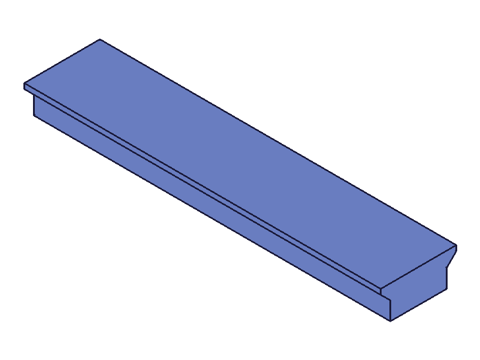
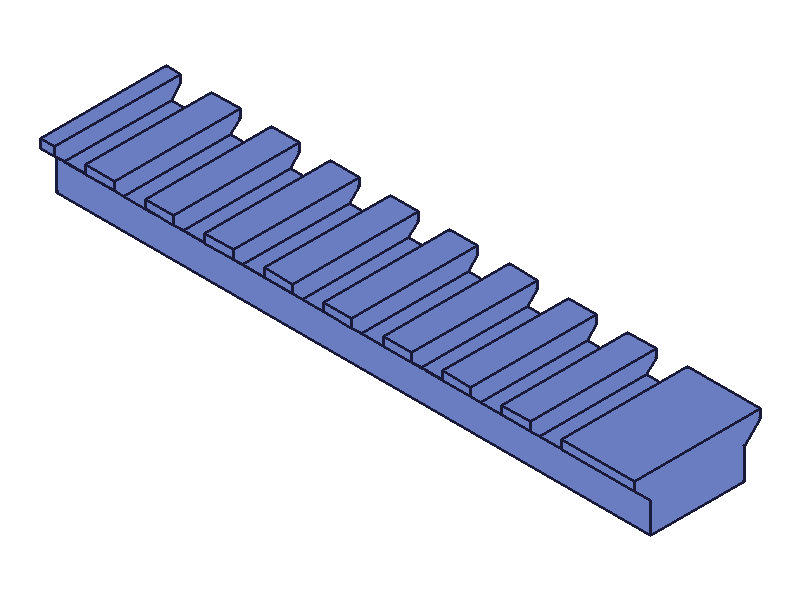
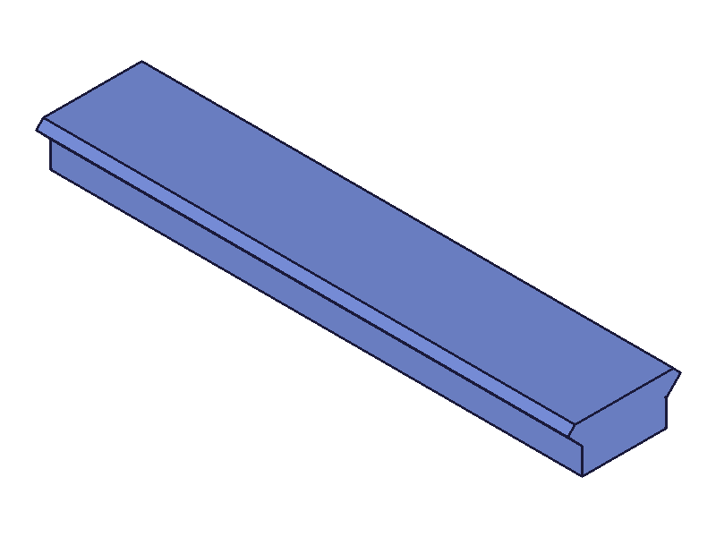
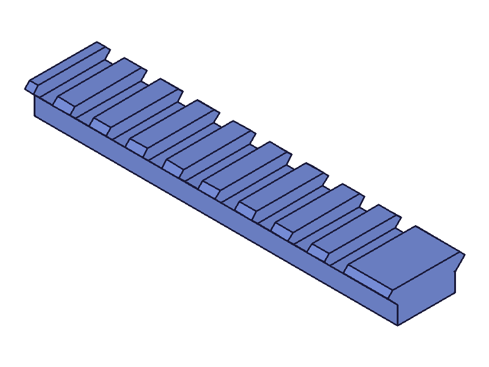

# Picatinny Rail — MIL-STD-1913 Section

**Date:** 2026-03-20

## Goal

Create a MIL-STD-1913 Picatinny rail section using the ClassCAD Part and Sketch APIs. Dimensions sourced from the official standard (MIL-STD-1913 (AR), 3 February 1995).

## Dimensions Used

All from MIL-STD-1913, converted to millimeters:

| Feature | Inches | mm |
|---|---|---|
| Top flat width | .835 | 21.21 |
| Body width (below dovetail) | .617 | 15.67 |
| Dovetail height | .164 | 4.16 |
| Dovetail angle | 45° | 45° |
| Slot width | .206 | 5.23 |
| Slot depth | .118 | 3.00 |
| Slot spacing (center-to-center) | .394 | 10.01 |
| Tooth width (derived) | .188 | 4.78 |

Body height below the dovetail is application-dependent (not specified in the standard). Used 5.0mm.

## Cross-Section Profile

### v1 — vertical lip (incorrect)

First attempt had a vertical lip at the top of the dovetail — 90° corners where the widest point meets the flat top:

```
  5 __________________ 4      <- top flat (21.21mm)
   |                  |       <- vertical lip (1.39mm)
 6/                    \3     <- 45° flare (2.77mm)
  |                    |      <- body (15.67mm)
 7|____________________|2
  0                    1      <- bottom
```

This made the teeth "pointy" at the top — missing the upper 45° chamfer.

### v2 — symmetric 45° dovetail (correct)

Fixed profile: 45° on both top and bottom of the dovetail. The lower 45° is the bearing surface, the upper 45° is the matching chamfer. The widest point (21.21mm) is at the midpoint of the dovetail, and the top flat narrows to 18.43mm:

```
     5 ____________ 4        <- top flat (18.43mm)
      /            \         <- 45° inward (upper chamfer, 1.39mm)
   6 /              \ 3      <- widest point (21.21mm)
     \              /        <- 45° outward (bearing surface, 2.77mm)
    7 \            / 2       <- body top (15.67mm)
       |          |
       |__________|          <- bottom
       0          1
```

## Method

1. **Sketch the cross-section** — 8 individual `sketch.line` calls forming a closed loop on the XY plane. Batch line creation didn't work as expected (returned single ID instead of array), so lines were drawn one at a time.

2. **Create sketch region** — `sketch.sketchRegion` with all 8 line IDs.

3. **Extrude the rail body** — `part.extrusion` type UP, limit2=100mm along Z. Benign `GetNormal` error (documented, safe to ignore).

4. **Position slot cutter** — `part.workCSys` with offset to place a box at the first slot position: centered in X (wider than the rail), top-of-rail minus slot depth in Y, half-tooth offset in Z.

5. **Create slot box** — `part.box` referenced to the workCSys. 25.21mm × 3.0mm × 5.23mm (length × width × height = X × Y × Z).

6. **Pattern the slots** — `part.linearPattern` along a Z-axis `workAxis`. 9 instances at 10.01mm spacing, merged=true.

7. **Boolean subtract** — `part.boolean` type SUBTRACTION, target=rail extrusion, tools=[slot pattern]. Produces the final slotted rail.

## Results

### v1 — vertical lip (scripts/01-picatinny-rail.mjs)

|  |  |
|---|---|

Sharp 90° corners at the top of the dovetail — teeth are "pointy" at the sides. Missing upper chamfer.

### v2 — symmetric 45° (scripts/02-picatinny-rail-v2.mjs)

|  |  |
|---|---|

Correct profile: 45° chamfer on both top and bottom of the dovetail. Teeth have proper beveled tops. Top flat is 18.43mm (narrower than widest point of 21.21mm).

## Findings

- **Batch `sketch.line` gotcha:** Passing an array of param objects directly as the execute value (`{ 'v1.sketch.line': lineParams }`) creates only one line. Must wrap in positional args array or call individually.
- **workCSys + box + linearPattern + boolean** is a clean workflow for creating patterned cuts. No issues with the pattern-as-boolean-tool chain.
- **`merged: true`** on the linear pattern fuses the slot boxes into one body, which makes the boolean subtraction a single clean operation.
- The STEP file is exported at `files/02-picatinny-rail-v2-final-rail.stp` for verification in external CAD viewers.
- **Profile correction (v1→v2):** The dovetail must have 45° on both top and bottom — the upper chamfer mirrors the lower bearing surface. v1's vertical lip produced incorrect sharp corners on the teeth.
