# Training: Booleans (Deep)

**Date:** 2026-03-20

## Goal

Deep training on `v1.part.boolean` and `v1.part.updateBoolean`. Prior session (2026-03-19) left AGENT NOTEs covering basics — this session goes deeper with systematic coverage.

**Methods to cover:**
- `boolean` — all 3 types: UNION, SUBTRACTION, INTERSECTION
- `boolean` params: id, type, target, tools, name
- `boolean` target/tools with `indices` (multi-solid features)
- `boolean` target/tools as plain IDs vs object `{ id, indices }` syntax
- `updateBoolean` — change type, change target, change tools, change name
- `updateBoolean` — open/close workflow, return values, error behavior

---

## 01 — Basic UNION

Script: `scripts/01-union-basic.mjs` — two overlapping boxes (100x100x60 + 80x80x80 offset [30,30]), UNION.

**Results:**
- `boolean` returned feature ID 290
- No errors (only benign GetNormal on extrusions)
- Visually confirmed: before shows 2 distinct colored bodies, after shows one unified solid

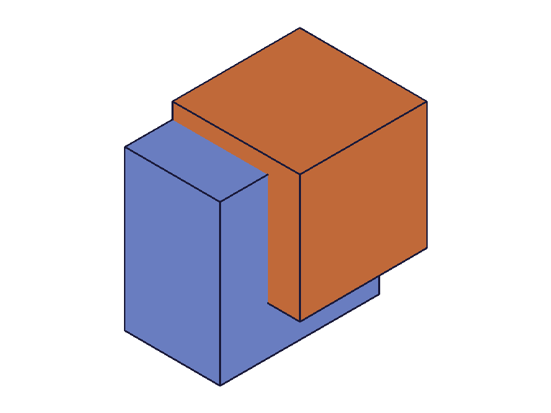
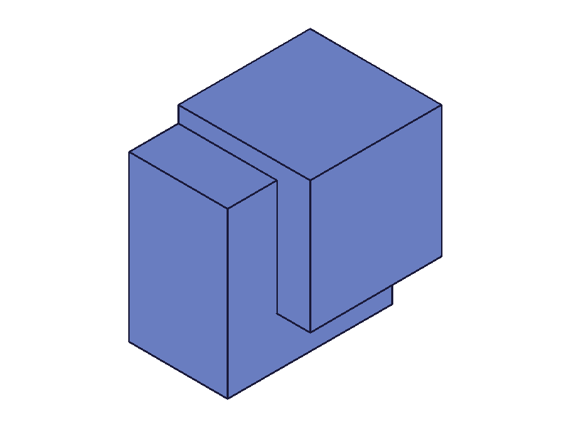

**Learned:** UNION works as expected. Returns feature ID. First boolean in a fresh part with 2 extrusions gets ID 290.

---

## 02 — Basic SUBTRACTION

Script: `scripts/02-subtraction-basic.mjs` — 100x100x60 base, subtract 40x40x80 at [20,50].

**Results:**
- `boolean` returned 290
- Visually confirmed: clear rectangular notch cut from the block

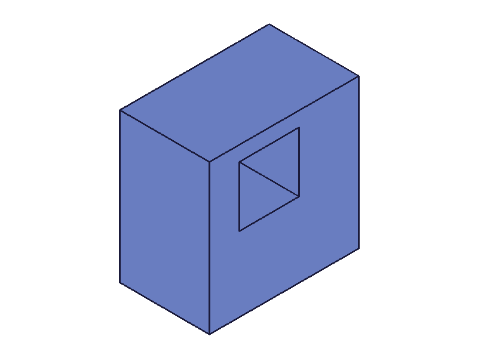

**Learned:** SUBTRACTION: target = body to keep, tools = bodies to remove. Tool positioned asymmetrically for visible cut.

---

## 03 — Basic INTERSECTION

Script: `scripts/03-intersection-basic.mjs` — 100x100x60 + 60x60x80 at [50,50], INTERSECTION.

**Results:**
- `boolean` returned 290
- Visually confirmed: result is the smaller overlap region (50x50x60 box)

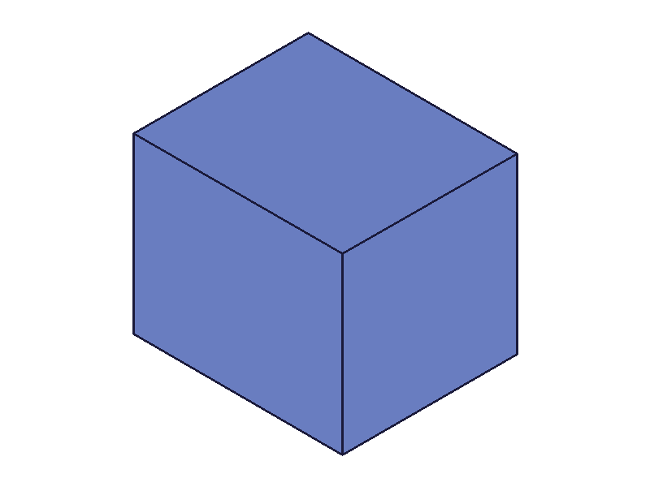

**Learned:** INTERSECTION keeps only the shared volume between target and tools.

---

## 04 — Named Boolean

Script: `scripts/04-named-boolean.mjs` — UNION with `name: 'MyCustomUnion'`.

**Results:**
- `boolean` returned 226
- No errors

**Learned:** Custom `name` param works silently. Feature ID differs from 01 (226 vs 290) — likely due to different sketch geometry sizes producing different internal IDs.

---

## 05 — Multiple Tools

Script: `scripts/05-multi-tools.mjs` — 120x120x50 base, subtract 3 small boxes (20x20x80) at diagonal positions.

**Results:**
- `boolean` returned 522
- No errors
- All 3 holes cut in one call

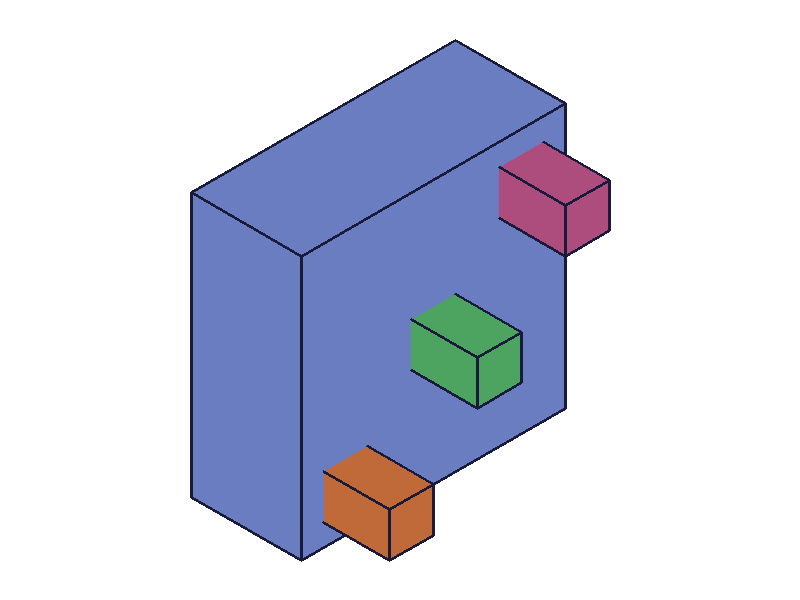
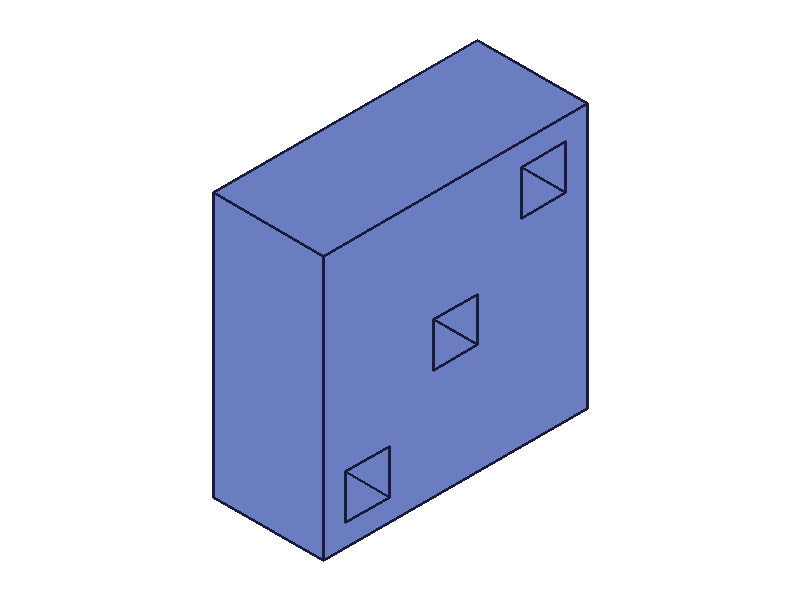

**Learned:** Multiple tools in one boolean call works. All tools applied simultaneously.

---

## 06 — Object-Style Target/Tools

Script: `scripts/06-object-style.mjs` — SUBTRACTION with `target: { id: ext1 }` and `tools: [{ id: ext2 }]`.

**Results:**
- `boolean` returned 226
- Identical behavior to plain ID syntax

**Learned:** Object `{ id }` syntax works interchangeably with plain IDs. The `indices` field inside the object is optional.

---

## 07 — Non-Overlapping UNION

Script: `scripts/07-non-overlapping.mjs` — two 40x40x40 boxes, 100 units apart.

**Results:**
- `boolean` returned 226
- `messages: []`, `maxLevel: 31`
- No errors at all

**Learned:** Non-overlapping UNION succeeds silently. The bodies merge conceptually even without shared volume.

---

## 08 — Error Cases

Script: `scripts/08-error-cases.mjs` — 5 error scenarios.

**Results:**

| Test | Result | Error |
|------|--------|-------|
| Empty tools `[]` | null | code 1004: `The type "0" is not supported in PrepareAPIParams!` |
| Invalid tool ID (99999) | null | WARNING: `ToId()/TOID() didn't get an existing or valid id` + ERROR code 1006: `An element of parameter "tools" has an invalid id!` |
| Missing target | null | code 1004: `The parameter "target" must be provided in the api call!` |
| Invalid type string | null | code 1013: `The provided value for parameter "type" is not valid. Possible values are: ["UNION","SUBTRACTION","INTERSECTION"]` |
| Same feature as target AND tool | **226 (success!)** | No errors |

**Learned:**
- Empty tools: cryptic error "type 0 not supported in PrepareAPIParams" — not a helpful message, but indicates empty arrays aren't valid
- Invalid IDs: WARNING + ERROR, returns null
- Missing target: clear error message
- Invalid type: lists valid values in error — useful
- **Same feature as target+tool: SUCCEEDS with no error.** This is surprising and potentially dangerous. The feature may consume itself.

📌 Skill update: Document same-target-tool behavior, empty tools error, error message patterns.

---

## 09 — Non-Overlapping SUBTRACTION

Script: `scripts/09-non-overlap-sub-int.mjs` — two 40x40x40 boxes, 100 apart, SUBTRACTION.

**Results:**
- `boolean` returned 226
- `messages: []`, `maxLevel: 31`

**Learned:** Non-overlapping SUBTRACTION succeeds silently. The tool body disappears, target body unchanged. Consistent with prior AGENT NOTE.

---

## 10, 10b — updateBoolean: Change Type

Scripts: `scripts/10-update-type.mjs` (failed without open/close), `scripts/10b-update-type-fixed.mjs` (with openFeature/closeFeature).

**Results (10 — without open/close):**
- ERROR: "The provided feature is not allowed to update. It's not active and open."
- ERROR: `"id" must be provided for update.`

**Results (10b — with open/close):**
- UNION → SUBTRACTION: `updateBoolean` returned 226, no errors
- SUBTRACTION → INTERSECTION: returned 226, no errors
- All 3 states visually confirmed as distinct shapes

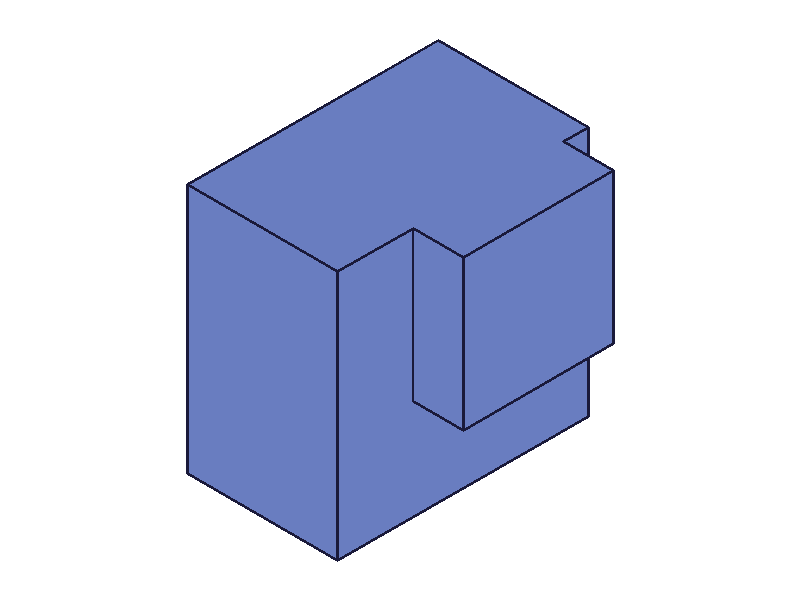
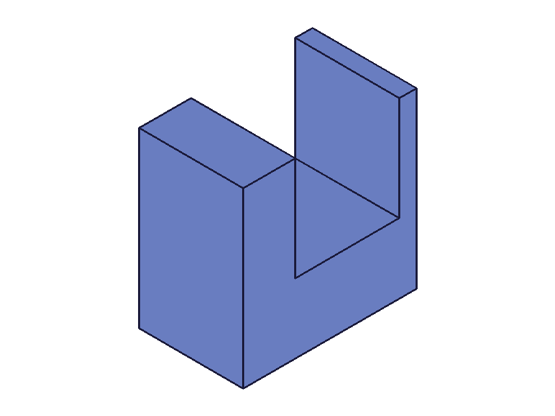

**Learned:**
- `updateBoolean` REQUIRES `openFeature`/`closeFeature` bracket (like all update* functions)
- Returns the boolean feature ID on success (not null like some other updates)
- Can cycle through all 3 types on the same feature

📌 Skill update: Document that updateBoolean returns feature ID, not null.

---

## 11, 11b — updateBoolean: Change Name

Script: `scripts/11b-update-name-fixed.mjs` — rename from 'OriginalName' to 'RenamedBoolean'.

**Results:**
- `updateBoolean` returned 226, no errors

**Learned:** Name update works as a partial update — only the name changes, type/target/tools preserved.

---

## 12, 12b — updateBoolean: Change Target and Tools

Script: `scripts/12b-update-target-tools-fixed.mjs` — 3 boxes, boolean ext1-ext2, then update to ext3-ext1.

**Results:**
- `updateBoolean` returned 311, no errors
- Visually confirmed: geometry changed after update

**Learned:** Can change both target and tools in one update call. Uses object syntax `{ id: featureId }` for target/tools in update.

---

## 13 — Chain Booleans (Boolean on Boolean)

Script: `scripts/13-chain-booleans.mjs` — UNION ext1+ext2, then SUBTRACTION result-ext3.

**Results:**
- First boolean: 311
- Second boolean (using first boolean as target): 490, no errors
- Visually confirmed: union then cut

**Learned:** Boolean features can be used as targets for subsequent booleans. This is the primary way to chain operations.

---

## 14 — Non-Overlapping INTERSECTION

Script: `scripts/14-non-overlap-intersection.mjs` — two 40x40x40 boxes, 100 apart, INTERSECTION.

**Results:**
- `boolean` returned 226
- ERROR: `"blank solid was removed."`
- No solid snapshot generated (only sketch snapshots)

**Learned:** Non-overlapping INTERSECTION returns a feature ID but produces no geometry — the result is empty and the solid is removed with an error message. Unlike UNION/SUBTRACTION (which succeed silently), INTERSECTION with no overlap triggers level-51 ERROR.

📌 Skill update: Document different behavior for non-overlapping across the 3 types.

---

## 15, 15b, 15c — Tools with Indices

Scripts: 15/15b failed due to linearPattern requiring `targets` (plural) and `dir1.references`. Script 15c fixed both.

**Results (15c):**
- Pattern created: ID 234
- `boolean` with `tools: [{ id: patId, indices: [2] }]`: returned 478, no errors
- Only instance at index 2 was used as tool

**Learned:** `indices` on tools works — picks specific solid instances from a multi-solid feature (e.g. linearPattern). Index is 0-based.

📌 Skill update: Confirm indices are 0-based, document with pattern example.

---

## 16, 16b, 16c — Target with Indices

Script 16c: pattern 3 boxes, use pattern as boolean target with `indices: [0]`.

**Results:**
- `boolean` with `target: { id: patId, indices: [0] }`: returned 391, no errors

**Learned:** Target indices work the same way — pick specific solid instance from multi-solid feature.

---

## 17 — 3-Way Intersection

Script: `scripts/17-intersection-3way.mjs` — 3 overlapping boxes, INTERSECTION with 2 tools.

**Results:**
- `boolean` returned 311, no errors

**Learned:** INTERSECTION with multiple tools computes the intersection of all bodies (target ∩ tool1 ∩ tool2). Works correctly.

---

## 18 — updateBoolean on Wrong Feature Type

Script: `scripts/18-update-wrong-type.mjs` — open an extrusion feature, call updateBoolean on it.

**Results:**
- ERROR: `The provided value for parameter "type" is not valid. Possible values are: ["UP","DOWN","SYMMETRIC","CUSTOM"]`

**Learned:** `updateBoolean` doesn't validate that the feature IS a boolean — it dispatches to whatever feature type is open. When called on an open extrusion, it tries to update the extrusion and complains about the type enum being wrong for extrusions. This means `updateBoolean` is essentially a generic feature updater that just passes params through.

📌 Skill update: Document that updateBoolean dispatches to the open feature's actual type, no boolean-specific validation.

---

## 19, 19b — Boolean + Fillet

Script: `scripts/19b-boolean-fillet-fixed.mjs` — subtract, then fillet 4 edges of the boolean result.

**Results:**
- Boolean: 226
- `getBrepGeometryByIndex` on boolean feature: found edges [275, 278, 338, 276]
- Fillet: returned 372, no errors

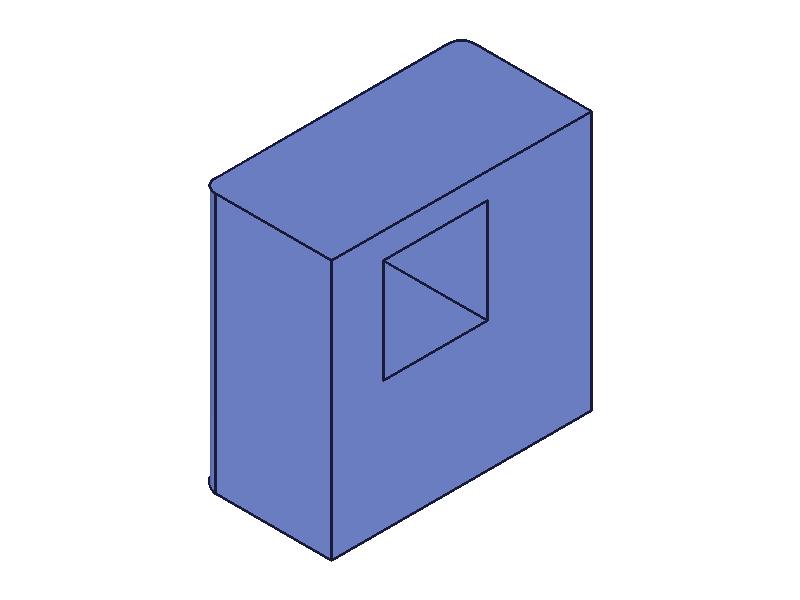

**Learned:** Fillet works on edges of boolean result. Use `getBrepGeometryByIndex` with the boolean feature ID to get edge IDs.

---

## 20, 20b — Pattern a Boolean Feature

Script: `scripts/20b-pattern-boolean-fixed.mjs` — subtract a hole from a plate, then linearPattern the boolean feature.

**Results:**
- Boolean: 234
- Pattern of boolean: returned 380, no errors

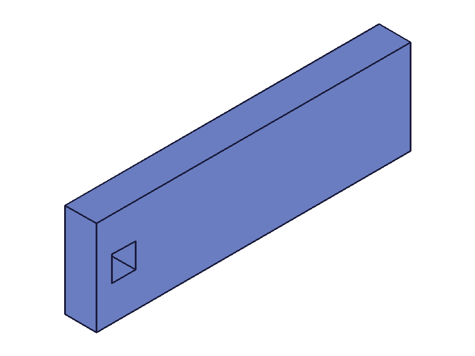
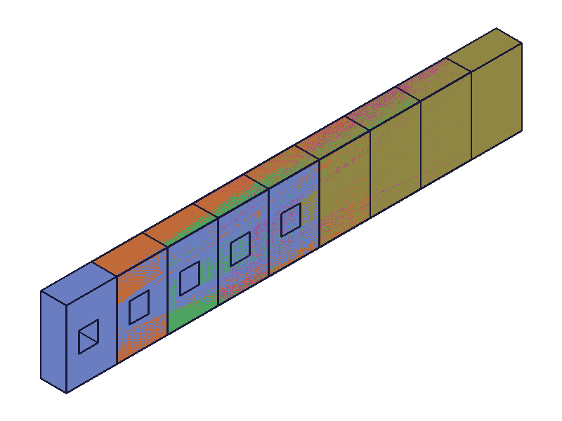

**Learned:** Boolean features can be patterned — creates repeated instances of the boolean operation. This is the standard workflow for repeated holes/cuts.

---

## Coverage Checklist

- [x] `boolean` — all 3 types (UNION, SUBTRACTION, INTERSECTION)
- [x] `boolean` — every documented param (id, type, target, tools, name)
- [x] `boolean` — target as plain ID and as `{ id }` object
- [x] `boolean` — tools as plain IDs and as `[{ id }]` objects
- [x] `boolean` — tools with `indices`
- [x] `boolean` — target with `indices`
- [x] `boolean` — multiple tools in one call
- [x] `boolean` — non-overlapping bodies (all 3 types)
- [x] `boolean` — chaining (boolean on boolean)
- [x] `boolean` — error cases (empty tools, invalid IDs, missing target, invalid type, same target+tool)
- [x] `boolean` — 3-way intersection
- [x] `updateBoolean` — change type (all 3 transitions)
- [x] `updateBoolean` — change name
- [x] `updateBoolean` — change target and tools
- [x] `updateBoolean` — requires openFeature/closeFeature
- [x] `updateBoolean` — returns feature ID (not null)
- [x] `updateBoolean` — on wrong feature type (dispatches to actual type)
- [x] Cross-method: boolean + fillet
- [x] Cross-method: boolean + linearPattern (pattern a boolean)

## Skill Updates

Findings to apply:

1. **updateBoolean returns feature ID** — existing NOTE says "Can change type, name, target, or tools when feature is open" but doesn't mention return value
2. **Non-overlapping behavior differs by type**: UNION/SUBTRACTION succeed silently; INTERSECTION returns ID but ERROR "blank solid was removed"
3. **Same feature as target+tool**: succeeds with no error — potentially dangerous
4. **Empty tools array**: ERROR code 1004 "type 0 not supported in PrepareAPIParams"
5. **updateBoolean dispatches to open feature type** — no boolean-specific validation
6. **indices are 0-based** for both target and tools
7. **Boolean features can be used as**: targets for subsequent booleans, targets for patterns, sources for brep edge queries (fillet/chamfer)
