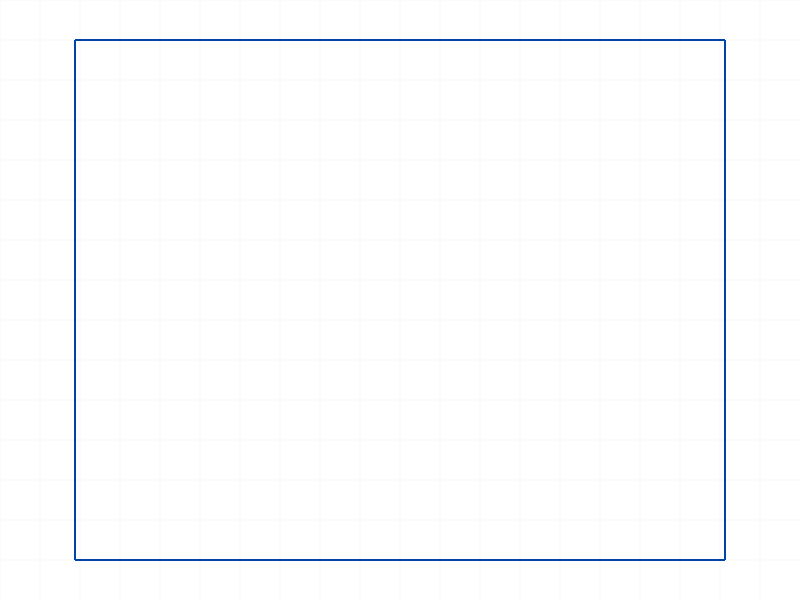
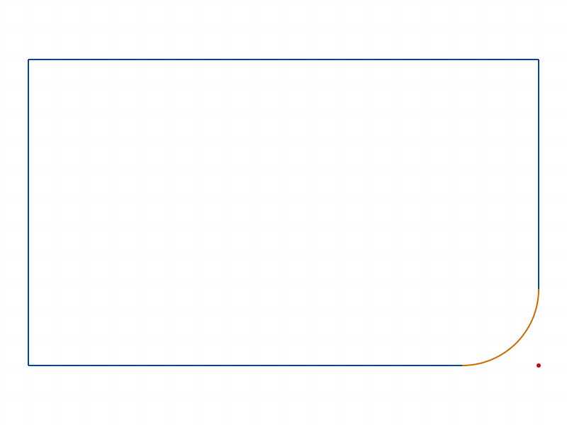
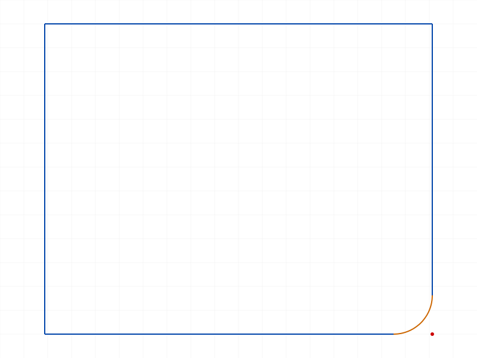
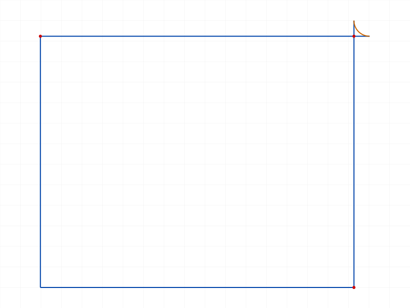
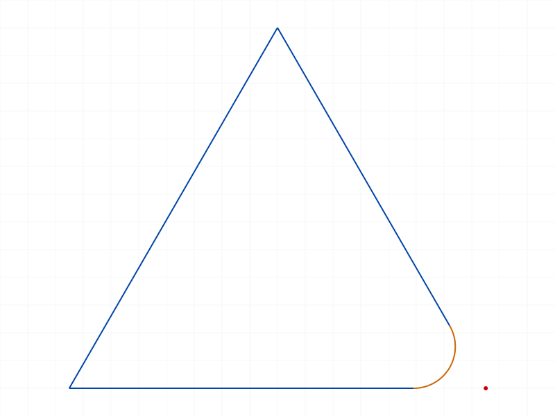
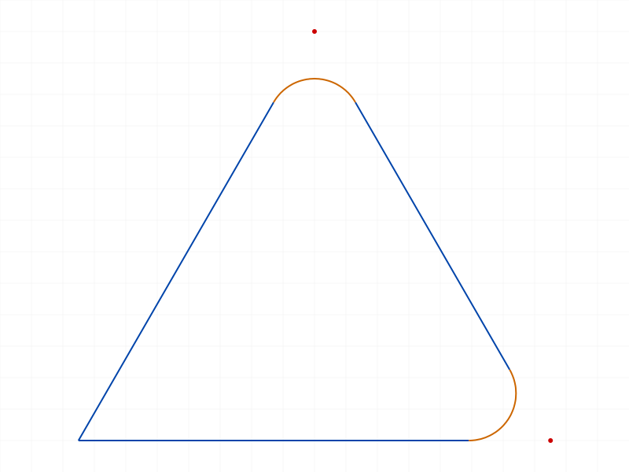
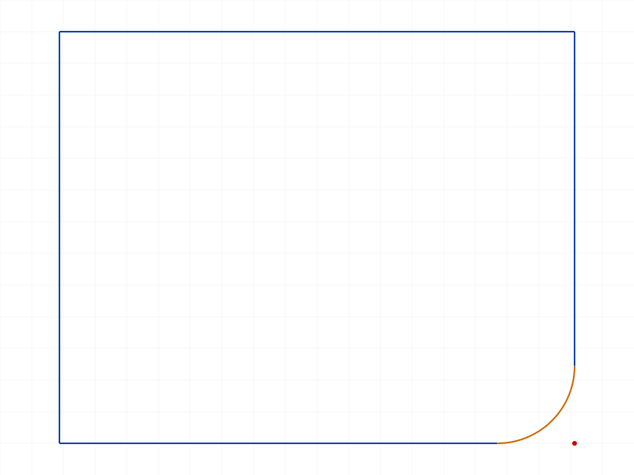
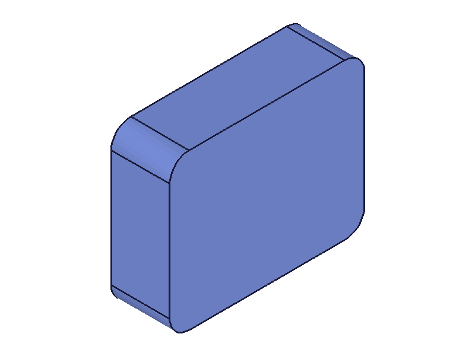
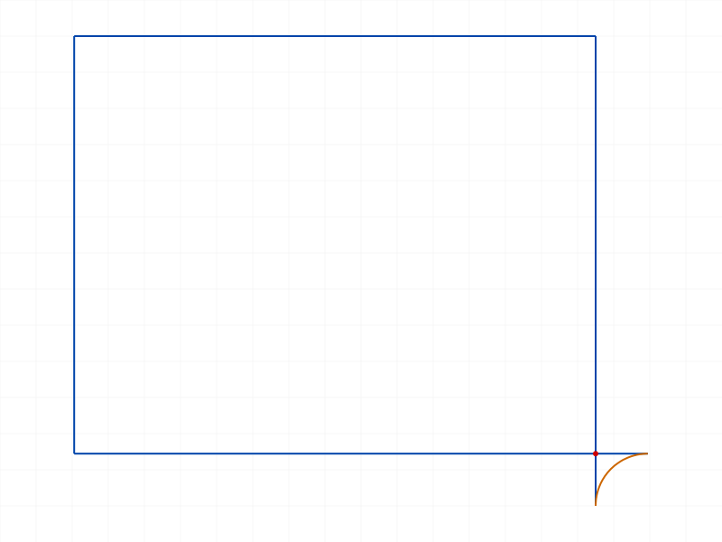

# Sketch Fillets Training Session

**Date:** 2026-03-20  
**Topic:** `v1.sketch.fillet` + `v1.sketch.undoFillet`  
**Session:** `workspace/training/2026-03-20_14-18-00_sketch-fillets/`

## Goal

Verify and extend existing AGENT NOTE (dated 2026-03-20, 13 prior tests) on sketch fillets. Cover: offset/radius/default behavior, priority, sequential filleting, edge cases, non-line geometry, collinear/disconnected errors, non-90° angles, undoFillet, double-fillet, workflow integration, constraints, negative offset.

## Test Results

### 01-basic-offset
- `fillet({ id: sketchId, lineIds: [line1, line2], offset: 10 })` on 100×80 rectangle
- Returns `[94, 92, 96, 95]` = [arcId, controlPointId, startPointId, endPointId]
- Arc radius ≈ 10 (matches offset at 90°)

✅ Confirms return tuple format. Before/after shows corner replaced by arc.

### 02-basic-radius
- `fillet({ ..., radius: 15 })` on 100×80 rectangle
- Returns same tuple structure, arc.radius = 15

✅ Larger arc visible compared to 01.

### 03-default
- `fillet({ id, lineIds })` — no offset or radius
- Default offset = 1/4 × shortest line. For 100×80 rect, shortest side = 80, so offset = 20

✅ Confirms default behavior. Visibly larger fillet than 01/02.

### 04-offset-priority
- `fillet({ ..., offset: 10, radius: 50 })`
- Arc radius ≈ 10, NOT 50. **Offset wins when both specified.**

✅ Small fillet — offset=10 overrode radius=50.

### 05-sequential-4corners
- Filleted all 4 corners of a rectangle sequentially (offset=8)
- Each call succeeds, returns fresh tuple. IDs increment: [94,...], [113,...], [132,...], [151,...]

✅ Rounded rectangle. Each corner filleted independently.

### 06-edge-cases
- `offset: 0` → ERROR "Invalid arc parameters" (null result)
- `offset: -5` → **Succeeds!** Returns valid tuple. Surprising.
- `offset: 100` on 100-wide rect → ERROR "Can't create a fillet with offset larger than line length!"
- `radius: 0.001` → Succeeds, creates micro-fillet

✅ Snapshot shows the negative-offset + micro-radius fillets that succeeded.

### 07-non-line-geom
- Circle creation failed (script used wrong param), but fillet with non-line IDs correctly errors: "lineIds has the wrong type! It should be of type (string|real|id)"
- `v1.sketch.arcByThreePoints` → "Unknown command" — doesn't exist

✅ Lines-only enforcement confirmed. No snapshot (script errored early).

### 08-collinear
- Two collinear lines (both along X axis) → ERROR "Can't create a fillet between parallel lines!"

✅ No snapshot (error, no geometry created).

### 09-disconnected
- Two perpendicular lines that don't share a point → ERROR "Lines don't have incident points!"

✅ No snapshot (error, no geometry created).

### 10-non-90-angles
- 60° triangle: fillet with radius=10 succeeds
- Second fillet on adjacent corner also succeeds

✅ Arc shape adapts to acute angle. Second fillet on same triangle works.

### 11-undo-fillet
- Create fillet, then `undoFillet({ id: sketchId, arcId: 94 })`
- Returns null with no errors. Corner restored.

✅ Before/after: arc removed, sharp corner restored.

### 12-undo-wrong-arc
- `undoFillet` with a line ID → ERROR "arcId has a wrong id type! Provide only following id types: ['sketch-arc']"
- `undoFillet` with bogus ID 99999 → "An element of parameter 'arcId' has an invalid id!"

✅ No snapshot (error tests). 📌 Skill update: document undoFillet error messages.

### 13-double-fillet
- Fillet corner once (succeeds), then try same corner again → ERROR "Lines don't have incident points!"
- Makes sense: after filleting, the two original lines no longer share a point

✅ Snapshots identical — second fillet had no effect. 📌 Skill update: can't double-fillet.

### 14-fillet-region-extrude
- 4-corner fillet → sketchRegion → extrusion
- All succeed. Extrusion produces benign "Sketch.GetNormal" error (expected).

✅ Full workflow: rounded rectangle extruded into solid with rounded edges. 📌 Skill update: confirm workflow.

### 15-constraints
- `v1.sketch.getConstraints` → "Unknown command"
- API doesn't exist. Fillet constraints (Fillet_Coinc ×3, Fillet_Tan ×2) visible only in structure tree output.

✅ No snapshot. 📌 Skill update: getConstraints doesn't exist.

### 16-negative-offset
- `fillet({ ..., offset: -5 })` succeeds, returns valid tuple
- Arc geometry created with valid positions

✅ Negative offset silently accepted. Unclear geometric meaning vs positive. Existing note already flags this.

## Skill Updates

The existing AGENT NOTE was comprehensive. Added 4 bullets:

1. 📌 **Double-fillet same corner** — fails, lines no longer share incident point
2. 📌 **undoFillet error messages** — wrong type and invalid ID strings
3. 📌 **v1.sketch.getConstraints doesn't exist** — structure tree only
4. 📌 **Full workflow confirmed** — fillet → sketchRegion → extrusion end-to-end
