# Training: part / linearPattern

**Date:** 2026-03-20

## Goal

Re-train `v1.part.linearPattern` + `v1.part.updateLinearPattern` thoroughly, with emphasis on parameter semantics, update behavior, and feature-target variants.

**Methods to cover:**

- `v1.part.linearPattern`
  - params: `id`, `name`, `targets` (id + object + indices), `dir1` (`references`, `inverted`, `distance`, `count`, `merged`), `dir2` (`references`, `inverted`, `distance`, `count`)
- `v1.part.updateLinearPattern`
  - params: `id`, `name`, `targets`, `dir1.*`, `dir2.*`
  - open/close requirement behavior
- Supporting verification
  - `v1.part.calculateMassProperties`
  - `v1.part.workAxis`, `v1.part.workPoint`, `v1.part.workCSys`
  - `v1.part.openFeature`, `v1.part.closeFeature`

**Coverage checklist:**

- [x] `linearPattern` happy path (`dir1` axis reference)
- [x] `count` semantics (includes original)
- [x] `distance` semantics (per-step spacing)
- [x] expression distance in `dir1`
- [x] `inverted` direction behavior
- [x] `merged` behavior
- [x] `dir2` 2D grid behavior
- [x] `targets` as raw id
- [x] `targets` as object `{id}`
- [x] `targets` object with `indices`
- [x] `updateLinearPattern` without openFeature (expected failure)
- [x] `updateLinearPattern` with openFeature/closeFeature (success)
- [x] update `dir1` fields
- [x] update/add `dir2` fields
- [x] multi-target pattern (2 targets)
- [x] error case: wrong type for boolean flags

**Questions:**

- Are prior AGENT NOTE statements still accurate on current runtime?
- Does `targets[].indices` selection behave predictably with multi-solid source features?
- Is `merged` performing boolean merge-like behavior when instances overlap?

---

## Session log

## 01 — Happy path, count + distance semantics

Script: `scripts/01-happy-path-count-distance.mjs`

**What/why:** Baseline `linearPattern` with axis reference, `count=4`, `distance=30`.

**Key results:**
- Seed box volume: `1600`
- After pattern volume: `6400`
- Pattern return: `136` (feature id)
- CoG moved from `x=-110` to `x=-65`.

|  | 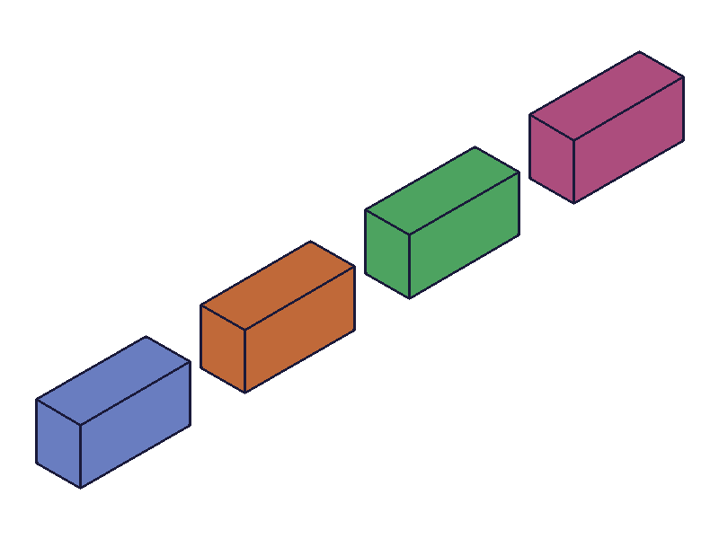 |
|---|---|

**Learned:**
- `count` includes original instance (4 total instances).
- `distance` is per-step spacing.
- Raw target ID form `targets: [featureId]` works.

**📌 Skill update:** No discrepancy vs existing note.

## 02 — Expression distance

Script: `scripts/02-expression-distance.mjs`

**What/why:** Validate expression parsing for `dir1.distance`.

**Key results:**
- `distance: '90/3'` accepted.
- Pattern succeeded with expected total volume `6400`.
- CoG matches non-inverted baseline spacing (`x≈-65`).

|  |  |
|---|---|

**Learned:**
- Expression strings for `distance` still work.
- Object target syntax `targets: [{ id: featureId }]` works.

**📌 Skill update:** Existing note already states expression distance support.

## 03 — Inverted direction

Script: `scripts/03-inverted-direction.mjs`

**What/why:** Confirm `dir1.inverted=true` flips propagation direction.

**Key results:**
- Pattern succeeded, total volume `6400`.
- CoG moved to `x≈-155` (opposite side from non-inverted case).

|  | 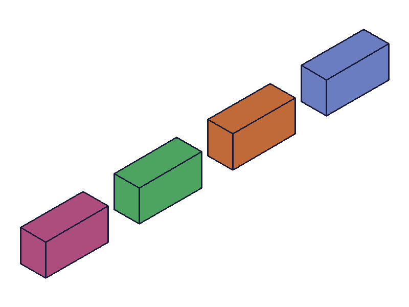 |
|---|---|

**Learned:**
- `inverted` reverses direction along same reference axis as expected.

**📌 Skill update:** Existing note mentions boolean type; add explicit geometric effect phrasing for `inverted`.

## 04 — dir2 grid (2D pattern)

Script: `scripts/04-dir2-grid.mjs`

**What/why:** Exercise second-direction parameters (`dir2.references`, `dir2.distance`, `dir2.count`).

**Key results:**
- `dir1.count=3`, `dir2.count=2` produced volume `9600` (= 6 × 1600).
- Pattern return feature id `144`.

|  | 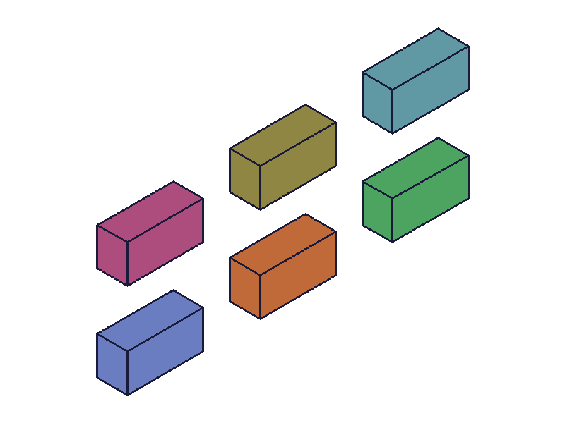 |
|---|---|

**Learned:**
- `dir2` multiplies instance count as expected (grid behavior confirmed).

**📌 Skill update:** Existing note says 2D grid works; now reconfirmed on current runtime.

## 05 — merged=true with overlapping instances

Script: `scripts/05-merged-overlap.mjs`

**What/why:** Determine what `dir1.merged=true` actually does on overlapping instances.

**Key results:**
- Seed volume: `8000` (40×20×10)
- Pattern settings: `count=3`, `distance=20`, `merged=true`
- Final volume: `16000` (NOT `24000`)

| 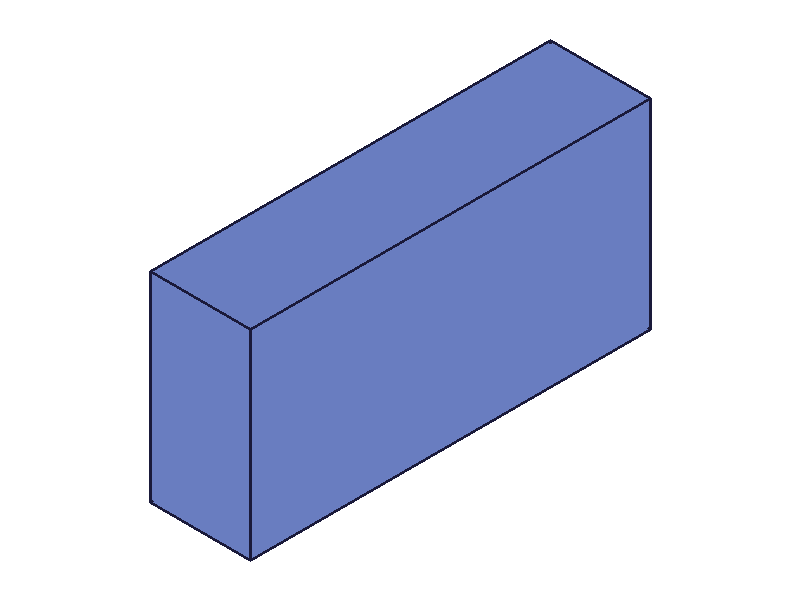 | 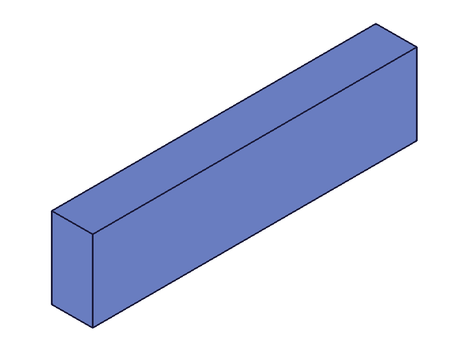 |
|---|---|

**Learned:**
- `merged=true` performs geometry merging/union-like behavior across overlapping instances.
- Overlap volume is removed in final result (volume equals union of overlapping copies).

**📌 Skill update:** Add explicit AGENT NOTE for `merged=true` semantics: overlap is fused (not raw additive).

## 06 — Target indices (select specific instance from pattern)

Script: `scripts/06-target-indices.mjs`

**What/why:** Test `targets[].indices` to select a specific solid instance from a prior pattern feature, then pattern that single instance in a second direction.

**Setup:** Box → linearPattern(count=3, X-axis) → second linearPattern targeting `{ id: p1, indices: [1] }` along Y-axis.

**Key results:**
- First pattern: volume `4800` (3 × 1600).
- Second pattern (indices=[1]) added 1 copy of instance[1] along Y → volume `6400` (4 × 1600).
- CoG Y shifted from 25 to 32.5, confirming the second pattern only duplicated one instance.

| 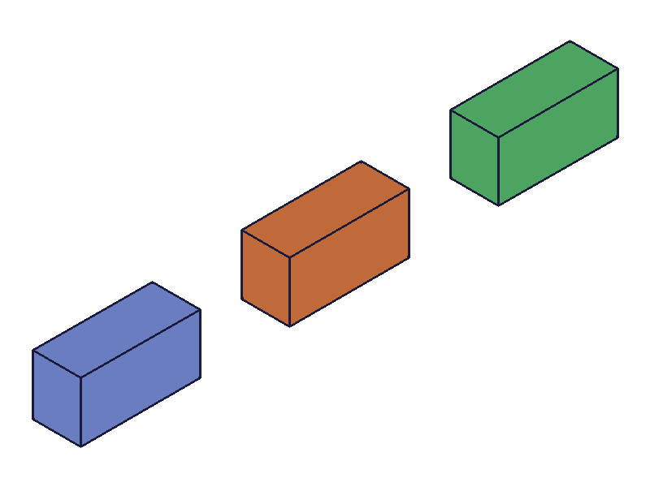 | 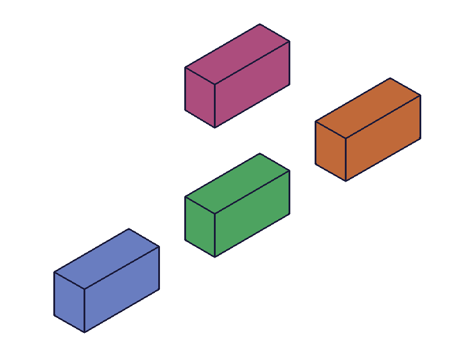 |
|---|---|

**Learned:**
- `targets[].indices` works for selecting specific solid instances from multi-solid features.
- Index is 0-based.

**📌 Skill update:** Reconfirmed indices behavior. Existing note mentions it.

## 07 — updateLinearPattern without openFeature (expected failure)

Script: `scripts/07-update-without-open.mjs`

**What/why:** Confirm that `updateLinearPattern` fails without `openFeature`.

**Key results:**
- `updateLinearPattern` returned `null`.
- Two error messages:
  - `"The provided feature is not allowed to update. It's not active and open."`
  - `"id" must be provided for update.`

**Learned:**
- Confirmed: openFeature is required before updateLinearPattern.
- The second error message ("id must be provided") is misleading — id WAS provided, but the feature gate blocks before id validation.

**📌 Skill update:** No change — existing AGENT NOTE already documents this requirement.

## 08 — updateLinearPattern with openFeature/closeFeature

Script: `scripts/08-update-with-open.mjs`

**What/why:** Confirm proper update flow with open/close and verify geometry change.

**Key results:**
- Before update: count=3, distance=30 → volume `4800`, CoG x=-80
- After update: count=4, distance=45 → volume `6400`, CoG x=-42.5
- `updateLinearPattern` returned feature id `107`.

| 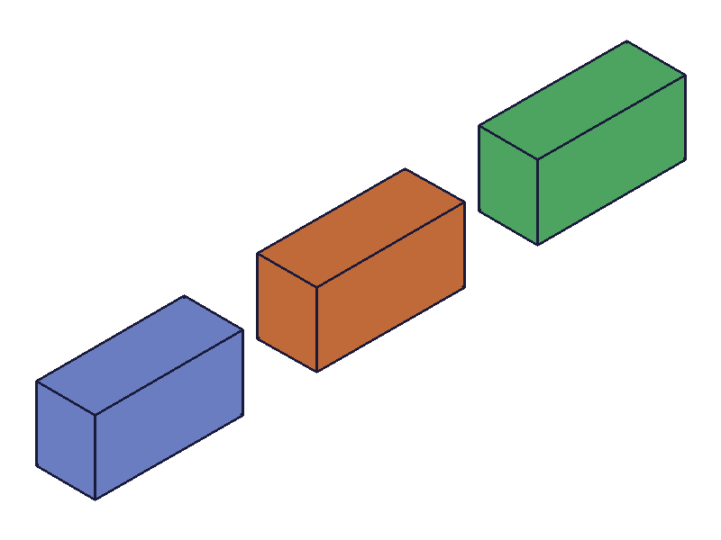 | 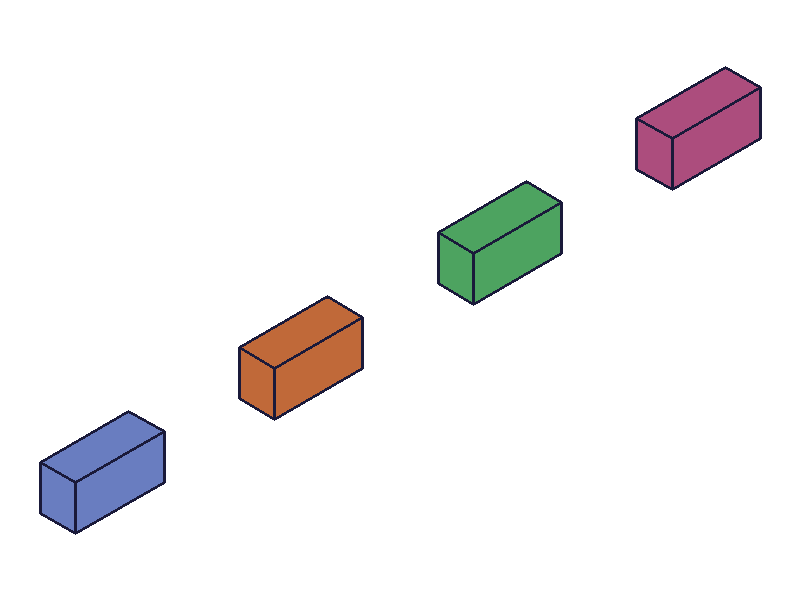 |
|---|---|

**Learned:**
- Partial update works (changed distance + count, didn't re-specify references/merged).
- Returns the feature id on success (vs null on failure).

**📌 Skill update:** Existing note accurate. Add: returns feature id on success, null on failure.

## 09 — updateLinearPattern: add dir2 via update

Script: `scripts/09-update-add-dir2.mjs`

**What/why:** Can you add a `dir2` to a pattern that was created with only `dir1`?

**Key results:**
- Before update: dir1 only (count=2, distance=35) → volume `3200`
- After update: added dir2 (Y-axis, distance=25, count=3) → volume `9600`
- 2×3 = 6 instances, 6 × 1600 = 9600. ✓

| 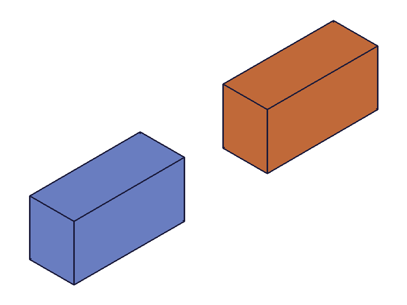 | 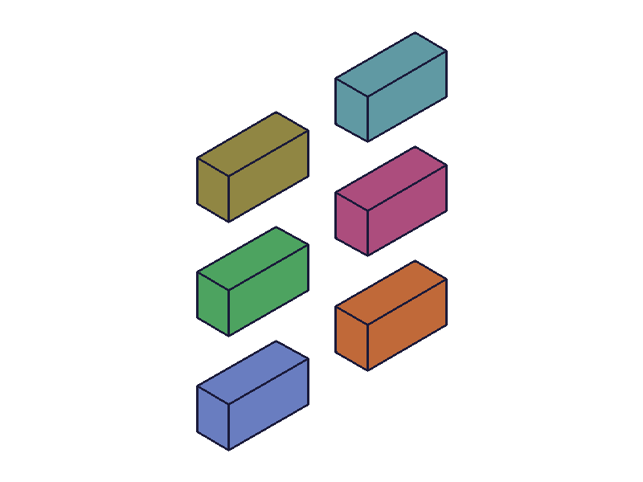 |
|---|---|

**Learned:**
- `dir2` can be added retroactively via `updateLinearPattern`. The pattern upgrades from 1D to 2D grid.

**📌 Skill update:** Add note: dir2 can be added post-creation via update — not limited to creation-time.

## 10 — Multi-target pattern (two box features)

Script: `scripts/10-multi-target.mjs`

**What/why:** Pass two separate features as targets in one linearPattern call.

**Key results:**
- Before: 2 boxes, volume `3200`
- After pattern (count=3, distance=40): volume `9600` (= 6 × 1600)
- Both box features were patterned together as a unit.

| 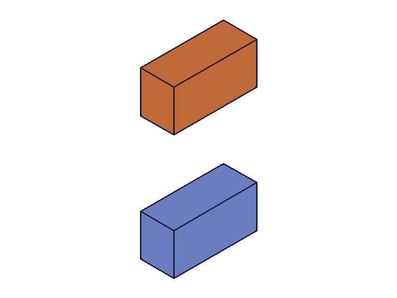 | 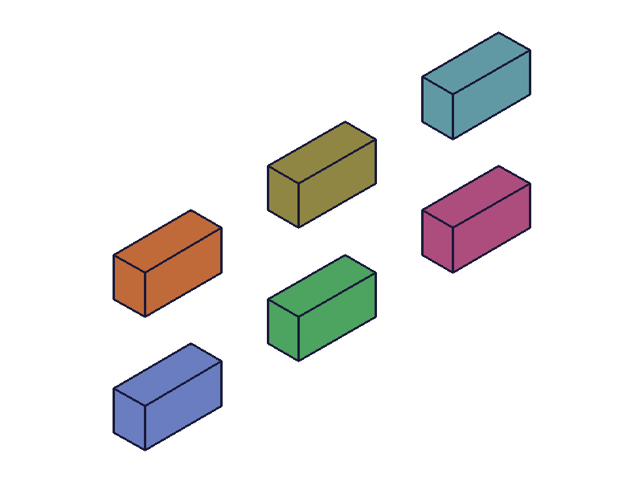 |
|---|---|

**Learned:**
- Multiple targets work as expected — all targets are copied together at each step.

**📌 Skill update:** Existing note mentions it but doesn't spell out "targets copied as a group." Strengthen.

## 11 — String boolean type error (merged: 'TRUE')

Script: `scripts/11-boolean-string-type-error.mjs`

**What/why:** Verify string-typed boolean parameters are rejected.

**Key results:**
- `linearPattern` returned `null`.
- Error: `The parameter "merged" has the wrong type! It should be of type (boolean)`

**Learned:**
- Confirmed: `'TRUE'` (string) is rejected. Must use `true` (JS boolean).

**📌 Skill update:** Existing note already documents this.

## 12 — Two workPoints as direction reference

Script: `scripts/12-two-workpoints-reference.mjs`

**What/why:** Test `dir1.references: [workPoint1, workPoint2]` as direction definition.

**Key results:**
- Points at [0,0,0] and [0,80,0] → pattern propagates along Y.
- Volume `6400` (4 × 1600). CoG Y shifted to 62.5.

| 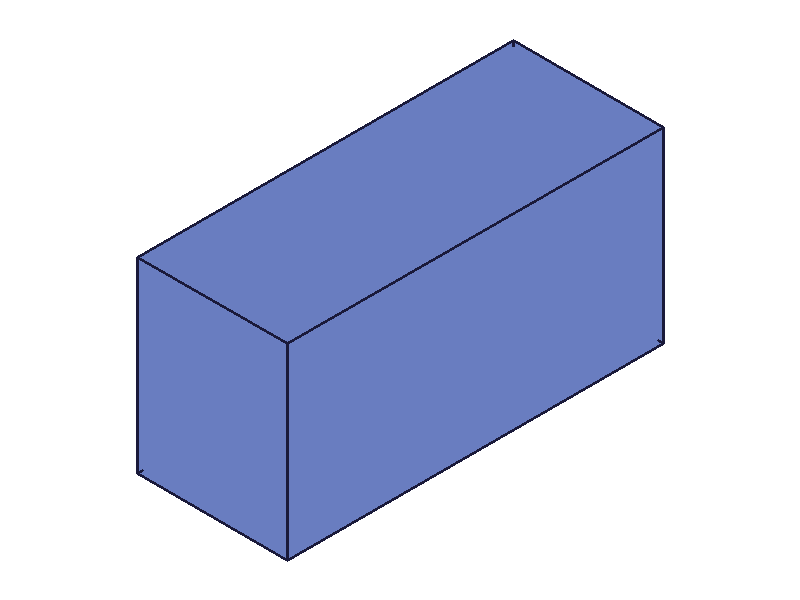 | 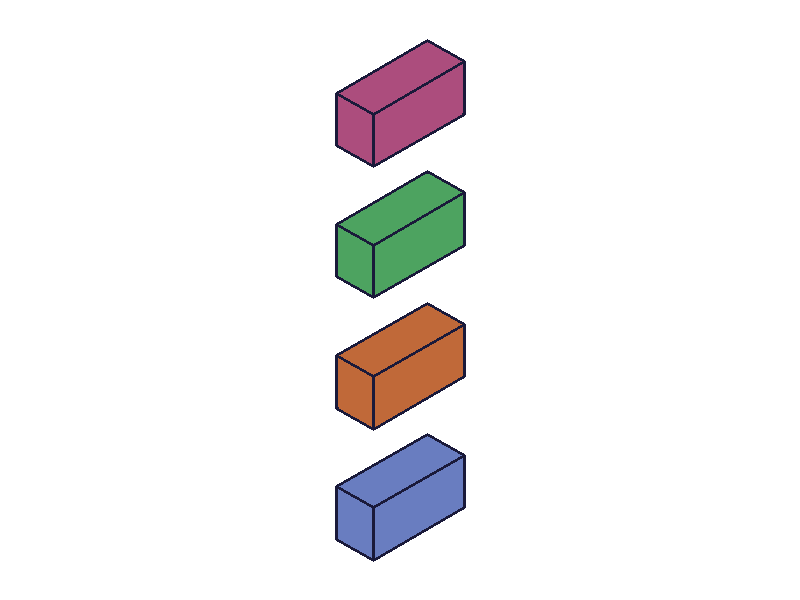 |
|---|---|

**Learned:**
- Two workPoints define direction (point1→point2 vector). Works as documented.

**📌 Skill update:** Existing note confirmed.

## 13 — updateLinearPattern with wrong id type (partId)

Script: `scripts/13-update-wrong-id-type.mjs`

**What/why:** Pass partId instead of pattern feature id to update.

**Key results:**
- Returned `null`.
- Errors: `"The provided id for the feature is not a feature or work geometry id."` + `"id" must be provided for update.`

**Learned:**
- Clear error when wrong id type is used. Even with openFeature, the wrong id type is caught.

**📌 Skill update:** Add note: updateLinearPattern requires pattern feature id, not part id.

## Skill Updates

Updated `knowledge/classcad-skill/references/part.md`:

1. **linearPattern AGENT NOTE (2026-03-20)**
   - Added explicit support confirmation for target forms: `[id]`, `[{id}]`, `[{id, indices}]`
   - Added `indices` is 0-based confirmation
   - Added multi-target group-copy behavior
   - Added explicit `inverted` direction flip behavior
   - Added explicit `merged=true` overlap-fusion semantics with measured volume example

2. **updateLinearPattern AGENT NOTE (2026-03-20)**
   - Added success/failure return behavior (`id` on success, `null` on failure)
   - Added ability to add `dir2` via update (1D→2D conversion)
   - Added wrong-id-type failure behavior (part id rejected)
   - Added note about misleading secondary `"id" must be provided` message

`changes.md` written at: `workspace/training/2026-03-20_17-26-30_part-linearpattern/changes.md`

## 14 — dir2.inverted behavior

Script: `scripts/14-dir2-inverted.mjs`

**What/why:** Verify `dir2.inverted=true` flips second-direction propagation.

**Key results:**
- Pattern config: dir1(count=2,d=35), dir2(count=3,d=25,inverted=true)
- Final volume `9600` (6 instances)
- CoG Y moved near 0 (from initial +25 seed row), confirming replication toward negative Y for dir2.

|  | 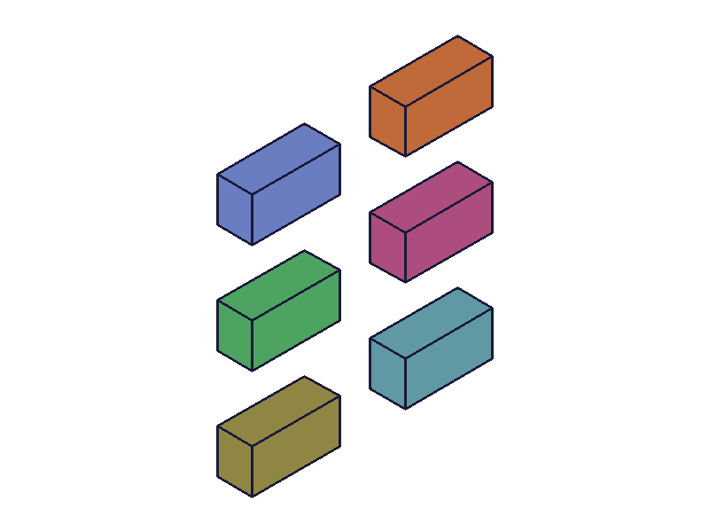 |
|---|---|

**Learned:**
- `dir2.inverted` flips second-axis direction exactly like `dir1.inverted` does for first axis.

**📌 Skill update:** Extend linearPattern AGENT NOTE to mention `dir2.inverted` symmetry.

## 15 — updateLinearPattern targets replacement

Script: `scripts/15-update-targets.mjs`

**What/why:** Test whether `updateLinearPattern` can change `targets` set (not just dir params).

**Key results:**
- Initial pattern targeted only `boxA` with count=2.
- Before update volume `4800` (boxB + 2 copies of boxA).
- After update with `targets: [boxA, boxB]` volume `6400`.
- `updateLinearPattern` returned feature id `152` (success).

| 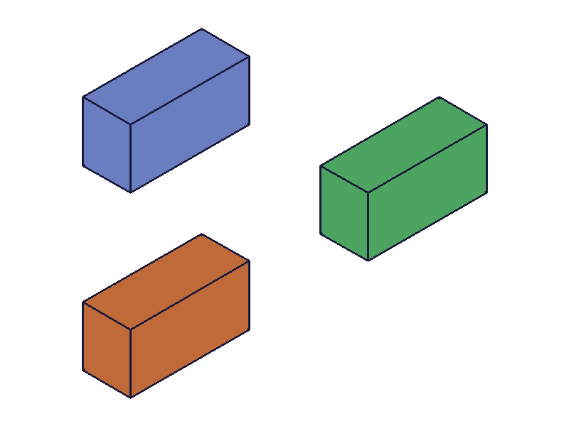 | 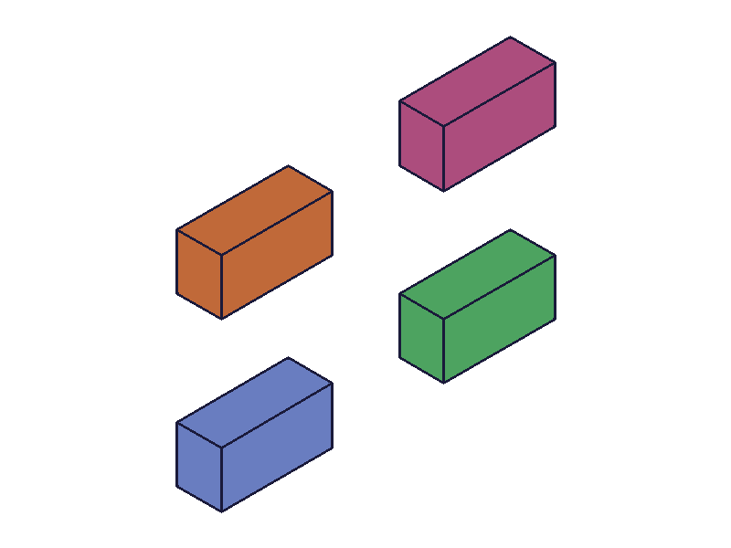 |
|---|---|

**Learned:**
- `updateLinearPattern` can update/replace the `targets` array while retaining existing dir settings.

**📌 Skill update:** Add to updateLinearPattern note: targets are updatable post-creation.

## Skill Updates (final)

Applied updates in `knowledge/classcad-skill/references/part.md`:

- `linearPattern` AGENT NOTE expanded with:
  - all supported `targets` forms (`id`, object, object+indices)
  - indices are 0-based
  - multi-target copy-as-group behavior
  - `inverted` behavior on both `dir1` and `dir2`
  - `merged=true` overlap fusion semantics with measured volume example

- `updateLinearPattern` AGENT NOTE expanded with:
  - success/failure return behavior (id vs null)
  - adding `dir2` via update (1D→2D)
  - updating/replacing `targets` via update
  - wrong-id-type failure behavior + misleading secondary id message

`changes.md` refreshed: `workspace/training/2026-03-20_17-26-30_part-linearpattern/changes.md`

Total scripts run in this session: **15** (`01`–`15`).
