# Training: curve / polyline2d

**Date:** 2026-03-20

## Goal

Train `v1.curve.polyline2d` comprehensively, including parameter semantics, bulge behavior, closure behavior, batching, and failure modes.

**Method to cover:**

- `v1.curve.polyline2d`
  - `id` (shape id requirement)
  - `points` (Array<point>, coplanarity)
  - `bulges` (optional, length behavior, sign behavior, type validation)
  - `close` (default false, true behavior)
  - batch call form (`Array<object>`)

**Supporting setup/verification methods:**

- `v1.part.create`
- `v1.part.entityInjection`
- `v1.curve.shape`
- `v1.curve.cleanShape`
- `v1.common.clear`

**Questions:**

- For open polylines, does `bulges.length` need to be `points.length` or `points.length - 1`?
- For closed polylines (`close: true`), how is the closing segment bulge controlled?
- Does `close: true` require repeating the first point at the end?
- What are the exact runtime errors for non-coplanar points and wrong `points`/`bulges` types?
- Does batch mode (`Array<object>`) behave identically to single-call mode?

## Coverage checklist

- [x] happy path, open polyline, no bulges
- [x] happy path, open polyline, bulges provided
- [x] happy path, close=true without repeated endpoint
- [x] happy path, close=true with repeated endpoint
- [x] bulges sign test (+/-)
- [x] bulges length = points.length
- [x] bulges length = points.length - 1
- [x] bulges length mismatch error behavior (short/long)
- [x] non-coplanar points error behavior
- [x] wrong type: flat points array
- [x] wrong type: bulges non-numeric
- [x] wrong param name (`closed` vs `close`)
- [x] batch mode (Array<object>)
- [x] wrong id type (part/eif id passed to polyline2d)
- [x] cross-method sanity check (multi-shape + cleanShape interaction)

---

## Session log

## 01 — open polyline, no bulges

Script: `scripts/01-open-no-bulges.mjs` — ✅ success.

| 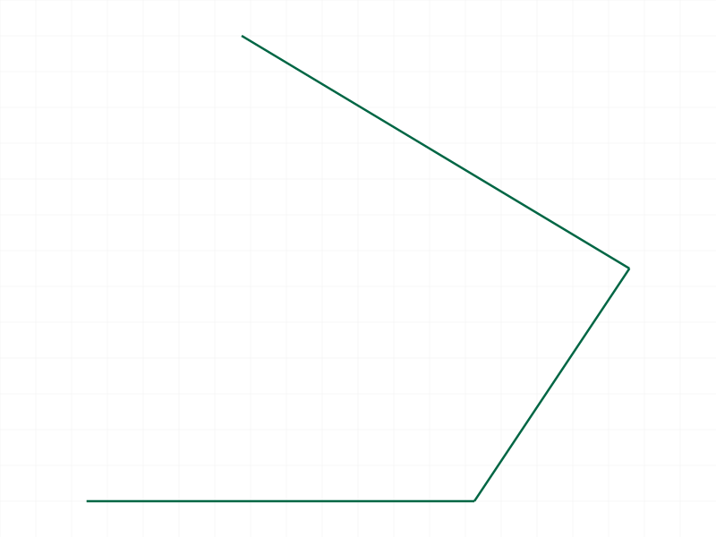 |
|---|

**Learned:** Baseline open polyline creation works with only `points`.

## 02 — open polyline, bulges length = points-1

Script: `scripts/02-open-bulges-points-minus-1.mjs` — ❌ fails.

**Runtime message:** `For creating a polyline there must be as many bulges as positions`

**Learned:** `bulges.length = points.length - 1` is rejected.

**📌 Skill update:** Add explicit pitfall note: points-1 bulges are not accepted.

## 03 — close=true without repeated endpoint

Script: `scripts/03-close-true-no-repeat.mjs` — ✅ success.

| 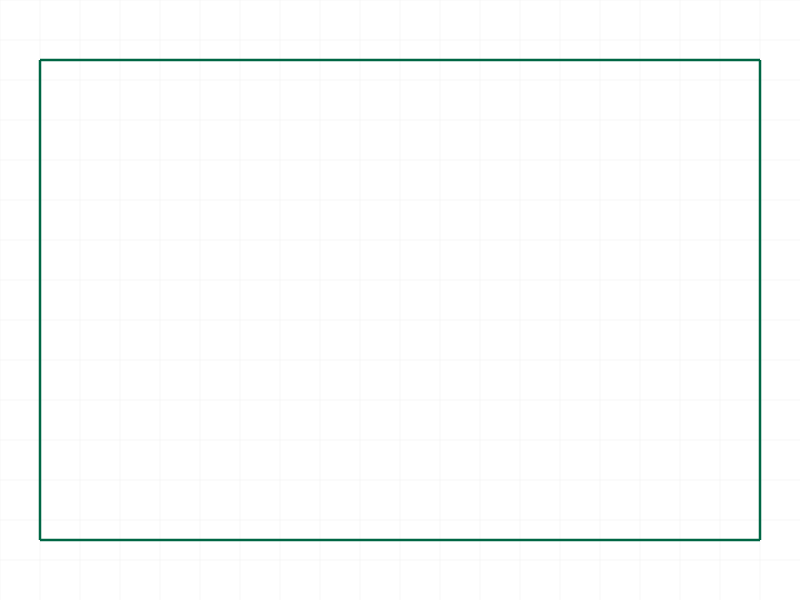 |
|---|

**Learned:** `close: true` is accepted without repeating the first point in `points`.

**📌 Skill update:** Clarify this accepted usage.

## 04 — bulges too short

Script: `scripts/04-bulges-too-short.mjs` — ❌ fails.

**Runtime message:** `For creating a polyline there must be as many bulges as positions`

**Learned:** short bulge arrays fail with the same strict-length error.

## 05 — non-coplanar points

Script: `scripts/05-non-coplanar-points.mjs` — ❌ fails.

**Runtime message:** `polyline2d is not planar!`

| 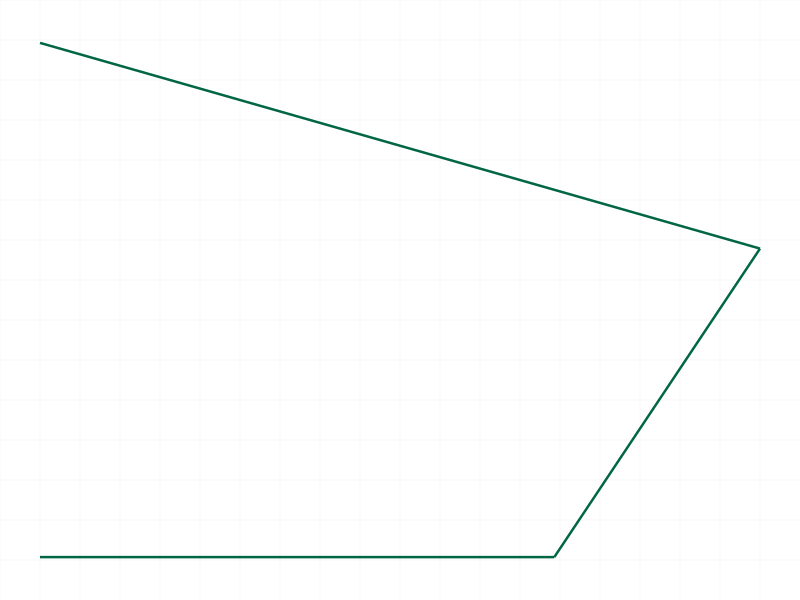 |
|---|

**Learned:** Coplanarity check is strict and explicit.

## 06 — open polyline, bulges length = points

Script: `scripts/06-open-bulges-equal-points.mjs` — ✅ success.

| 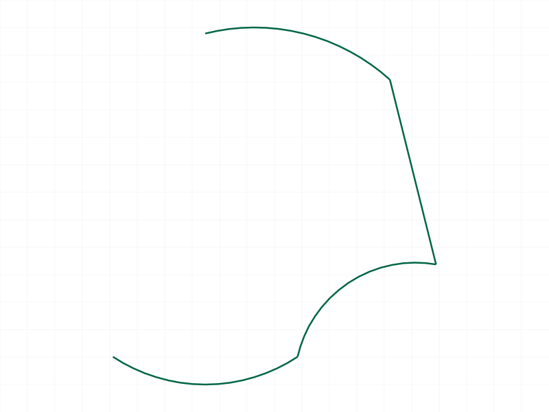 |
|---|

**Learned:** For open polylines, runtime requires `bulges.length === points.length`.

## 07 — close=true with bulges length = points-1

Script: `scripts/07-close-bulges-points-minus-1.mjs` — ❌ fails.

**Runtime message:** `For creating a polyline there must be as many bulges as positions`

**Learned:** Same strict length rule applies when `close: true`.

## 08 — close=true with repeated endpoint

Script: `scripts/08-close-true-repeat-endpoint.mjs` — ✅ success.

| 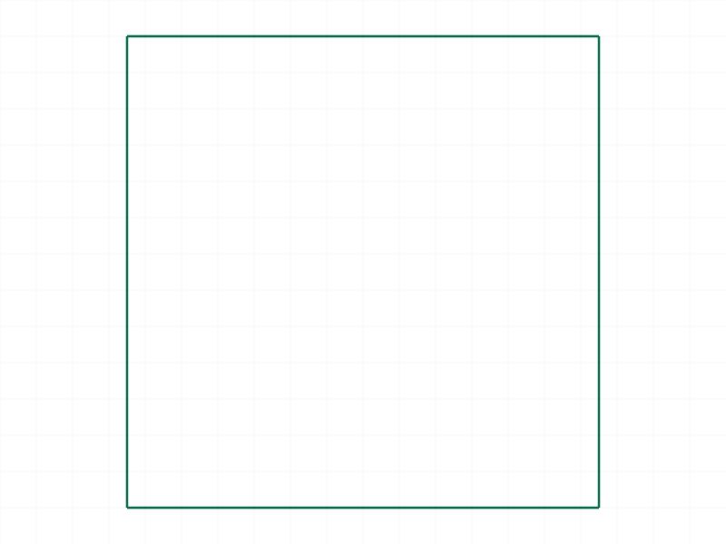 |
|---|

**Learned:** Repeating the first endpoint is also accepted together with `close: true`.

## 09 — wrong type: flat points array

Script: `scripts/09-flat-points-array-error.mjs` — ❌ fails.

**Runtime message:** `The parameter "points" has the wrong type! It should be of type (point)`

**Learned:** Flat numeric list is rejected; must be `Array<point>`.

## 10 — batch mode with 2 objects

Script: `scripts/10-batch-two-polylines.mjs` — ✅ success.

| 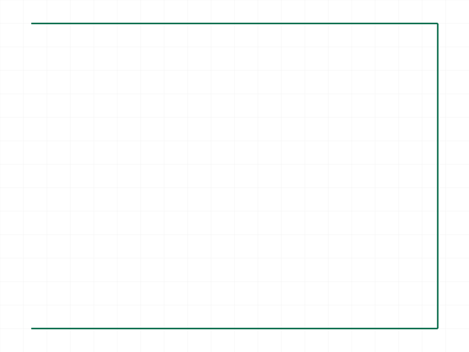 |
|---|

**Learned:** `polyline2d` supports array/batch input reliably.

**📌 Skill update:** Add explicit confirmation that array-mode creates multiple polylines in one call.

## 11 — wrong param name: `closed`

Script: `scripts/11-wrong-param-closed.mjs` — ✅ call returns success, but geometry is open.

| 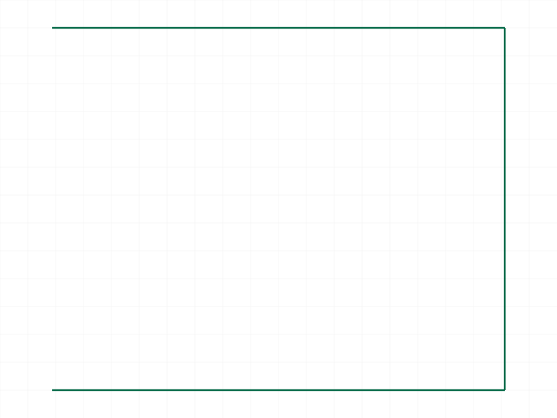 |
|---|

**Learned:** `closed` is silently ignored (no validation error). Must use `close`.

**📌 Skill update:** Strengthen existing note: this is a silent ignore, not a hard error.

## 12 — wrong id type: part id

Script: `scripts/12-wrong-id-partid.mjs` — ❌ fails.

**Runtime message:** `The parameter "id" has a wrong id type! Provide only following id types: ["shape"]`

**Learned:** `polyline2d.id` strictly requires shape id.

## 13 — wrong id type: EIF id

Script: `scripts/13-wrong-id-eifid.mjs` — ❌ fails.

**Runtime message:** `The parameter "id" has a wrong id type! Provide only following id types: ["shape"]`

**Learned:** EIF id is also rejected; only shape id accepted.

**📌 Skill update:** Add exact runtime error string for wrong-id-type diagnostics.

## 14 — wrong bulges element type

Script: `scripts/14-bulges-string-type-error.mjs` — ❌ fails.

**Runtime message:** `An element of parameter "bulges" has the wrong type! It should be of type (real)`

**Learned:** Bulges are element-wise type validated; numeric strings are rejected.

## 15 — bulge sign (+1 vs -1)

Script: `scripts/15-bulge-sign-positive-vs-negative.mjs` — ✅ success.

| 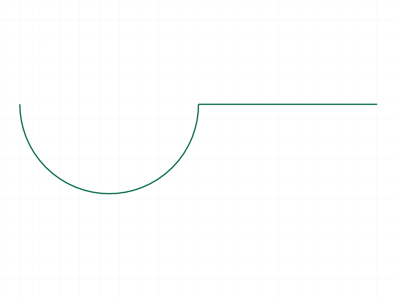 |
|---|

**Learned:** Positive/negative bulge signs produce opposite arc directions (consistent with doc statement).

## 16 — bulges too long

Script: `scripts/16-bulges-too-long.mjs` — ❌ fails.

**Runtime message:** `For creating a polyline there must be as many bulges as positions`

**Learned:** Long bulge arrays fail with same strict-length rule.

## 17 — comparative `closed` vs `close`

Script: `scripts/17-closed-vs-close.mjs` — ✅ both calls accepted.

| 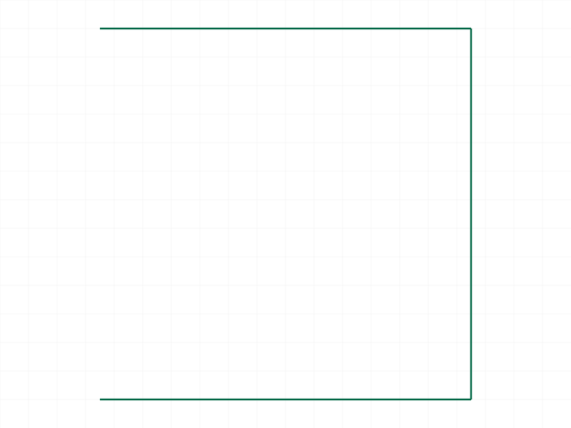 |
|---|

**Learned:** Confirms API accepts unknown `closed` key without throwing. Use only `close`.

## 18 — multi-shape + cleanShape cross-method check

Script: `scripts/18-shape-isolation-clean.mjs` — mixed result.

- Both shapes were created and populated with `polyline2d` successfully.
- `v1.curve.cleanShape({ ids:[shapeA] })` returned error:
  `Trying to open database which does not exist`

|  | 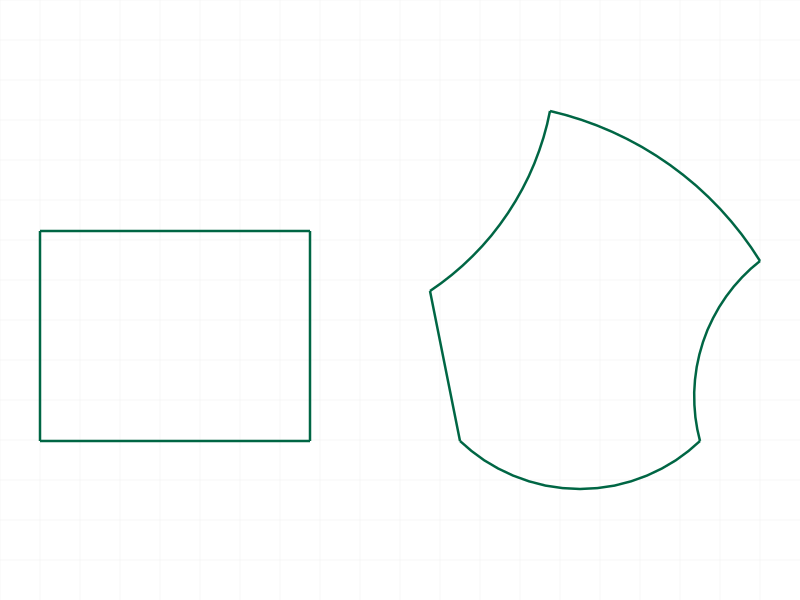 |
|---|---|

**Learned:** `polyline2d` works independently per shape in same EIF. `cleanShape` produced unrelated runtime issue in this setup; not blocking polyline2d conclusions.

## 19 — close=true, no bulges

Script: `scripts/19-close-true-no-bulges.mjs` — ✅ success.

| 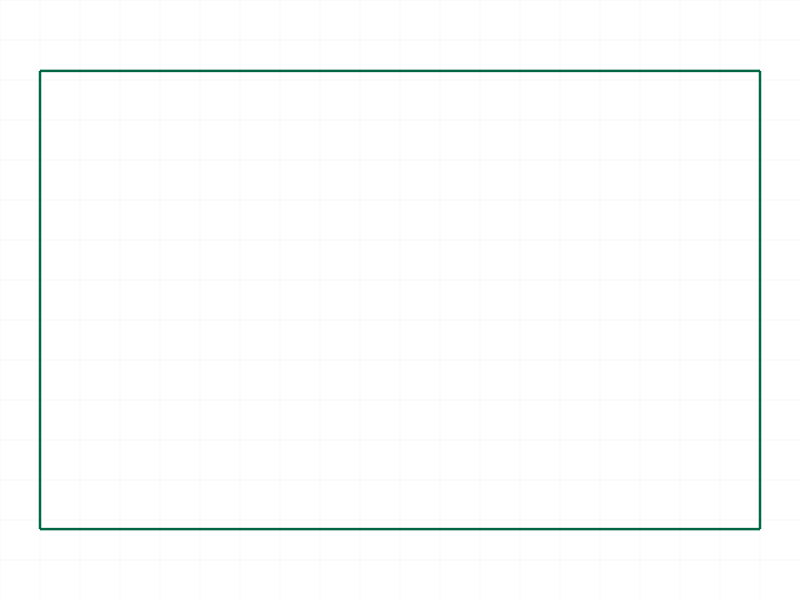 |
|---|

**Learned:** `close: true` works even when `bulges` is omitted.

## 20 — open polyline trailing bulge effect

Script: `scripts/20-open-trailing-bulge-effect.mjs` — ✅ success.

| 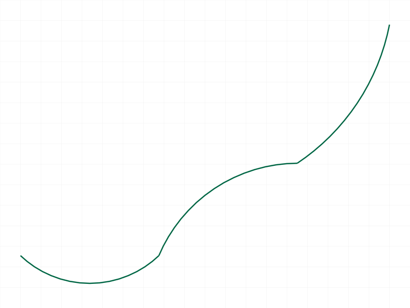 |
|---|

**Learned:** Open polylines still require full-length bulges array, but the trailing bulge value appears to have no visible effect on geometry (consistent with no closing segment in open polyline).

**📌 Skill update:** Add note that trailing bulge on open polylines is accepted but appears geometrically inactive.

## Skill Updates

Updated `knowledge/classcad-skill/references/curve.md` under `polyline2d` AGENT NOTE:

- strict bulge length behavior (`bulges.length` must equal `points.length`; short/long and points-1 all fail)
- strict id type behavior (shape id only; part/eif id rejected with explicit message)
- explicit element-type validation for `bulges`
- `close` vs `closed` behavior (`closed` silently ignored)
- confirmation of batch array mode
- confirmation that `close:true` is accepted with omitted `bulges`
- trailing bulge on open polylines appears geometrically inactive

`changes.md` written at: `workspace/training/2026-03-20_17-53-07_curve-polyline2d/changes.md`
