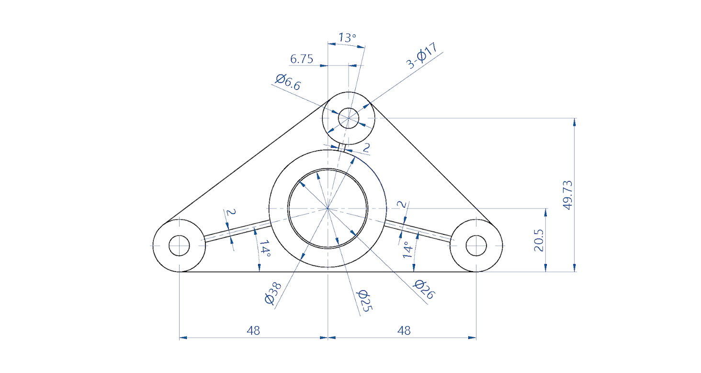
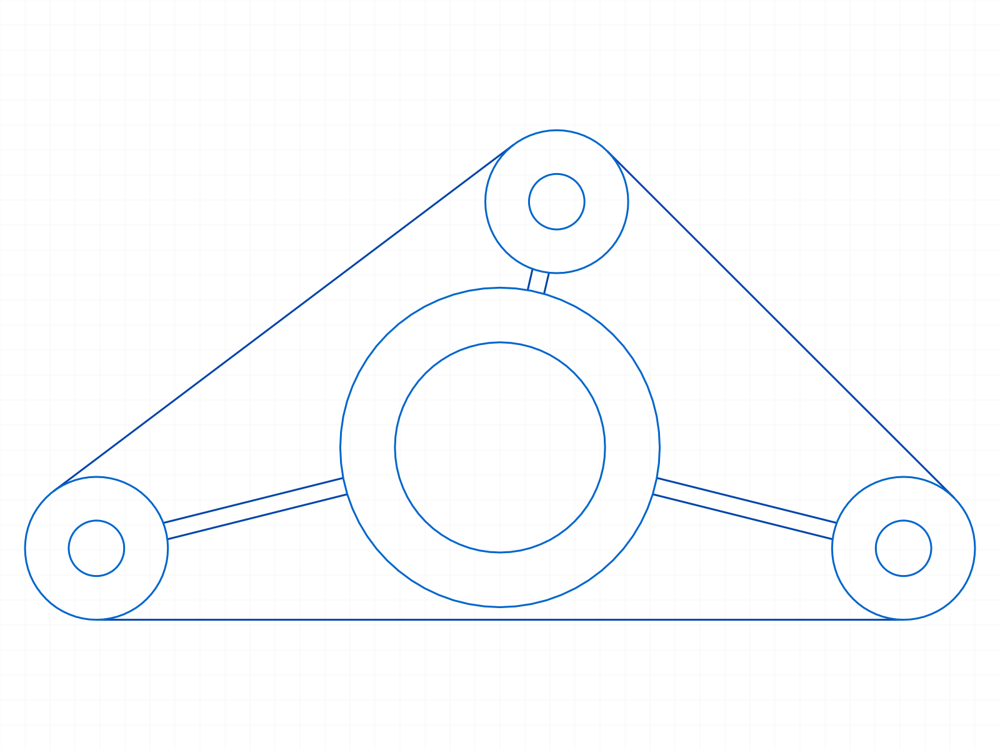
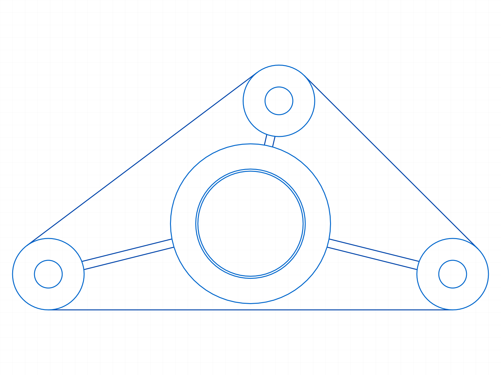
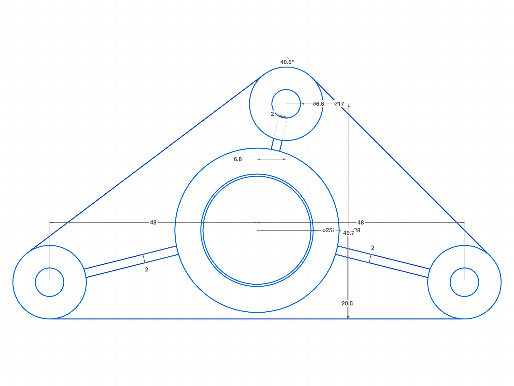

# Training: 3ERP Bracket Plate Sketch Reproduction

**Date:** 2026-04-13

## Goal

Recreate the 3ERP triangular bracket plate technical drawing in ClassCAD sketch from source image analysis. Exercise the full sketch API: lines, circles, arcs, constraints, dimensions.

**Source:**

## Dimension Analysis

### Coordinate System

Hub center at origin (0, 0). All coordinates in sketch-local space (Z=0).

### Derived Boss Center Positions

| Boss              | Center (x, y) | Derivation                                                          |
| ----------------- | ------------- | ------------------------------------------------------------------- |
| Bottom-left (BL)  | (−48, −12)    | 48 horizontal, `48×tan(14°)=12` vertical below hub                  |
| Bottom-right (BR) | (48, −12)     | Symmetric to BL                                                     |
| Top (T)           | (6.75, 29.23) | 13° from vertical, `6.75/sin(13°)=30` distance, `30×cos(13°)=29.23` |

### Key Cross-References

- `48 × tan(14°) = 11.97 ≈ 12` → bottom boss y-offset
- `boss_center_y − r = −12 − 8.5 = −20.5` → confirms boss r=8.5 (Ø17) matches 20.5 datum
- `6.75 / sin(13°) = 30.0` → hub-to-top-boss distance
- `30.0 × cos(13°) = 29.23` → top boss y-position
- `49.73 = 29.23 − (−20.5)` → bottom datum to top boss center ✓

### Dimension Checklist

- [✅] D1: Ø38 — DIAMETER — central hub outer circle
- [✅] D2: Ø25 — DIAMETER — central bore
- [✅] D3: Ø26 — DIAMETER — middle concentric ring at hub center (between Ø25 bore and Ø38 outer)
- [✅] D4: 3×Ø17 — DIAMETER — three boss outer circles (r=8.5 each)
- [✅] D5: Ø6.6 — DIAMETER — three through-holes at boss centers
- [✅] D6: 48 (left) — HORIZONTAL_DISTANCE — hub center to BL boss center
- [✅] D7: 48 (right) — HORIZONTAL_DISTANCE — hub center to BR boss center
- [✅] D8: 49.73 — VERTICAL_DISTANCE — bottom datum to top boss center
- [✅] D9: 20.5 — VERTICAL_DISTANCE — bottom datum to hub center
- [✅] D10: 6.75 — HORIZONTAL_DISTANCE — hub vertical axis to top boss center
- [✅] D11: 13° — ANGLE — vertical axis to hub→top-boss line (actual: 13.003°)
- [✅] D12: 14° (left) — ANGLE — horizontal axis to hub→BL-boss line (actual: 14.036°)
- [✅] D13: 14° (right) — ANGLE — horizontal axis to hub→BR-boss line (actual: 14.036°)
- [✅] D14: 2 (top arm) — OFFSET — arm width, hub to top boss
- [✅] D15: 2 (left arm) — OFFSET — arm width, hub to BL boss
- [✅] D16: 2 (right arm) — OFFSET — arm width, hub to BR boss

**Result: 16/16 PASS**

### Ø26 Resolution

Ø26 is the **middle concentric ring** at the hub center — a thin step/shoulder between the Ø25 bore (r=12.5) and the Ø38 outer hub (r=19). Wall thickness between Ø25 and Ø26 is only 0.5mm, making them hard to distinguish at low image resolution. Confirmed by user: three center circles are Ø25, Ø26, Ø38.

### Geometric Features

- [✅] G1: Outer triangle — 3 tangent lines between boss circles (external tangent, equal radii)
- [✅] G2: Arm walls — 6 lines (2 per arm) from hub circle to boss circle intersections
- [ ] G3: Hub arcs — not drawn (full hub circles drawn instead, matching source)
- [ ] G4: Boss arcs — not drawn (full boss circles drawn instead, matching source)
- [ ] G5: Construction centerlines — not drawn (annotation layer, not profile geometry)

## 01 — Bracket plate full geometry

Script: `scripts/01-bracket-plate.mjs` — ✅ All geometry placed correctly.

|  |
| -------------------------------------------------------------- |

**Geometry created:**

- 2 hub circles (Ø38, Ø25)
- 6 boss circles (3× Ø17 outer + 3× Ø6.6 holes)
- 3 outer tangent lines (triangle edges)
- 6 arm wall lines (from hub circle to boss circle surface intersections)

**Key coordinates verified:**

- Bottom tangent: (-48, -20.5) to (48, -20.5) — horizontal ✓
- Left tangent: (-53.11, -5.21) to (1.64, 36.02) — correct outward perpendicular ✓
- Right tangent: (12.76, 35.24) to (54.01, -5.99) — correct outward perpendicular ✓
- Arm walls correctly computed via line-circle intersection (hub r=19 and boss r=8.5)

## 02 — Dimension verification

Script: `scripts/02-verify-dims.mjs` — ✅ 17/17 dimensions pass.

**Cross-checks:**

- Hub→BL: 49.48, Hub→BR: 49.48, Hub→T: 30.00
- Gap BL: 21.98, Gap BR: 21.98, Gap T: 2.50
- Arm length BL: 22.06, BR: 22.06, T: 2.58

**Data:** `files/02-verify-dims-dimension-checks.json`

## 04 — Final bracket with Ø26

Script: `scripts/04-bracket-with-26.mjs` — ✅ All 16 dimensions present.

|  |
| ------------------------------------------------------------------- |

Added Ø26 (r=13) as third concentric circle at hub center. All three hub rings now visible: Ø25 and Ø26 appear as a tight pair inside the larger Ø38 ring.

**Final geometry count:** 9 circles + 3 tangent lines + 6 arm wall lines = 18 sketch elements.

## 05 — Complete bracket with constraints + dimensions

Script: `scripts/05-bracket-complete.mjs` — ✅ All geometry, constraints, and dimensions.

|  |
| ----------------------------------------------------------------- |

**Added constraints (12):**

- 2× CONCENTRIC (hub circles)
- 3× CONCENTRIC (boss + hole pairs)
- 6× TANGENT (tangent lines to boss circles)
- 1× HORIZONTAL (bottom tangent line)
- 1× HORIZONTAL + 1× VERTICAL (reference lines)

**Added dimensions (16):**

- 5× DIAMETER: Ø38, Ø26, Ø25, Ø17 (top boss), Ø6.6 (top hole)
- 3× HORIZONTAL_DISTANCE: 48 (left), 48 (right), 6.75 (top offset)
- 2× VERTICAL_DISTANCE: 20.5 (bottom datum→hub), 49.73 (bottom datum→top boss)
- 3× ANGLE: 14° (BL), 14° (BR), 13° (T)
- 3× OFFSET: arm width 2 (BL, BR, T)

**Construction geometry (5 lines):**

- 3× arm centerlines (hub→boss centers)
- 1× horizontal reference line
- 1× vertical reference line

**Data:** `files/05-bracket-complete-complete-ids.json`

## Visual Comparison

| Feature                  | Match | Notes                                    |
| ------------------------ | ----- | ---------------------------------------- |
| Overall triangular shape | ✓     | Correct proportions, asymmetric top      |
| Hub circles (Ø38/Ø25)    | ✓     | Size and position match                  |
| Boss positions           | ✓     | All three corners correct                |
| Boss circles (3×Ø17)     | ✓     | Correct proportions to hub               |
| Through-holes (Ø6.6)     | ✓     | Small holes at each boss center          |
| Outer tangent lines      | ✓     | Three edges forming triangle             |
| Arm walls (width 2)      | ✓     | Six lines, proper hub/boss intersections |
| Top boss right-offset    | ✓     | 6.75mm visible asymmetry                 |
| Construction centerlines | ✗     | Not drawn (annotation layer)             |
| Ø26 middle ring          | ✓     | Added in script 04                       |
