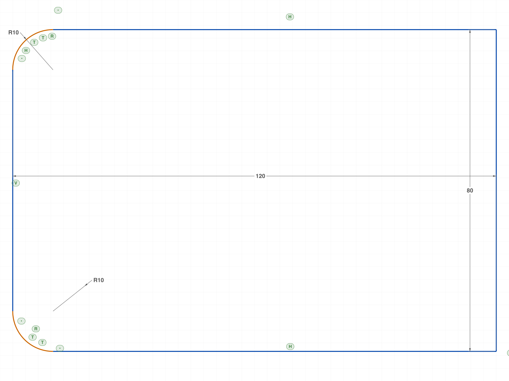
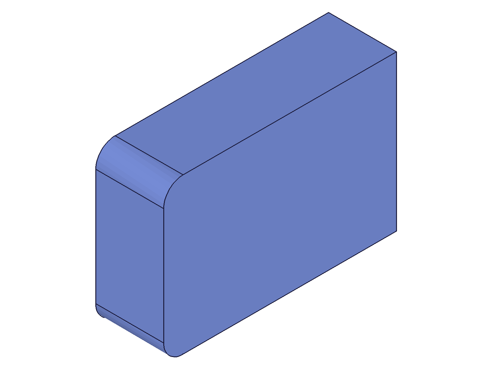
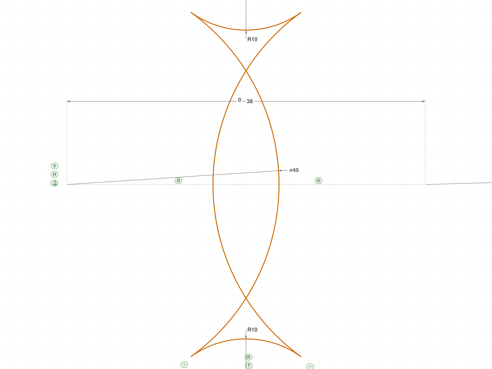
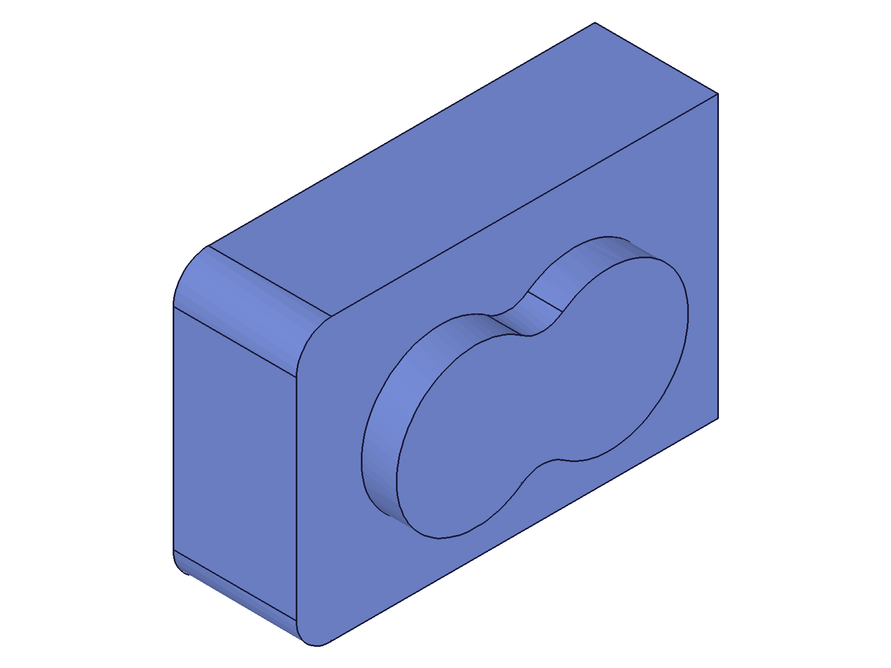
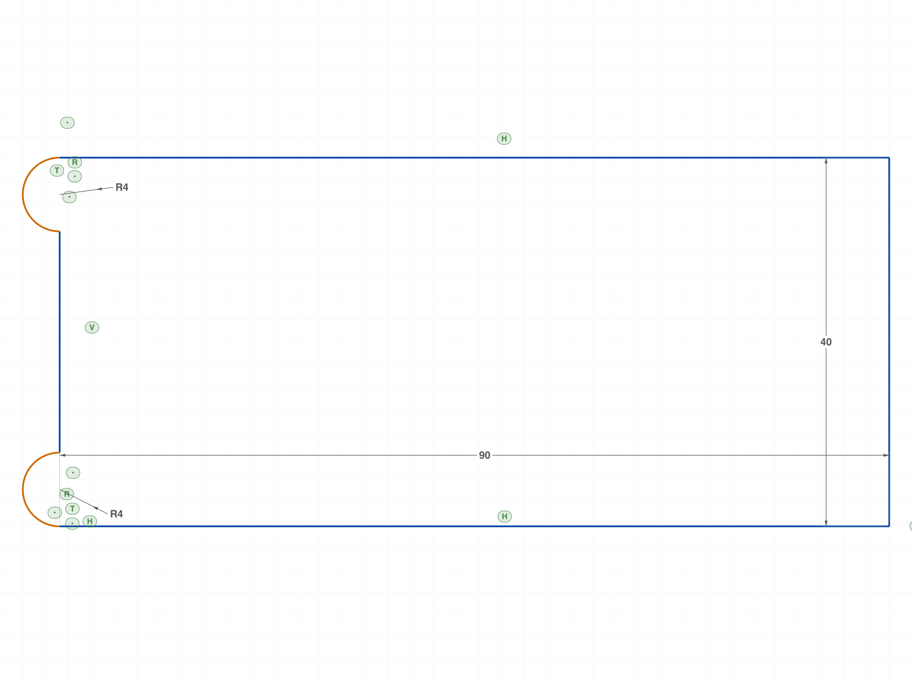
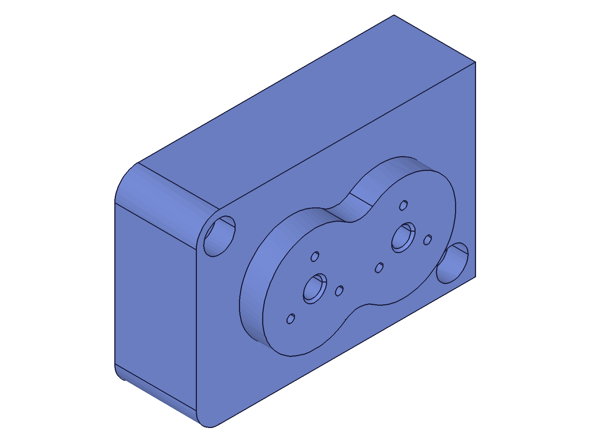
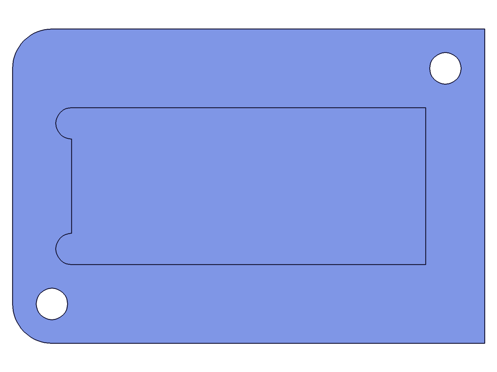
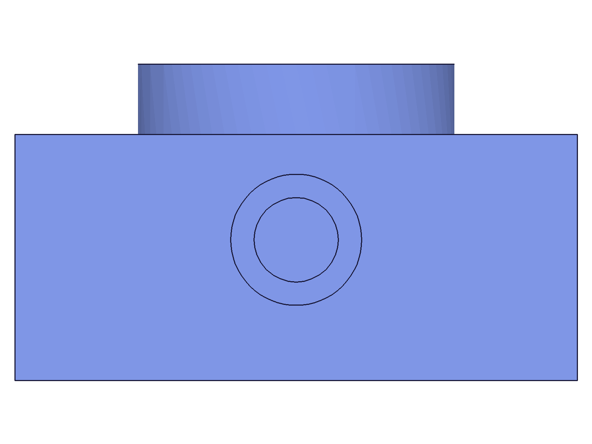

# Build: Liquid Mixer V2 — constrained sketches (conditioned rebuild)

**Date:** 2026-06-10
**Approach:** all three profile sketches rebuilt from ROUGH seeds + the drawing's dimension
scheme — the solver lays out the geometry. Feature holes (workCSys cylinders/cones) unchanged
from the verified hardcoded build (sketch-level constraining was the scope).
**Equivalence gate:** the constrained model must reproduce the verified hardcoded model —
same mass properties, same 21-point B-rep audit.

## Build log

### 00 — probe crash: rough arcs must still be VALID arcs

Script: `scripts/00-probe-arc-constraints.mjs` — ❌ my bug, instructive: a "rough" arc with
|start−center| ≠ |end−center| is rejected by `arcByCenter` (known zero-tolerance rule),
returned null, crashed the script downstream.
**Learned:** rough seeding ≠ sloppy geometry. Seed arcs from center+radius+two angles so the
arc is internally consistent; roughness goes into the center/radius/angle VALUES.

### 01 — probe: arc constraint machinery

Script: `scripts/01-probe-arc-constraints2.mjs` — ✅ all three answers yes:
RADIUS dim solves on arcs (r→10), COINCIDENT chains arc endpoints (gap 0.00e+0),
**TANGENT works arc-arc** (center distance → exactly r1+r2 = 30.000000).
→ Boss buildable as a constrained 4-arc chain. No trim needed; trim-on-constrained-sketch
stays an open question (not exercised in this build).

### 02 — block profile, constrained: 8/8 exact

Script: `scripts/02-block-constrained.mjs` — rough seeds (lines off by ±2–5, corner arcs seeded
r=8 and r=12!) → FIX bottom-right corner (120,0) · H/V ×4 · COINCIDENT chain ×6 ·
TANGENT line-arc ×4 · R10 ×2 · HD 120 · VD 80.
**All 8 readbacks exact to 9 decimals** (corners, tangent joins, arc centers). Extruded:
vol 334497.87 — **identical** to the hardcoded build (Δ 0.0000%).
|  |  |
|---|---|

### 03 — boss peanut, constrained 4-arc chain: 7/7 exact

Script: `scripts/03-boss-constrained.mjs` — rough arcs (wrong radii 20/8/21/9, centers off) →
FIX hub1 center (41,40) · COINCIDENT chain ×4 · TANGENT ×4 at the joins ·
Ø45 ×2 · R10 ×2 · HD 38 · VD 0.
**Solver derived every tangent point and fillet center**: boss2 (79,40), fillet centers
(60, 66.367593747)/(60, 13.632406253), all 4 joins at the analytic tangent coordinates —
9-decimal agreement with the hand-derived values of the hardcoded build. Union vol
**365463.13 — identical**. The SKETCHING.md tangent-math sections are now optional
pre-planning tools; the solver does this.
|  |  |
|---|---|

### 04 — cutout, constrained: under-constraint caught by readback, then 8/8

Script: `scripts/04-cutout-constrained.mjs` — first run: **4/8**. Bottom chain exact, but
top.end / earT.center / leftL drifted (x = 15.997, 15.795…) — the scheme had no fact pinning
the left edge: ear angular extents and the left line's x floated.
**Diagnosis pattern:** partial exactness maps the missing constraints — solved-exact points
are downstream of the datum, drifted points mark the unconstrained subgraph.
**Fix:** encode the drawing fact "ears bulge outward only" as ear-center-ON-left-line
(COINCIDENT point-curve) ×2 → cascade pins everything → **8/8 exact**.
|  |
|---|

### 05 — full constrained build: EQUIVALENT to the verified model

Script: `scripts/05-final-constrained.mjs` — three constrained sketches + the feature drillings.

- **Audit: 21/21** (all face extents, feature floors, corners, tangent vertex, hole rims —
  same probes as the hardcoded build)
- **Volume: 326305.89 vs 326305.89** — identical
- **COG: (59.51102224959143, 39.99852489061117, 20.18977192544782)** vs hardcoded
  (…59138, …61144, …4782) — agreement to ~14 significant digits (float noise)
- `equivalent: true && COG match: true`

|        |      |
| --------------------------------------------------------------- | ------------------------------------------------------------- |
|  |  |

## Verdict

The conditioned rebuild reproduces the verified model exactly and re-solves on dimension change (the Ø45→Ø60 adaptivity was proven in
the investigation session): numeric equivalence at float precision,
full B-rep audit, visual match.

## Deliverables

- Final model: `files/05-final-constrained-05-final-iso.stp` / `.ofb`
- Constraint schemes per sketch documented in scripts 02–04 (datum → relations → dims)

## Notes for SKETCHING.md (Step: comb-through)

1. Rough-seeding rule for arcs (internally valid; roughness in values, on the correct side)
2. Under-constraint diagnosis by readback (partial exactness maps the missing facts)
3. Encode drawing language as constraints (e.g. "bulges outward only" = center-on-edge-line)
4. Datum pattern: FIX one exactly-placed corner/center point per sketch; everything else rough
5. Arc-chain profiles (COINCIDENT + TANGENT per join) avoid trim entirely when topology is known
6. Open question stays open: trim (`splitAllCurves`/`mergeBack`) on a constrained sketch
