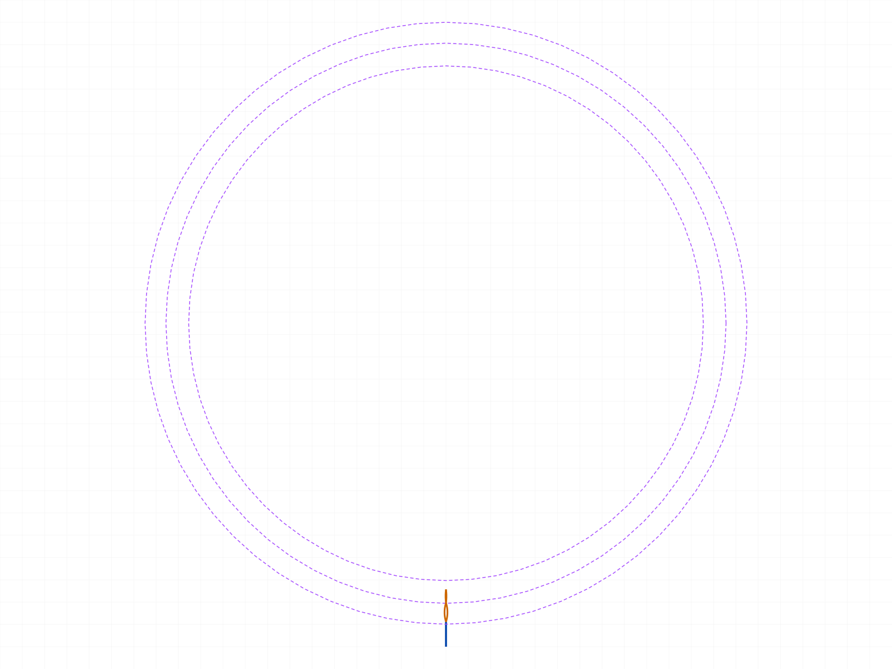
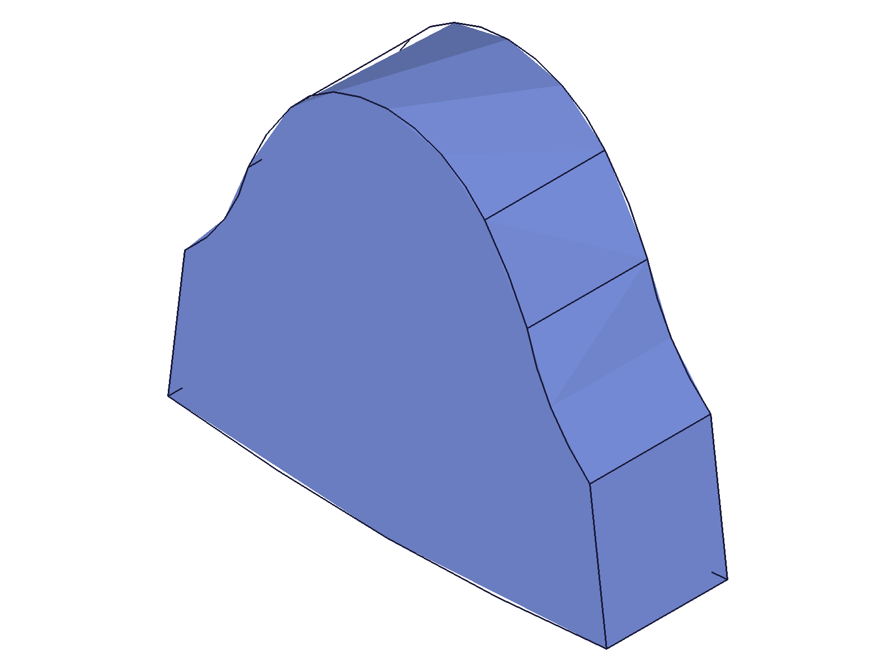
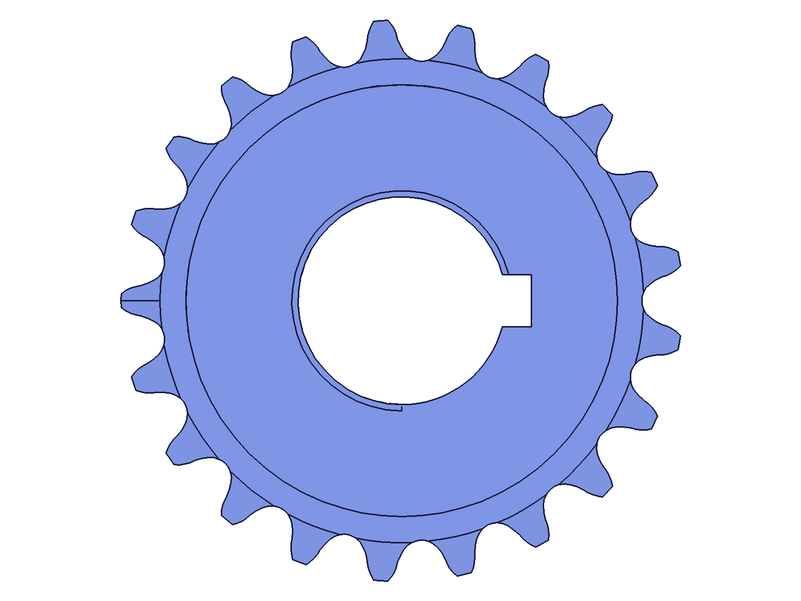
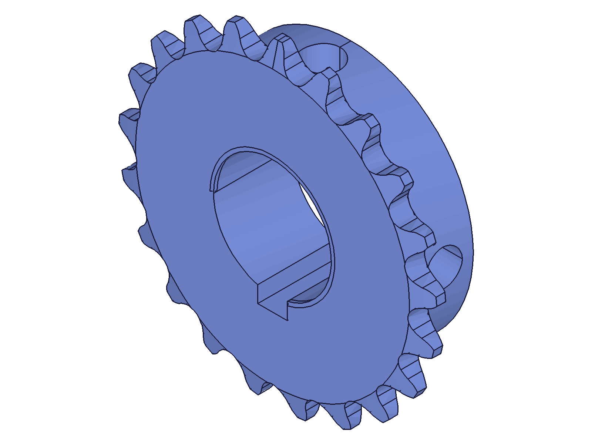
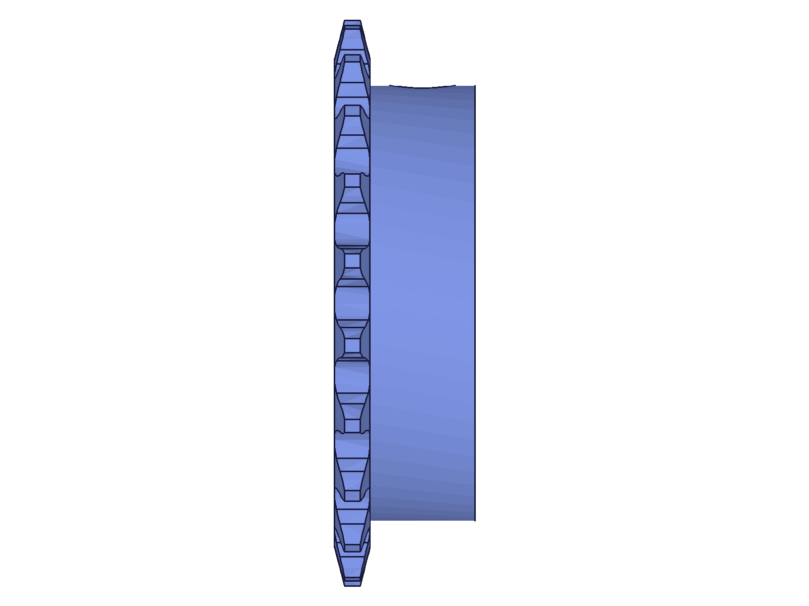
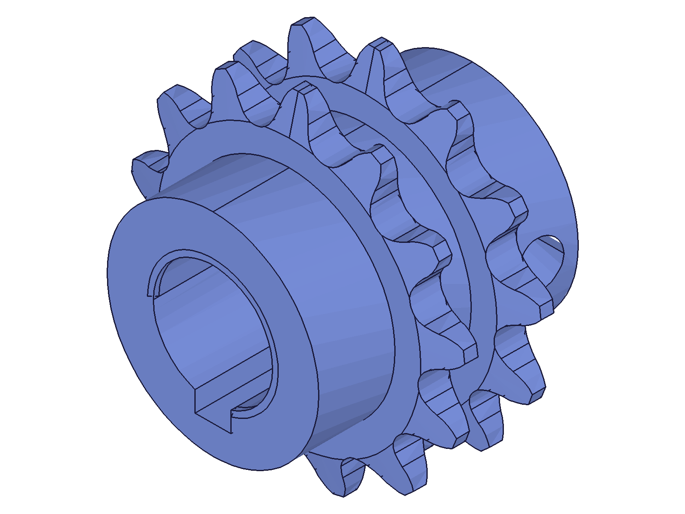
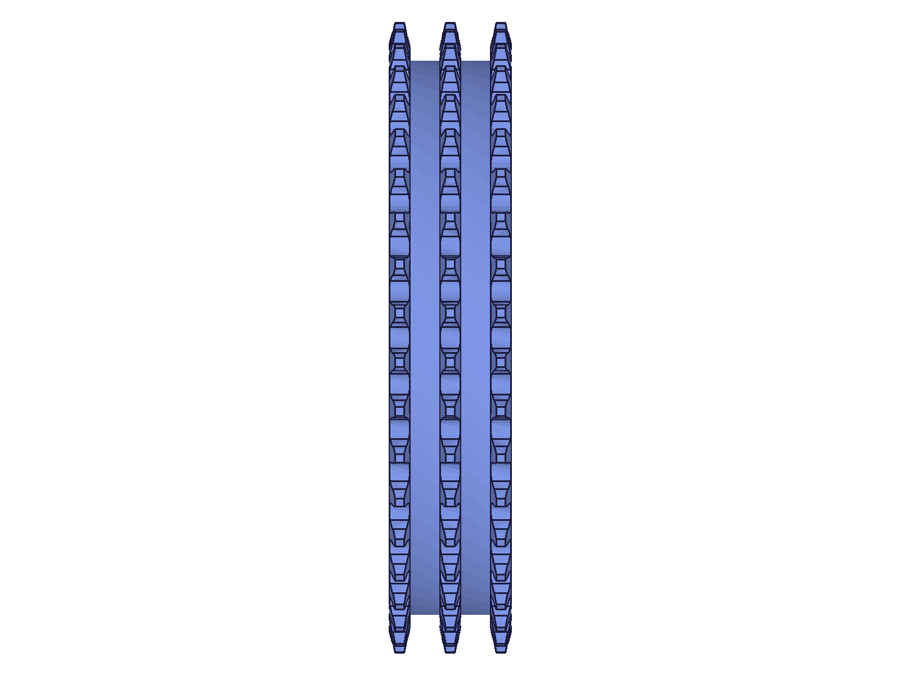
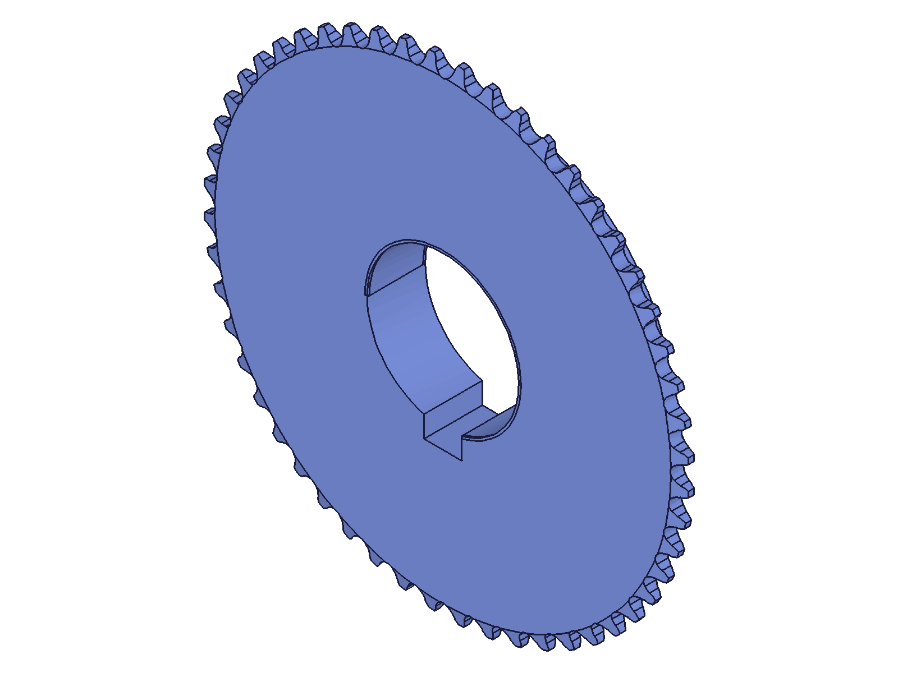

# Session: Martin 35 SS Sprocket — parametric generator (user-directed build)

**Date:** 2026-08-10
**Task (ph):** verify a ChatGPT conversation's sprocket recipe + the Onshape-style "MARTIN 35 SS SPROCKET" custom-feature header, then build the parametrized sprocket in ClassCAD.

Groundwork (sources, verified equations, catalog data, ChatGPT-recipe assessment): see [GROUNDWORK.md](GROUNDWORK.md). Short version: the ChatGPT chat contributes a sound Method-1 *workflow* (blank → one tooth-space → pattern → bore/hub/chamfers) but zero tooth-form math — its own caveat admits this. The real geometry comes from the ACA/ASME B29.1 equations (verified against the gearseds worked example to 4 decimals) and the Martin catalog pages (chain dims, t1/t2/K, max hub/bore, keyways/set screws).

## 01 — plane mappings + arc direction probe

Script: `scripts/01-probe-planes.mjs` — incremental mass-property algebra recovers each probe body's COG.

| Plane | localX → | localY → | normal → |
|---|---|---|---|
| Top | +X | +Y | +Z |
| Front | +X | **−Z** | +Y |
| Right | **+Z** | **−Y** | +X |

`arcByCenter isClockwise=true` sweeps **math-negative** in local coords (half-disc bulge at local −y; volume 628.3 = π·10²·4/2 exact). `01b-probe-cw.mjs` confirmed the same semantics on ALL three planes.

## 02 — tooth-space profile validation (21T)

Script: `scripts/02-tooth-profile-2d.mjs`

**Run 1 failed** — extrusion error 1121 "curves self intersect" at exactly Rcap. Numeric dump showed `topR` sweeping −324.9° and `workR` +344.7°: **mirrored arcs traversed in reverse keep the SAME cw flag as their left-side counterparts** (mirror flips orientation, traversal reversal flips it back). I had inverted them. One-line fix in `_model.mjs`.

**Run 2:** extrusion of the 8-entity chain (root seating arc, 2 working arcs, 2 topping arcs, 2 radial lines, cap arc) succeeds; CAD slab volume / thickness = **0.08144 in² vs 0.08144 in² polygonized** (dev 0.004%).

|  |  |
|---|---|

**Data:** `files/02-tooth-profile-2d-area-check.json`. Note the sketch PNG draws the arcs as a tiny lens — the **2D sketch renderer misdraws `arcByCenter` entities** (solid + numbers agree with each other and with theory; the sketch plot does not → TODO #178).

**📌 LLM doc:** none needed for the math itself (session artifact), but see findings below.

## 01c — boolean × circularPattern semantics probe

Script: `scripts/01c-probe-boolean.mjs` (after run 1 of the full build failed with a baffling `Entity "SetScrew2" ... already consumed`):

- `boolean(box, [cylA, cylB])` — two plain tools: ✓
- `boolean(box, [cylC, patternOf(cylC)])` — ❌ 1014 "Entity **Pat** is not available…consumed" (misleading name; in the full build it blamed *SetScrew2*)
- `boolean(box, [patternOf(cylC)])` — ✓ (result 206)

**Finding: `circularPattern` CONSUMES its targets.** The pattern feature owns all `count` instances *including the original*. Never pass the pattern's target as a boolean tool alongside the pattern. The 1014 error names an arbitrary *other* tool, not the offending one.
**📌 LLM doc:** `part/circularPattern.md`, `part/boolean.md`.

## 03 — full build: 35B21SS (single strand, style B, 1" bore)

Script: `scripts/03-sprocket-35B21SS.mjs` via `scripts/_build.mjs` (generator) + `scripts/_model.mjs` (math).

Pipeline: Parameters (9 expressions) → Blank revolve (Top-plane cross-section staircase, XAxis) → ToothSpace extrusion (Right plane, SYMMETRIC) → circularPattern ×21 → 2 tip-taper revolve tools → bore cylinder (workCSys z→+X) → keyway extrusion → 2 set-screw extrusions (Top/Front planes) → **one SUBTRACTION** (blank − [pattern, tapers, bore, keyway, screws]) → bore chamfer (2 rim arcs, EQUAL_DISTANCE .03") → stainless appearance → MateConnector workCSys → verification.

Intermediate stumbles, each probed and fixed:
1. `getGeometryIds` returns **empty arrays** (not null) for no-match entries — `[6513, [], []]`; filtering with `.filter(Boolean)` keeps them and poisons `getGeometryPositions` (whole call returns entries with no positions). Fix: keep numeric ids only. **📌 LLM doc:** `part/getGeometryIds.md`.
2. Hub OD rim circles are **not findable** via `arcs`/`circles` position lookup on untouched revolve geometry (the nearest `lines` match was 3/64" off — a red herring). Fix: look up the hub as a **cylindrical FACE** (`cylinders: [{positions: [p1, p2]}]`) → `getGeometryPositions(face)` returns seam + 2 rim-circle midpoints. **📌 LLM doc:** `part/getGeometryIds.md`.
3. First face-probe points landed **exactly inside the two set-screw holes** (both probe azimuths +Z/+Y = both screw directions). Probes moved to −Y/−Z.

Final checks (all ✓, `files/03-sprocket-35B21SS-report-35B21SS.json`):

| check | result |
|---|---|
| root arc radius (Rp−R = 1.1560") | err 2.2e-16 in |
| tip-flat corner (r=Ro at v0+P/8) | err 6.9e-18 in |
| bore rim (r=0.5" at vMin) | err 1.4e-17 in |
| hub OD face (r=1.0391", end at vMax) | err 2.3e-13 in |
| volume CAD 1.85864 in³ vs MC 1.85083 (chamfer-adj) | dev 0.42% |
| COG off-axis 0.020" (keyway+screw asymmetry) | ✓ |

|  |  |  |
|---|---|---|

## 04/05/06 — configuration sweep (parametric proof)

Same generator, three more configs, ALL checks pass in each:

- **D35C13SS** (`04`): double strand, 13T, style C, 5/8" bore, 1 screw. Strand spacing K verified: 2nd plate's tip-flat corner at exactly v0+K+P/8 (err 1.1e-16). Volume dev 0.18%.
- **T35A40SS** (`05`): triple strand, 40T, style A (no hub — set screws auto-skipped as required), 1.5" bore. Volume dev 0.48%, COG on axis.
- **35B52SS** (`06`): customMode 52T (outside catalog table → maxHub interpolation), 2" bore, 1/2×1/4 keyway, 2×1/2" screws, explicit hubDia 4.5". Volume dev 0.26%.

|  |  |  |
|---|---|---|

## Deviations from the image recipe (documented, deliberate)

1. **Topping radius = |b−y| (F_eff), not the published F formula** — the ACA equations are self-inconsistent by ~1.4% (F vs the distance b→y); gearseds says "force tangency" in CAD. F_eff makes the profile watertight; ~<1° tangency kink at y; tip lands marginally outward (still truncated by the blank OD for all tested N).
2. **"Extrude-cut + pattern the cut"** → ClassCAD has no cut-extrude, so: pattern the *tool*, subtract once. Same resulting body and the feature tree stays recipe-shaped.
3. Mate connector → `workCSys` "MateConnector" (z along bore axis at the front face); material → `setAppearance` stainless-gray (no material system in ClassCAD); custom toolbar icon → n/a.
4. A few Martin max-hub/bore 64ths are flagged `conf:'low'` (catalog page OCR) in `_model.mjs` — worth re-checking against a paper catalog if exact stock-hub fidelity matters.

## Skill Updates

Findings 📌 above → `references/part/circularPattern.md`, `references/part/boolean.md`, `references/part/getGeometryIds.md` (see `changes.md`). New TODO entries #178–#180.
