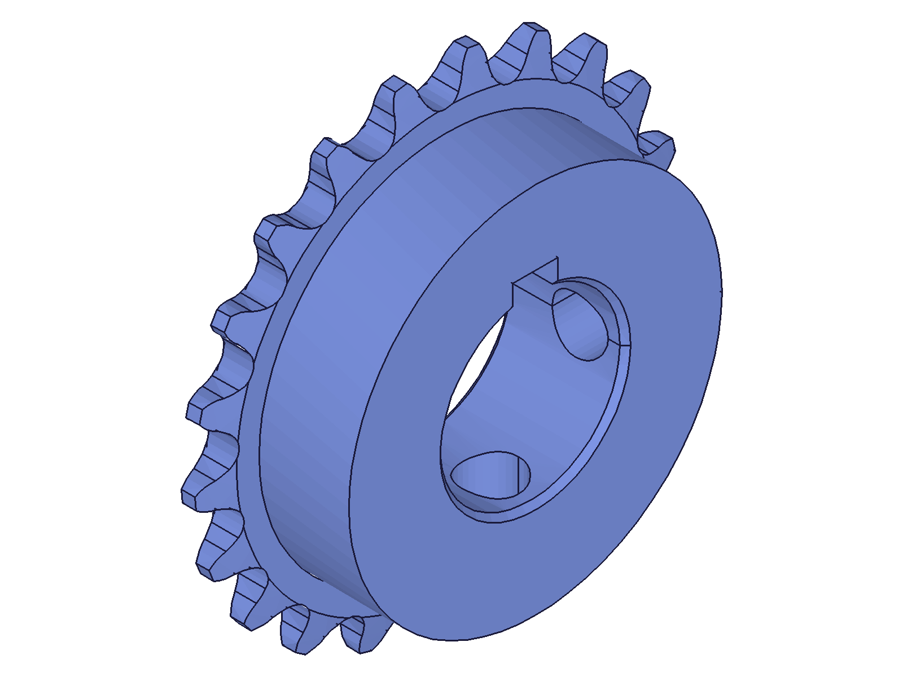
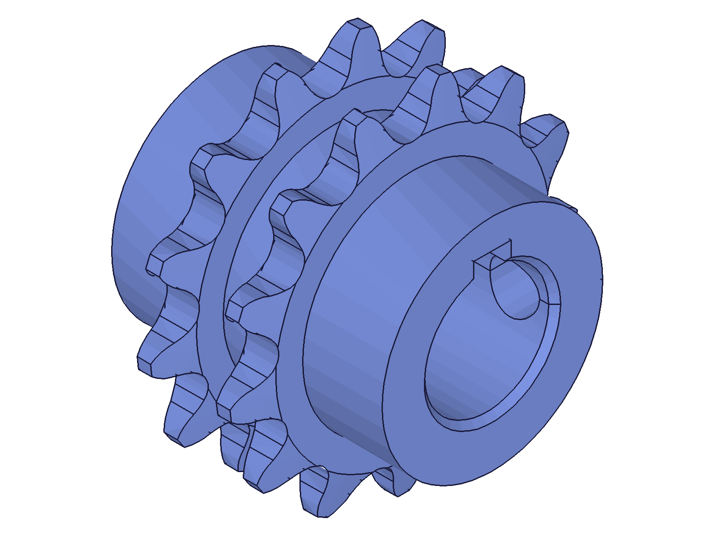

# Session: Sprocket Variant A — honest destructive build via `solid.*`

**Date:** 2026-08-10
**Task (ph + rainer):** rainer's recommendation for the *generated* model: use the solid API — no pseudo-feature-tree. Same math (`_model.mjs` copied from the generated session), direct modeling in an EIF.

## Port mapping (feature variant → solid variant)

| Feature build | Solid build |
|---|---|
| Blank: sketch + `part.revolve` | `curve.shape` + `advancedPolyline` (v,r staircase in world XY) + `solid.revolve` about [1,0,0] |
| ToothSpace extrusion + `circularPattern` | ONE Right-plane sketch profile (8 curves) + **N × `solid.extrusion` with `rotation:[k·2π/N,0,0]`** — the solid-API pattern idiom |
| bore `part.cylinder` (workCSys) | `solid.cylinder` (centered!) rotated z→X, translated to span middle |
| keyway sketch-extrusion | `solid.box` (centered), positioned at world −Y |
| set screws sketch-extrusions | `solid.cylinder` ±rotation (+Z / Rx(−90°)→+Y) |
| tip taper revolve-tools | same triangles via `curve.shape` + `solid.revolve` |
| `part.chamfer` (edge refs!) | **45° cone-ring `solid.revolve` cuts** — no edge hunting, no seam-split trap at all |
| ONE `part.boolean` SUBTRACTION | ONE `solid.subtraction` (target mutates in place) |

Notes: `curve.advancedPolyline` returns VOID (like curve.circle) — check maxLevel, not result. `sketch.geometry` seeds with all `gen*` flags off (coordinate dump — appropriate here; no solver involved).

## Stumble → finding: `common.recalc` destroys direct geometry

First full run: everything built (maxLevel 31 everywhere), then `calculateMassProperties` → null/51. 00-diag bisected it: every step healthy WITHOUT recalc (blank volume 2.6603 in³ vs analytic 2.6608 ✓, space cut +0.0707 = area×span exactly ✓, subtraction fine at 2.1217) — then ONE `common.recalc({})` → **massProps null, maxLevel 51 (NullMem), body gone**. Direct EIF geometry is not feature-history-backed; recalc regenerates from the history. Deterministic. 📌 `solid/subtraction.md` gotcha, TODO #184. Rule: never recalc in direct-modeling flows.

## Results

**35B21SS-solid** (21T, style B, 1" bore, keyway, 2 screws, tapers, chamfers — full feature set):

| check | result |
|---|---|
| volume | CAD **1.85596** vs MC-adj 1.85083 in³ (0.28%) — feature variant: **1.85595** → the two API paths agree to 1e-5 in³ |
| COG | off-axis 0.0201 in, along 0.2162 — identical to the feature variant |
| root radius | 2.2e-16 in |
| tip-flat corner | 6.9e-18 in |

**D35C13SS-solid** (double strand, style C, 5/8" bore, 1 screw): volume 1.11900 vs feature variant 1.11902 in³ (0.03% vs MC), root 3.3e-16, tip 1.1e-16 ✓. `getGeometryIds`/`getGeometryPositions` work on EIF brep — position-verification carries over unchanged.

|  |  |
|---|---|

## Assessment (vs the Kollege's point)

For a *generated* model the solid API is indeed the more honest, and operationally the SIMPLER tool:
- no consumption bookkeeping (target id stable, `keepTools` explicit),
- no edge-reference hunting for chamfers (cone cuts — the seam-split chamfer bug of the feature variant *cannot happen here*),
- no pseudo-parametric feature tree that must not be touched (the feature variant's tree is frozen by consumption anyway — variant B measured exactly *how* frozen: feature params dead, only sketch dims live),
- same verification rigor applies (MC + brep positions), and the result is bit-compatible with the feature build.
Cost: no in-model parametrics at all — regeneration is strictly re-run (which the generator does well), and `common.recalc` is forbidden.
