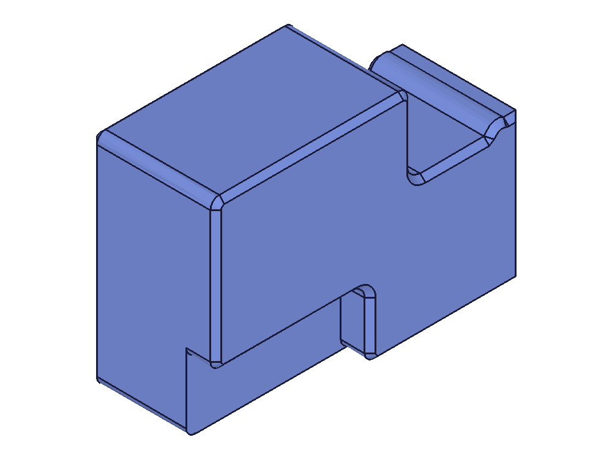

# Training: PVS stepped-cavity Boolean failure

Date: 2026-09-16. User-selected conceptual investigation; no MCP.

## Scope and approval boundary

Use `scripts/run.mjs` directly. Freeze the existing native generator and recipe in inputs. Do not change production housing geometry, the harness, or any skill file. Findings and possible documentation changes stay here for owner review. The existing modified skill bundle is recorded by hash, not reset.

## Questions and experiment map

- Q1: Does the exact failing second cavity subtraction reproduce through the harness? 01-reproduce.
- Q2: Are target/tool volumes, bounds and topology valid before subtraction? 01 checkpoints and 02 operand measurements.
- Q3: What is the smallest trigger (outer bevels, cavity bevels, overlap, Boolean order)? Reduced controls, one variable per script.
- Q4: Is this a translator defect, invalid input, or native Boolean robustness issue? Compare native-chamfer and tapered constructions, use independent OCC measurements.
- Q5: Which solution preserves the intended shape and regenerates? Solution run, volume/COG/bound checks and parameter perturbation.
- Q6: Does the successful method also survive the full base/shell shared envelope? Full-scale confirmation if a solution is established.

No more than 20 experiments. A three-variation failure is recorded before moving to another hypothesis. Runtime caps are operational observations, not proof of an infinite loop.

## Known before this session

Prior MCP worker samples showed SMLib intersection imprinting/UpdateFaces at 100% CPU. A separate MCP handshake timer bug is fixed and tested. The source builder currently includes experimental tapered cavity ends and sequential subtraction, so neither correctness nor the earlier causal explanation is assumed.

## Evidence standard

Persist call name/arguments/status/duration before and after Boolean operations; save native pre-failure operands. Use feature-owned CC_Solid IDs for individual mass checks. Compare numeric measurements with OCC reference; inspect section/top/isometric snapshots for material continuity. Keep source-based facts separate from hypotheses.

## Skill updates

Deferred explicitly by owner. No skill or recipe edits, no skill commit, no generic PLAN checkbox marked complete. Proposed updates will be listed in findings.md after evidence review.

## 01 — Harness baseline with pre-operation checkpoint

Script: `scripts/01-reproduce.mjs`. Completed in 22.784 s including snapshots. The second cavity subtraction returned successfully. Target volume before cut: 171080.355228 mm³; electronics tool: 68361.485036 mm³; result: 105847.367673 mm³. Independent reference comparison is pending; API success alone is not correctness.

| Operands | Result |
|---|---|
|  |  |

Evidence: `files/01-baseline-calls.jsonl`, `files/01-reproduce-01-baseline-before.json`, `files/01-reproduce-01-baseline-result.json`. The wrapper measures and snapshots immediately before subtraction. Next isolate those interventions. One wrapper syntax error was fixed before this actual run; no kernel conclusion drawn from it.

## 02 — Same reduced build, no pre-cut intervention

Script: `scripts/02-uninstrumented.mjs`. Completed in 15.913 s. The second subtraction also succeeds without measurement/save/snapshot beforehand. This rules out the checkpoint as necessary for this reduced harness case.

| Result |
|---|
|  |

Independent OCC reference (`scripts/reference.py`, `files/occ-reference.json`) reports valid one-solid inputs and result. Result volume 105845.388997 mm³; native mass integration 105847.367673 mm³, difference 0.00187%. Exact exported-solid comparison remains pending; curved-surface integration is approximate. The electronics cavity volume agrees to numerical precision (68361.485036 mm³).

## 03 — Full base feature history

Script: `scripts/03-full-base.mjs`. The full base passed all cavity subtractions with normal harness emission, then hit a *different* explicit error in `F381_common_housing_shell_py_61` (rear-interface intersection). This is not a recurrence of the second-cavity hang; full base completion is outside the currently isolated success. Full operand volumes/shape checked in 01–02; this run establishes call progression only.

## 04 — Suppressed emission reproduces the hang without MCP

Script: `scripts/04-suppressed.mjs`, using the repository's `connectSession`/`buildScriptApi` in a harness script and the existing `SUPPRESS_EMISSION` profile. Identical reduced recipe and dimensions. The 40 s watchdog found the second cavity SUBTRACTION still pending. Stack sample: 1487/1487 samples in SMLib ManifoldBoolean → ImprintIntersections → UpdateFaces. Runner terminated only its disposable worker.

Evidence: `files/04-suppressed-calls.jsonl`, `files/04-suppressed-emission.json` (file is prefixed with script name by helper), `files/04-suppressed-sample.txt`, run JSON. No post-hang image can be produced. The normal-emission operand/result images from 01 are the geometric control, not evidence of a successful suppressed result.

## Export comparison caveat

`compare-export.py` reads the native STEP in OCC. The imported result is reported valid with one solid and volume 105846.454343 mm³ (reference 105845.388997). However, OCC differences of these closed cavity-bearing solids returned negative volumes, so the symmetric-difference calculation is rejected as invalid evidence. No exact-equivalence claim is made from it. The first comparison launch needed FreeCAD initialization before importing Part; corrected before the reported measurements.

## 05–06 — Separate graphics from structure emission

05 (`scripts/05-kernel-graphics.mjs`): SUPPRESS plus `sendGraphic_Kernel:true` still hangs at the second subtraction; stopped by 40 s watchdog.
06 (`scripts/06-structure-only.mjs`): SUPPRESS plus `sendStructure:true` completes in 9.111 s. This is a measured candidate workaround, not yet an engine fix.

| Structure-only result |
|---|
|  |

Effective profiles, calls, results and stack samples are in files. Both experiments use the same native recipe. Source investigation follows `workspace/TODO-HOW-TO.md`; its outdated classcad-agent paths resolve here to classcad-ai. User's no-skill-update condition overrides documentation-promotion steps.

## Final controls 07-11

Read workspace/TODO-HOW-TO.md and traced the C++ structure serialization path without edits. Simple outer box passes under suppression. Explicit pre-cut tree refresh passed once but failed its fresh-worker repeat: reject it as reliable workaround. Native cavity chamfer returns an error. Structure emission passed twice (9.1 and 8.5 s). See findings.md for the complete matrix, limitations, source trace, and deferred engine investigation. Skill hash baseline unchanged. All trial workers cleaned up.

## Root-cause follow-up

User requested actual engine cause. Read worker fatal-signal handler and kernel source. Debug-symbol build plus LLDB proved EXC_BAD_ACCESS at UpdateFaces:4804. Lifetime tracing proved ResolveOverlappingProtoEdges updates only one of two owners before deleting an edge; the second owner later dereferences freed memory. Candidate updating all owners passes three fresh workers, zero stale-reference events. Recorded varying mass results and limited scope; no geometric equivalence claim. Saved patches; restored original source/object and binary. See cause.md. Skill unchanged. No production commits.

## SMLib 9 follow-up trials

See [smlib9-follow-up.md](smlib9-follow-up.md) for scripts, outputs, measurements and conclusions. Both original intersection failures persist; existing regroupings build both parts; volume discrepancy persists; broad suite now completes 396/397 with only testTwist2 compilation error. No skill or deep implementation edits. Default worker uses 9.
