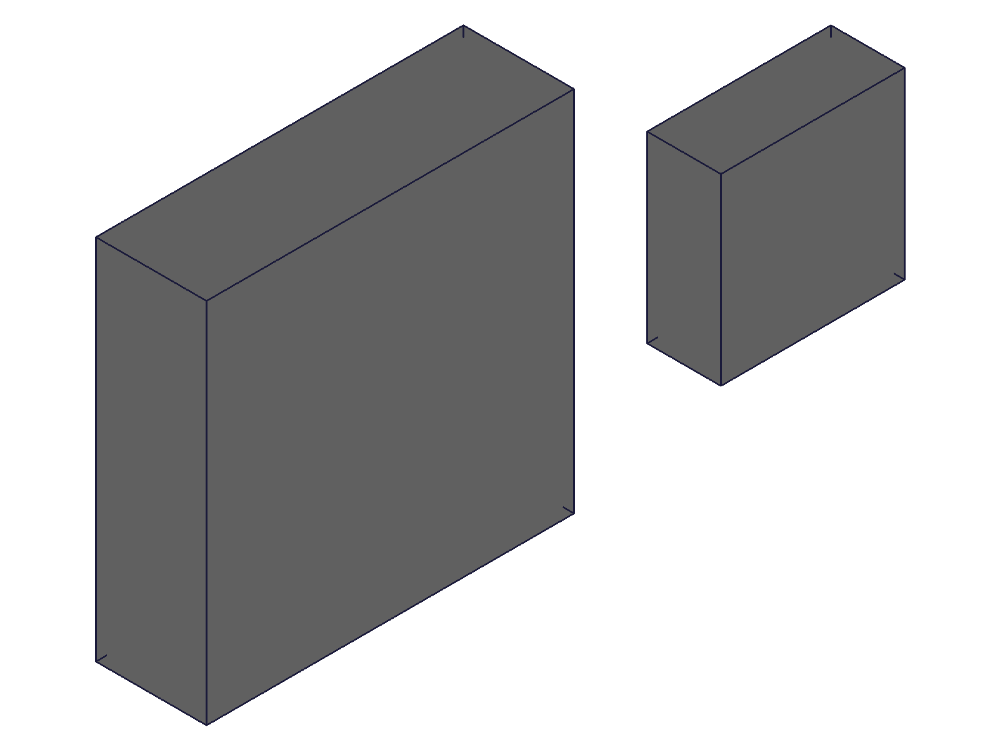
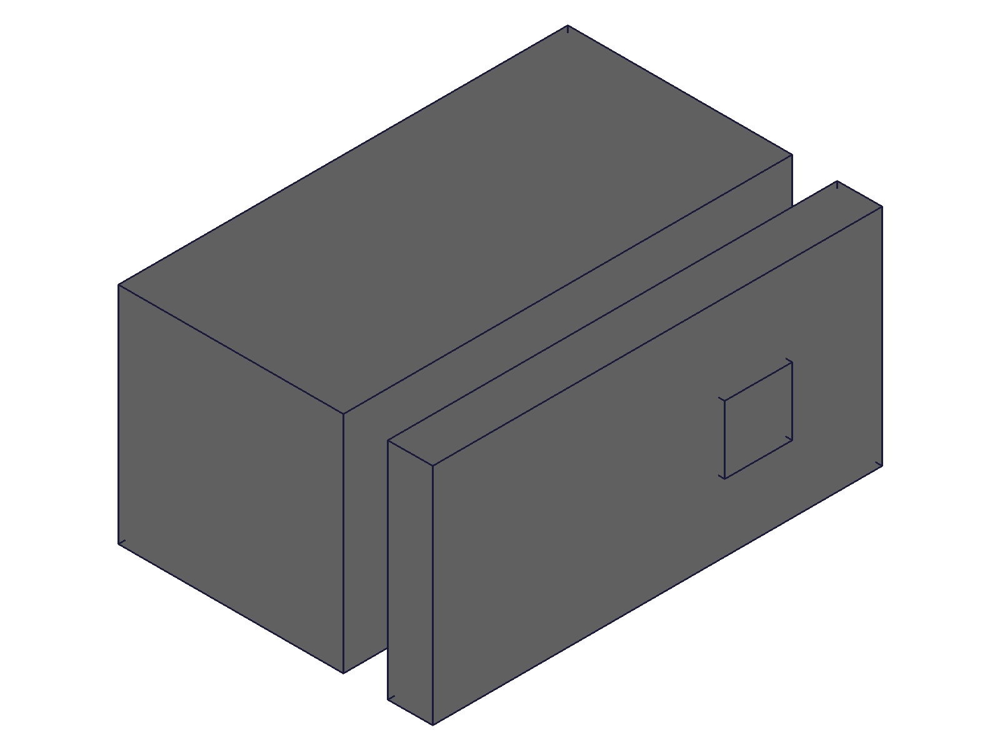
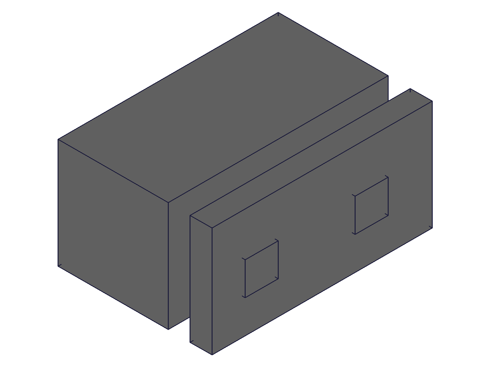
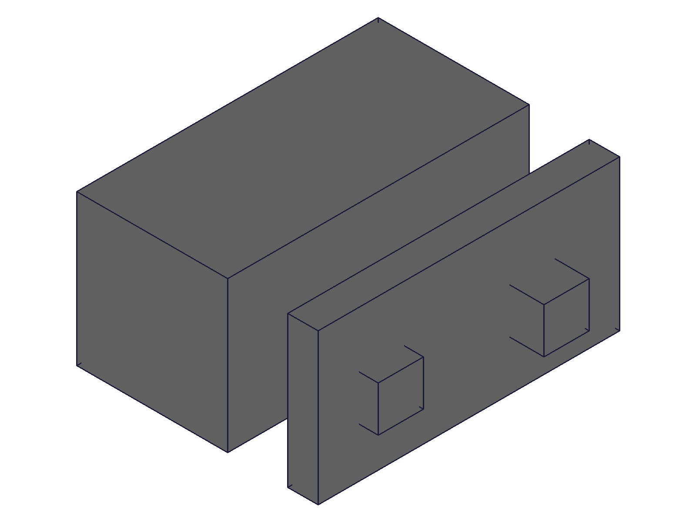

# Reactive assembly training

User-directed conceptual exercise, 2026-09-16. Production PVS geometry remains untouched.

## Questions and evidence plan
1. `01-expression-scope.mjs`: Can assembly-owned expressions directly drive child-part features? Does updating the master regenerate both products and repeated instances?
2. `02-datum-assembly.mjs`: Can expressions drive fastened offsets and slider travel limits? Which mate stays grounded? Are repeated instances still live after measurement?
3. `03-persistence.mjs`: Do relationships survive OFB save/reload and subsequent edits?
4. `06-invalid-design.mjs`: What rejects impossible travel, conflicting constraints or negative derived geometry? Distinguish engine rejection from application validation.
5. Follow-up scripts as evidence requires: explicit cross-product reference syntax, dimensioned sketch/extrusion and measurement side effects.

Deliverable (updated user instruction): journal and reproduction evidence only. No skill corrections, commit or push. Findings await team discussion. No production edits, no engine edits without demonstrated need. Use direct harness on the existing worker; do not stop its owner-managed process.

## 01 first run
Root `part.expression` throws id-type validation error: only `part` accepted. Source corroboration: `PartAPI_v1.expression` resolves ID as `CC_Part`, despite upstream prose saying product. Revised the probe to capture expected exceptions and test whether equal names in separate parts propagate.

## 01 completed
Master part volume 200→300; child stays 50. Child unqualified master expression fails conversion. Assembly expression creation rejects root ID. Evidence: scope-masses.json, assembly-expression.json, child-master-reference.json.

| Expression scopes |
|---|
|  |

## 02 completed
Slider update requires constraint ID (initial assembly-ID misuse corrected per existing docs). String xOffset is rejected as non-real; inverted limits reject explicitly. Requested -10 mm clamps ButtonA COG to Z12.000033 (bottom 11.000033), ButtonB stays Z13. Shell COG Z13, reference Z5. No ground drift. This is a kinematic probe with intentionally overlapping block proxies, not a manufacturing fit model.

| Pressed probe |
|---|
|  |

## 03 completed
Repeated template geometry updates; expression-driven datum geometry updates. This did not establish automatic joint-placement propagation (see 08–09). Assembly volume 2436→2454 on shoulder 2→3, survives OFB reload, then reaches 2472 on shoulder 4. Root/template mass reads did not block propagation. The shell geometry shifts with its datum; this must not be confused with the constrained instances following it. The later 08–09 probes isolate joint placement. The reference block remains grounded.

| Before | After |
|---|---|
|  |  |

## Additional question from Fable
Cross-product path `A.ExpressionSet.W` reportedly resolves but remains stale until recalc. Added 04-cross-product-paths.mjs to test a two-hop chain, actual feature volumes, repeated instances, one vs two recalculations, and save/reload. This overrides the provisional conclusion that sharing is unavailable: root-owned registry is blocked, but a dedicated master part may work with explicit full recalculation.

## 04 — multi-hop expression chain
Script: `scripts/04-cross-product-paths.mjs`. Evidence: `files/04-cross-product-paths-stages.json`.

`Dimensions → Shell → Plunger`, with two plunger instances:
- Source 2→3 alone leaves consumers stale.
- One explicit `api.v1.common.recalc({})`: final expression reads 3, but plunger solid remains 18 mm³ instead of 27. Shell updates to 1300 mm³.
- Second recalc: plunger reaches 27 mm³, assembly 1354 mm³.
- OFB reload preserves formulas. Source 3→4 plus one recalc again leaves plunger geometry a generation behind (27 instead of 36 mm³).

Conclusion: expression readback is not geometry verification. Two passes fixed this example, not a general guarantee for arbitrary dependency graphs.

## 05 — direct registry and constrained sketch
Script: `scripts/05-sketch-star.mjs`. Evidence: `files/05-sketch-star-stages.json` and before/after snapshots (visually inspected).

Empty uninstanced Dimensions template created first. Plunger expressions reference it directly. A center-fixed circle with expression-driven radius is FULLY_CONSTRAINED; its extrusion uses expression-driven height. Two instances reuse this template.

Radius 2→2.5 and height 2→3: one recalc changes part volume 25.13224→58.90369 mm³ and assembly 50.26448→117.80738 mm³. Second recalc makes no further change. Sketch remains FULLY_CONSTRAINED. Snapshots show both instances widening/thickening, consistent with measured volumes.

This independently supports Fable's direct-registry geometry finding. Fable also reported OFB persistence and stable-name path dependence; those reports are external session evidence, distinct from this exercise's own measurements.

## 06 — invalid design behavior
Script: `scripts/06-invalid-design.mjs`.

Negative box height is rejected: `Height not valid for ShoulderProbe (CC_Box). Value for height must be greater than 0.` The expression was explicitly restored afterwards. A conflicting extra fastenedOrigin constraint returned an ID with maxLevel31 and no messages. This does **not** prove constraints were satisfied; this script did not measure residuals. It demonstrates that creation success alone cannot be used as the fit verdict. Existing physical clearance, collision, thickness and travel audits remain necessary.

## 07 — instance mass-query side effects
Script: `scripts/07-instance-measurement.mjs`. Evidence: `files/07-instance-measurement-stages.json`.

Measured both instances before changing local shoulder height 2→3. Both instance volumes subsequently change 18→27 mm³; no permanent detachment observed. Root assembly mass initially stays 2436 instead of 2454 mm³; recalc refreshes it to 2454. This challenges the skill's blanket claim that instance mass queries permanently materialize/freeze all instances. Scope: expression-driven box update on this worker, not every modification API or engine version.

## 08 — direct registry, mating datum and reload
Script: `scripts/08-registry-mates-reload.mjs`. Registry created after templates in this probe.

Shared shoulder_height drives plunger height; shared `seat_height = 10 + shoulder_height` drives shell datum. After shoulder 2→3 and one recalc:
- Plunger volume 27 mm³; shell COG Z14 (datum Z13 plus half roof thickness).
- Fastened ButtonB COG Z13.5: its bottom stayed at Z12, **not** Z13.
- Root mass remains 2436 until a second recalc gives 2454.
- Second recalc still does not move ButtonB to the updated datum.
- Save/reload, then shoulder→4 and recalc gives volume 2472 and ButtonB COG Z16 (bottom14), shell COG15. Reload affects the observed refresh behavior; do not rely on this as an editing workflow.

## 09 — registry first and explicit joint refresh
Script: `scripts/09-master-first-mates.mjs`. Evidence: stages and joint-before JSON files.

Registry created before consuming templates; no initial instance mass queries. After shoulder 2→3:
- First recalc gives correct root volume2454 and shell COG14.
- ButtonB COG stays13.5 (bottom12) through **three** recalcs; expected14.5 (bottom13).
- Existing fastened joint reports zOffset0.
- `updateFastened({id: joint.id, zOffset: 0})` reapplies the **same** offset. ButtonB COG becomes14.5, as required.

An intermediate exploratory run with zOffset13 moved bottom to26 (= datum13 + offset13); final reproduction uses offset0. These measurements contradict the skill's blanket statement that mate CSys origins have no positioning effect. They support a stale-joint-refresh issue, but do not establish engine root cause or rotated-axis semantics.

## Proposed architecture for team discussion

1. One script, one root assembly, one part template per distinct printed part, reused instances.
2. Empty uninstanced Params template created first, stable name, shared inputs and shared derived formulas. Each part references Params directly; avoid sibling-to-sibling chains.
3. Native constrained sketches and expression-driven features remain the modeling mechanism.
4. Explicit recalc after registry edits; check actual solids, not merely expression values. Verify aggregate and instance measurements agree.
5. Refresh affected joints with their intended existing offsets after datum changes; verify placements numerically. Numeric-only joint parameters need evaluated values supplied by the script.
6. Keep manufacturing/fit checks. Successful regeneration or constraint API calls do not establish physical validity.

This demonstrates a viable geometry registry, **not** a fully automatic, dependable cross-part geometry-and-assembly dependency solver. Team questions: cross-part recalculation ordering, joint invalidation on workCSys changes, mass-cache invalidation, and constraint failure reporting. No engine root-cause diagnosis or fix claimed.

## Skill changes: none retained

Skill corrections were drafted and their bundle rebuilt before the user requested journal only. All six modified tracked skill/bundle files were restored to their pre-run committed state. No PLAN changes, no commit, no push. Reproduction scripts and local evidence remain in this training workspace. Production PVS and engine source were not changed.

## 10 — Fable's consumer-refresh thesis tested live
Script: `scripts/10-consumer-refresh.mjs`; fresh direct-reference and chained-reference rigs, three edits each (height3,5,2), two instances of Plunger (fastened and slider), then OFB reload and edit4. No explicit recalc or joint updates anywhere before measurements.

Formula reassignment in dependency order correctly updates both instance geometries and the fastened placement on every edit, including after reload. However, after instance measurements between edits, aggregate volume lags one edit: at height5 it reports2454 instead of2490; at height2 it reports2490 instead of2436. Individual volumes and tree transforms are correct. This is a measurement-cache failure, not evidence that geometry failed.

The movement endpoint checks in this script were deliberately strict (0.001mm). Slider settles inside its legal range rather than exactly at the endpoints (COG12.11226 and12.99547, legal[12,13]); therefore those endpoint assertions fail, without establishing a violated travel bound. Follow-up must distinguish legal range from exact endpoint convergence.

## 11–12 — separate geometry refresh from mass-query ordering
Scripts: `11-refresh-cache.mjs`, `12-measurement-order.mjs`; results JSON alongside each script log.

An extra Shell formula refresh did not fix root-first mass measurement. A recalc before root-first measurement also did not fix it. In contrast, querying leaf instances first and the root afterwards produced correct totals on every edit:2454,2490,2436mm³. This worked both without recalc and with recalc inserted between instance and root measurements. Fastened COGs14.5,17.5,13 were correct throughout.

This narrows the remaining failure to aggregate measurement/cache ordering in this rig; it does not invalidate Fable's modeling sequence. For this flat assembly, consumer formula refresh followed by instance-first measurements needs no explicit recalc. Checked slider placements remain within the refreshed range (allowing0.002mm solver tolerance). Motion probes stayed within bounds; exact endpoint convergence was not established.

## 13 — nested repeated assembly
Script: `13-nested-consumer-refresh.mjs`; results JSON.

One Module template contains a grounded Shell and a Plunger fastened to its top datum; root has two instances of Module, translated100mm apart. Registry edits5,7,3 followed by Shell then Plunger formula reassignment (no recalc, no joint updates) produced:
- Internal plunger transforms Z5,7,3: all follow the datum.
- Shell/plunger template volumes500/20,700/28,300/12mm³.
- Each module volume520,728,312mm³; root1040,1456,624mm³.
- Module COG X values differ by100mm as intended.

Initial attempt to measure an unexpanded inner instance failed with “use objects from expanded tree”. Final probe measures part templates, outer module instances, then root. Those measurements succeeded. This is one nested level with fastened joints, not proof for all nesting/constraint types.

## Updated conclusion after testing Fable's proposal

**The consumer-refresh solution is viable in the tested rigs.** Update Params, then reassign each consumer's existing link formulas; for chains, process dependencies before dependents. This regenerated actual geometry and re-solved fastened placement without full recalc or rewriting joint parameters. Tested repeated part instances, slider bounds, repeated edits, dependency-ordered chains, OFB reload, and one subassembly instantiated twice. Script10's final snapshot was visually inspected; numerical transforms/volumes are the decisive evidence.

Read-only source inspection corroborates the proposed mechanism: `PartAPI_v1.cclass` updateExpression DoJob around3508–3543 collects successfully updated products, calls `GetDependentAssemblies(products)`, and invokes `assembly.Solve(TRUE)`. No engine changes were made. This supports Fable's explanation; it is not a complete audit of recalc or cache internals.

Practical candidate workflow:
1. Keep shared inputs/derived formulas in an uninstanced Params template.
2. Maintain an explicit consumer/formula list in the build script; favor direct registry references.
3. Update registry values, then reassign consuming formulas in dependency order.
4. Verify geometry and transforms. In these probes, measure individual instances before aggregate assembly mass to avoid stale totals; nested internal IDs may need expanded-tree resolution.
5. Retain physical fit/manufacturability checks. Slider endpoints, other joint types (including revolute), deeper nesting and production-scale performance remain outside this result.

This supersedes the earlier proposal to routinely reapply joint offsets: formula refresh requires knowledge of expression consumers, but no enumeration or modification of affected joint parameters. It does not magically add automatic cross-part dependency tracking; the script still orchestrates the refresh.

User instruction remains journal-only. No skill corrections, engine edits, production edits, commit or push.

## 14 — controlled check of Fable's materialization objection
Script: `14-materialization-control.mjs`; evidence: `files/14-materialization-control-results.json`.

Fresh identical rigs, direct Params references only, same registry→Shell→Plunger formula-refresh sequence, no recalc and no joint edits. Each starts at height2, then edits3,5,2; a final edit4 follows instance measurements in every case.

| Measurement history | Root volumes after edits3,5,2 (before new instance query) |
|---|---|
| No instance measurements before final stage | 2454,2490,2436 — all correct |
| Measure instances once before edits | 2436(stale),2490,2436 |
| Measure instances before edits and at each edit | 2436(stale),2490,2436; rereading root after instance query corrects first to2454 |

The each-edit case additionally queries template mass and rereads root after instance queries, so its cache history differs from script10; do not equate their entire sequences. The clean control is the initial instance measurement: with it the first root result is stale, without it correct. This was a direct-reference path, not chained or recalc-only.

Measured instance volumes follow18→27→45→18 and, after another edit,36mm³. Final edit4 gives root2472 and fastened COG16 in **all** cases. No instance deletion/recreation is used. Tree transforms independently show the fastened base following Z13,15,12. The documented claim of permanent freezing after mass measurement is not reproduced on this expression-refresh path.

Conclusion: Fable's warning identified a real measurement side effect worth isolating, but the observed behavior is transient/order-dependent aggregate mass staleness, not permanently frozen instances. His correct root-only totals are consistent with our no-instance-query control. The previous recommendation to measure instances first is a tested way to obtain consistent audit numbers when instance measurements are needed, not a necessary step for the modeling workflow. Prefer leaving those queries out when root-only verification suffices. No general claim about other modification APIs or all kernel versions.

Journal/evidence only; skill remains unchanged.
