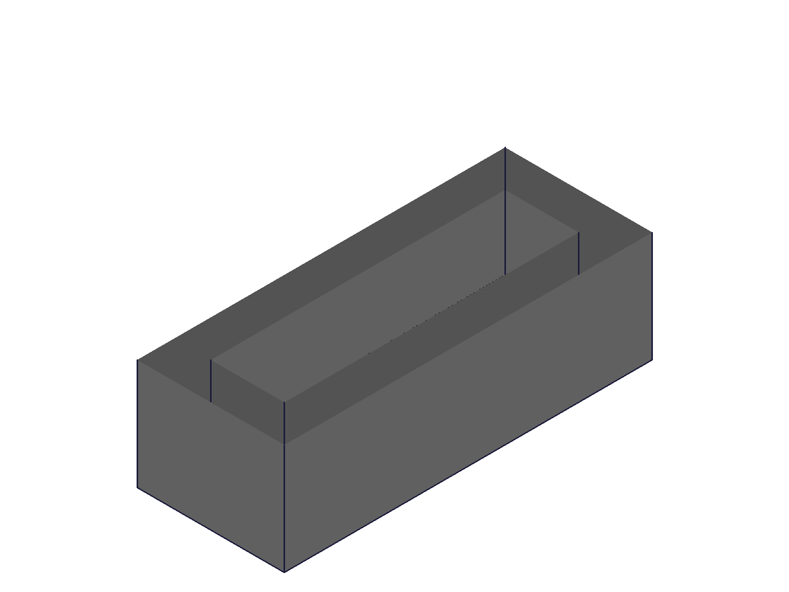
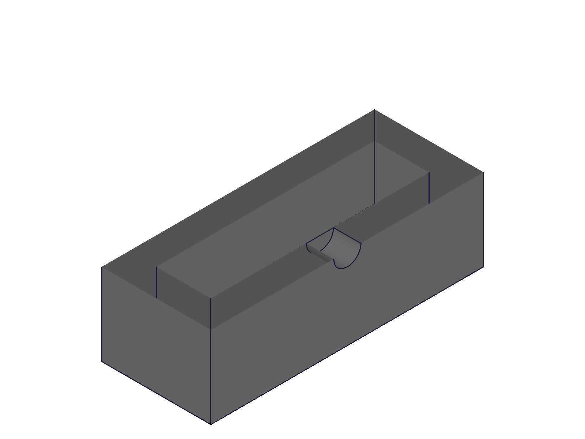
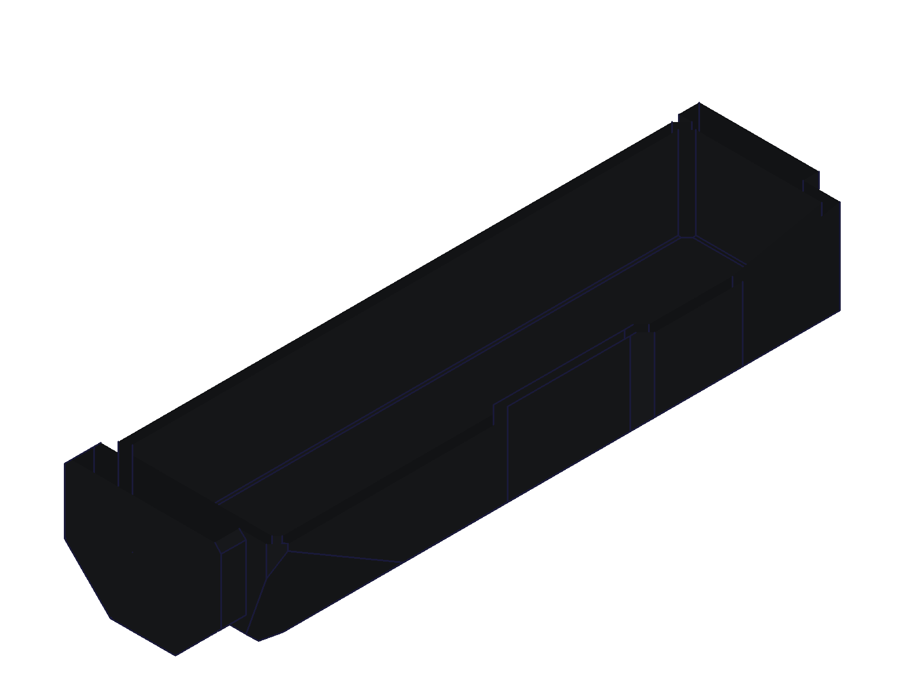
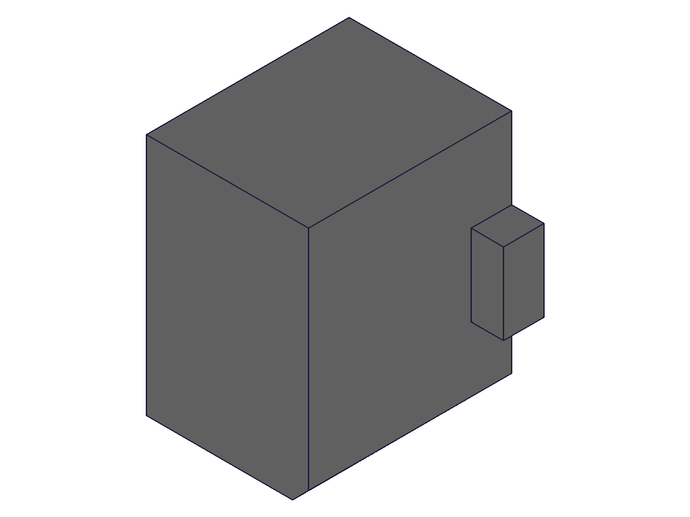

# Training: does hollowing a closed body (enclosed void) break later features?

**Date:** 2026-09-20. User-selected conceptual study, outside PLAN.md order.

## Goal

Claim under test, made after a PVS v2 housing build failed: *"hollowing a closed body in ClassCAD leaves an enclosed
void, and that breaks the features that come after it; so split the part first and hollow afterwards."*
The session assumes the claim is WRONG and tries to show it.

**Questions**

- Q1 Does subtracting a fully enclosed tool give a correct solid and volume? (01, 12)
- Q2 Do later features work on a body with a void: bore into it, chamfer, union, slice through it? (01, 12, 07)
- Q3 Does it depend on sliced targets/tools, pockets, or a tool that is itself a boolean result? (02–06)
- Q4 Does the real failing build order work? What made the original run fail? (07, 08, 09, 11)
- Q5 What is the failed state really: no cut, wrong measurement, or a broken body? (10 + `scripts/occ-measure.py`)

## 01 — box minus enclosed box, then a bore into the void

`scripts/01-enclosed-box.mjs` — claim fails at the first test. 100×60×40 minus enclosed 80×40×20: volume 176000.000
(exact). Bore Ø10 through the top wall into the void: maxLevel 31, 175213.07 (analytic 175214.60, curved-surface integration).

|  |  |
|---|---|

## 02–06 — housing-like shell, one ingredient added per script

`scripts/_case.mjs` with `02-plain`, `03-sliced-target`, `04-sliced-both`, `05-with-dish`, `06-full`. Hollowing and the
later front bore succeed in all five. 02, 04, 06: volume after hollowing equals solid − cavity to 0.001. 03 and 05 differ
from that naive expectation by design (03: unsliced cavity pokes through the facets; 05: the pocket overlaps the cavity by
250 mm³), not by failure.

## 07 — the real Tub in the ORIGINAL order (closed shell hollowed before the seam slice)

`scripts/07-replay-build.mjs`, project builder unchanged, current parameters. Builds completely: hollowing
178890.9 → 43973.6, three openings, the seam slice THROUGH the void, posts and insert bores, final 20077.3.
The order I blamed works.

## 08 — exact model of the failed run

`scripts/08-replay-failed-model.mjs` — reproduces: `Hollow_interior` leaves the volume at 178378.5, the following
mass-properties call dies with `GetVolumeAndCOG: Division by zero!`. Same order as 07; only parameter values differ.

## 09 — one parameter at a time back to its working value

`scripts/09-bisect-parameter.mjs` (env `FLIP`). Two UNRELATED single changes each cure it: `chamfer_front_bottom`
3.0→2.2 and `eye_y` 11.9→12.4 (eye rim 0.5 mm along Y, at the other end of the part). Five other single flips do not.

## 10 — what the failed state is

`scripts/10-failed-hollow-export.mjs` + `scripts/occ-measure.py`. All 33 operand solids are identical in both runs up
to the rim union. Failing result solid: native volume 178378.478 = its target. The section snapshot nevertheless shows
the cavity cut. OCC on the exported part: **failing = 0 solids** (unassembled shells, signed volume −312914.6 =
−(178378 + 134536)); **working = 1 solid, 2 shells** (178368.9 forward, 134536.1 reversed), volume 43832.777 vs native
43832.768. So the cut happened; the result is a SHEET body. That is also the source of the later
`is a Sheet, please select a solid` seen in the project build.

|  |  |
|---|---|

## 11 — remove one feature at a time from the failing model

`scripts/11-drop-feature.mjs` (env `DROP`). Cured by dropping the eye rim, the grown-dish subtraction from the cavity
tool, or all slices; NOT cured by dropping the shroud or the dish. With 09: a multi-factor kernel robustness failure,
no single geometric rule.

## 12 — features on a body that keeps its void

`scripts/12-features-after-void.mjs` — chamfer 175200.000, union 178400.000, slice through the void 89200.000: all exact.

|  |
|---|

## Answers

- Q1/Q2: **The claim is false.** An enclosed void is a valid single solid with two shells; volume exact; every later
  feature tried works (01, 07, 12; OCC in 10).
- Q3: slices, pockets and compound tools do not change that (02–06).
- Q4/Q5: the original failure is a SUBTRACTION that reports success but returns a sheet body, triggered by a specific
  multi-factor geometry (09, 11). Splitting at the seam first avoided it by changing the geometry, not by avoiding a void.

**📌 LLM doc:** `references/part/boolean.md` (void is fine; silent sheet result + detection), `references/part/calculateMassProperties.md`
(void measured correctly; unchanged volume / Division by zero signature), `recipes/verification.md` (assert the drop after every subtraction).

Not done on the user's instruction to change the skill only: no PLAN.md mark, no TODO.md entry, no commit. The sheet-body
boolean is a kernel defect worth a TODO entry (repro: `scripts/08-replay-failed-model.mjs`).
